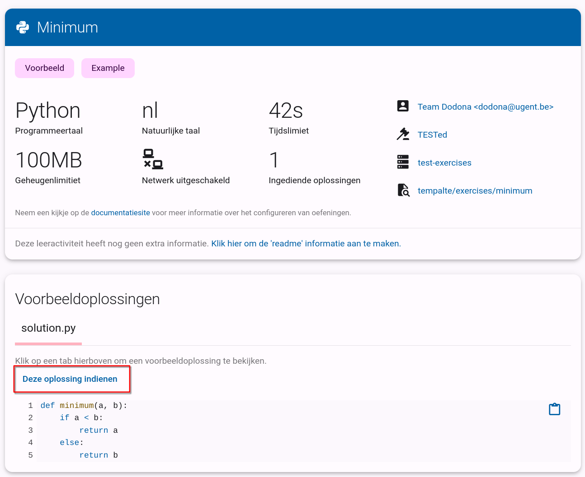

# Oefeningen opstellen: opgave en testplan schrijven

Als je in de vorige stap van de handleiding de _template repository_ gebruikt hebt, bevat je repository al een oefening (de _Echofunctie_).
Hier zullen we nu zelf nog een oefening toevoegen.
De bestaande oefening kan uiteraard als voorbeeld dienen.

::: info Bestanden en mappen maken
1. Selecteer de map waarin je het bestand of de map wil aanmaken.
2. Gebruik de icoontjes bovenaan om een bestand of map aan te maken. Rechtsklikken op de map en kiezen voor `New File...` of `New Folder...` kan ook.
2. Typ de naam van het bestand (inclusief extensie) of map. Kies bij voorkeur een naam zonder spaties.
3. Bevestig met <kbd>Enter</kbd>.
:::

<!--@include: ../../examples/_common.md-->

## 5. Wijzigingen opslaan

Nu de oefening klaar is, moeten we de wijzigingen opslaan in de repository (dat wil zeggen de wijzigingen _committen_ in de repo).
Doe dit als volgt:

1. Klik aan de linkerkant op het icoontje voor _Source Control_.
2. Klik bovenaan de lijst met wijzigingen op de knop met `+` om alle bestanden klaar te zetten (_Stage All Changes_).
3. Kies bovenaan een _commit message_. Hierin beschrijf je wat je gedaan hebt, zoals "Voeg mijn eerste oefening toe".
4. Klik op de knop `Commit & Push`. Als je een pop-up krijgt, kies je voor `Sync (Push & Pull)`.

Als alles goed gegaan is, werd dit venster leeg.

## 6. Oefening testen

De oefening die je daarnet gemaakt hebt, kan je terugvinden in [jouw oefeningenrepository](https://dodona.be/nl/repositories/) op Dodona.
Je nieuwe oefening is nu beschikbaar als _concept_ op Dodona.

Vooraleer je een oefening kan publiceren (uit concept halen), controleert Dodona of aan drie voorwaarden voldaan is:

- De oefening moet een geldig configuratiebestand hebben. 
- De oefening moet een naam en een beschrijving hebben. 
- Je moet minstens één correcte oplossing indienen.

Als je deze handleiding gevolgd hebt, zijn aan de eerste twee voorwaarden al voldaan.
Je moet enkel nog een juiste oplossing indienen, die we al gemaakt hebben.
Om dit te doen klik je bovenaan de menubalk op het informatie-icoontje:

Vervolgens kies je de voorbeeldoplossing die je wilt indienen (hier is er maar een: `solution.py), waarna je op de knop _Deze oplossing indienen_ klikt.
Dit zal de oefeningenpagina openen met de voorbeeldoplossing ingeladen.
Je moet enkel nog op indienen klikken.

Eens de oplossing juist gerekend is, zal je de oefening kunnen publiceren door op _Deze oefening publiceren_ te klikken.
Je oefening is nu klaar om te gebruiken op Dodona!

::: tip
Laat je oefening eens oplossen door iemand anders. Zo ontdek je vaak nog gaten in het testplan, en kan je de oefening verder verfijnen.
:::
