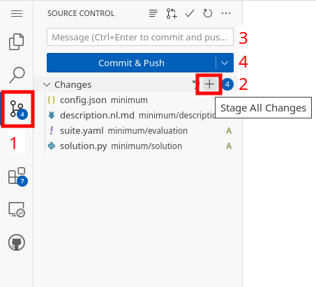
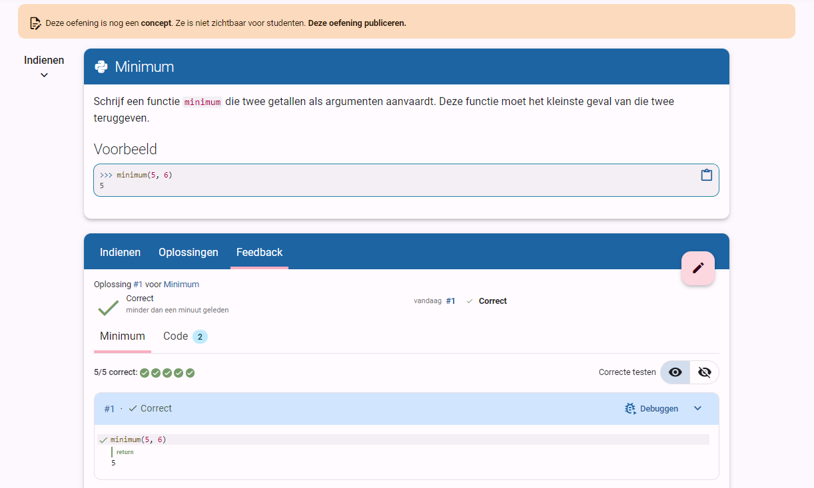

# Oefeningen opstellen: opgave en testplan schrijven

Als je in de vorige stap van de handleiding de _template repository_ gebruikt hebt, bevat je repository al een oefening (de _Echofunctie_).
Hier zullen we nu zelf nog een oefening toevoegen.
De bestaande oefening kan uiteraard als voorbeeld dienen.

::: info Bestanden en mappen maken
1. Selecteer de map waarin je het bestand of de map wil aanmaken.
2. Typ de naam van het bestand (inclusief extensie) of map
3. Bevestig met <kbd>Enter</kbd>.
:::

<!--@include: ../../examples/_common.md-->

## 5. Wijzigingen opslaan

Nu de oefening klaar is, moeten we de wijzigingen opslaan in de repository (dat wil zeggen de wijzigingen _committen_ in de repo).
Doe dit als volgt:

1. Klik aan de linkerkant op het icoontje voor _Source Control_.
2. Klik bovenaan de lijst met wijzigingen op de knop met "+" om alle bestanden klaar te zetten (_Stage All Changes_).
3. Kies bovenaan een _commit message_. Hierin beschrijf je wat je gedaan hebt, zoals "Voeg mijn eerste oefening toe".
4. Klik op de knop _Commit & Push_.

Als alles goed gegaan is, werd dit venster leeg.

## 6. Oefening testen

De oefening die je daarnet gemaakt hebt, kan je terugvinden in  [jouw oefeningenrepository](https://dodona.be/nl/repositories/) op Dodona. Test de oefening. Is alles naar wens? Dan kan je bovenaan de oefening publiceren (_Deze oefening publiceren_). Je oefening is nu klaar om te gebruiken op Dodona!

::: tip
Laat je oefening eens oplossen door iemand anders. Zo ontdek je vaak nog gaten in het testplan, en kan je de oefening verder verfijnen.
:::
