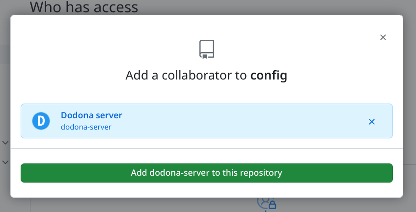
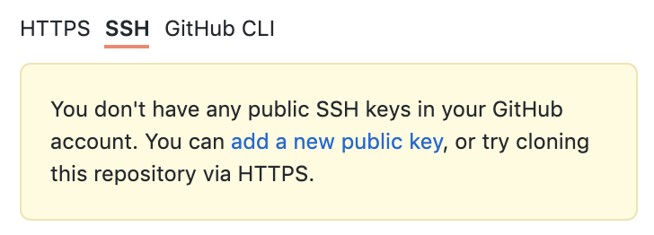
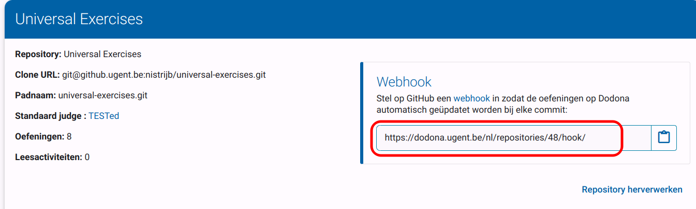
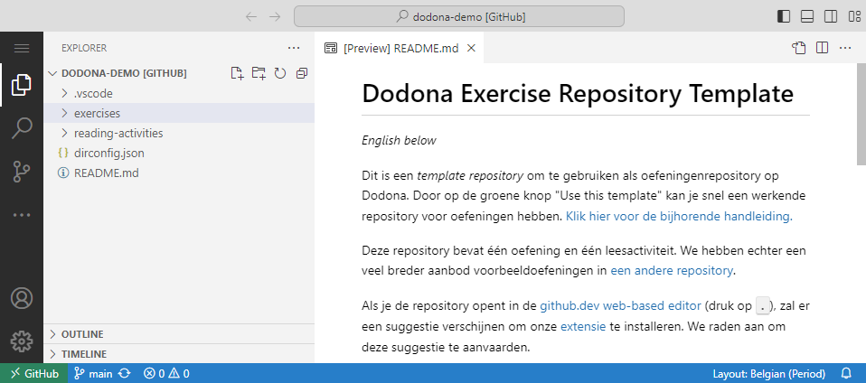

# Oefeningen opstellen: installatie en configuratie

In dit hoofdstuk overlopen en configureren we alle programma's en tools die nodig zijn om een oefening op te stellen.

::: info Online werken
Merk op dat we er in deze handleiding voor kiezen om met _VS Code for the Web_ te werken, een versie van VS Code die in de browser draait.
In de toekomst voorzien we ook een handleiding om lokaal te werken.
:::

## Browser

Aangezien je deze handleiding aan het lezen bent, heb je waarschijnlijk al een browser.
Controleer voor de zekerheid toch of je een recente versie van Chrome, Firefox of Safari (de drie browsers die Dodona ondersteunt) gebruikt.

## Lesgeversrechten op Dodona

Gewone accounts hebben op Dodona niet voldoende rechten om zelf oefeningen te kunnen maken.
Daarvoor kan je via [het formulier](https://dodona.ugent.be/nl/rights_requests/new) lesgeversrechten aanvragen voor je account.

## Repository forken

Dodona gebruikt Git-repository's om oefeningen en ander lesmateriaal te beheren.
Een repository kan meerdere oefeningen bevatten en moet aan een bepaalde structuur voldoen om gelezen te kunnen worden door Dodona.
We zullen hier een sjabloon als startpunt voor je repository gebruiken, zodat de structuur al meteen goed zit.

### Account op GitHub

We gebruiken GitHub om de repository op te slaan.
Eerst heb je een account nodig bij GitHub.
Ga naar <https://github.com/signup> om een account te maken, of gebruik je bestaande account als je die hebt.

### Repository forken

Als volgende stap moet je je persoonlijke kopie van het sjabloon maken:

1. Ga naar <https://github.com/dodona-edu/exercise-template-repository>.
2. Klik op de knop `Use this template`.
3. Kies vervolgens de eerste optie: `Create a new repository`.
   
4. Vul de details voor de nieuwe repository in:
   1. Kies een naam voor de repository.
   2. Kies de toegang tot de repository. _Public_ betekent dat iedereen aan de oefeningen kan, dus we raden _Private_ aan.
   3. Klik op `Create repository`
   

Nu heb je een repository waarin je je oefeningen zal opslaan.
Laat de pagina open staan, je zal haar nog nodig hebben.

### Dodona toegang geven tot je repository

Voor je je nieuwe repository aan Dodona kan toevoegen, moet je ervoor zorgen dat Dodona lees- en schrijfrechten heeft op je repository.

De makkelijkste manier om dit te doen (op github.com) is de gebruiker [dodona-server](https://github.com/dodona-server) toegang te geven tot je repository:

1. Ga naar het tabblad `Settings` in je repository.
2. Klik in de navigatie links op het onderdeel `Collaborators`. Dit staat normaliter redelijk bovenaan.
3. Klik op de centrale groene knop `Add people`.
4. Typ _dodona-server_ in het zoekveld dat verschijnt en kies de juiste gebruiker (ook te herkennen aan het blauwe Dodona-logo).
5. Klik op de groene knop `Add dodona-server to this repository`.

GitHub zal dan een uitnodiging sturen die Team Dodona moet aanvaarden.
Eens de uitnodiging aanvaard is, kan je verder gaan met de volgende stappen.

::: warning Manueel werk
Een lid van Team Dodona moet de uitnodiging van GitHub manueel aanvaarden.
Daardoor kan het soms even duren eer dat gebeurt.
:::

### Repository toevoegen aan Dodona

Eens je lesgeversrechten op Dodona hebt, kan je je repository toevoegen aan Dodona.
Ga daarvoor eerst naar <https://dodona.ugent.be/nl/repositories/> en klik op de lichtroze knop met een plusteken (`+`) in.

Vul vervolgens de details van de repository in:

1. **Naam**: kies een unieke naam voor de repository op Dodona. Dit wordt gebruikt om de repository later terug te vinden.
2. **Clone URL**: hiervoor moet je terug naar GitHub.
   
   1. Ga naar je repository die je hierboven gemaakt hebt.
   2. Klik op de groene knop `Code`.
   3. Onder de hoofding _Clone_ zijn 3 tabbladen. Klik op het tabblad `SSH`.
   4. Kopieer de URL die verschijnt, ofwel manueel ofwel door op de knop naast de URL te klikken.
   5. Plak deze URL in het veld _Clone URL_ bij Dodona.
3. **Standaard judge**: kies hier "TESTed".
4. Klik op de roze knop bovenaan met een vinkje in.

::: tip Wees gerust
Krijg je bij het kopiëren van de URL een waarschuwing zoals hieronder?
Dat is geen probleem: je kan deze probleemloos negeren.

Deze waarschuwing betekent dat je geen SSH-sleutels in je account hebt.
Om te werken met Dodona heb je die ook niet nodig.
Meer informatie over SSH kan je vinden in de GitHub-handleiding [_About SSH_](https://docs.github.com/en/authentication/connecting-to-github-with-ssh/about-ssh).
:::

### Webhook instellen

Dodona zal vervolgens je repository ophalen en verwerken.
Dit zal elke keer als je een aanpassing doet aan een oefening moeten gebeuren, dus moet Dodona weten wanneer er wijzigingen gebeuren.
We doen dit met behulp van een _webhook_.
Dit is een unieke URL die er voor zorgt dat Dodona je repository opnieuw zal verwerken.
Deze URL zou zichtbaar moeten zijn nadat je je repository aan Dodona hebt toegevoegd.

Deze URL moet je vervolgens toevoegen aan GitHub:

1. Ga naar je repository op GitHub.
2. Klik op het tabblad `Settings`.
3. Kies in de zijbalk de optie `Webhooks` (die staat ergens halverwege).
4. Klik linksboven op de knop `Add webhook`.
5. Plak de URL van Dodona in het veld met als titel **Payload URL**.
6. Klik onderaan op de groene knop `Add webhook`.

Je repository is nu klaar om een oefening te schrijven.
In het volgende deel van de handleiding zullen we dan effectief de oefening schrijven.

Er zijn verschillende soorten oefeningen die ondersteund worden door Dodona.
In deze handleiding kiezen we voor een oefening met functies, maar we hebben ook handleidingen voor andere soorten oefeningen.

## VS Code gebruiken

In deze handleiding gebruiken we de webversie van VS Code.
Om deze te openen:

1. Ga naar de pagina van je repository op GitHub (als die nog open staat, des te beter).
2. Druk op <kbd>.</kbd> op je toetsenbord (op azerty-toetsenborden is dit <kbd>Shift</kbd>+<kbd>.</kbd>).
3. Na het opstarten moet je even wachten, waarna er rechts onderaan een melding zal verschijnen over het installeren van de aanbevolen extensies.
   Aanvaard deze suggestie.

In de linkerkolom is zichtbaar wat er in de repository zit. In de template zijn er aparte mappen voorzien voor oefeningen (_exercises_) en leesactiviteiten (_reading-activities_). Bovenaan de kolom zijn er knoppen voorzien om eigen bestanden of mappen aan te maken.  
