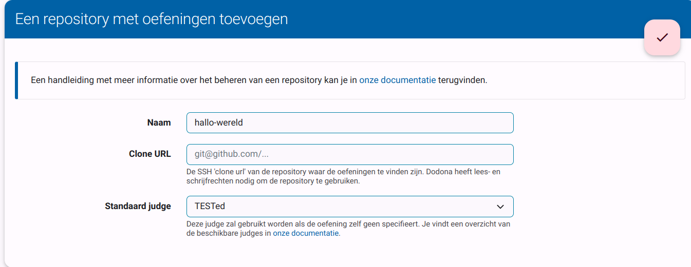
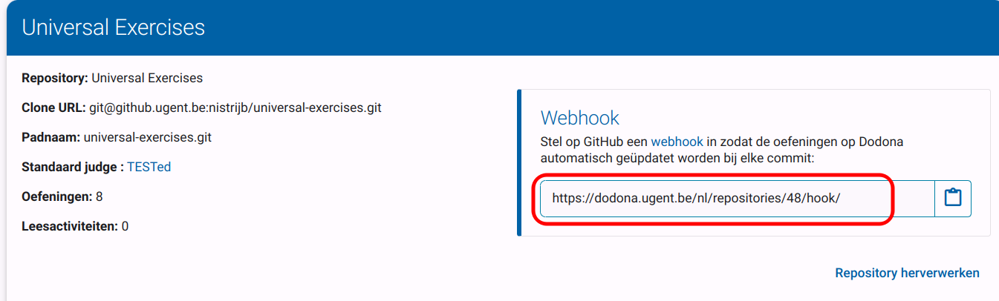

# Oefening met invoer en uitvoer

In deze _tutorial_ stellen we een oefening op die gebruik maakt van invoer en uitvoer.

Een vaak gebruikt voorbeeld van een dergelijke oefening is de naam van de gebruiker vragen en die vervolgens een boodschap tonen waarin de naam staat.
We zullen deze oefening hier volledig uitwerken voor gebruik met Dodona.
Op het einde van de handleiding heb je een werkende oefening, waaruit je kan vertrekken om je eigen oefeningen te maken.

De handleiding bestaat uit twee grote delen:

1. Een [repository](#de-repository-met-oefeningen) voor oefeningen maken. Dit moet je slechts één keer doen; als je al een repository hebt, kan je deze stap overslaan.
2. De [oefening](#een-oefening-maken) zelf opstellen.

## Voor we beginnen

Om deze handleiding te volgen, heb je het volgende nodig:

- Een werkende installatie van [Git](https://git-scm.com/).
- Een [GitHub-account](https://docs.github.com/en/get-started/signing-up-for-github/signing-up-for-a-new-github-account).
- Lesgeversrechten op Dodona. Als je die nog niet hebt, kan je die aanvragen via [dit formulier](https://dodona.ugent.be/nl/rights_requests/new).
- Een tekstverwerker.


## De repository met oefeningen

Oefeningen en ander lesmateriaal in Dodona worden beheerd in een git-repository.
Een repository kan meerdere oefeningen bevatten en moet aan een [bepaalde structuur](/nl/references/repository-directory-structure) voldoen om gelezen te kunnen worden door Dodona.

### 1. Een repository aanmaken

We beginnen met het maken van een remote repository: dat is de server waarop de oefeningen opgeslagen zullen worden.

Een makkelijke oplossing is GitHub gebruiken.
Daarvoor kan je hun handleiding [_Create a repo_](https://docs.github.com/en/get-started/quickstart/create-a-repo) volgen.
Let er wel op dat je je repository _private_ maakt: anders kan iedereen aan je oefeningen (tenzij dat dat de bedoeling is natuurlijk).

::: tip Alternatieven voor GitHub

Dodona ondersteunt ook [GitLab](https://about.gitlab.com/) en de _enterprise_-varianten van zowel GitHub als GitLab.
Als je verbonden bent met de UGent kan je je repository bijvoorbeeld maken op [github.ugent.be](https://github.ugent.be).

:::

### 2. De repository toevoegen aan Dodona

In de linker navigatiebalk staat een snelkoppeling `Repositories` die je naar een [overzicht van jouw repositories op Dodona](https://dodona.ugent.be/nl/repositories/) brengt.
Om een nieuwe repository toe te voegen, klik je op de grote plus-knop bovenaan de pagina.

::: tip Geen link naar je repositories?
 
Dan heb je geen lesgeversrechten.
Vraag ze aan via [dit formulier](https://dodona.ugent.be/nl/rights_requests/new) en herlees de paragraaf [_Voor we beginnen_](#voor-we-beginnen).

:::



In het formulier dat vervolgens verschijnt, vul je het volgende in:

- **Naam**: een unieke naam voor je repository binnen Dodona.
- **Clone URL**: deze kan je vinden op de GitHub-pagina van je repository (zie de schermafbeelding hieronder).  Zorg ervoor dat je de SSH-link van GitHub kopieert en niet de HTTPS-variant.
- **Standaard judge**: selecteer "TESTed".


Voordat je op de toevoeg-knop klikt, moet je er eerst voor zorgen dat de Dodona server zowel lees- als schrijfrechten heeft op je repository met oefeningen.
We hebben deze schrijftoegang nodig om eenvoudig de oefeningen kunnen bewerken via de webinterface.

Je moet de gebruiker [dodona-server](https://github.com/dodona-server) aan je repository toevoegen.
Zodra wij deze uitnodiging accepteren, kan je van start gaan.


Je kan op Dodona het toevoegen van de repository nu finaliseren.

### 3. De webhook instellen

Dodona zal vervolgens je repository ophalen en verwerken.
Dit zal elke keer als je een aanpassing doet aan een oefening moeten gebeuren, dus moet Dodona weten wanneer er wijzigingen gebeuren.
We doen dit met behulp van een _webhook_.
Dit is een unieke URL die er voor zorgt dat Dodona je repository opnieuw zal verwerken.
Deze URL zou zichtbaar moeten zijn nadat je je repository aan Dodona hebt toegevoegd.



Deze URL moet je vervolgens toevoegen aan GitHub.
Dit doe je door op GitHub naar de instellingen van je repository te gaan en vervolgens op `Webhooks` te klikken in de navigatiebalk.
Klik vervolgens op de `Add webhook`-knop en geef de URL in die je van Dodona gekregen hebt.
Gebruik voor de rest de standaardinstellingen en klik op `Add webhook`.


## Lokaal met de repository werken

Nu de server ingesteld is, is het tijd om ervoor te zorgen dat we lokaal op onze eigen computer met de repository kunnen werken.

Open de commandoregel en voer het volgende commando uit in de map waarin je de repository wilt:

```bash
$ git clone [URL] [NAAM]
```

Hierbij vervang je `[URL]` door de SSH-url die je hierboven al gebruikt hebt, of als je geen SSH-sleutels hebt, de HTTPS-variant.
`[NAAM]` is optioneel en kan gebruikt worden als je de repository een andere naam wilt geven.

Stel dat je repository als naam `voorbeeldoefeningen` heeft.
Dan zal je na het klonen een lege map hebben met dezelfde naam:

```
├── voorbeeldoefeningen/
|   ...
```

## Een oefening maken

### 1. Structuur

Elke oefening in Dodona komt overeen met een bepaalde map in de oefeningenrepository.
Die map heeft een [vaste structuur](/nl/references/exercise-directory-structure), die we nu zullen maken.

Maak dus eerst een nieuwe map voor de oefening, die we `hello-world` zullen noemen.
Maak daarna, in deze nieuwe map, nog twee mappen:
- `description`: de map waarin de opgave komt
- `evaluation`: map met informatie over hoe een oplossing beoordeeld moet worden

Hierna moet je repository er als volgt uitzien:

```
voorbeeldoefeningen/
└── hello-world/
   ├── evaluation/
   ├── description/
   └── solution/
```

### 2. Configuratie

Dodona eist voor elke oefeningen ook een [configuratiebestand](/nl/references/exercise-config).
Dit bestand bevat metadata, die door Dodona gebruikt worden.

Maak het bestand `config.json` in de map `hello-world` met de volgende inhoud:

```json
{
  "description": {
    "names": {
      "en": "Hello World",
      "nl": "Hello World"
    }
  },
  "evaluation": {
    "test_suite": "suite.yaml"
  }
  "programming_language": "python",
  "access": "private"
}
```

In dit bestand worden drie dingen gespecifieerd:

- De naam van de oefening zoals getoond door Dodona in het Nederlands en in het Engels (in dit geval zijn beide namen hetzelfde).
- We stellen de naam van het testplan in (later meer hierover). Dit is een bestand relatief ten opzicht van de map `evaluation`.
- De programmeertaal van de oefening: hier kies je in welke programmeertaal je de oplossingen wilt. In dit geval is dat Python.
- Het toegangsniveau: hier _private_. We kiezen voor een private oefening omdat dit maar een handleiding is, maar we moedigen aan om je oefeningen publiek te zetten: dan kunnen andere leerkrachten er ook gebruik van maken (net zoals jij de keuze hebt uit duizenden publieke oefeningen op Dodona).

Nadat je dit bestand gemaakt hebt, zal je repository er zo uitzien:

```
voorbeeldoefeningen/
└── hello-world/
   ├── evaluation/
   ├── description/
   ├── solution/
   └── config.json
```

### 3. Opgave en voorbeeldoplossing

De volgende stap is de opgave van de oefening.
Dit krijgen leerlingen en studenten te zien wanneer ze de oefening willen oplossen en vertelt hen wat ze moeten doen.

Maak een bestand `description.nl.md` aan in de map `description` van de oefening, met volgende inhoud:

````markdown
Schrijf een Python-programma dat de naam van de gebruikt vraagt
en vervolgens de gebruiker begroet met de zin `Hallo, [NAAM]!`,
waarbij `[NAAM]` de naam van de gebruiker is.

Het programma moet de naam dus inlezen van standaardinvoer (stdin)
en de begroeting uitschrijven naar standaarduitvoer (stdout).
Het zinnetje dat de naam vraagt is vrij te kiezen.

### Voorbeeld

```bash
>>> $ pyton programma.py
Wat is je naam?
Jan
Hallo, Jan!
```
````

De `nl` in de naam van de opgave kan je vervangen door `en` als je ook een Engelstalige opgave wilt maken.
De opgave zelf wordt geschreven in Markdown, een redelijk eenvoudig opmaakformaat. Meer informatie over Markdown is [hier](/nl/references/exercise-description) te vinden.

We voegen ook direct een voorbeeldoplossing toe.
Dit is niet verplicht, maar vaak is het wel handig om te hebben.
Leerlingen kunnen deze voorbeeldoplossing niet zien (tenzij je repository publiek staat natuurlijk).

Maak een bestand `solution.py` aan in de map `solution` met volgende inhoud:

```python
naam = input("Wat is je naam?")
print(f"Hallo, {naam}!")
```

Nadat je deze twee bestanden gemaakt hebt, moet je repository er zo uitzien:

```
voorbeeldoefeningen/
└── hello-world/
   ├── evaluation/
   ├── description/
   |  └── description.nl.md
   ├── solution/
   |  └── solution.py
   └── config.json
```

### 4. Een testplan maken

We willen dat deze oefening automatisch getest wordt.
Hiervoor moeten we een testplan schrijven, waarin we Dodona vertellen welke testen we allemaal willen uitvoeren.

Deze oefening heeft natuurlijk een aantal voor de hand liggende testen, waarbij verschillende namen geprobeerd worden.
Ook kunnen we eens een naam met cijfers of speciale tekens invullen.
Nog een leuke naam is om een naam met dubbelen en enkele aanhalingstekens te proberen.
Ook een naam met _escaped newlines_ kunnen we proberen.

Om dit kort te houden, beperken we ons testplan tot zeven testen.
Maak een bestand `suite.yaml` in de map `evaluation` met volgende inhoud:

```yaml
- tab: "Testen"
  testcases:
  - stdin: "Jan"
    stdout: "Hallo, Jan!"
  - stdin: "Piet"
    stdout: "Hallo, Piet!"
  - stdin: "5236-hallo!"
    stdout: "Hallo, 5236-hallo!!"
  - stdin: "'wereld'"
    stdout: "Hallo, 'wereld'!"
  - stdin: '"wereld"'
    stdout: 'Hallo, "wereld"!'
  - stdin: "    "
    stdout: "Hallo,     !"
  - stdin: "leuk\nje\nte\nzien"
    stdout: "Hallo, leuk\nje\nte\nzien!"
```

Een testplan wordt geschreven in YAML, en moet ook voldoen aan een bepaalde structuur.
In het voorbeeld hierboven maken we één tabblad met als naam "Testen", en definiëren zeven testen in dat tabblad:
- Testen 1 en 2 gebruiken twee namen.
- Test 3 gebruikt cijfers en leestekens.
- Test 4 gebruikt enkele aanhalingstekens.
- Test 5 gebruikt dubbele aanhalingstekens.
- Test 6 heeft een naam die enkel uit spaties bestaan.
- Test 7 heeft een naam met _escaped newlines_.

Elk nieuw testgeval begint met een liggend streepje: dit is in YAML de manier om een nieuw object te beginnen (je ziet dat ons tabblad ook een object is).
We maken dus een tabblad-object, waarin we een lijst van testgeval-objecten steken.

Hierna ziet de repository er als volgt uit:

```
voorbeeldoefeningen/
└── hello-world/
   ├── evaluation/
   |  └── suite.yaml
   ├── description/
   |  └── description.nl.md
   ├── solution/
   |  └── solution.py
   └── config.json
```

## Alles opslaan

Nu moeten we onze wijzigingen klaarzetten om op te slaan, opslaan en op de server zetten.
Voer deze commando's uit in de repository:

```bash
# Zet alles klaar om op te slaan
$ git add .
# Sla alles op, met een beschrijving
$ git commit -m "Mijn eerste oefening"
# Stuur de wijzigingen naar de server
$ git push
```

Na enkele seconden zal de oefening bijgewerkt zijn op Dodona: ze is klaar voor gebruik!

Je kan ook altijd eens vergelijken met de volledige oefening:

- In de repository
- Op Dodona zelf
