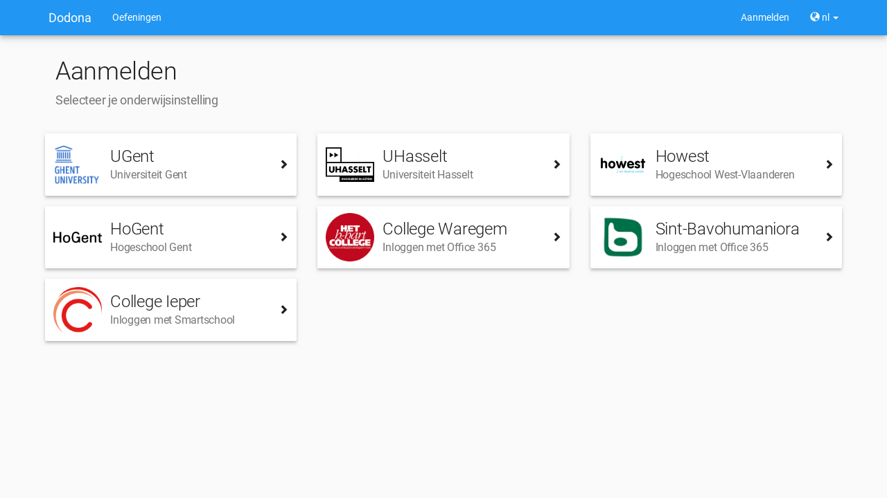
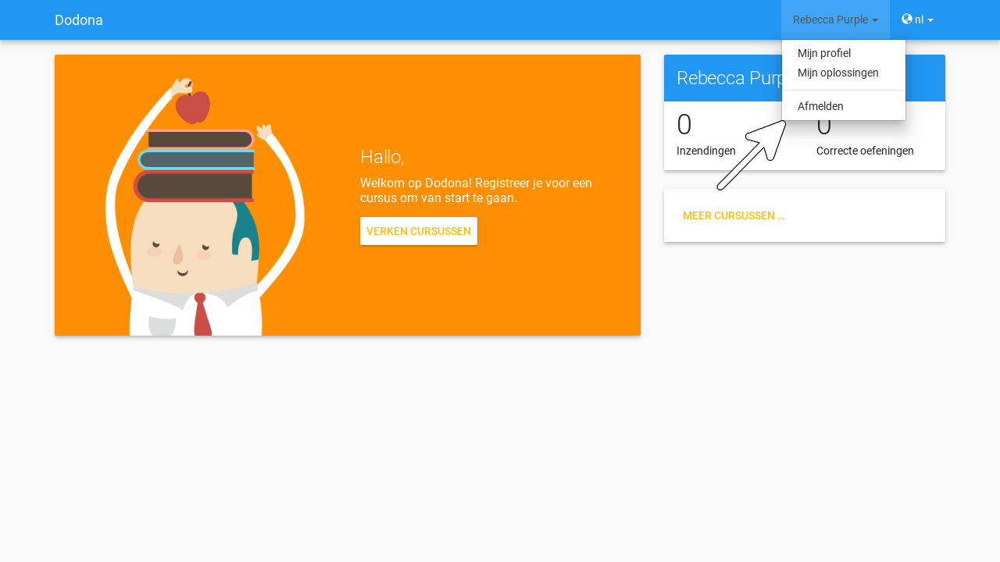
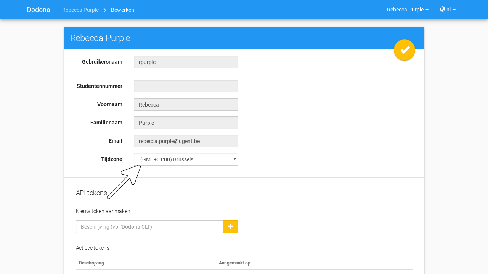
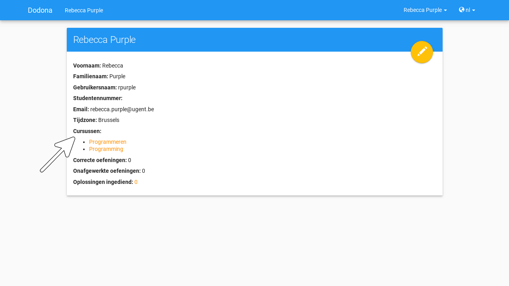
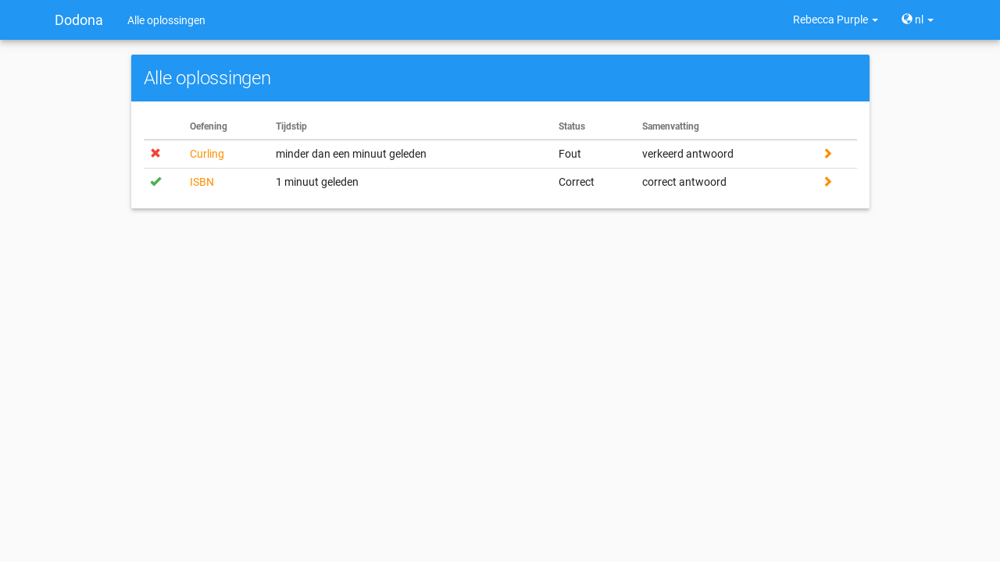

# Dodona voor studenten

Als student kan je [registreren](#registreren-voor-een-cursus) voor één of meer [cursussen](). Elke cursus bevat een reeks [oefeningen](#navigeren-naar-een-oefening) die gegroepeerd zijn in [oefeningenreeksen](). Voor elke oefening kan je herhaald [oplossingen](#navigeren-naar-een-oplossing) [indienen](#indienen-van-een-oplossing) die automatisch worden beoordeeld en van [feedback](#interpreteren-van-feedback) voorzien. Deze acties vereisen echter dat je over een [gebruikersaccount](#aanmelden) beschikt en dat je [aangemeld](#aanmelden) bent op Dodona.

## Selecteren van de taal

Als **taal** voor Dodona kan je kiezen tussen Nederlands of Engels. Gebruik hiervoor het **taalmenu** aan de rechterkant van de **navigatiebalk** (bovenaan elke pagina).

Als je een [taal](#selecteren-van-de-taal) selecteert terwijl je [aangemeld](#aanmelden) bent dan wordt die ook als voorkeurstaal ingesteld in je [gebruikersprofiel](#instellen-van-persoonlijke-voorkeuren). Op die manier wordt bij aanmelden automatisch je voorkeurstaal geselecteerd.

::: details Notitie

De taal waarin vaste componenten van Dodona (menubalken, cursusstructuur, mededelingen, ...) worden weergegeven, valt volledig onder de controle van het platform. Deze componenten worden altijd weergegeven in de geselecteerde [taal](#selecteren-van-de-taal).

De naam en beschrijving van een [cursus]() liggen vast, net zoals namen en beschrijvingen van [oefeningenreeksen]() binnen een cursus. Deze componenten zijn niet afhankelijk van de selectie van de [taal](#selecteren-van-de-taal). De taal van deze componenten valt volledig onder de controle van de cursusbeheerders die de cursus hebben opgesteld.

De naam en beschrijving van een [oefening]() zijn afhankelijk van de selectie van de [taal](#selecteren-van-de-taal). Als bij het opstellen van de oefening een vertaling voorzien werd van de naam en de beschrijving in de geselecteerde taal, dan zullen deze componenten van de oefening ook in die taal weergegeven worden.

De [taal](#selecteren-van-de-taal) van de [feedback](#interpreteren-van-feedback) over een [oplossing]() die je [indient]() voor een [oefening]() valt volledig onder de controle van de [judge](#interpreteren-van-feedback) waaraan de oefening gekoppeld is. De judge kan de taal van deze feedback laten afhangen van de taal die geselecteerd is op het ogenblik waarop de oplossing wordt ingediend.
:::

## Aanmelden

Om te kunnen [aanmelden](#aanmelden), moet je over een **gebruikersaccount** beschikken op Dodona. In het daaraan gekoppelde [gebruikersprofiel](#instellen-van-persoonlijke-voorkeuren) kan je persoonlijke voorkeuren instellen om je gebruikerservaring op het platform te personaliseren. Daarnaast worden alle acties die je op het platform uitvoert &mdash; zoals het [registreren](#registreren-voor-een-cursus) voor [cursussen]() of het [indienen](#indienen-van-een-oplossing) van [oplossingen](#navigeren-naar-een-oplossing) &mdash; aan je gebruikersaccount gekoppeld.

::: tip Belangerijk

Je kunt zelf geen gebruikersaccount aanmaken. Dodona maakt automatisch een gebruikersaccount aan als je voor het eerst [aanmeldt](#aanmelden) met een gebruikersaccount van één van deze externe onderwijs- of onderzoeksinstellingen:

-   Universiteit Gent (UGent)
-   Universiteit Hasselt (UHasselt)
-   Hogeschool West-Vlaanderen (Howest)
-   Hogeschool Gent (HoGent)
-   Katholieke Universiteit Leuven (KU Leuven)
-   H.-Hartcollege Waregem
-   Sint-Bavohumaniora Gent
-   College Ieper
:::

Druk op Aanmelden aan de rechterkant van de [navigatiebalk](#selecteren-van-de-taal) of navigeer naar de [landingspagina]() en druk op de knop Aanmelden centraal op de landingspagina.

::: tip

Je kunt enkel aanmelden als je momenteel afgemeld bent. Je herkent dat je afgemeld bent als je Aanmelden ziet staan aan de rechterkant van de [navigatiebalk](#selecteren-van-de-taal). Als je aangemeld bent dan staat op dezelfde plaats het [gebruikersmenu]() met de naam uit je [gebruikersprofiel](#instellen-van-persoonlijke-voorkeuren).
:::

Selecteer de onderwijs- of onderzoeksinstelling die de gebruikersaccount beheert waarmee je wilt aanmelden. Daarna volg je de instellingsspecifieke aanmeldingsprocedure.

::: tip Belangerijk

Sommige onderwijs- of onderzoeksinstellingen vragen op het einde van de aanmeldingsprocedure expliciet jouw toestemming voor het doorsturen van enkele [persoonsgegevens]() naar Dodona. Vaak hoef je deze toestemming slechts één keer te geven op elke computer waarmee je aanmeldt. Dodona gebruikt deze persoonsgegevens enkel voor intern beheer van je [gebruikersprofiel](#instellen-van-persoonlijke-voorkeuren) en wisselt deze informatie nooit uit met externe partijen.
:::

::: details Notitie

Voor authenticatie met gebruikersaccounts van externe onderwijs- of onderzoeksinstellingen ondersteunt Dodona zowel [SAML](https://nl.wikipedia.org/wiki/Security_Assertion_Markup_Language) als [OAuth](https://nl.wikipedia.org/wiki/OAuth). Vraag een ICT-beheerder of lesgever van je onderwijs- of onderzoeksinstelling om [contact](#contact-opnemen) met ons op te nemen als je graag alle gebruikersaccounts van je instelling toegang wilt geven tot Dodona. Deze dienstverlening is gratis.
:::

### Persoonsgegevens doorsturen

Als dit de eerste keer is dat je [aanmeldt](#aanmelden) op Dodona dan wordt er automatisch een nieuwe [gebruikersaccount](#aanmelden) aangemaakt op basis van de [persoonsgegevens]() die doorgestuurd werden door je externe onderwijs- of onderzoeksinstelling. In het [gebruikersprofiel](#instellen-van-persoonlijke-voorkeuren) van deze gebruikersaccount kan je [persoonlijke]() instellen voor de [taal](#selecteren-van-de-taal) en de [tijdzone]() die door Dodona gebruikt worden.

::: tip Belangerijk

Als je beschikt over gebruikersaccounts bij verschillende externe onderwijs- of onderzoeksinstellingen, dan corresponderen deze elk met een afzonderlijke gebruikersaccount op Dodona.
:::

::: tip

Als je wilt schakelen naar een andere [gebruikersaccount](#aanmelden) dan deze die momenteel [aangemeld](#aanmelden) is, dan moet je eerst [afmelden]() en daarna terug aanmelden met de andere gebruikersaccount.
:::

Als je aangemeld bent dan zie je aan de rechterkant van de [navigatiebalk](#selecteren-van-de-taal) het **gebruikersmenu** met de naam uit je [gebruikersprofiel](#instellen-van-persoonlijke-voorkeuren). Het gebruikersmenu staat op de plaats waar voorheen Aanmelden stond toen je nog niet aangemeld was.

Als je [aangemeld](#aanmelden) bent dan verandert de neutrale [landingspagina]() in een gepersonaliseerde **startpagina** met een overzicht van alle [cursussen]() waarvoor je [geregistreerd]() bent, hun [oefeningenreeksen]() met nakende [deadlines]() en je voortgang bij het [indienen](#indienen-van-een-oplossing) van [oplossingen](#navigeren-naar-een-oplossing) voor [oefeningen](#navigeren-naar-een-oefening). Je kunt dus ook makkelijk aan de landingspagina of aan je startpagina herkennen of je al dan niet aangemeld bent.

::: tip

Vanaf elke pagina kan je naar de [landingspagina]() (als je afgemeld bent) of naar je [startpagina]() (als je aangemeld bent) navigeren door uiterst links in de [navigatiebalk](#selecteren-van-de-taal) op Dodona te drukken.

:::

Als dit de eerste keer is dat je aanmeldt op Dodona dan ben je uiteraard nog voor geen enkele [cursus]() [geregistreerd]() en heb je nog geen enkele [oplossing]() [ingediend](). Daardoor ziet je [startpagina]() er op dit moment nog vrij kaal uit.

## Instellen van persoonlijke voorkeuren

Kies voor Mijn profiel in het [gebruikersmenu]() aan de rechterkant van de [navigatiebalk](#selecteren-van-de-taal) om naar je **profielpagina** te navigeren.

Op de [profielpagina]() staan je **persoonsgegevens** (voornaam, familienaam, gebruikersnaam en emailadres) en enkele **persoonlijke voorkeuren** ([taal](#selecteren-van-de-taal) en [tijdzone]()) die samen je **gebruikersprofiel** vormen. Dodona gebruikt het gebruikersprofiel om je gebruikerservaring te personaliseren.

::: {#gebruikersprofiel bewerken}
Druk op de bewerkknop in de rechterbovenhoek van je [profielpagina]() om je [gebruikersprofiel](#instellen-van-persoonlijke-voorkeuren) te bewerken. Je [persoonsgegevens]() kan je niet zelf aanpassen. Deze worden automatisch aangepast op basis van de persoonsgegevens die tijdens het [aanmelden](#aanmelden) door je externe onderwijs- of onderzoeksinstelling [doorgestuurd](#persoonsgegevens-doorsturen) worden naar Dodona.
:::

::: {#gebruikersprofiel tijdzone}
In je [gebruikersprofiel](#instellen-van-persoonlijke-voorkeuren) kan je de **tijdzone** instellen die gebruikt wordt voor het weergeven van alle tijdsaanduidingen op het platform (bijvoorbeeld het [tijdstip]() waarop je een [oplossing]() hebt [ingediend]() of de [deadline]() voor een [oefeningenreeks]()).
:::

::: tip

Als de [tijdzone]() uit je [gebruikersprofiel](#instellen-van-persoonlijke-voorkeuren) niet overeenkomt met de lokale tijdzone zoals die door je browser gedecteerd wordt, dan krijg je bovenaan elke pagina een mededeling te zien die erop wijst dat alle tijdsaanduidingen op het platform niet overeenkomen met de lokale tijdzone.

Je kunt deze mededeling enkel weghalen door in je [gebruikersprofiel](#instellen-van-persoonlijke-voorkeuren) de [tijdzone]() in te stellen op de lokale tijdzone. Merk op dat de mededeling een link bevat waarmee je rechtstreeks naar je [profielpagina]() kunt navigeren.
:::

## Navigeren naar een cursus

Cursusbeheerders kunnen [cursussen]() opbouwen uit [oefeningen](#navigeren-naar-een-oefening) die gegroepeerd worden in [oefeningenreeksen](). Als je voor een cursus [geregistreerd]() bent dan kan je binnen de cursus ook [oplossingen](#navigeren-naar-een-oplossing) [indienen](#indienen-van-een-oplossing) voor de [oefeningen](#navigeren-naar-een-oefening). Er zijn verschillende plaatsen waar je een cursus kunt selecteren:

-   Aan de linkerkant van je [startpagina]() staan kaartjes van alle [cursussen]() waarvoor je [geregistreerd]() bent, gegroepeerd per academiejaar. Gebruik de zoekbalk bovenaan de startpagina om te zoeken naar specifieke cursussen op basis van een cursusnaam, een naam van een lesgever of een academiejaar. Selecteer een cursus door op de gekleurde titelbalk van het kaartje van de cursus te drukken of door onderaan het kaartje op de knop GA NAAR DEZE CURSUS te drukken.

-   Als je nog [registratieverzoeken]() voor [cursussen]() hebt openstaan die wachten op goedkeuring van een cursusbeheerder, dan vind je deze cursussen in het paneel Wachten op goedkeuring in de rechterkolom van je [startpagina](). Je kunt één van deze cursussen selecteren door op de naam van de cursus te drukken.

-   Het [gebruikersmenu]() aan de rechterkant van de [navigatiebalk](#selecteren-van-de-taal) bevat onder de hoofding Mijn vakken een lijst met alle [cursussen]() waarvoor je [geregistreerd]() bent. Deze lijst is beperkt tot de cursussen van het meest recente academiejaar waarvoor je voor een cursus geregistreerd bent. Omdat de navigatiebalk op elke pagina beschikbaar is, vormt dit een snelle manier om één van de cursussen uit deze lijst te selecteren zonder dat je eerst naar je [startpagina]() moet navigeren.

    

-   Op je [profielpagina]() staat een lijst met alle [cursussen]() waarvoor je [geregistreerd]() bent of waarvoor je nog een [registratieverzoek]() hebt openstaan dat wacht op goedkeuring van een cursusbeheerder. Je kunt één van deze cursussen selecteren door op de naam van de cursus te drukken.

    

-   ::: {#cursusoverzicht}
    Het **cursusoverzicht** toont alle beschikbare [cursussen](), gegroepeerd per academiejaar. Navigeer naar het cursusoverzicht door te drukken op de knop MEER CURSUSSEN ... onderaan in de rechterkolom op je [startpagina](). Als je nog voor geen enkele cursus [geregistreerd]() bent, dan kan je als alternatief ook drukken op de knop VERKEN naast de afbeelding op je startpagina.
    :::

    

    Gebruik de zoekbalk bovenaan het [cursusoverzicht]() om te zoeken naar specifieke [cursussen]() op basis van een cursusnaam, een naam van een lesgever of een academiejaar. Selecteer een cursus door op de gekleurde titelbalk van het kaartje van de cursus te drukken of door onderaan het kaartje op de knop GA NAAR DEZE CURSUS te drukken.

    

::: {#cursuspagina}
Na [selectie]() van een [cursus]() navigeer je naar de **cursuspagina** met bovenaan een beschrijving van de cursus. Daaronder staan de [oefeningenreeksen]() met de [oefeningen](#navigeren-naar-een-oefening) van de cursus.
:::

::: tip

Als je binnen een [cursus]() aan het werken bent dan verschijnt de naam van de cursus naast Dodona aan de linkerkant van de [navigatiebalk](#selecteren-van-de-taal). Door in de navigatiebalk op de naam van de cursus te drukken, navigeer je terug naar de [cursuspagina]().

:::

::: {#oefeningenreeks weergeven}
::: {#oefeningenreeks deadline}
Voor elke [oefeningenreeks]() kan er door een cursusbeheerder optioneel een **deadline** ingesteld zijn die dan naast de naam van de oefening wordt weergegeven. Bij weergave van de deadline wordt rekening gehouden met de [tijdzone]() uit je [gebruikersprofiel](#instellen-van-persoonlijke-voorkeuren). Deadlines worden in het groen weergegeven als ze nog niet verstreken zijn, en in het rood als ze reeds verstreken zijn.
:::
:::

Onder de naam van een [oefeningenreeks]() staat optioneel een beschrijving, met daaronder een oplijsting van alle [oefeningen](#navigeren-naar-een-oefening) uit de reeks. De lijst toont voor elke oefening [statistieken]() en je [indienstatus](). Vóór elke oefening in de lijst staat ook een [icoontje]() dat correspondeert met je indienstatus voor de oefening.

::: {.belangrijk}
Dezelfde [oefening]() kan voorkomen in meerdere [cursussen](). De [statistieken]() en je [indienstatus]() voor de oefening zijn dan doorgaans niet hetzelfde omdat ze voor elke cursus afzonderlijk bepaald worden en je telkens [oplossingen](#navigeren-naar-een-oplossing) [indient]() binnen een bepaalde cursus.

Dezelfde [oefening]() kan ook voorkomen in meerdere [oefeningenreeksen]() van een [cursus](). Ook dan zijn de [statistieken]() en je [indienstatus]() voor de oefening niet noodzakelijk hetzelfde omdat de indienstatus afhangt van de [deadlines]() van de oefeningenreeksen. Als er geen deadline werd ingesteld of als dezelfde deadline werd ingesteld voor de oefeningenreeksen, dan zijn de statistieken en je indienstatus voor de oefening per definitie wel hetzelfde.
:::

::: {#oefeningenreeks statistieken}
De **statistieken** van een [oefening]() uit een [oefeningenreeks]() bestaan uit twee getallen $c/i$. Daarbij staat $i$ voor het aantal gebruikers (studenten en cursusbeheerders) dat in de [cursus]() al minstens één [oplossing]() heeft [ingediend]() voor de oefening en $c$ voor het aantal gebruikers (studenten en cursusbeheerders) dat in de cursus al minstens één *correcte* oplossing heeft ingediend voor de oefening.
:::

::: {#oefeningenreeks oefening indienstatus}
::: {#oefeningenreeks oefening indienstatus icoontje}
Je **indienstatus** voor een [oefening]() uit een [oefeningenreeks]() wordt bepaald op basis van de [oplossing]() die je als laatste in de [cursus]() hebt [ingediend]() voor de oefening. Als er een [deadline]() werd ingesteld voor de oefeningenreeks, dan is dit de laatst ingediende oplossing voorafgaand aan de deadline. In de oefeningenreeks zie je vóór elke oefening ook een **icoontje** dat correspondeert met je indienstatus voor de oefening. Als je in een oefeningenreeks drukt op je indienstatus voor een oefening, dan navigeer je naar de [oplossing]() die gebruikt werd om de indienstatus te bepalen (als je effectief een oplossing hebt ingediend op basis waarvan de indienstatus kon bepaald worden).
:::
:::

Mogelijke weergaven van je [indienstatus]() vóór het verstrijken van de [deadline]() of als er geen deadline is ingesteld:

  | indienstatus | icoontje | weergegeven als je |
  | --- | --- | --- |
  | niet opgelost | | geen [oplossing]() hebt [ingediend]() (vóór de [deadline]()) | 
  | verkeerd |  | laatste [oplossing]() die je [indiende]() verkeerd was |
  | correct |  |laatste [oplossing]() die je [indiende]() correct was (vóór de [deadline]()) |

Mogelijke weergaven van je [indienstatus]() nadat de [deadline]() verstreken is:

  |indienstatus | icoontje | weergegeven als je |
  |-------------|----------|--------------------|
  | correct (groen) |  | laatst [ingediende]() [oplossing]() vóór de [deadline]() correct is
  | deadline gemist (rood) | | geen [oplossingen](#navigeren-naar-een-oplossing) hebt [ingediend]()|
  | deadline gemist (rood) |  | als je laatst ingediende oplossing niet correct is |
  | deadline gemist (rood) |  | als je na de [deadline]() een correcte oplossing hebt ingediend |

::: tip Belangerijk

Als je **vóór het verstrijken van de deadline** van een [oefeningenreeks]() een [oplossing]() [indient]() voor een [oefening]() uit de oefeningenreeks, dan kan je [indienstatus]() voor de oefening nog wijzigen omdat die indienstatus altijd gebaseerd is op je laatst ingediende oplossing vóór de [deadline](). Het is dus je eigen verantwoordelijkheid om ervoor te zorgen dat je laatst ingediende oplossing vóór de deadline ook je meest correcte oplossing is. Je kunt eventueel een voorgaande oplossing selecteren en [opnieuw]().

Dodona toont een **waarschuwingssymbool** naast je [indienstatus]() van een [oefening]() in een [oefeningenreeks]() en in de lijst met [recente]() op je [startpagina]() als je laatst [ingediende]() [oplossing]() voor de oefening vóór de [deadline]() van de oefeningenreeks een [status]() heeft die slechter is dan de status van een oplossing voor de oefening die je daarvoor hebt ingediend. Je kunt eventueel een voorgaande oplossing selecteren en [opnieuw]().

Als je **na het verstrijken van de deadline** van een [oefeningenreeks]() een [oplossing]() [indient]() voor een [oefening]() uit een [oefeningenreeks](), dan zal je [indienstatus]() voor de oefening in de oefeningenreeks daardoor nooit wijzigen. Je indienstatus voor een oefening in een oefeningenreeks wordt immers bepaald op basis van je laatst ingediende oplossing vóór de [deadline]().
:::

In het menu van een [oefeningenreeks]() vind je de volgende opties:

Toon overzicht

Toont een overzicht waarin de namen en beschrijvingen van alle [oefeningen](#navigeren-naar-een-oefening) uit de [oefeningenreeks]() netjes onder elkaar staan. Onder elke beschrijving staat ook je [indienstatus]() voor de oefening. Als je op de indienstatus drukt dan navigeer je naar de [oplossing]() die gebruikt werd om de indienstatus te bepalen (als je effectief een oplossing hebt [ingediend]() op basis waarvan de indienstatus kon bepaald worden).

::: tip
Dit overzicht is handig als je een afgedrukte versie wil van alle [oefeningen](#navigeren-naar-een-oefening) uit een [oefeningenreeks](). Dodona voorziet dezelfde verzorgde opmaak als bij het [afdrukken]() van een individuele oefening.
:::

Oplossing downloaden

Downloadt een ZIP-bestand dat voor elke [oefening]() uit de [oefeningenreeks]() de [oplossing]() bevat die gebruikt werd om je [indienstatus]() voor de oefening te bepalen (als je effectief een oplossing hebt [ingediend]() op basis waarvan de indienstatus kon bepaald worden).

## Registreren voor een cursus

Je moet geregistreerd zijn voor een [cursus]() voordat je [oplossingen](#navigeren-naar-een-oplossing) kan [indienen](#indienen-van-een-oplossing) voor de [oefeningen](#navigeren-naar-een-oefening) uit de cursus.

Als je [navigeert]() naar een [cursus]() waarvoor je nog niet [geregistreerd]() bent, dan zie je bovenaan de [cursuspagina]() een paneel dat aangeeft of en hoe je je voor de cursus kan [registreren](#registreren-voor-een-cursus). Hierbij zijn er drie mogelijkheden:

-   De [cursus]() werkt met een [open]() [registratieprocedure](), wat betekent dat iedereen voor de cursus kan registreren zonder expliciete goedkeuring van een cursusbeheerder. Druk op de knop REGISTREREN om je voor de cursus te registreren.

    

-   De [cursus]() werkt met een [gemodereerde]() [registratieprocedure](), wat betekent dat je een **registratieverzoek** kunt indienen dat daarna dient goedgekeurd of afgekeurd te worden door een cursusbeheerder. Pas wanneer je registratieverzoek wordt goedgekeurd, ben je ook effectief geregistreerd voor de cursus. Druk op de knop REGISTRATIEVERZOEK om een registratieverzoek voor de cursus in te dienen.

    

    Zolang je registratieverzoek nog niet werd goedgekeurd of afgekeurd door een cursusbeheerder, verschijnt in het paneel bovenaan de [cursuspagina]() de boodschap Je staat al op de wachtlijst. en wordt de cursus opgelijst in het paneel Wachten op goedkeuring in de rechterkolom van je [startpagina]().

    

-   De [cursus]() werkt met een [gesloten]() [registratieprocedure](), wat betekent dat je geen [registratieverzoek]() kunt indienen voor de cursus.

    

::: details Notitie

Op een [cursuspagina]() kan je enkel de beschrijving en de [oefeningenreeksen]() zien als je voor de [cursus]() [geregistreerd]() bent of als de cursus werkt met [open]().
:::

Zodra je voor een [cursus]() [geregistreerd]() bent, verschijnt er een kaartje van de cursus aan de linkerkant van je [startpagina]() en wordt de cursus opgelijst op je [profielpagina](). Als de cursus wordt aangeboden in het meest recente academiejaar waarvoor je voor een cursus geregistreerd bent, dan wordt de cursus ook opgelijst onder Mijn vakken in het [gebruikersmenu]() aan de rechterkant van de [navigatiebalk](#selecteren-van-de-taal).

Naast de mogelijkheid om zelf naar een [cursus]() te navigeren en op de [cursuspagina]() de [registratieprocedure]() te doorlopen, bestaat ook de mogelijkheid dat je een [registratielink]() ontvangt van een [cursusbeheerder]() (bijvoorbeeld per email van een lesgever). Door op de registratielink te drukken, wordt de registratieprocedure opgestart voor een specifieke cursus en hoef je dus zelf niet meer naar de cursus te navigeren. De registratieprocedure blijft net zoals bij [manuele]() wel afhankelijk van het feit of de cursus werkt met een [open](), een [gemodereerde]() of een [gesloten]() registratieprocedure.

## Uitschrijven uit een cursus

Als je navigeert naar een [cursus]() waarvoor je [geregistreerd]() bent of waarvoor je nog een [registratieverzoek]() hebt openstaan, dan zie je onder de beschrijving van de cursus op de [cursuspagina]() een knop UITSCHRIJVEN waarmee je je kunt uitschrijven uit de cursus.

Hierdoor verdwijnt het kaartje van de [cursus]() aan de linkerkant van je [startpagina]() en wordt de cursus niet langer opgelijst op je [profielpagina](). Als de cursus werd opgelijst onder Mijn vakken in het [gebruikersmenu]() aan de rechterkant van de [navigatiebalk](#selecteren-van-de-taal), dan verdwijnt de cursus ook uit die lijst. Als de cursus werd opgelijst in het paneel Wachten op goedkeuring in de rechterkolom van je [startpagina](), dan verdwijnt de cursus ook uit die lijst.

## Navigeren naar een oefening

Lesgevers kunnen **oefeningen** opstellen waarvoor je [oplossingen](#navigeren-naar-een-oplossing) kunt [indienen](#indienen-van-een-oplossing). Cursusbeheerders kunnen deze oefeningen aan hun [cursussen]() toevoegen. Daardoor zijn er verschillende plaatsen waar je een oefening kunt selecteren:

-   Op een [cursuspagina]() kan je een [oefening]() selecteren uit een [oefeningenreeks]() door op de naam van de oefening te drukken.

    

-   Het bovenste paneel in de rechterkolom van je [startpagina]() bevat een lijst RECENTE OEFENINGEN met maximaal vijf [oefeningen](#navigeren-naar-een-oefening) waar je het laatst [oplossingen](#navigeren-naar-een-oplossing) voor [ingediend]() hebt over alle cursussen heen. In de lijst zie je vóór elke oefening ook een [icoontje]() dat correspondeert met je [indienstatus]() voor de oefening. Selecteer een oefening uit de lijst door op de naam van de oefening te drukken. Op die manier kan je snel oefeningen selecteren waaraan je recent gewerkt hebt.

    

Na [selectie]() van een [oefening]() navigeer je naar de **oefeningpagina**. Bovenaan staat een paneel met de naam en de beschrijving van de oefening. De weergave van deze componenten is afhankelijk van de geselecteerde [taal](#selecteren-van-de-taal). Als bij het opstellen van de oefening een vertaling voorzien werd van de naam en de beschrijving in de geselecteerde taal, dan zullen deze componenten van de oefening ook in die taal weergegeven worden.

 oefening op Dodona.](./student.exercise_start.nl.png)

::: tip

Als je een actie aan het uitvoeren bent op een [oefening]() dan verschijnt de naam van de oefening naast Dodona aan de linkerkant van de [navigatiebalk](#selecteren-van-de-taal), eventueel voorafgegaan door de naam van de [cursus]() en de naam van de [oefeningenreeks]() waaruit je de oefening [geselecteerd]() hebt. Door in de navigatiebalk op de naam van de oefening te drukken, navigeer je naar de [oefeningpagina](). Door in de navigatiebalk op de naam van de oefeningenreeks te drukken, navigeer je naar de oefeningenreeks op de [cursuspagina](). Door in de navigatiebalk op de naam van de cursus te drukken, navigeer je naar de cursuspagina.

:::

::: tip

Dodona voorziet een verzorgde opmaak bij het afdrukken van een [oefeningpagina](). Daarbij worden sommige componenten die je in een browser te zien krijgt automatisch verborgen bij het afdrukken. Enkel de naam en de beschrijving van de [oefening]() worden afgedrukt.

Bovendien is het mogelijk dat bij het opstellen van de [oefening]() bepaalde componenten uit de beschrijving expliciet werden verboren in de afdrukbare versie (bijvoorbeeld interactieve componenten zoals afspeelbare videofragmenten) of dat er extra componenten aan de beschrijving werden toegevoegd die enkel zichtbaar zijn in de afdrukbare versie (bijvoorbeeld een statische afbeelding als alternatief voor een videofragment).
:::

## Indienen van een oplossing

Op een [oefeningpagina]() staat onder het paneel met de beschrijving van de [oefening]() een tweede paneel waarmee je een [oplossing]() kunt indienen voor de oefening. Druk hiervoor op de tab Indienen als deze tab niet geselecteerd was en plaats de broncode van je oplossing in de **code editor**. Druk daarna op de indienknop in de rechterbovenhoek van het paneel om je oplossing in te dienen.

::: tip

Voor het schrijven van software maken programmeurs gebruik van een geavanceerde ontwikkelingsomgeving: een zogenaamde [Integrated Development Environment](https://nl.wikipedia.org/wiki/Integrated_development_environment) (IDE). Voorbeelden hiervan zijn [PyCharm](https://www.jetbrains.com/pycharm/specials/pycharm/pycharm.html) voor [Python](https://www.python.org/) of [IntelliJ IDEA](https://www.jetbrains.com/idea/) voor [Java](https://java.com/). Let wel, het schrijven van programma\'s in dergelijke omgevingen moet evenwel nog altijd door een programmeur gebeuren. Alleen zijn er heel wat extra hulpmiddelen om het schrijven van broncode te ondersteunen en om administratie bij te houden die grote softwareprojecten met zich meebrengen.

Om een aantal belangrijke redenen **raden we ten stelligste af om rechtstreeks broncode te schrijven in de code editor van Dodona**. In plaats daarvan adviseren we om een IDE te gebruiken voor het schrijven, uitvoeren, testen en debuggen van broncode. Voer je broncode eerst uit op een aantal testgevallen om na te gaan dat ze geen grammaticale en logische fouten meer bevat. Gebruik daarvoor bijvoorbeeld de testgevallen die in de beschrijving van de oefening gegeven werden. Aangezien zelfs de meest doorgewinterde programmeur bijna nooit broncode schrijft die meteen kan uitgevoerd worden zonder fouten te produceren, bieden IDEs heel wat ondersteuning voor het debuggen van broncode. Leer werken met de debugger van je IDE om daarmee logische fouten in je broncode op te sporen en daaraan te remediëren.

Dien je broncode pas in op Dodona als je ervan overtuigd bent dat ze geen fouten meer bevat en als je ze wilt uittesten op een groter aantal testgevallen. Selecteer hiervoor de broncode in de code editor van je IDE, kopiëren ze naar het klembord en plak ze daarna in de code editor van Dodona. Op die manier leer je je programmeervaardigheden generiek in te zetten om andere programmeeropdrachten aan te pakken dan enkel de oefeningen uit Dodona.
:::

Na het [indienen](#indienen-van-een-oplossing) van een [oplossing]() wordt automatisch de tab Oplossingen geselecteerd. Deze tab bevat een overzicht van alle oplossingen die je in de [cursus]() hebt ingediend voor de [oefening](). Deze oplossingen worden in het overzicht opgelijst in omgekeerde chronologische volgorde (meest recente bovenaan), waardoor de oplossing die je net hebt ingediend helemaal bovenaan staat. Het overzicht bevat voor elke oplossing het [tijdstip]() van indienen, de [status]() en een korte [samenvatting]() van de [feedback](#interpreteren-van-feedback). In het overzicht zie je vóór elke oplossing ook een [icoontje]() dat correspondeert met de status van de oplossing.

Om overbelasting van het platform tegen te gaan, worden [oplossingen](#navigeren-naar-een-oplossing) niet onmiddellijk beoordeeld na het [indienen](#indienen-van-een-oplossing) maar worden ze eerst in een **wachtrij** geplaatst. Zolang een oplossing in de wachtrij staat heeft ze de [status]() In de wachtrij.... Van zodra het platform klaar is om een oplossing te beoordelen, wordt de eerst ingediende oplossing uit de wachtrij (*first-in-first-out*) geselecteerd en [beoordeeld]() door een [judge](#interpreteren-van-feedback). Tijdens het beoordelen heeft een oplossing de status Aan het uitvoeren....

::: details Notitie

Je kunt het [beoordelingsproces]() van een [oplossing]() niet annuleren. Terwijl een oplossing in de [wachtrij]() staat en terwijl de [judge](#interpreteren-van-feedback) bezig is om de oplossing te beoordelen, wordt de indienknop op de [oefeningpagina]() buiten werking gesteld en kan je geen nieuwe oplossing [indienen](#indienen-van-een-oplossing). Ook dit is een maatregel om overbelasting van het platform tegen te gaan. Nog een reden dus om te wachten met indienen tot je jezelf ervan vergewist hebt dat je oplossing geen fouten meer bevat.
:::

Zodra de [judge](#interpreteren-van-feedback) klaar is met het beoordelen van je [oplossing]() krijgt ze haar finale [status]() en wordt de [feedbackpagina]() met gedetailleerde [feedback](#interpreteren-van-feedback) over de oplossing automatisch weergegeven in een nieuwe tab Feedback.

::: tip

Er zit geen beperking op het aantal keer dat je een [oplossing]() kan [indienen](#indienen-van-een-oplossing) voor een [oefening](). Gebruik de [feedback](#interpreteren-van-feedback) die de [judge](#interpreteren-van-feedback) heeft aangeleverd om je oplossing te corrigeren of verder te verfijnen.
:::

## Navigeren naar een oplossing

Binnen een [cursus]() kun je **oplossingen** [indienen](#indienen-van-een-oplossing) voor de [oefeningen](#navigeren-naar-een-oefening) uit de cursus. Er zijn verschillende plaatsen waar je een **overzicht** kunt krijgen van je oplossingen:

-   Kies Mijn oplossingen in het [gebruikersmenu]() aan de rechterkant van de [navigatiebalk](#selecteren-van-de-taal) of druk op de statistiek Inzendingen in het paneel in de rechterkolom van je [startpagina]() voor een overzicht van al je [oplossingen](#navigeren-naar-een-oplossing).

    

-   Druk op de statistiek Inzendingen in het kaartje van een cursus op je [startpagina]() of op de [cursuspagina]() voor een overzicht van alle [oplossingen](#navigeren-naar-een-oplossing) die je binnen de [cursus]() hebt [ingediend]().

    

-   Selecteer de tab Oplossingen op een [oefeningpagina]() voor een overzicht van alle [oplossingen](#navigeren-naar-een-oplossing) die je hebt [ingediend]() voor de [oefening](). Als je de oefening [geselecteerd]() hebt binnen een [cursus](), dan is het overzicht bijkomend beperkt tot alle oplossingen die je binnen de cursus hebt ingediend.

    

-   Druk in een [oefeningenreeks]() op het groter dan symbool aan de rechterkant van een [oefening]() voor een overzicht van alle [oplossingen](#navigeren-naar-een-oplossing) die je binnen de [cursus]() hebt [ingediend]() voor de oefening.

    

Een [oplossingenoverzicht]() bevat voor elke [oplossing]() het [tijdstip]() van [indienen](#indienen-van-een-oplossing), de [status]() en een korte [samenvatting]() van de [feedback](#interpreteren-van-feedback). Vóór elke oplossing staat ook nog een [icoontje]() dat correspondeert met de [status]() van de oplossing. In het overzicht worden je oplossingen altijd opgelijst in omgekeerde chronologische volgorde (meest recente bovenaan).

Je kunt een [oplossing]() selecteren door in een [oplossingenoverzicht]() op het groter dan symbool te drukken aan rechterkant van de oplossing. Hierdoor navigeer je naar de **feedbackpagina** met de gedetailleerde [feedback](#interpreteren-van-feedback) over de oplossing.

## Interpreteren van feedback

Op de [feedbackpagina]() staat gedetailleerde **feedback** over een [oplossing]() die je [ingediend]() hebt voor een [oefening](). Zo snel mogelijk na het indienen wordt de oplossing automatisch beoordeeld door een **judge** die aan de oefening gekoppeld is. Als motivatie van zijn beoordeling voorziet de judge gedetailleerde feedback over de oplossing.

Aan de bovenkant van de [feedbackpagina]() staan de volgende gegevens over de [oplossing]():

Opgave

> De naam van de [oefening]() waarvoor de [oplossing]() werd [ingediend](). Druk op de naam om naar de [oefeningpagina]() te navigeren.

Cursus

De naam van de [cursus]() waarbinnen de [oplossing]() werd [ingediend](). Druk op de naam om naar de [cursuspagina]() te navigeren.

::: details Notitie
Dit informatieveld ontbreekt als de [oplossing]() niet binnen de context van een [cursus]() werd [ingediend]().
:::

Ingediend

Het **tijdstip** waarop de [oplossing]() werd [ingediend](). Dit tijdstip wordt op een gebruiksvriendelijke manier weergegeven, bijvoorbeeld ongeveer 2 uur geleden. Als je de muiswijzer boven het tijdstip plaatst dan krijg je de gedetailleerde weergave van het tijdstip te zien.

Status

De **status** die Dodona of de [judge](#interpreteren-van-feedback) aan de [oplossing]() heeft toegekend. Met elke status correspondeert een **icoontje** dat in elke oplijsting van de [oplossing]() wordt weergegeven. Statussen met zwarte of gele icoontjes worden door Dodona toegekend. Statussen met groene of rode icoontjes worden door de judge toegekend. Betekenis van de mogelijke statussen die aan de oplossing kunnen toegekend worden:

| status               | icoontje             | betekenis            |
|----------------------|----------------------|----------------------|
| In de wachtrij… |  | [oplossing]() staat in  de [wachtrij]() |
| Aan het uitvoeren... |  | [oplossing]() wordt momenteel beoordeeld door de [judge]() |
| Correct |  | [oplossing]() wordt momenteel beoordeeld door de [judge]() |
| Fout |  | logische fout opgeworpen tijdens het uitvoeren van minstens één test |
| Uitvoeringsfout |  | onverwachte fout opgeworpen tijdens het uitvoeren van minstens één test |
| Timeout |  | tijdslimiet vastgelegd voor de oefening werd overschreden tijdens het testen; kan wijzen op slechte performantie of een oneindige lus. |
| Geheugenfout |  | geheugenlimiet vastgelegd voor de [oefening]() werd overschreden tijdens het uitvoeren van minstens één test |
| Compilatiefout |  | [oplossing]() bevat grammaticale fouten |
| Interne fout |  | [judge]() is gecrashed tijdens het beoordelen van de [oplossing](); oorzaak van fout ligt dus niet bij de oplossing maar bij het falen van de judge |

Hoe lager de [status]() in bovenstaande tabel wordt opgelijst, hoe zwaarder het soort fout dat ermee correspondeert. Als de [judge](#interpreteren-van-feedback) bij het beoordelen van de [oplossing]() verschillende soorten fouten tegenkomt, dan staat het hem vrij te beslissen welke status hij aan de oplossing toekent. Raadpleeg de documentatie van de judge voor meer details over de specifieke procedure die hij gebruikt om de status van de oplossing te bepalen.

Samenvatting

> Korte motivering van de [judge](#interpreteren-van-feedback) bij de [status]() die hij aan de [oplossing]() heeft toegekend.

Daaronder staat meer gedetailleerde [feedback](#interpreteren-van-feedback) die de [judge](#interpreteren-van-feedback) kan uitgesplitst hebben over meerdere **tabs**. Naast de naam van een tab kan aan de rechterkant een **badge** staan met daarin een getal. Het getal geeft aan hoeveel fouten de judge gevonden heeft bij het uitvoeren van de testen waarover hij rapporteert onder de tab. Het staat de judge vrij om te beslissen of en op welke manier deze fouten geteld worden. Raadpleeg de documentatie van de judge voor meer details over de specifieke procedure die hij gebruikt om de waarde voor de badge te bepalen.

De laatste [tab]() heeft altijd de naam Code en bevat de broncode van de [oplossing](). Op bepaalde plaatsen in de broncode kan de [judge](#interpreteren-van-feedback) opmerkingen toegevoegd hebben (bijvoorbeeld over de programmeerstijl) die ook kunnen motiveren waarom hij een bepaalde [status]() aan de oplossing toegekend heeft.

::: tip

In de tab Code op de [feedbackpagina]() kan je de broncode van de [oplossing]() niet wijzigen. Als je op de broncode drukt dan wordt die volledig geselecteerd. Kopieer de broncode naar het klembord en plak die in je IDE. Als alternatief kan je op de downloadknop drukken in de rechterbovenhoek van de [feedbackpagina](). Daarmee download je een bestand met de broncode dat je dan kan openen in je IDE. In je IDE kan je de broncode bewerken en daarna eventueel opnieuw [indienen](#indienen-van-een-oplossing).

Als alternatief kan je ook op de bewerkknop drukken in de rechterbovenhoek van de [feedbackpagina]() om te navigeren naar de [oefening]() waarvoor de [oplossing]() werd [ingediend](). De broncode van de oplossing werd daarbij ingevoegd in de [code]() aan de onderkant van de [oefeningpagina](). Daar kan je de broncode bewerken en daarna eventueel opnieuw indienen.
:::

Onder een [tab]() rapporteert de [judge](#interpreteren-van-feedback) over individuele **testen** waaraan hij de broncode onderworpen heeft. Daarbij worden gerelateerde testen gegroepeerd in een **testgeval** en worden testgevallen die van elkaar afhankelijk zijn gegroepeerd in een **context**.

Visueel worden alle [testgevallen]() van een [context]() met elkaar verbonden via een dunne vertikale lijn aan de linkerkant. De kleur van die lijn geeft aan of de [judge](#interpreteren-van-feedback) de volledige context beoordeelt als geslaagd (groene lijn) of als niet geslaagd (rode lijn).

Aan de rechterkant van de dunne vertikale lijn worden de [testgevallen]() van de [context]() onder elkaar weergegeven. De beschrijving van een testgeval wordt weergegeven binnen een rechthoek met lichtgrijze achtergrondkleur die over de volledige breedte loopt. In de rechterbovenhoek van die rechthoek staat een gekleurd symbool dat aangeeft of de [judge](#interpreteren-van-feedback) het volledige testgeval beoordeelt als geslaagd (groen vinkje) of als niet geslaagd (rood kruisje).

Als de [judge](#interpreteren-van-feedback) binnen een [testgeval]() rapporteert over individuele [testen](), dan worden die opgelijst onder de rechthoek met lichtgrijze achtergrond waarin de beschrijving van het testgeval staat. Om visueel onderscheid te maken met de weergave van het testgeval, wordt elke test weergegeven met een kleine marge links en rechts. De weergave van een test bestaat zelf uit de volgende optionele componenten die onder elkaar worden weergegeven:

-   Een beschrijving van de uitgevoerde [test](). Deze beschrijving wordt weergegeven binnen een rechthoek met dezelfde lichtgrijze achtergrondkleur als bij de beschrijving van een testgeval.

-   Een tekstuele vergelijking tussen een verwachte waarde en een waarde die gegenereerd werd aan de hand van de oplossing. Als minstens één van beide waarden uit meerdere regels bestaat, dan worden de overeenkomstige regels tegenover elkaar uitgelijnd. Identieke overeenkomstige regels worden weergegeven met een transparante achtergrondkleur. Als overeenkomstige regels van elkaar verschillen dan worden ze weergegeven met een lichtgekleurde achtergrondkleur (groen voor de verwachte waarde en rood voor de gegenereerde waarde). Individuele karakters die verschillen binnen overeenkomstige regels worden weergegeven met een donkerder achtergrondkleur (groen voor de verwachte waarde en rood voor de gegenereerde waarde).

- Algemene feedback over de uitgevoerde [test](). Voor deze feedback heeft de [judge](#interpreteren-van-feedback) alle vrijheid wat betreft de vormgeving, waardoor hij zowel tekstuele als grafische feedback kan aanleveren.

De [judge](#interpreteren-van-feedback) kan niet enkel algemene [feedback](#interpreteren-van-feedback) geven over individuele [testen](), maar ook over individuele [testgevallen](), individuele [contexten]() en de volledige [oplossing](). De algemene feedback over de volledige oplossing staat aan de bovenkant van de [feedbackpagina](), tussen de gegevens van de oplossing en de tabs. De algemene feedback over een tab staat boven de weergave van de contexten onder de tab. De algemene feedback over een context staat onder de weergave van de testgevallen van de context. De algemene feedback over een testgeval staat onder de weergave van de testen van het testgeval.

## Contact opnemen

Als je met vragen zit over de werking van Dodona of als er interessante ideeën bij je opborrelen over hoe we het platform zouden kunnen verbeteren of uitbreiden, neem dan gerust contact met ons op. Alle commentaren en suggesties zijn meer dan welkom. Navigeer daarvoor naar de **contactpagina** door in de **voettekst** (onderaan elke pagina) op Contact te drukken.

Vul de gegevens in het paneel Contacteer ons aan en druk daarna op de verzendknop in de rechterbovenhoek van het paneel.
