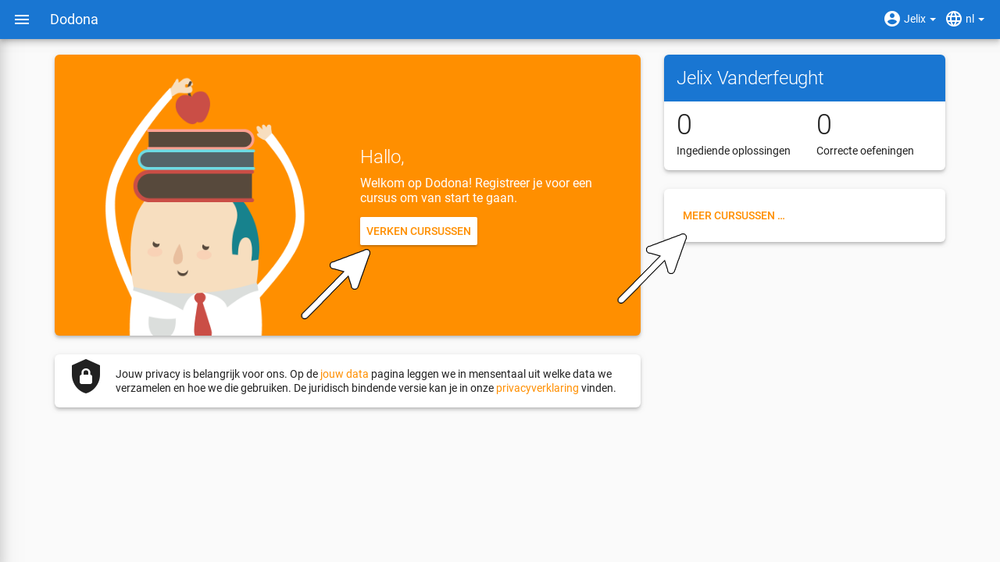
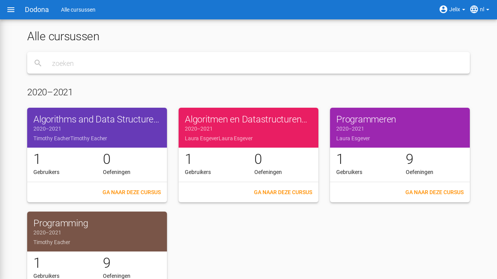
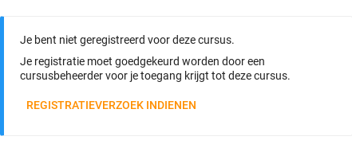
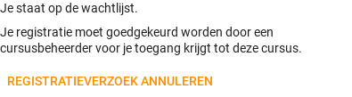
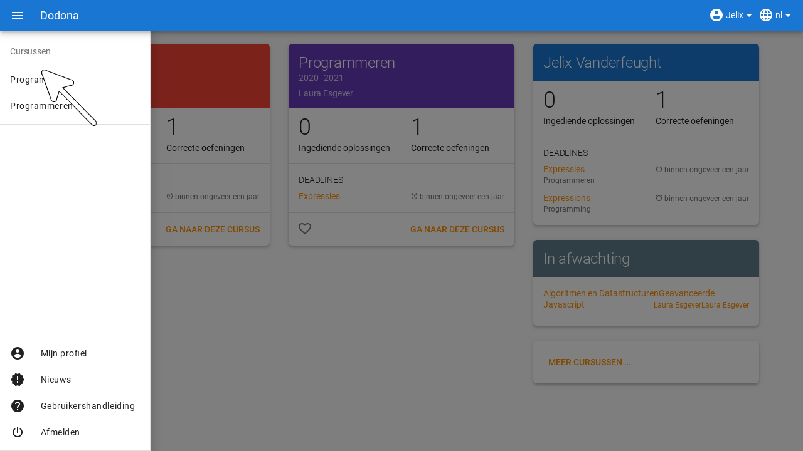
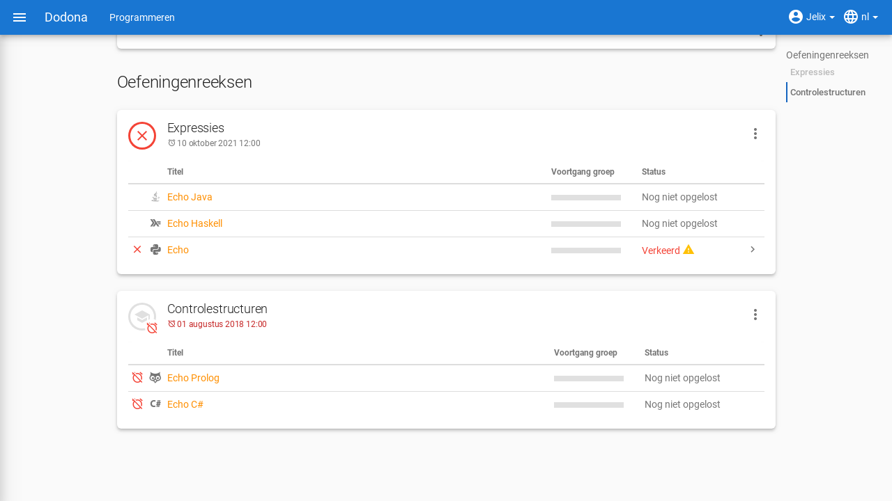

# Cursussen op Dodona
> Alle informatie zodat je als student kan registreren en uitschrijven voor een cursus, kan navigeren naar een cursus en de indienstatus kan interpreteren.

**Inhoudsopgave**
[[toc]]

## Wat is een cursus?

Een cursus op Dodona is een leerpad met [oefeningen](../exercises/#navigeren-naar-een-oefening) die gebundeld worden in oefeningenreeksen. Als je voor een cursus [geregistreerd](#registreren-voor-een-cursus) bent dan kan je binnen de cursus ook [oplossingen](../exercises/#navigeren-naar-een-oplossing) [indienen](../exercises/#indienen-van-een-oplossing) voor de [oefeningen](../exercises/#navigeren-naar-een-oefening).

## Registreren voor een cursus

Om oplossingen voor oefeningen in een cursus te kunnen indienen moet je in die cursus geregistreerd zijn. Daarom zullen wij nu uitleggen hoe je een cursus makkelijk kan vinden en je hiervoor kan registreren. 

### Hoe vind je een cursus?

Eerst moet je de cursus waarvoor je wil registreren vinden. Dit kan je doen door op je startpagina op `MEER CURSUSSEN...` of op `VERKEN CURSUSSEN` te klikken.

Dit zal je naar een overzicht van alle cursussen brengen waar je de zoekbalk kan gebruiken om op basis van een cursusnaam, een naam van een lesgever of een academiejaar de juiste cursus kan vinden.

### Hoe registreer je?

Als je [navigeert](#navigeren-naar-een-cursus) naar de cursus dat je zocht, waarvoor je nog niet [geregistreerd](#registreren-voor-een-cursus) bent, dan zie je bovenaan de [cursuspagina](#cursuspagina) een paneel dat aangeeft of en hoe je je voor de cursus kan [registreren](#registreren-voor-een-cursus). Hierbij zijn er drie mogelijkheden:

-   De cursus werkt met een open registratieprocedure, wat betekent dat iedereen voor de cursus kan registreren zonder expliciete goedkeuring van een cursusbeheerder. Klik op de knop `REGISTREREN` om je voor de cursus te registreren.

    

<h1 id="registratieverzoek"/>

-   De cursus werkt met een gemodereerde registratieprocedure, wat betekent dat je een **registratieverzoek** kunt indienen dat daarna dient goedgekeurd of afgekeurd te worden door een cursusbeheerder. Pas wanneer je registratieverzoek wordt goedgekeurd, ben je ook effectief geregistreerd voor de cursus. Klik op de knop `REGISTRATIEVERZOEK` om een registratieverzoek voor de cursus in te dienen.

    

    Zolang je registratieverzoek nog niet werd goedgekeurd of afgekeurd door een cursusbeheerder, verschijnt in het paneel bovenaan de [cursuspagina](#cursuspagina) de boodschap `Je staat al op de wachtlijst.` en wordt de cursus opgelijst in het paneel `Wachten op goedkeuring` in de rechterkolom van je startpagina.

    

-   De cursus werkt met een gesloten registratieprocedure, wat betekent dat je geen [registratieverzoek](#registratieverzoek) kunt indienen voor de cursus.

    

Zodra je voor een cursus [geregistreerd](#registreren-voor-een-cursus) bent, verschijnt er een kaartje van de cursus aan de linkerkant van je startpagina en wordt de cursus opgelijst op je [profielpagina](../login-and-settings/#instellen-van-persoonlijke-voorkeuren). Als de cursus wordt aangeboden in het meest recente academiejaar waarvoor je voor een cursus geregistreerd bent, dan wordt de cursus ook opgelijst onder `Mijn vakken` in het hamburger menu aan de linkerkant van de [navigatiebalk](../login-and-settings/#selecteren-van-de-taal).

Naast de mogelijkheid om zelf naar een cursus te navigeren en op de [cursuspagina](#cursuspagina) de registratieprocedure te doorlopen, bestaat ook de mogelijkheid dat je een registratielink ontvangt van een cursusbeheerder (bijvoorbeeld per email van een lesgever). Door op de registratielink te klikken, wordt de registratieprocedure opgestart voor een specifieke cursus en hoef je dus zelf niet meer naar de cursus te navigeren. De registratieprocedure blijft net zoals bij manuele registratie wel afhankelijk van het feit of de cursus werkt met een open, een gemodereerde of een gesloten registratieprocedure.

## Cursus componenten

### Cursuspagina

Na [selectie](#navigeren-naar-een-cursus) van een cursus navigeer je naar de **cursuspagina** met bovenaan een beschrijving van de cursus. Daaronder staan de oefeningenreeksen met de [oefeningen](../exercises/#navigeren-naar-een-oefening) van de cursus.

::: tip

Als je binnen een cursus aan het werken bent dan verschijnt de naam van de cursus naast `Dodona` aan de linkerkant van de [navigatiebalk](../login-and-settings/#selecteren-van-de-taal). Door in de navigatiebalk op de naam van de cursus te klikken, navigeer je terug naar de [cursuspagina](#cursuspagina).

:::

### Oefeningenreeksen
#### Deadlines

Voor elke oefeningenreeks kan er door een cursusbeheerder optioneel een **deadline** ingesteld zijn die dan naast de naam van de oefening wordt weergegeven. Bij weergave van de deadline wordt rekening gehouden met de [tijdzone](../login-and-settings/#tijdzone) uit je [gebruikersprofiel](../login-and-settings/#instellen-van-persoonlijke-voorkeuren). Deadlines worden in het groen weergegeven als ze nog niet verstreken zijn, en in het rood als ze reeds verstreken zijn.

Onder de naam van een oefeningenreeks staat optioneel een beschrijving, met daaronder een oplijsting van alle [oefeningen](../exercises/#navigeren-naar-een-oefening) uit de reeks. De lijst toont voor elke oefening [statistieken](#statistieken) en je [indienstatus](#indienstatus). Vóór elke oefening in de lijst staat ook een [icoontje](#indienstatus) dat correspondeert met je indienstatus voor de oefening.

::: tip Belangrijk
Dezelfde [oefening](../exercises/#navigeren-naar-een-oefening) kan voorkomen in meerdere cursussen. De [statistieken](#statistieken) en je [indienstatus](#indienstatus) voor de oefening zijn dan doorgaans niet hetzelfde omdat ze voor elke cursus afzonderlijk bepaald worden en je telkens [oplossingen](../exercises/#navigeren-naar-een-oplossing) [indient](../exercises/#navigeren-naar-een-oplossing) binnen een bepaalde cursus.

Dezelfde [oefening](../exercises/#navigeren-naar-een-oefening) kan ook voorkomen in meerdere oefeningenreeksen van een cursus. Ook dan zijn de [statistieken](#statistieken) en je [indienstatus](#indienstatus) voor de oefening niet noodzakelijk hetzelfde omdat de indienstatus afhangt van de [deadlines](#deadline) van de oefeningenreeksen. Als er geen deadline werd ingesteld of als dezelfde deadline werd ingesteld voor de oefeningenreeksen, dan zijn de statistieken en je indienstatus voor de oefening per definitie wel hetzelfde.
:::

#### Menu

In het menu van een oefeningenreeks vind je de volgende opties:

`Toon overzicht`

Toont een overzicht waarin de namen en beschrijvingen van alle [oefeningen](../exercises/#navigeren-naar-een-oefening) uit de oefeningenreeks netjes onder elkaar staan. Onder elke beschrijving staat ook je [indienstatus](#indienstatus) voor de oefening. Als je op de indienstatus drukt dan navigeer je naar de [oplossing](../exercises/#navigeren-naar-een-oplossing) die gebruikt werd om de indienstatus te bepalen (als je effectief een oplossing hebt [ingediend](../exercises/#navigeren-naar-een-oplossing) op basis waarvan de indienstatus kon bepaald worden).

::: tip
Dit overzicht is handig als je een afgedrukte versie wil van alle [oefeningen](../exercises/#navigeren-naar-een-oefening) uit een oefeningenreeks. Dodona voorziet dezelfde verzorgde opmaak als bij het afdrukken van een individuele oefening.
:::

`Oplossing downloaden`

Downloadt een ZIP-bestand dat voor elke [oefening](../exercises/#navigeren-naar-een-oefening) uit de oefeningenreeks de [oplossing](../exercises/#navigeren-naar-een-oplossing) bevat die gebruikt werd om je [indienstatus](#indienstatus) voor de oefening te bepalen (als je effectief een oplossing hebt [ingediend](../exercises/#navigeren-naar-een-oplossing) op basis waarvan de indienstatus kon bepaald worden).

### Oefeningen
#### Statistieken

De **statistieken** van een [oefening](../exercises/#navigeren-naar-een-oefening) uit een oefeningenreeks bestaan uit twee getallen *c/i*. Daarbij staat *i* voor het aantal gebruikers (studenten en cursusbeheerders) dat in de cursus al minstens één [oplossing](../exercises/#navigeren-naar-een-oplossing) heeft [ingediend](../exercises/#navigeren-naar-een-oplossing) voor de oefening en *c* voor het aantal gebruikers (studenten en cursusbeheerders) dat in de cursus al minstens één *correcte* oplossing heeft ingediend voor de oefening.

#### Indienstatus

Je **indienstatus** voor een [oefening](../exercises/#navigeren-naar-een-oefening) uit een oefeningenreeks wordt bepaald op basis van de [oplossing](../exercises/#navigeren-naar-een-oplossing) die je als laatste in de cursus hebt [ingediend](../exercises/#navigeren-naar-een-oplossing) voor de oefening. Als er een [deadline](#deadline) werd ingesteld voor de oefeningenreeks, dan is dit de laatst ingediende oplossing voorafgaand aan de deadline. In de oefeningenreeks zie je vóór elke oefening ook een **icoontje** dat correspondeert met je indienstatus voor de oefening. Als je in een oefeningenreeks drukt op je indienstatus voor een oefening, dan navigeer je naar de [oplossing](../exercises/#navigeren-naar-een-oplossing) die gebruikt werd om de indienstatus te bepalen (als je effectief een oplossing hebt ingediend op basis waarvan de indienstatus kon bepaald worden).

Mogelijke weergaven van je [indienstatus](#indienstatus) vóór het verstrijken van de [deadline](#deadline) of als er geen deadline is ingesteld:

  | indienstatus | icoontje | weergegeven als je |
  | --- | --- | --- |
  | `niet opgelost` | | geen [oplossing](../exercises/#navigeren-naar-een-oplossing) hebt [ingediend](../exercises/#navigeren-naar-een-oplossing) (vóór de [deadline](#deadline)) | 
  | `verkeerd` |  | laatste [oplossing](../exercises/#navigeren-naar-een-oplossing) die je [indiende](../exercises/#navigeren-naar-een-oplossing) verkeerd was |
  | `correct` |  |laatste [oplossing](../exercises/#navigeren-naar-een-oplossing) die je [indiende](../exercises/#navigeren-naar-een-oplossing) correct was (vóór de [deadline](#deadline)) |

Mogelijke weergaven van je [indienstatus](#indienstatus) nadat de [deadline](#deadline) verstreken is:

  |indienstatus | icoontje | weergegeven als je |
  |-------------|----------|--------------------|
  | `correct` (groen) |  | laatst [ingediende](../exercises/#navigeren-naar-een-oplossing) [oplossing](../exercises/#navigeren-naar-een-oplossing) vóór de [deadline](#deadline) correct is
  | `deadline gemist` (rood) |  | geen [oplossingen](../exercises/#navigeren-naar-een-oplossing) hebt [ingediend](../exercises/#navigeren-naar-een-oplossing)|
  | `deadline gemist` (rood) |  | als je laatst ingediende oplossing niet correct is |
  | `deadline gemist` (rood) |  | als je na de [deadline](#deadline) een correcte oplossing hebt ingediend |

::: tip Belangrijk

Als je **vóór het verstrijken van de deadline** van een oefeningenreeks een [oplossing](../exercises/#navigeren-naar-een-oplossing) [indient](../exercises/#navigeren-naar-een-oefening) voor een [oefening](../exercises/#navigeren-naar-een-oefening) uit de oefeningenreeks, dan kan je [indienstatus](#indienstatus) voor de oefening nog wijzigen omdat die indienstatus altijd gebaseerd is op je laatst ingediende oplossing vóór de [deadline](#deadline). Het is dus je eigen verantwoordelijkheid om ervoor te zorgen dat je laatst ingediende oplossing vóór de deadline ook je meest correcte oplossing is. Je kunt eventueel een voorgaande oplossing selecteren en opnieuw indienen.

Dodona toont een **waarschuwingssymbool** naast je [indienstatus](#indienstatus) van een [oefening](../exercises/#navigeren-naar-een-oefening) in een oefeningenreeks en in de lijst met recente op je startpagina als je laatst [ingediende](../exercises/#navigeren-naar-een-oplossing) [oplossing](../exercises/#navigeren-naar-een-oplossing) voor de oefening vóór de [deadline](#deadline) van de oefeningenreeks een status heeft die slechter is dan de status van een oplossing voor de oefening die je daarvoor hebt ingediend. Je kunt eventueel een voorgaande oplossing selecteren en opnieuw indienen.

Als je **na het verstrijken van de deadline** van een oefeningenreeks een [oplossing](../exercises/#navigeren-naar-een-oplossing) [indient](../exercises/#navigeren-naar-een-oefening) voor een [oefening](../exercises/#navigeren-naar-een-oefening) uit een oefeningenreeks, dan zal je [indienstatus](#indienstatus) voor de oefening in de oefeningenreeks daardoor nooit wijzigen. Je indienstatus voor een oefening in een oefeningenreeks wordt immers bepaald op basis van je laatst ingediende oplossing vóór de [deadline](#deadline).
:::

## Uitschrijven uit een cursus

Als je navigeert naar een cursus waarvoor je [geregistreerd](#registreren-voor-een-cursus) bent of waarvoor je nog een [registratieverzoek](#registratieverzoek) hebt openstaan, dan zie je onder de beschrijving van de cursus op de [cursuspagina](#cursuspagina) een knop `UITSCHRIJVEN` waarmee je je kunt uitschrijven uit de cursus.

Hierdoor verdwijnt het kaartje van de cursus aan de linkerkant van je startpagina en wordt de cursus niet langer opgelijst op je [profielpagina](../login-and-settings/#instellen-van-persoonlijke-voorkeuren). Als de cursus werd opgelijst onder `Mijn vakken` in het hamburger menu aan de linker kant van de [navigatiebalk](../login-and-settings/#selecteren-van-de-taal), dan verdwijnt de cursus ook uit die lijst. Als de cursus werd opgelijst in het paneel `Wachten op goedkeuring` in de rechterkolom van je startpagina, dan verdwijnt de cursus ook uit die lijst.