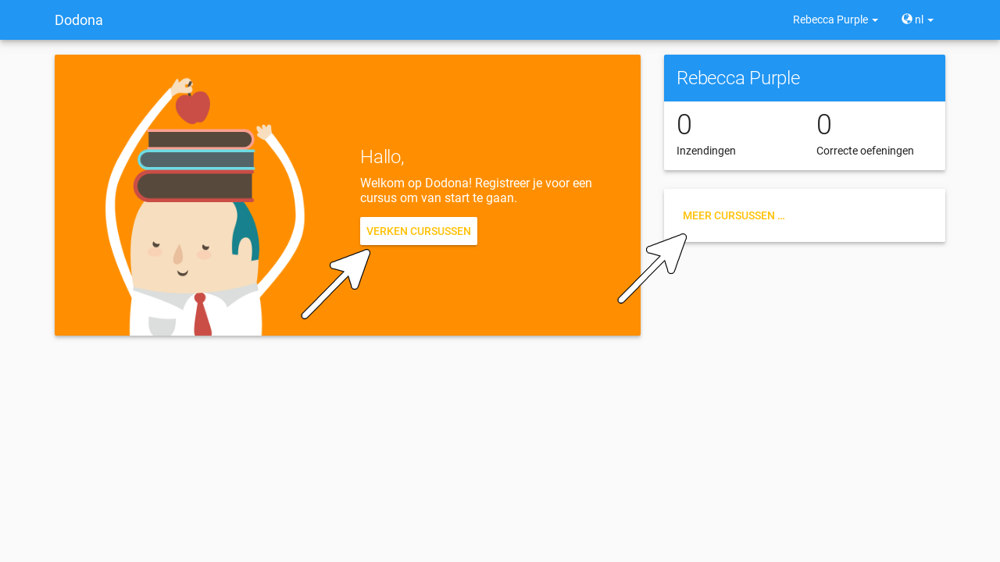
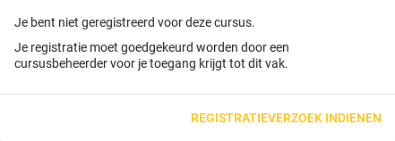

## Navigeren naar een cursus

Cursusbeheerders kunnen [cursussen]() opbouwen uit [oefeningen](/nl/guides/for-students/exercises/#navigeren-naar-een-oefening) die gegroepeerd worden in [oefeningenreeksen](). Als je voor een cursus [geregistreerd](#registreren-voor-een-cursus) bent dan kan je binnen de cursus ook [oplossingen](/nl/guides/for-students/exercises/#navigeren-naar-een-oplossing) [indienen](#indienen-van-een-oplossing) voor de [oefeningen](/nl/guides/for-students/exercises/#navigeren-naar-een-oefening). Er zijn verschillende plaatsen waar je een cursus kunt selecteren:

-   Aan de linkerkant van je [startpagina](/nl/guides/for-students/login-and-settings/#startpagina) staan kaartjes van alle [cursussen]() waarvoor je [geregistreerd](#registreren-voor-een-cursus) bent, gegroepeerd per academiejaar. Gebruik de zoekbalk bovenaan de startpagina om te zoeken naar specifieke cursussen op basis van een cursusnaam, een naam van een lesgever of een academiejaar. Selecteer een cursus door op de gekleurde titelbalk van het kaartje van de cursus te drukken of door onderaan het kaartje op de knop GA NAAR DEZE CURSUS te drukken.

-   Als je nog [registratieverzoeken](#registratieverzoek) voor [cursussen]() hebt openstaan die wachten op goedkeuring van een cursusbeheerder, dan vind je deze cursussen in het paneel Wachten op goedkeuring in de rechterkolom van je [startpagina](/nl/guides/for-students/login-and-settings/#startpagina). Je kunt één van deze cursussen selecteren door op de naam van de cursus te drukken.

-   Het [hamburger menu]() aan de linkerkant van de [navigatiebalk](#selecteren-van-de-taal) bevat onder de hoofding Mijn vakken een lijst met alle [cursussen]() waarvoor je [geregistreerd](#registreren-voor-een-cursus) bent. Deze lijst is beperkt tot de cursussen van het meest recente academiejaar waarvoor je voor een cursus geregistreerd bent. Omdat de navigatiebalk op elke pagina beschikbaar is, vormt dit een snelle manier om één van de cursussen uit deze lijst te selecteren zonder dat je eerst naar je [startpagina](/nl/guides/for-students/login-and-settings/#startpagina) moet navigeren.

    

-   Op je [profielpagina](/nl/guides/for-students/login-and-settings/#instellen-van-persoonlijke-voorkeuren) staat een lijst met alle [cursussen]() waarvoor je [geregistreerd](#registreren-voor-een-cursus) bent of waarvoor je nog een [registratieverzoek](#registratieverzoek) hebt openstaan dat wacht op goedkeuring van een cursusbeheerder. Je kunt één van deze cursussen selecteren door op de naam van de cursus te drukken.

    

<h1 id="cursusoverzicht"></h1>

-   Het **cursusoverzicht** toont alle beschikbare [cursussen](), gegroepeerd per academiejaar. Navigeer naar het cursusoverzicht door te drukken op de knop MEER CURSUSSEN ... onderaan in de rechterkolom op je [startpagina](/nl/guides/for-students/login-and-settings/#startpagina). Als je nog voor geen enkele cursus [geregistreerd](#registreren-voor-een-cursus) bent, dan kan je als alternatief ook drukken op de knop VERKEN naast de afbeelding op je startpagina.

    

    Gebruik de zoekbalk bovenaan het [cursusoverzicht](#cursusoverzicht) om te zoeken naar specifieke [cursussen]() op basis van een cursusnaam, een naam van een lesgever of een academiejaar. Selecteer een cursus door op de gekleurde titelbalk van het kaartje van de cursus te drukken of door onderaan het kaartje op de knop GA NAAR DEZE CURSUS te drukken.

    

<h1 id="cursuspagina"></h1>

Na [selectie](#navigeren-naar-een-cursus) van een [cursus]() navigeer je naar de **cursuspagina** met bovenaan een beschrijving van de cursus. Daaronder staan de [oefeningenreeksen]() met de [oefeningen](/nl/guides/for-students/exercises/#navigeren-naar-een-oefening) van de cursus.

::: tip

Als je binnen een [cursus]() aan het werken bent dan verschijnt de naam van de cursus naast Dodona aan de linkerkant van de [navigatiebalk](#selecteren-van-de-taal). Door in de navigatiebalk op de naam van de cursus te drukken, navigeer je terug naar de [cursuspagina](#cursuspagina).

:::

<h1 id="deadline"></h1>

Voor elke [oefeningenreeks]() kan er door een cursusbeheerder optioneel een **deadline** ingesteld zijn die dan naast de naam van de oefening wordt weergegeven. Bij weergave van de deadline wordt rekening gehouden met de [tijdzone](/nl/guides/for-students/login-and-settings/#tijdzone) uit je [gebruikersprofiel](#instellen-van-persoonlijke-voorkeuren). Deadlines worden in het groen weergegeven als ze nog niet verstreken zijn, en in het rood als ze reeds verstreken zijn.

Onder de naam van een [oefeningenreeks]() staat optioneel een beschrijving, met daaronder een oplijsting van alle [oefeningen](/nl/guides/for-students/exercises/#navigeren-naar-een-oefening) uit de reeks. De lijst toont voor elke oefening [statistieken](#statistieken) en je [indienstatus](#indienstatus). Vóór elke oefening in de lijst staat ook een [icoontje](#indienstatus) dat correspondeert met je indienstatus voor de oefening.

::: tip Belangrijk
Dezelfde [oefening](/nl/guides/for-students/exercises/#navigeren-naar-een-oefening) kan voorkomen in meerdere [cursussen](). De [statistieken](#statistieken) en je [indienstatus](#indienstatus) voor de oefening zijn dan doorgaans niet hetzelfde omdat ze voor elke cursus afzonderlijk bepaald worden en je telkens [oplossingen](/nl/guides/for-students/exercises/#navigeren-naar-een-oplossing) [indient](/nl/guides/for-students/exercises/#navigeren-naar-een-oplossing) binnen een bepaalde cursus.

Dezelfde [oefening](/nl/guides/for-students/exercises/#navigeren-naar-een-oefening) kan ook voorkomen in meerdere [oefeningenreeksen]() van een [cursus](). Ook dan zijn de [statistieken](#statistieken) en je [indienstatus](#indienstatus) voor de oefening niet noodzakelijk hetzelfde omdat de indienstatus afhangt van de [deadlines](#deadlines) van de oefeningenreeksen. Als er geen deadline werd ingesteld of als dezelfde deadline werd ingesteld voor de oefeningenreeksen, dan zijn de statistieken en je indienstatus voor de oefening per definitie wel hetzelfde.
:::

<h1 id="statistieken"></h1>

De **statistieken** van een [oefening](/nl/guides/for-students/exercises/#navigeren-naar-een-oefening) uit een [oefeningenreeks]() bestaan uit twee getallen *c/i*. Daarbij staat *i* voor het aantal gebruikers (studenten en cursusbeheerders) dat in de [cursus]() al minstens één [oplossing](/nl/guides/for-students/exercises/#navigeren-naar-een-oplossing) heeft [ingediend](/nl/guides/for-students/exercises/#navigeren-naar-een-oplossing) voor de oefening en *c* voor het aantal gebruikers (studenten en cursusbeheerders) dat in de cursus al minstens één *correcte* oplossing heeft ingediend voor de oefening.

<h1 id="indienstatus"></h1>

Je **indienstatus** voor een [oefening](/nl/guides/for-students/exercises/#navigeren-naar-een-oefening) uit een [oefeningenreeks]() wordt bepaald op basis van de [oplossing](/nl/guides/for-students/exercises/#navigeren-naar-een-oplossing) die je als laatste in de [cursus]() hebt [ingediend](/nl/guides/for-students/exercises/#navigeren-naar-een-oplossing) voor de oefening. Als er een [deadline](#deadlines) werd ingesteld voor de oefeningenreeks, dan is dit de laatst ingediende oplossing voorafgaand aan de deadline. In de oefeningenreeks zie je vóór elke oefening ook een **icoontje** dat correspondeert met je indienstatus voor de oefening. Als je in een oefeningenreeks drukt op je indienstatus voor een oefening, dan navigeer je naar de [oplossing](/nl/guides/for-students/exercises/#navigeren-naar-een-oplossing) die gebruikt werd om de indienstatus te bepalen (als je effectief een oplossing hebt ingediend op basis waarvan de indienstatus kon bepaald worden).

Mogelijke weergaven van je [indienstatus](#indienstatus) vóór het verstrijken van de [deadline](#deadlines) of als er geen deadline is ingesteld:

  | indienstatus | icoontje | weergegeven als je |
  | --- | --- | --- |
  | niet opgelost | | geen [oplossing](/nl/guides/for-students/exercises/#navigeren-naar-een-oplossing) hebt [ingediend](/nl/guides/for-students/exercises/#navigeren-naar-een-oplossing) (vóór de [deadline](#deadlines)) | 
  | verkeerd |  | laatste [oplossing](/nl/guides/for-students/exercises/#navigeren-naar-een-oplossing) die je [indiende](/nl/guides/for-students/exercises/#navigeren-naar-een-oplossing) verkeerd was |
  | correct |  |laatste [oplossing](/nl/guides/for-students/exercises/#navigeren-naar-een-oplossing) die je [indiende](/nl/guides/for-students/exercises/#navigeren-naar-een-oplossing) correct was (vóór de [deadline](#deadlines)) |

Mogelijke weergaven van je [indienstatus](#indienstatus) nadat de [deadline](#deadlines) verstreken is:

  |indienstatus | icoontje | weergegeven als je |
  |-------------|----------|--------------------|
  | correct (groen) |  | laatst [ingediende](/nl/guides/for-students/exercises/#navigeren-naar-een-oplossing) [oplossing](/nl/guides/for-students/exercises/#navigeren-naar-een-oplossing) vóór de [deadline](#deadlines) correct is
  | deadline gemist (rood) | | geen [oplossingen](/nl/guides/for-students/exercises/#navigeren-naar-een-oplossing) hebt [ingediend](/nl/guides/for-students/exercises/#navigeren-naar-een-oplossing)|
  | deadline gemist (rood) |  | als je laatst ingediende oplossing niet correct is |
  | deadline gemist (rood) |  | als je na de [deadline](#deadlines) een correcte oplossing hebt ingediend |

::: tip Belangrijk

Als je **vóór het verstrijken van de deadline** van een [oefeningenreeks]() een [oplossing](/nl/guides/for-students/exercises/#navigeren-naar-een-oplossing) [indient](/nl/guides/for-students/exercises/#navigeren-naar-een-oefening) voor een [oefening](/nl/guides/for-students/exercises/#navigeren-naar-een-oefening) uit de oefeningenreeks, dan kan je [indienstatus](#indienstatus) voor de oefening nog wijzigen omdat die indienstatus altijd gebaseerd is op je laatst ingediende oplossing vóór de [deadline](#deadlines). Het is dus je eigen verantwoordelijkheid om ervoor te zorgen dat je laatst ingediende oplossing vóór de deadline ook je meest correcte oplossing is. Je kunt eventueel een voorgaande oplossing selecteren en [opnieuw indienen]().

Dodona toont een **waarschuwingssymbool** naast je [indienstatus](#indienstatus) van een [oefening](/nl/guides/for-students/exercises/#navigeren-naar-een-oefening) in een [oefeningenreeks]() en in de lijst met [recente]() op je [startpagina](/nl/guides/for-students/login-and-settings/#startpagina) als je laatst [ingediende](/nl/guides/for-students/exercises/#navigeren-naar-een-oplossing) [oplossing](/nl/guides/for-students/exercises/#navigeren-naar-een-oplossing) voor de oefening vóór de [deadline](#deadlines) van de oefeningenreeks een [status](/nl/guides/for-students/exercises/#status) heeft die slechter is dan de status van een oplossing voor de oefening die je daarvoor hebt ingediend. Je kunt eventueel een voorgaande oplossing selecteren en opnieuw indienen.

Als je **na het verstrijken van de deadline** van een [oefeningenreeks]() een [oplossing](/nl/guides/for-students/exercises/#navigeren-naar-een-oplossing) [indient](/nl/guides/for-students/exercises/#navigeren-naar-een-oefening) voor een [oefening](/nl/guides/for-students/exercises/#navigeren-naar-een-oefening) uit een [oefeningenreeks](), dan zal je [indienstatus](#indienstatus) voor de oefening in de oefeningenreeks daardoor nooit wijzigen. Je indienstatus voor een oefening in een oefeningenreeks wordt immers bepaald op basis van je laatst ingediende oplossing vóór de [deadline](#deadlines).
:::

In het menu van een [oefeningenreeks]() vind je de volgende opties:

Toon overzicht

Toont een overzicht waarin de namen en beschrijvingen van alle [oefeningen](/nl/guides/for-students/exercises/#navigeren-naar-een-oefening) uit de [oefeningenreeks]() netjes onder elkaar staan. Onder elke beschrijving staat ook je [indienstatus](#indienstatus) voor de oefening. Als je op de indienstatus drukt dan navigeer je naar de [oplossing](/nl/guides/for-students/exercises/#navigeren-naar-een-oplossing) die gebruikt werd om de indienstatus te bepalen (als je effectief een oplossing hebt [ingediend](/nl/guides/for-students/exercises/#navigeren-naar-een-oplossing) op basis waarvan de indienstatus kon bepaald worden).

::: tip
Dit overzicht is handig als je een afgedrukte versie wil van alle [oefeningen](/nl/guides/for-students/exercises/#navigeren-naar-een-oefening) uit een [oefeningenreeks](). Dodona voorziet dezelfde verzorgde opmaak als bij het [afdrukken]() van een individuele oefening.
:::

Oplossing downloaden

Downloadt een ZIP-bestand dat voor elke [oefening](/nl/guides/for-students/exercises/#navigeren-naar-een-oefening) uit de [oefeningenreeks]() de [oplossing](/nl/guides/for-students/exercises/#navigeren-naar-een-oplossing) bevat die gebruikt werd om je [indienstatus](#indienstatus) voor de oefening te bepalen (als je effectief een oplossing hebt [ingediend](/nl/guides/for-students/exercises/#navigeren-naar-een-oplossing) op basis waarvan de indienstatus kon bepaald worden).

## Registreren voor een cursus

Je moet geregistreerd zijn voor een [cursus]() voordat je [oplossingen](/nl/guides/for-students/exercises/#navigeren-naar-een-oplossing) kan [indienen](#indienen-van-een-oplossing) voor de [oefeningen](/nl/guides/for-students/exercises/#navigeren-naar-een-oefening) uit de cursus.

<h1 id="manuele-registratie"/>

Als je [navigeert](#navigeren-naar-een-cursus) naar een [cursus]() waarvoor je nog niet [geregistreerd](#registreren-voor-een-cursus) bent, dan zie je bovenaan de [cursuspagina](#cursuspagina) een paneel dat aangeeft of en hoe je je voor de cursus kan [registreren](#registreren-voor-een-cursus). Hierbij zijn er drie mogelijkheden:

-   De [cursus]() werkt met een [open]() [registratieprocedure](), wat betekent dat iedereen voor de cursus kan registreren zonder expliciete goedkeuring van een cursusbeheerder. Druk op de knop REGISTREREN om je voor de cursus te registreren.

    

<h1 id="registratieverzoek"/>

-   De [cursus]() werkt met een [gemodereerde]() [registratieprocedure](), wat betekent dat je een **registratieverzoek** kunt indienen dat daarna dient goedgekeurd of afgekeurd te worden door een cursusbeheerder. Pas wanneer je registratieverzoek wordt goedgekeurd, ben je ook effectief geregistreerd voor de cursus. Druk op de knop REGISTRATIEVERZOEK om een registratieverzoek voor de cursus in te dienen.

    

    Zolang je registratieverzoek nog niet werd goedgekeurd of afgekeurd door een cursusbeheerder, verschijnt in het paneel bovenaan de [cursuspagina](#cursuspagina) de boodschap Je staat al op de wachtlijst. en wordt de cursus opgelijst in het paneel Wachten op goedkeuring in de rechterkolom van je [startpagina](/nl/guides/for-students/login-and-settings/#startpagina).

    

-   De [cursus]() werkt met een [gesloten]() [registratieprocedure](), wat betekent dat je geen [registratieverzoek](#registratieverzoek) kunt indienen voor de cursus.

    

::: details Notitie

Op een [cursuspagina](#cursuspagina) kan je enkel de beschrijving en de [oefeningenreeksen]() zien als je voor de [cursus]() [geregistreerd](#registreren-voor-een-cursus) bent of als de cursus werkt met [open]().
:::

Zodra je voor een [cursus]() [geregistreerd](#registreren-voor-een-cursus) bent, verschijnt er een kaartje van de cursus aan de linkerkant van je [startpagina](/nl/guides/for-students/login-and-settings/#startpagina) en wordt de cursus opgelijst op je [profielpagina](/nl/guides/for-students/login-and-settings/#instellen-van-persoonlijke-voorkeuren). Als de cursus wordt aangeboden in het meest recente academiejaar waarvoor je voor een cursus geregistreerd bent, dan wordt de cursus ook opgelijst onder Mijn vakken in het [hamburger menu]() aan de linkerkant van de [navigatiebalk](#selecteren-van-de-taal).

Naast de mogelijkheid om zelf naar een [cursus]() te navigeren en op de [cursuspagina](#cursuspagina) de [registratieprocedure]() te doorlopen, bestaat ook de mogelijkheid dat je een [registratielink]() ontvangt van een [cursusbeheerder]() (bijvoorbeeld per email van een lesgever). Door op de registratielink te drukken, wordt de registratieprocedure opgestart voor een specifieke cursus en hoef je dus zelf niet meer naar de cursus te navigeren. De registratieprocedure blijft net zoals bij [manuele registratie](#manuele-registratie) wel afhankelijk van het feit of de cursus werkt met een open, een gemodereerde of een gesloten registratieprocedure.

## Uitschrijven uit een cursus

Als je navigeert naar een [cursus]() waarvoor je [geregistreerd](#registreren-voor-een-cursus) bent of waarvoor je nog een [registratieverzoek](#registratieverzoek) hebt openstaan, dan zie je onder de beschrijving van de cursus op de [cursuspagina](#cursuspagina) een knop UITSCHRIJVEN waarmee je je kunt uitschrijven uit de cursus.

Hierdoor verdwijnt het kaartje van de [cursus]() aan de linkerkant van je [startpagina](/nl/guides/for-students/login-and-settings/#startpagina) en wordt de cursus niet langer opgelijst op je [profielpagina](/nl/guides/for-students/login-and-settings/#instellen-van-persoonlijke-voorkeuren). Als de cursus werd opgelijst onder Mijn vakken in het [hamburger menu]() aan de linker kant van de [navigatiebalk](#selecteren-van-de-taal), dan verdwijnt de cursus ook uit die lijst. Als de cursus werd opgelijst in het paneel Wachten op goedkeuring in de rechterkolom van je [startpagina](/nl/guides/for-students/login-and-settings/#startpagina), dan verdwijnt de cursus ook uit die lijst.