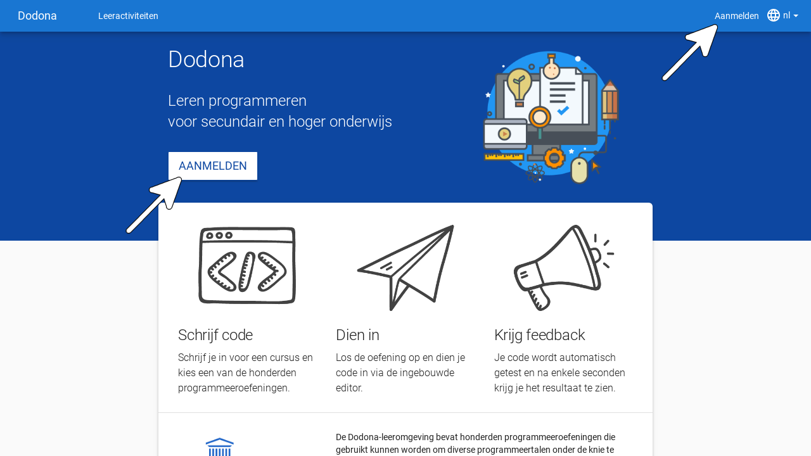
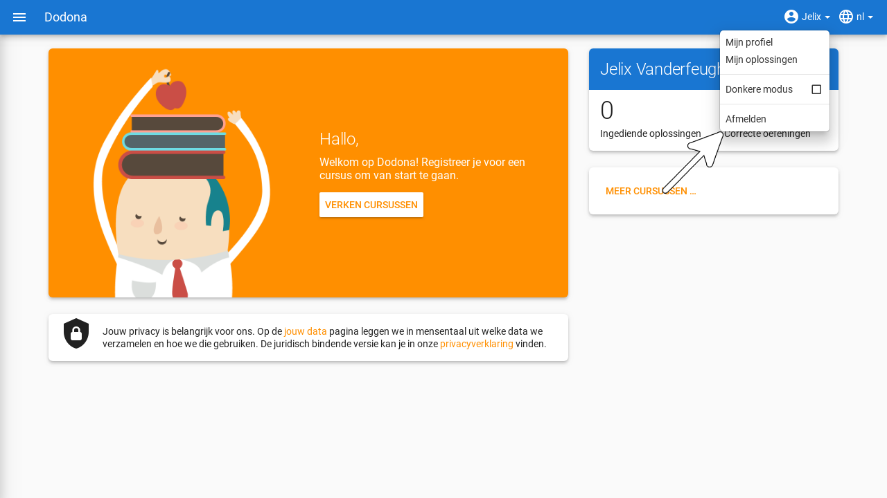
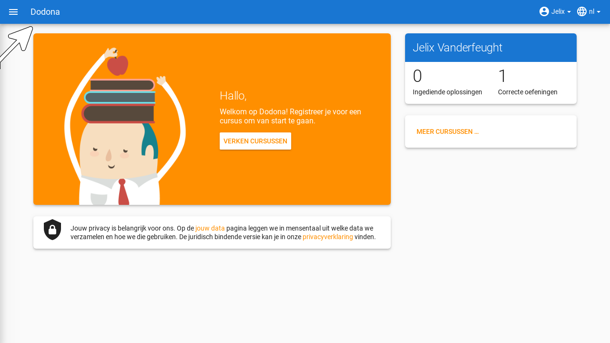
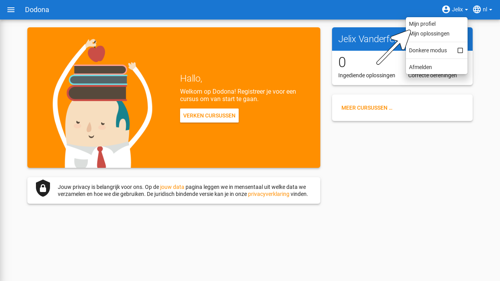
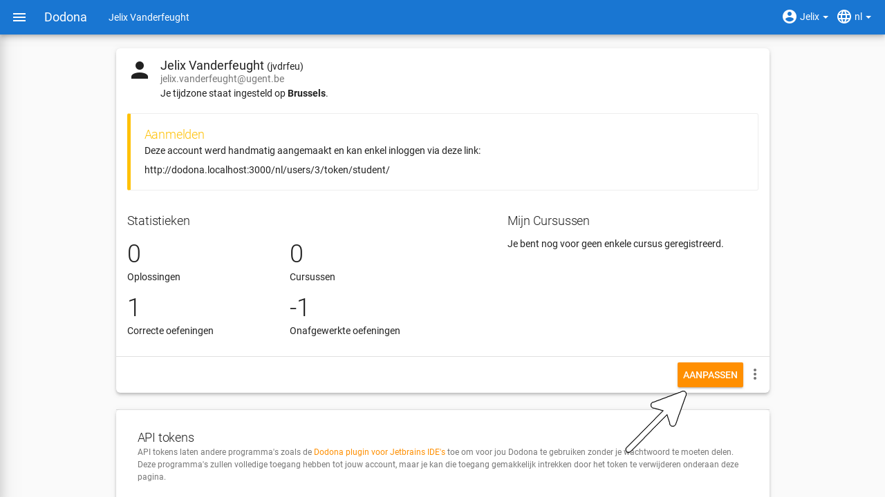

# Aanmelden & gebruikersinstellingen
> Alle informatie zodat je als student een een gebruikersaccount door Dodona kan laten aanmaken en die kan personaliseren.

## Inhoudstafel
[[toc]]

## Selecteren van de taal

Als taal voor Dodona kan je kiezen tussen Nederlands of Engels. Gebruik hiervoor het taalmenu aan de rechterkant van de navigatiebalk (bovenaan elke pagina).

Als je een taal selecteert terwijl je aangemeld bent dan wordt die ook als voorkeurstaal ingesteld in je [gebruikersprofiel](https://dodona.ugent.be/profile). Op die manier wordt bij aanmelden automatisch je voorkeurstaal geselecteerd.

::: tip Notitie

De taal waarin vaste componenten van Dodona (menubalken, cursusstructuur, mededelingen, ...) worden weergegeven, valt volledig onder de controle van het platform. Deze componenten worden altijd weergegeven in de geselecteerde taal.

De naam en beschrijving van een [cursus]() liggen vast, net zoals namen en beschrijvingen van [oefeningenreeksen]() binnen een cursus. Deze componenten zijn niet afhankelijk van de selectie van de taal. De taal van deze componenten valt volledig onder de controle van de cursusbeheerders die de cursus hebben opgesteld.

De naam en beschrijving van een [oefening](../exercises/#navigeren-naar-een-oefening) zijn afhankelijk van de selectie van de taal. Als bij het opstellen van de oefening een vertaling voorzien werd van de naam en de beschrijving in de geselecteerde taal, dan zullen deze componenten van de oefening ook in die taal weergegeven worden.

De taal van de [feedback](../exercises/#interpreteren-van-feedback) over een [oplossing](../exercises/#navigeren-naar-een-oplossing) die je [indient](../exercises/#indienen-van-een-oplossing) voor een [oefening](../exercises/#navigeren-naar-een-oefening) valt volledig onder de controle van de [judge](../exercises/#interpreteren-van-feedback) waaraan de oefening gekoppeld is. De judge kan de taal van deze feedback laten afhangen van de taal die geselecteerd is op het ogenblik waarop de oplossing wordt ingediend.
:::

## Aanmelden

Klik op `Aanmelden` aan de rechterkant van de [navigatiebalk](#selecteren-van-de-taal) of navigeer naar de landingspagina en klik op de knop `Aanmelden` centraal op de landingspagina.

Je kunt je inloggen op Dodona door je onderwijsinstelling te selecteren op de aanmeldpagina. Studenten uit het secundair kunnen inloggen met hun Smartschool, Office365 of G-Suite account. Als dit de eerste keer is dat je aanmeldt op Dodona dan wordt er automatisch een nieuwe gebruikersaccount aangemaakt op basis van de persoonsgegevens die doorgestuurd werden door je externe onderwijs- of onderzoeksinstelling. In het gebruikersprofiel van deze gebruikersaccount kan je [persoonlijke voorkeuren](#instellen-van-persoonlijke-voorkeuren) instellen voor de [taal](#selecteren-van-de-taal) en de tijdzone die door Dodona gebruikt worden.  Daarnaast worden alle acties die je op het platform uitvoert &mdash; zoals het [registreren](../courses/#registreren-voor-een-cursus) voor [cursussen]() of het [indienen](../exercises/#indienen-van-een-oplossing) van [oplossingen](../exercises/#navigeren-naar-een-oplossing) &mdash; aan je gebruikersaccount gekoppeld.

::: tip Belangrijk

Sommige onderwijs- of onderzoeksinstellingen vragen op het einde van de aanmeldingsprocedure expliciet jouw toestemming voor het doorsturen van enkele [persoonsgegevens](#instellen-van-persoonlijke-voorkeuren) naar Dodona. Vaak hoef je deze toestemming slechts één keer te geven op elke computer waarmee je aanmeldt. Dodona gebruikt deze persoonsgegevens enkel voor intern beheer van je [gebruikersprofiel](#instellen-van-persoonlijke-voorkeuren) en wisselt deze informatie nooit uit met externe partijen.
:::

::: details Notitie

Voor authenticatie met gebruikersaccounts van externe onderwijs- of onderzoeksinstellingen ondersteunt Dodona zowel [SAML](https://nl.wikipedia.org/wiki/Security_Assertion_Markup_Language) als [OAuth](https://nl.wikipedia.org/wiki/OAuth). Vraag een ICT-beheerder of lesgever van je onderwijs- of onderzoeksinstelling om [contact](../#contact-opnemen) met ons op te nemen als je graag alle gebruikersaccounts van je instelling toegang wilt geven tot Dodona. Deze dienstverlening is gratis.
:::

::: tip Belangrijk

Als je beschikt over gebruikersaccounts bij verschillende externe onderwijs- of onderzoeksinstellingen, dan corresponderen deze elk met een afzonderlijke gebruikersaccount op Dodona.
:::

::: tip

Als je wilt schakelen naar een andere [gebruikersaccount](#aanmelden) dan deze die momenteel [aangemeld](#aanmelden) is, dan moet je eerst afmelden en daarna terug aanmelden met de andere gebruikersaccount.
:::

### Gebruikersmenu

Als je aangemeld bent dan zie je aan de rechterkant van de [navigatiebalk](#selecteren-van-de-taal) het gebruikersmenu met de naam uit je [gebruikersprofiel](#instellen-van-persoonlijke-voorkeuren). Het gebruikersmenu staat op de plaats waar voorheen `Aanmelden` stond toen je nog niet aangemeld was.

### Startpagina

Als je [aangemeld](#aanmelden) bent dan verandert de neutrale landingspagina in een gepersonaliseerde startpagina met een overzicht van alle [cursussen]() waarvoor je [geregistreerd](../courses/#registreren-voor-een-cursus) bent, hun [oefeningenreeksen]() met nakende [deadlines]() en je voortgang bij het [indienen](../exercises/#indienen-van-een-oplossing) van [oplossingen](../exercises/#navigeren-naar-een-oplossing) voor [oefeningen](../exercises/#navigeren-naar-een-oefening). Je kunt dus ook makkelijk aan de landingspagina of aan je startpagina herkennen of je al dan niet aangemeld bent.

::: tip

Vanaf elke pagina kan je naar de landingspagina (als je afgemeld bent) of naar je startpagina (als je aangemeld bent) navigeren door uiterst links in de [navigatiebalk](#selecteren-van-de-taal) op `Dodona` te klikken.

:::

Als dit de eerste keer is dat je aanmeldt op Dodona dan ben je uiteraard nog voor geen enkele [cursus]() [geregistreerd](../courses/#registreren-voor-een-cursus) en heb je nog geen enkele [oplossing](../exercises/#navigeren-naar-een-oplossing) [ingediend](../exercises/#indienen-van-een-oplossing). Daardoor ziet je [startpagina]() er op dit moment nog vrij kaal uit.

## Instellen van persoonlijke voorkeuren

Kies voor `Mijn profiel` in het [gebruikersmenu](../login-and-settings/#gebruikersmenu) aan de rechterkant van de [navigatiebalk](#selecteren-van-de-taal) om naar je profielpagina te navigeren.

Op de [profielpagina](#instellen-van-persoonlijke-voorkeuren) staan je persoonsgegevens (voornaam, familienaam, gebruikersnaam en emailadres) en enkele persoonlijke voorkeuren ([taal](#selecteren-van-de-taal) en tijdzone) die samen je gebruikersprofiel vormen. Dodona gebruikt het gebruikersprofiel om je gebruikerservaring te personaliseren.

Klik op de bewerkknop in de rechterbovenhoek van je [profielpagina](#instellen-van-persoonlijke-voorkeuren) om je [gebruikersprofiel](#instellen-van-persoonlijke-voorkeuren) te bewerken. Je [persoonsgegevens]() kan je niet zelf aanpassen. Deze worden automatisch aangepast op basis van de persoonsgegevens die tijdens het [aanmelden](#aanmelden) door je externe onderwijs- of onderzoeksinstelling doorgestuurd worden naar Dodona.

<h1 id="tijdzone"/>

In je [gebruikersprofiel](#instellen-van-persoonlijke-voorkeuren) kan je de **tijdzone** instellen die gebruikt wordt voor het weergeven van alle tijdsaanduidingen op het platform (bijvoorbeeld het [tijdstip]() waarop je een [oplossing]() hebt [ingediend]() of de [deadline]() voor een [oefeningenreeks]()).

::: tip

Als de [tijdzone](#tijdzone) uit je [gebruikersprofiel](#instellen-van-persoonlijke-voorkeuren) niet overeenkomt met de lokale tijdzone zoals die door je browser gedecteerd wordt, dan krijg je bovenaan elke pagina een mededeling te zien die erop wijst dat alle tijdsaanduidingen op het platform niet overeenkomen met de lokale tijdzone.

Je kunt deze mededeling enkel weghalen door in je [gebruikersprofiel](#instellen-van-persoonlijke-voorkeuren) de [tijdzone](#tijdzone) in te stellen op de lokale tijdzone. Merk op dat de mededeling een link bevat waarmee je rechtstreeks naar je [profielpagina]() kunt navigeren.
:::