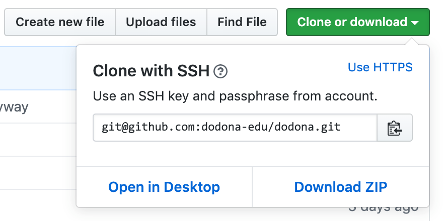

# Een nieuwe repository met oefeningen maken

Dodona gebruikt git repositories om oefeningen en ander lesmateriaal te beheren. Een repository kan meerdere oefeningen bevatten en moet aan een [bepaalde structuur](/nl/references/exercise-directory-structure) voldoen om gelezen te kunnen worden door Dodona.

## 1. Een Git repository aanmaken

Een eerste stap is om een git repository aan te maken. Je kan dit eenvoudig doen op [github.com](https://github.com). Daarnaast ondersteunen we ook [Gitlab](https://gitlab.com). Eenmaal aangemaakt kan je je repository toevoegen aan Dodona.

## 2. Je repository aan Dodona toevoegen

Als je lesgeversrechten op Dodona hebt, dan verschijnt in de linker navigatiebalk een link "Repositories" die je naar een overzicht van alle repositories op Dodona brengt. Om een nieuwe repository toe te voegen klik je op de grote plus-knop bovenaan de pagina.

In het formulier om de repository toe te voegen kies je een unieke naam voor je repository binnen Dodona. Geef vervolgens de "clone URL" in die ja kan vinden op de GitHub pagina van je repository. Zorg er voor dat je de SSH link van GitHub kopieert en niet de HTTPS variant. Kies tot slot de standaard judge die je wil gebruiken voor oefeningen in deze repository.

Voordat je op de toevoeg-knop klikt moet je er eerst voor zorgen dat de Dodona server zowel lees- als schrijfrechten heeft op je repository met oefeningen. We hebben deze schrijftoegang nodig om eenvoudig de oefeningen kunnen bewerken via de webinterface.

Op github.com is de eenvoudigste manier om de gebruiker [dodona-server](https://github.com/dodona-server) aan je repository toe te voegen. Van zodra wij deze uitnodiging accepteren kan je van start gaan. Op github.ugent.be voeg je op dezelfde wijze de gebruiker [SA-GitHubDodona](https://github.ugent.be/SA-GitHubDodona) toe. Op gitlab.com kan je [dodona-server](https://gitlab.com/dodona-server) toevoegen. Als je je repository op een eigen GitLab server host, dan zal je zelf een nieuwe gebruiker voor Dodona moeten aanmaken. Je kan onze [publieke ssh sleutel](/dodona.pub) hiervoor gebruiken.

Je kan op de Dodona website het toevoegen van de repository nu finaliseren.

## 3. De webhook instellen

Om je oefeningen up-to-date te houden moet Dodona weten wanneer je wijzigingen aanbrengt. We doen dit met behulp van een _webhook_. Dit is een unieke URL die er voor zorgt dat Dodona je repository opnieuw zal verwerken. Deze URL zou zichtbaar moeten zijn nadat je je repository aan Dodona hebt toegevoegd.

Deze URL moet je vervolgens toevoegen aan GitHub. Dit doe je door op GitHub naar de instellingen van je repository te gaan en vervolgens op "Webhooks" te klikken in de navigatiebalk. Klik vervolgens op de "Add webhook"-knop en geef de URL in die je van Dodona gekregen hebt. Gebruik voor de rest de standaardinstellingen en klik op "Add webhook".

## 4. Lesmateriaal aanmaken

Je bent nu helemaal klaar om oefeningen en lesmateriaal toe te voegen aan je repository. Als alles goed gaat, dan zouden ze automatisch moeten verschijnen op Dodona.