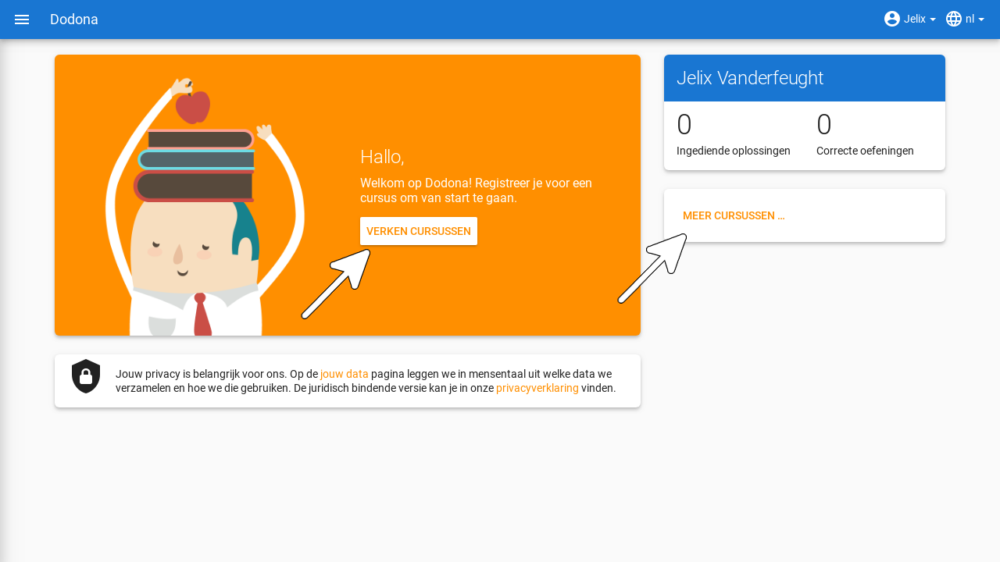
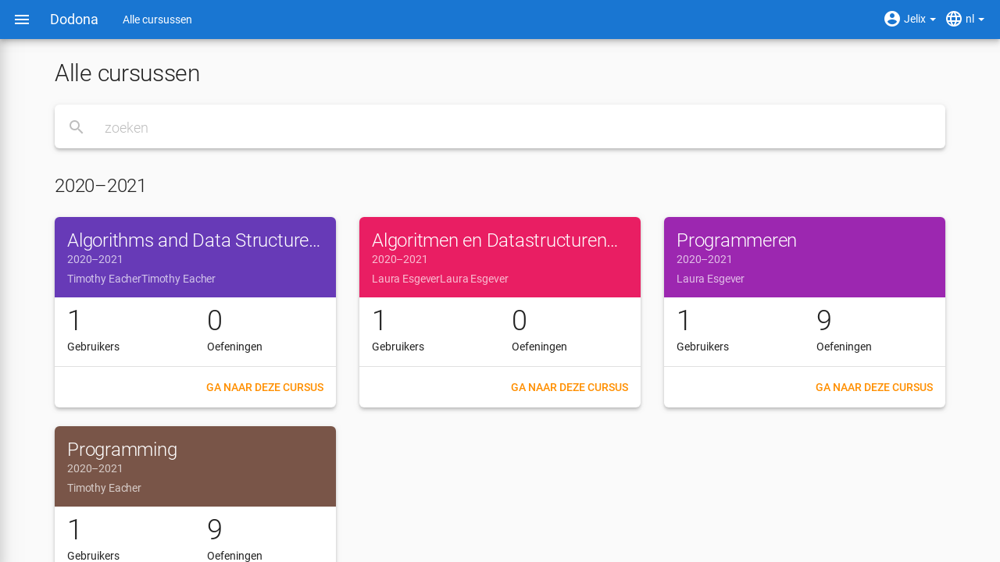
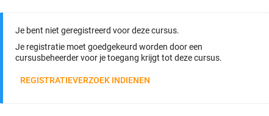
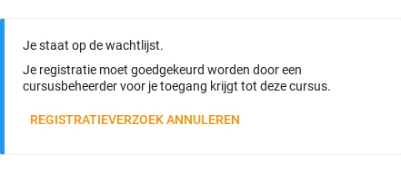
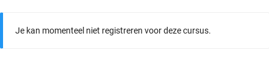
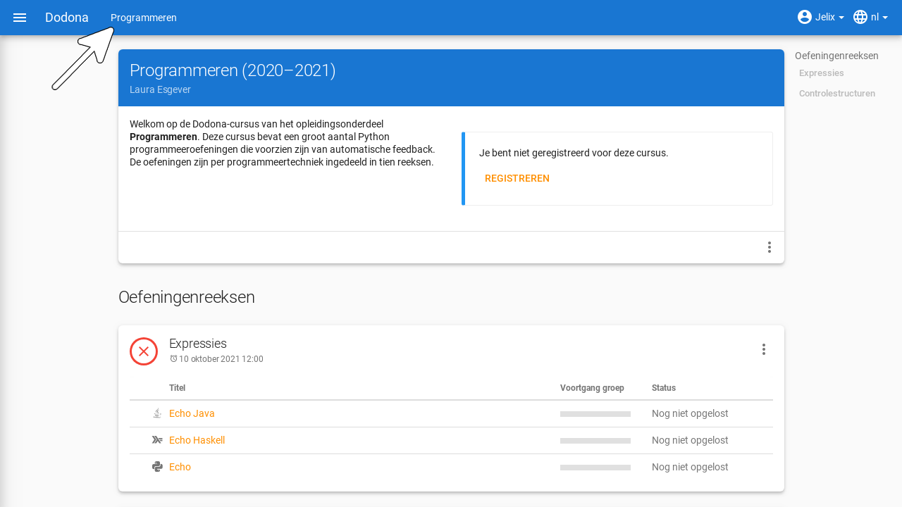
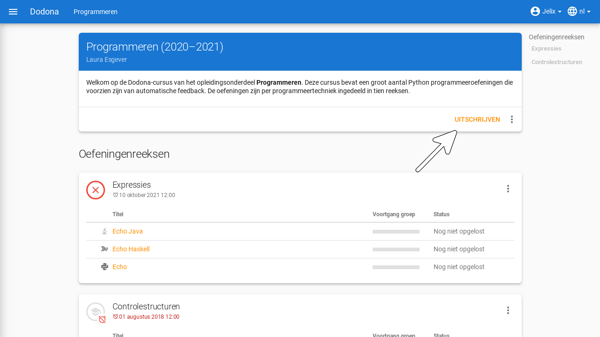

# Cursussen op Dodona
> Op deze pagina vind je alle informatie zodat je je als student kan registreren en uitschrijven voor een cursus, kan navigeren naar een cursus en de indienstatus kan interpreteren.

**Inhoudsopgave**
[[toc]]

## Wat is een cursus?

Een cursus op Dodona is een leerpad met [oefeningen](../exercises/#navigeren-naar-een-oefening) die gebundeld worden in oefeningenreeksen. Als je voor een cursus geregistreerd bent dan kan je binnen de cursus [oplossingen indienen](../exercises/#indienen-van-een-oplossing) voor de oefeningen.

## Registreren voor een cursus

Om oplossingen voor oefeningen in een cursus te kunnen indienen moet je in die cursus geregistreerd zijn.

### Hoe vind je een cursus?

Eerst moet je de cursus waarvoor je wil registreren vinden. Dit kan je doen door op je startpagina op `MEER CURSUSSEN...` of op `VERKEN CURSUSSEN` te klikken.

Dit zal je naar een [overzicht van alle cursussen](https://dodona.ugent.be/nl/courses/) brengen. Hier kan je de zoekbalk gebruiken om op basis van een cursusnaam, een naam van een lesgever, de naam van je onderwijsinstelling of een academiejaar de juiste cursus kan vinden.

### Hoe registreer je?

Als je navigeert naar de cursus dat je zocht, waarvoor je nog niet geregistreerd bent, dan zie je bovenaan de cursuspagina een paneel dat aangeeft of en hoe je je voor de cursus kan registreren. Hierbij zijn er drie mogelijkheden afhankelijk van hoe de cursus geconfigureerd werd:

-   De cursus werkt met een **open registratieprocedure**, wat betekent dat iedereen zich voor de cursus kan registreren zonder expliciete goedkeuring van een cursusbeheerder. Klik op de knop `REGISTREREN` om je voor de cursus te registreren.

    

<h1 id="registratieverzoek"/>

-   De cursus werkt met een **gemodereerde registratieprocedure**, wat betekent dat je een **registratieverzoek** kunt indienen dat daarna dient goedgekeurd of afgekeurd te worden door een cursusbeheerder. Pas wanneer je registratieverzoek wordt goedgekeurd, ben je ook effectief geregistreerd voor de cursus. Klik op de knop `REGISTRATIEVERZOEK INDIENEN` om een registratieverzoek voor de cursus in te dienen.

    

    Zolang je registratieverzoek nog niet werd goedgekeurd of afgekeurd door een cursusbeheerder, verschijnt in het paneel bovenaan de cursuspagina de boodschap `Je staat op de wachtlijst.` en wordt de cursus opgelijst in het paneel `In afwachting` in de rechterkolom van je startpagina.

    

-   De cursus werkt met een **gesloten registratieprocedure**, wat betekent dat je geen [registratieverzoek](#registratieverzoek) kunt indienen voor de cursus. De lesgever laat dus niet toe dat je jezelf kan registreren.

    

Nadat je geregistreerd bent, wordt de cursus getoond op je gepersonaliseerde startpagina.

Naast de mogelijkheid om zelf naar een cursus te navigeren en op de cursuspagina de registratieprocedure te doorlopen, is het ook mogelijk dat je een registratielink ontvangt van een cursusbeheerder (bijvoorbeeld per email van een lesgever). Door op de registratielink te klikken, wordt de registratieprocedure opgestart voor een specifieke cursus en hoef je dus zelf niet meer naar de cursus te navigeren.

## Cursuscomponenten

Een cursus bestaat uit verschillende componenten. Bovenaan de cursuspagina zie je de beschrijving van een cursus. Daaronder kan je verschillende oefeningenreeksen zien die elk bestaan uit een of meerdere oefeningen.

::: tip Tip

Als je binnen een cursus aan het werken bent dan verschijnt de naam van de cursus naast `Dodona` aan de linkerkant van de navigatiebalk. Door in de navigatiebalk op de naam van de cursus te klikken, navigeer je terug naar de cursuspagina.

:::

### Oefeningenreeksen

Een oefeningenreeks bestaat uit een beschrijving, een aantal oefeningen en eventueel een **deadline** die ingesteld werd door de cursusbeheerder. Indien er een deadline is ingesteld, dan wordt die weergegeven onder de naam van de oefeningenreeks. Bij weergave van de deadline wordt rekening gehouden met de tijdzone uit je [gebruikersprofiel](../login-and-settings/#instellen-van-persoonlijke-voorkeuren). Deadlines worden in het groen weergegeven als ze nog niet verstreken zijn, en in het rood als ze reeds verstreken zijn.

Als een reeks een deadline heeft, dan worden enkel ingediende oplossingen van voor dat tijdstip in rekening gebracht. Na de deadline kan je dus nog steeds indienen, maar ze tellen mogelijks niet mee voor een eventuele evaluatie. Meer details hierover kan je vinden bij de sectie [indienstatus](#indienstatus).

Onder de naam van een oefeningenreeks staat optioneel een beschrijving, met daaronder een oplijsting van alle oefeningen uit de reeks. De lijst toont voor elke oefening je indienstatus en eventueel de voortgang van de groep. Vóór elke oefening in de lijst staat ook een icoontje dat overeenkomt met je indienstatus voor de oefening.

::: tip Dezelfde oefening in meerdere cursussen/oefeningenreeksen
Dezelfde oefening kan voorkomen in meerdere cursussen. Je indienstatus voor de oefening wordt hierbij niet overgenomen. Je moet dus de oefening binnen elke cursus afzonderlijk indienen.

Dezelfde oefening kan ook voorkomen in meerdere oefeningenreeksen van eenzelfde cursus. Hier worden je ingediende opgelossingen wel in rekening genomenbij alle voorkomens van de oefening. Afhankelijk van de ingestelde deadlines van de reeksen kan de indienstatus wel verschillen. Bij een reeks met een deadline worden namelijk enkel oplossingen die voor de deadline werden ingediend meegeteld.
:::

In het menu van een oefeningenreeks vind je de volgende opties:

- `Alle opgaven en leesactiviteiten bekijken`: Toont een overzicht waarin de namen en beschrijvingen van alle oefeningen uit de oefeningenreeks netjes onder elkaar staan. Onder elke beschrijving staat ook je [indienstatus](#indienstatus) voor de oefening. Als je op de indienstatus drukt dan navigeer je naar de oplossing die gebruikt werd om de indienstatus te bepalen (als je effectief een oplossing hebt ingediend op basis waarvan de indienstatus kon bepaald worden).

- `Mijn oplossingen exporteren`: Downloadt een ZIP-bestand dat voor elke oefening uit de oefeningenreeks de oplossing bevat die gebruikt werd om je [indienstatus](#indienstatus) voor de oefening te bepalen (als je effectief een oplossing hebt ingediend op basis waarvan de indienstatus kon bepaald worden).

### Indienstatus

Je indienstatus voor een oefening uit een oefeningenreeks wordt bepaald **op basis van de oplossing die je als laatste in de cursus hebt ingediend voor de oefening**. Als er een deadline werd ingesteld voor de oefeningenreeks, dan is dit de laatst ingediende oplossing voorafgaand aan de deadline. In de oefeningenreeks zie je vóór elke oefening ook een **icoontje** dat overeenkomt met je indienstatus voor de oefening. Als je in een oefeningenreeks drukt op je indienstatus voor een oefening, dan navigeer je naar de oplossing die gebruikt werd om de indienstatus te bepalen (als je effectief een oplossing hebt ingediend op basis waarvan de indienstatus kon bepaald worden).

Mogelijke weergaven van je indienstatus als er geen deadline is ingesteld of vóór het verstrijken van de deadline:

  | indienstatus | icoontje | weergegeven als je |
  | --- | --- | --- |
  | `niet opgelost` | | geen oplossing hebt ingediend (vóór de deadline) | 
  | `verkeerd` |  | laatste oplossing die je indiende verkeerd was |
  | `correct` |  () |laatste oplossing die je indiende correct was (vóór de deadline) |

Mogelijke weergaven van je indienstatus nadat de deadline verstreken is:

  |indienstatus | icoontje | weergegeven als je |
  |-------------|----------|--------------------|
  | `correct` (groen) |  | laatst ingediende oplossing vóór de deadline correct is|
  | `deadline gemist` (rood) |  | geen oplossingen hebt ingediend|
  | `deadline gemist` (rood) |  | als je laatst ingediende oplossing niet correct is |
  | `deadline gemist` (rood) |  | als je na de deadline een correcte oplossing hebt ingediend |

::: tip Belangrijk: laatst ingediende oplossing vóór deadline telt

Als je **vóór het verstrijken van de deadline** van een oefeningenreeks een oplossing indient voor een oefening uit de oefeningenreeks, dan kan je indienstatus voor de oefening nog wijzigen omdat die indienstatus altijd gebaseerd is op je laatst ingediende oplossing vóór de deadline. Het is dus je eigen verantwoordelijkheid om ervoor te zorgen dat je laatst ingediende oplossing vóór de deadline ook je meest correcte oplossing is. Je kunt eventueel een voorgaande oplossing selecteren en opnieuw indienen.

Dodona toont een **waarschuwingssymbool** naast je indienstatus van een oefening in een oefeningenreeks en in de lijst met recente op je startpagina als je laatst ingediende oplossing voor de oefening vóór de deadline van de oefeningenreeks een status heeft die slechter is dan de status van een oplossing voor de oefening die je daarvoor hebt ingediend. Je kunt eventueel een voorgaande oplossing selecteren en opnieuw indienen.

Als je **na het verstrijken van de deadline** van een oefeningenreeks een oplossing indient voor een oefening uit een oefeningenreeks, dan zal je indienstatus voor de oefening in de oefeningenreeks daardoor nooit wijzigen. Je indienstatus voor een oefening in een oefeningenreeks wordt immers bepaald op basis van je laatst ingediende oplossing vóór de deadline.
:::

## Uitschrijven uit een cursus

Als je navigeert naar een cursus waarvoor je [geregistreerd](#registreren-voor-een-cursus) bent of waarvoor je nog een registratieverzoek hebt openstaan, dan zie je onder de beschrijving van de cursus op de cursuspagina een knop `UITSCHRIJVEN` (of `REGISTRATIEVERZOEK ANNULEREN`) waarmee je je kunt uitschrijven uit de cursus.

Hierdoor verdwijnt het kaartje van de cursus aan de linkerkant van je startpagina en wordt de cursus niet langer opgelijst op je [profielpagina](../login-and-settings/#instellen-van-persoonlijke-voorkeuren). Als de cursus werd opgelijst onder `Cursussen` in het hamburger menu aan de linkerkant van de navigatiebalk, dan verdwijnt de cursus ook uit die lijst. Als de cursus werd opgelijst in het paneel `In afwachting` in de rechterkolom van je startpagina, dan verdwijnt de cursus ook uit die lijst.
