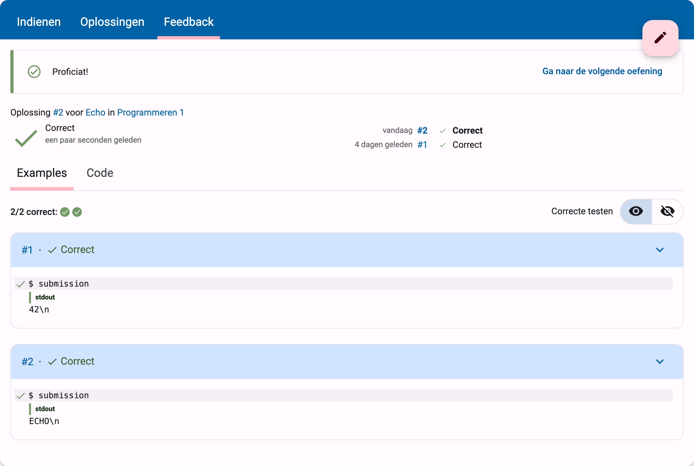
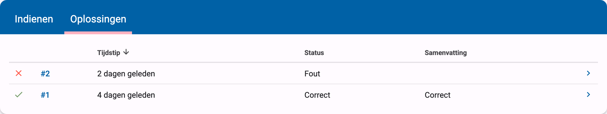

# Oefeningen oplossen
Alle informatie zodat je als student kan navigeren naar oefeningen of oplossingen, oplossingen kan indienen en vragen kan stellen over je code. Wat de feedback op een oplossing betekent, wordt in detail uitgelegd bij [Feedback begrijpen](../feedback/).

## Navigeren naar een oefening

Oefeningen op Dodona kunnen ofwel voorkomen in een cursus, ofwel daarbuiten.

- Oefeningen die tot een cursus behoren, kan je vinden door de pagina van een cursus te bezoeken.
    
- Oefeningen die niet tot een cursus behoren, kan je vinden door het [activiteitenoverzicht](https://dodona.be/nl/activities/) te bezoeken dat een lijst bevat van alle oefeningen.

::: tip Tip
Op je startpagina kan je een lijst vinden van de vijf laatste oefeningen waar je het laatst oplossingen voor ingediend hebt over alle cursussen heen. Zo kan je op een snelle manier een oefening waar je recent op hebt gewerkt selecteren door op de naam van de oefening te klikken.

:::

Op elke oefeningenpagina staat bovenaan een paneel met de naam en de beschrijving van de oefening. De weergave van deze componenten is afhankelijk van de geselecteerde taal. Als bij het opstellen van de oefening een vertaling voorzien werd van de naam en de beschrijving in de geselecteerde taal, dan zullen deze componenten van de oefening ook in die taal weergegeven worden.

::: tip

Als je een actie aan het uitvoeren bent op een oefening dan verschijnt de naam van de oefening naast `Dodona` aan de linkerkant van de navigatiebalk, eventueel voorafgegaan door de naam van de cursus en de naam van de oefeningenreeks waaruit je de oefening geselecteerd hebt. Door in de navigatiebalk op de naam van de oefening te klikken, navigeer je naar de oefeningpagina. Door in de navigatiebalk op de naam van de oefeningenreeks te klikken, navigeer je naar de oefeningenreeks op de cursuspagina. Door in de navigatiebalk op de naam van de cursus te klikken, navigeer je naar de cursuspagina.

:::

## Indienen van een oplossing

Op een oefeningpagina staat onder het paneel met de beschrijving van de oefening een tweede paneel waarmee je een oplossing kunt indienen voor de oefening. Klik hiervoor op de tab `Indienen`, als deze tab niet geselecteerd was, en plaats de broncode van je oplossing in de *code editor*. Klik daarna op de indienknop in de rechterbovenhoek van het paneel om je oplossing in te dienen. **Je mag zoveel indienen als je wil. Er wordt enkel rekening gehouden met het resultaat van jouw laatste oplossing**. Bij elke oplossing wordt [automatische feedback](../feedback/) door de judge gegeven die je kan gebruiken om je oplossing te corrigeren of verder te verfijnen.

::: tip Gebruik een IDE

Alhoewel je perfect kan programmeren in de editor op Dodona zelf, raden we niet aan om alle oefeningen hierin op te lossen. In plaats daarvan adviseren we om een [Integrated Development Environment](https://nl.wikipedia.org/wiki/Integrated_development_environment) (IDE) te gebruiken. IDE's geven namelijk meer ondersteuning tijdens het schrijven, uitvoeren, testen en debuggen van broncode. Op die manier leer je je programmeervaardigheden generiek in te zetten om andere problemen aan te pakken dan enkel de oefeningen uit Dodona.

Bovendien is er een plugin voorzien voor de JetBrains IDE's zoals [IntelliJ](https://www.jetbrains.com/idea/), [PyCharm](https://www.jetbrains.com/pycharm/), en [WebStorm](https://www.jetbrains.com/webstorm/specials/webstorm/webstorm.html). Ook voor [**Visual Studio Code**](https://code.visualstudio.com/) is een extensie voorzien. Programmeurs die met die IDE's werken kunnen hun oplossingen rechtstreeks in Dodona indienen met behulp van die tool. Zonder die tool moet je code kopiëren en plakken in het indieningstekstvak op Dodona en op de oranje cirkel te klikken. Instructies vind je [hier voor PyCharm](/nl/faq/ide-plugins/#hoe-installeer-ik-de-pycharm-plugin) en [hier voor VS Code](/nl/faq/ide-plugins/#hoe-installeer-ik-de-vs-code-extensie).
:::

Na het indienen van een oplossing wordt automatisch de tab `Oplossingen` geselecteerd. Deze tab bevat een overzicht van alle oplossingen die je in de cursus hebt ingediend voor de oefening. Deze oplossingen worden in het overzicht opgelijst in omgekeerde chronologische volgorde (meest recente bovenaan), waardoor de oplossing die je net hebt ingediend helemaal bovenaan staat. Het overzicht bevat voor elke oplossing het tijdstip van indienen, de status en een korte samenvatting van de [feedback](../feedback/). In het overzicht zie je vóór elke oplossing ook een [icoontje](../feedback/#mogelijke-statussen) dat overeenkomt met de status van de oplossing.

Na het indienen wordt je oplossing in een wachtrij geplaatst. Zolang een oplossing in de wachtrij staat heeft ze de status `In de wachtrij...`. Van zodra het platform klaar is om een oplossing te beoordelen, wordt de eerst ingediende oplossing uit de wachtrij uitgevoerd en beoordeeld door het systeem. Tijdens het beoordelen heeft een oplossing de status `Aan het uitvoeren...`. Meestal duurt dit maar enkele seconden.

Zodra de judge klaar is met het beoordelen van je oplossing krijgt ze haar finale status en wordt de feedbackpagina met gedetailleerde [feedback](../feedback/) over de oplossing automatisch weergegeven in een nieuwe tab `Feedback`.

## Navigeren naar een oplossing

Je kan op Dodona op verschillende manieren naar je ingediende oplossingen navigeren. Voor elke manier zullen de oplossingen door Dodona op een andere manier gegroepeerd worden. Hieronder volgen de twee belangrijkste manieren:

- Je kan al jouw oplossingen van één oefening bekijken door op de `Oplossingen` tab op de relevante oefeningenpagina te klikken.

- Je kan alle oplossingen die je ooit hebt ingediend zien door in het gebruikersmenu in de navigatiebalk op `Mijn oplossingen` te klikken.

Een oplossingenoverzicht bevat het oplossingsnummer, het tijdstip van indienen, de status en een korte samenvatting van de feedback voor elke oplossing. Vóór elke oplossing staat ook nog een [icoontje](../feedback/#mogelijke-statussen) dat overeenkomt met de status van de oplossing. In het overzicht worden je oplossingen altijd opgelijst in omgekeerde chronologische volgorde (meest recente bovenaan).

Je kunt een oplossing selecteren door in een oplossingenoverzicht op het pijltje te klikken aan rechterkant van de oplossing. Hierdoor navigeer je naar de feedbackpagina met de gedetailleerde feedback over de oplossing. Dezelfde pagina wordt getoond als je op het oplossingsnummer klikt.

## Je resultaat bekijken

Op de feedbackpagina staat gedetailleerde **feedback** over een oplossing die je ingediend hebt voor een oefening. Bovenaan zie je de **status** die de judge aan je oplossing heeft toegekend (bijvoorbeeld `Correct` of `Fout`) en een korte samenvatting van het resultaat. Daaronder rapporteert de judge in detail over alle testen waaraan je oplossing onderworpen werd, en in de tab `Code` zie je je broncode met eventuele opmerkingen van de judge.

De betekenis van elke status en de manier waarop de gedetailleerde feedback gestructureerd is, worden uitgelegd bij [Feedback begrijpen](../feedback/).

## Vragen stellen
::: tip Opmerking
Deze functie is enkel beschikbaar als je lesgever ze heeft ingeschakeld.
:::

Nadat je je oplossing hebt ingediend, kan je op drie manieren een vraag stellen. Bovenaan de ingediende code kan je een algemene vraag stellen door op `Stel een vraag over je code` te klikken. Daarnaast kan je links van het regelnummer op de roze cirkel klikken een vraag stellen bij een specifieke regel code. Je kan ook een stuk code selecteren en dan hierover vragen stellen via diezelfde knop.

Typ in het tekstvak de vraag die je aan de lesgever wil stellen. Je kan Markdown gebruiken om je tekst extra opmaak te geven. Klik als laatste op `Vraag stellen`.

::: tip Ondersteuning voor Markdown

Je kan met Markdown extra opmaak toevoegen door:

- asterisken (\*) rond woorden te zetten om het schuin weer te geven. \*schuine tekst\* wordt bijvoorbeeld weergegeven als *schuine tekst*.
- twee asterisken (\**) rond woorden te zetten om het in het vet weer te geven. \*\*vette tekst\*\* wordt bijvoorbeeld weergegeven als **vette tekst**.
- backticks (\`) rond een stukje code te zetten. \`Variabelen\` wordt bijvoorbeeld weergegeven als `Variabelen`.

Bekijk hier [alle mogelijkheden van Markdown](/nl/references/exercise-description/#markdown).
:::

Daarnaast kan je ook reageren op een bestaande vraag van jezelf of op een opmerking van een lesgever. Klik hiervoor op `Reageer` onder de vraag of opmerking. Typ je reactie in het tekstvak en klik op `Reageer`.
