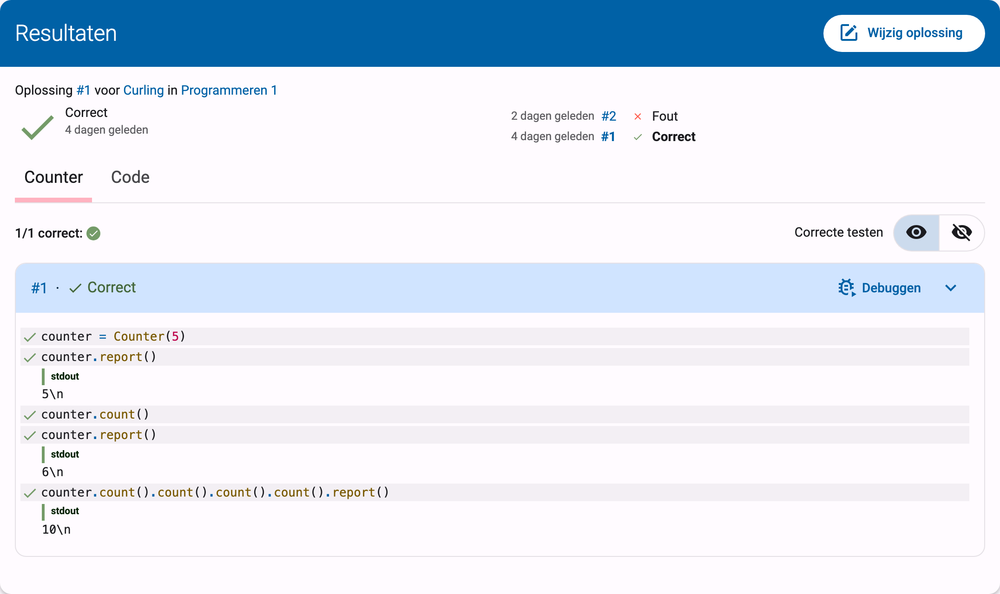
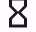
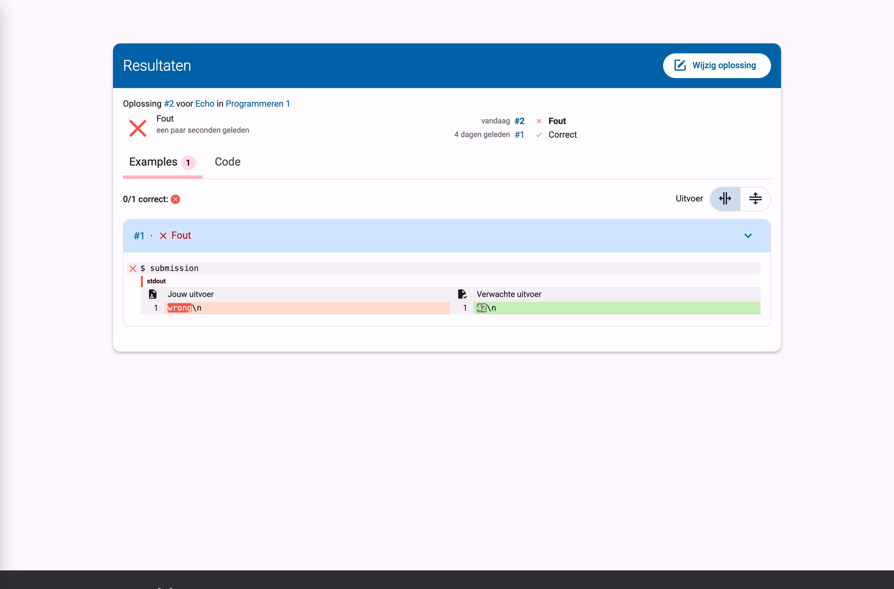
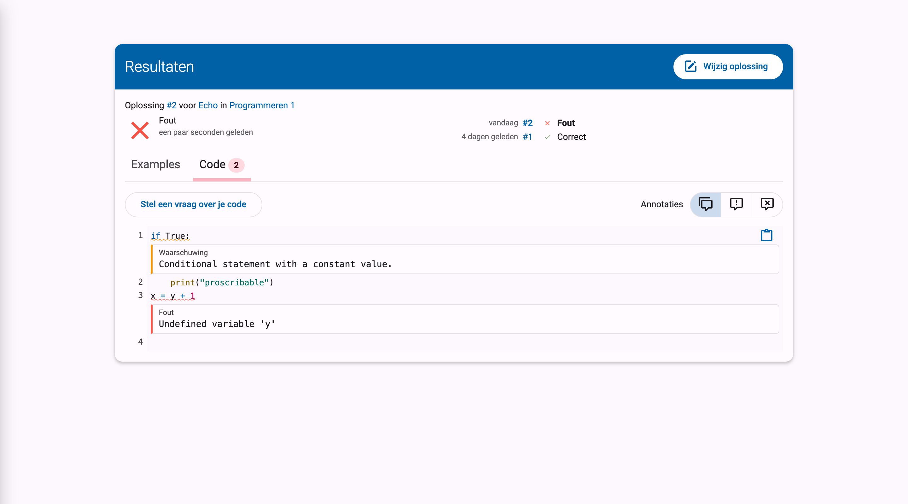
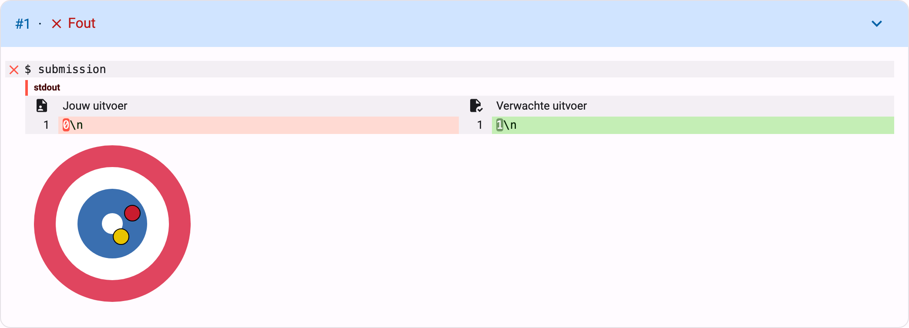

# Feedback begrijpen
Zo snel mogelijk na het indienen wordt een oplossing automatisch beoordeeld door een judge die aan de oefening gekoppeld is. Als motivatie van zijn beoordeling voorziet de judge gedetailleerde **feedback** over de oplossing, die je kan gebruiken om je oplossing te corrigeren of verder te verfijnen. Je ziet die feedback meteen in het indienpaneel nadat je een oplossing hebt ingediend, en ze wordt ook getoond op de feedbackpagina van een oplossing, die je bereikt via de [oplossingenoverzichten](../exercises/#navigeren-naar-een-oplossing). Deze pagina legt uit wat de verschillende statussen betekenen en hoe de gedetailleerde feedback van de judge gestructureerd is. Hoe je naar oefeningen navigeert en oplossingen indient, vind je bij [Oefeningen oplossen](../exercises/).

## De feedbackpagina

Bovenaan de feedbackpagina staat een lijn met de tekst `Oplossing #N voor <oefening> in <cursus>`, die linkt naar de oefening- en cursuspagina (het cursusgedeelte ontbreekt als de oplossing niet binnen de context van een cursus werd ingediend). Daaronder:

- Een **icoontje** en de **status** die Dodona of de judge aan de oplossing heeft toegekend, samen met het **tijdstip** waarop de oplossing werd ingediend, weergegeven op een gebruiksvriendelijke manier (bijvoorbeeld *ongeveer 2 uur geleden*; plaats de cursor erboven voor de gedetailleerde weergave van het tijdstip). De betekenis van elke status vind je [hieronder](#mogelijke-statussen).

- Een **geschiedenislijst** aan de rechterkant, met je andere oplossingen voor dezelfde oefening (tijdstip van indienen, nummer en status), zodat je snel tussen oplossingen kan wisselen.

## Mogelijke statussen

Betekenis van de mogelijke statussen die aan een oplossing kunnen toegekend worden:

| status               | icoontje             | betekenis            |
|----------------------|----------------------|----------------------|
| `In de wachtrij…` |  | oplossing staat in de wachtrij |
| `Aan het uitvoeren...` |  | oplossing wordt momenteel beoordeeld door de judge |
| `Correct` |  | alle testen zijn geslaagd |
| `Fout` |  | logische fout opgeworpen tijdens het uitvoeren van minstens één test |
| `Uitvoeringsfout` |  | onverwachte fout opgeworpen tijdens het uitvoeren van minstens één test |
| `Timeout` |  | tijdslimiet vastgelegd voor de oefening werd overschreden tijdens het testen; kan wijzen op slechte performantie of een oneindige lus. |
| `Geheugenfout` |  | geheugenlimiet vastgelegd voor de oefening werd overschreden tijdens het uitvoeren van minstens één test |
| `Uitvoerlimiet overschreden` |  | de oplossing produceerde meer uitvoer dan toegelaten voor de oefening |
| `Compilatiefout` |  | oplossing bevat grammaticale fouten |
| `Interne fout` |  | judge is gecrasht tijdens het beoordelen van de oplossing; oorzaak van fout ligt dus niet bij de oplossing maar bij het falen van de judge |

Hoe lager de status in bovenstaande tabel wordt opgelijst, hoe zwaarder het soort fout dat ermee correspondeert.

::: tip
Je indienstatus voor een oefening *binnen een cursus* (correct, deadline gemist, ...) is een ander concept: die is gebaseerd op je laatst ingediende oplossing vóór de deadline van de oefeningenreeks. Je vindt er alles over bij [Cursussen op Dodona](../courses/#indienstatus).
:::

## Feedbacktabs

Onder de korte samenvatting staat meer gedetailleerde feedback die de judge kan uitgesplitst hebben over meerdere *tabs*. De tabs zijn genoemd naar de eigen testgroepen van de judge (er is geen vaste tab `Correctheid`). Naast de naam van een tab kan aan de rechterkant een *badge* staan met daarin een getal. Het getal geeft aan hoeveel fouten de judge gevonden heeft bij het uitvoeren van de testen waarover hij rapporteert onder de tab.

De laatste tab heeft altijd de naam `Code` en bevat de broncode van de oplossing. Op bepaalde plaatsen in de broncode kan de judge opmerkingen toegevoegd hebben (bijvoorbeeld over de programmeerstijl) die ook kunnen motiveren waarom hij een bepaalde status aan de oplossing toegekend heeft.

::: tip Tip

In de tab `Code` kan je de broncode van de oplossing niet wijzigen. Klik hiervoor op `Wijzig oplossing` in de rechterbovenhoek van de feedbackpagina (in het indienpaneel op de oefeningpagina heet die knop `Deze oplossing bewerken`). De broncode van de oplossing waar je op dat moment naar kijkt wordt dan ingeladen in de editor. Daar kan je de broncode bewerken en daarna eventueel opnieuw indienen.
:::

## Testen, testgevallen en contexten

Per tab rapporteert de judge over individuele **testen** waaraan hij de broncode onderworpen heeft. Daarbij worden gerelateerde testen gegroepeerd in een **testgeval** en worden testgevallen die van elkaar afhankelijk zijn gegroepeerd in een **context**.

Visueel worden alle testgevallen van een context gegroepeerd in een **uitklapbare kaart**. De koptekst van de kaart bevat `Correct` of `Fout`, afhankelijk van de beoordeling van de volledige context door de judge. Als sommige, maar niet alle contexten correct zijn, worden de correcte contexten standaard ingeklapt en de foute contexten standaard uitgeklapt.

Binnen een context worden de testgevallen van de context onder elkaar weergegeven. De beschrijving van een testgeval wordt weergegeven binnen een rechthoek met lichtgrijze achtergrondkleur die over de volledige breedte loopt. In de rechterbovenhoek van die rechthoek staat een gekleurd symbool dat aangeeft of de judge het volledige testgeval beoordeelt als geslaagd (groen vinkje) of als niet geslaagd (rood kruisje).

Als de judge binnen een testgeval rapporteert over individuele testen, dan worden die opgelijst onder de rechthoek met lichtgrijze achtergrond waarin de beschrijving van het testgeval staat. Om visueel onderscheid te maken met de weergave van het testgeval, wordt elke test weergegeven met een kleine marge links en rechts. De weergave van een test bestaat zelf uit de volgende optionele componenten die onder elkaar worden weergegeven:

-   Een beschrijving van de uitgevoerde test. Deze beschrijving wordt weergegeven binnen een rechthoek met dezelfde lichtgrijze achtergrondkleur als bij de beschrijving van een testgeval.

-   Een tekstuele vergelijking tussen een verwachte waarde en een waarde die gegenereerd werd aan de hand van de oplossing. Als minstens één van beide waarden uit meerdere regels bestaat, dan worden de overeenkomstige regels tegenover elkaar uitgelijnd. Identieke overeenkomstige regels worden weergegeven met een transparante achtergrondkleur. Als overeenkomstige regels van elkaar verschillen dan worden ze weergegeven met een lichtgekleurde achtergrondkleur (groen voor de verwachte waarde en rood voor de gegenereerde waarde). Individuele karakters die verschillen binnen overeenkomstige regels worden weergegeven met een donkerder achtergrondkleur (groen voor de verwachte waarde en rood voor de gegenereerde waarde).

-   Algemene feedback over de uitgevoerde test. Voor deze feedback heeft de judge alle vrijheid wat betreft de vormgeving, waardoor hij zowel tekstuele als grafische feedback kan aanleveren.

    
