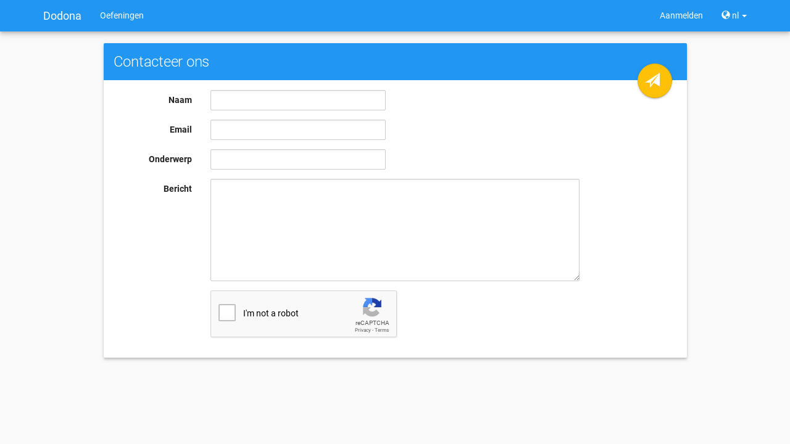

# Van start met Dodona als student

Op deze pagina vind je alle informatie om vlot van start te gaan met Dodona als student.

## Wat is Dodona?

Dodona is een online oefenplatform om te leren programmeren. De webapplicatie werd ontwikkeld aan de Universiteit Gent om practica aan grote groepen studenten te ondersteunen. Dodona focust daarom in de eerste plaats op het automatisch testen en geven van feedback op ingediende oplossingen van programmeeroefeningen. Op dit moment ondersteunt Dodona onder andere de programmeertalen Python, JavaScript, HTML, Java, Kotlin, C, C#, C++, Bash, Prolog, Haskell, SQL en R.

## Opdeling van de handleiding

De handleiding is onderverdeeld in drie onderdelen.

* Het eerste deel [Aanmelden & gebruikersinstellingen](../login-and-settings/) legt uit hoe je een gebruikersaccount op Dodona kan aanmaken en hoe je die kan personaliseren.
* Het tweede onderdeel, [Cursussen op Dodona](../courses/), bespreekt hoe je je kan registreren voor en uitschrijven uit een cursus, hoe je kan navigeren naar een cursus en hoe je de indienstatus moet interpreteren.
* Het laatste deel, [Oefeningen oplossen](../exercises/), bevat alle informatie die te maken heeft met het navigeren naar oefeningen of oplossingen, het indienen van oplossingen en het interpreteren van feedback.

## Contact opnemen

Als je met vragen zit over de werking van Dodona of als er interessante ideeën bij je opborrelen over hoe we het platform zouden kunnen verbeteren of uitbreiden, neem dan gerust contact met ons op. Alle commentaren en suggesties zijn meer dan welkom. Navigeer daarvoor naar de [contactpagina](https://dodona.be/nl/contact/) door in de voettekst (onderaan elke pagina) op `Contact` te klikken.
Vul vervolgens de gegevens in het paneel `Contacteer ons` aan en klik daarna op de verzendknop in de rechterbenedenhoek van het paneel.

