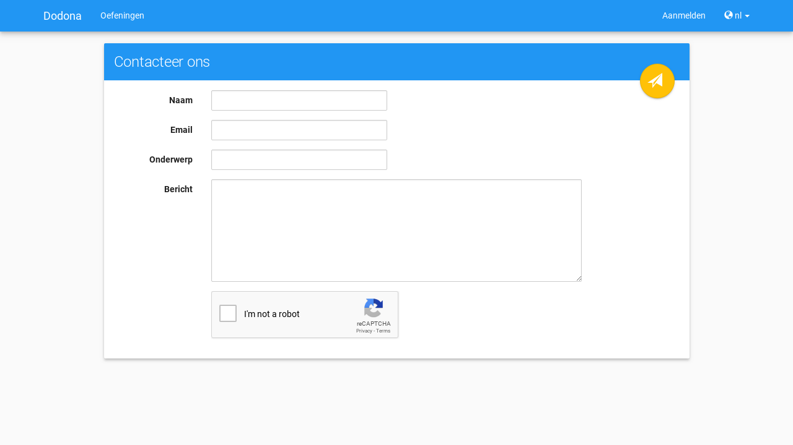

# Van start met Dodona als student

Op deze pagina vind je alle informatie om vlot van start te gaan met Dodona als student.

## Wat is Dodona?

<!--@include: ../../_what-is-dodona.md-->

## Contact opnemen

Als je met vragen zit over de werking van Dodona of als er interessante ideeën bij je opborrelen over hoe we het platform zouden kunnen verbeteren of uitbreiden, neem dan gerust contact met ons op. Alle commentaren en suggesties zijn meer dan welkom. Navigeer daarvoor naar de [contactpagina](https://dodona.be/nl/contact/) door in de voettekst (onderaan elke pagina) op `Contact` te klikken.
Vul vervolgens de gegevens in het paneel `Contacteer ons` aan en klik daarna op de verzendknop in de rechterbenedenhoek van het paneel.

