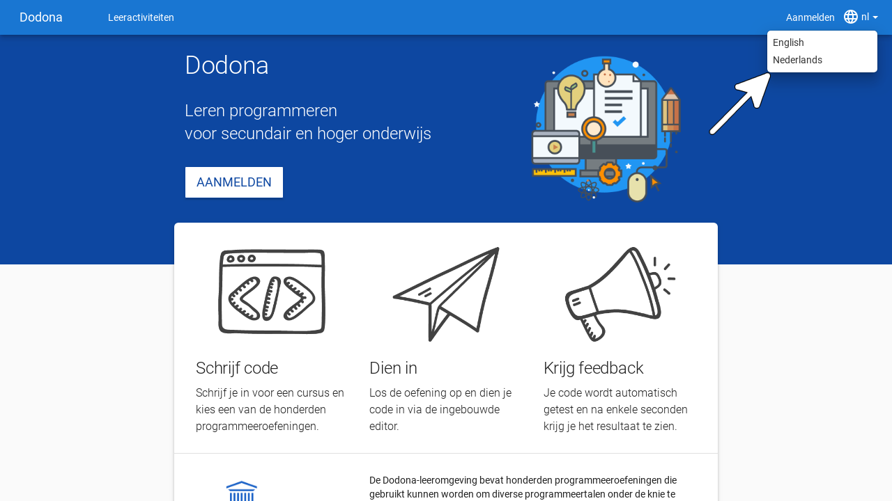
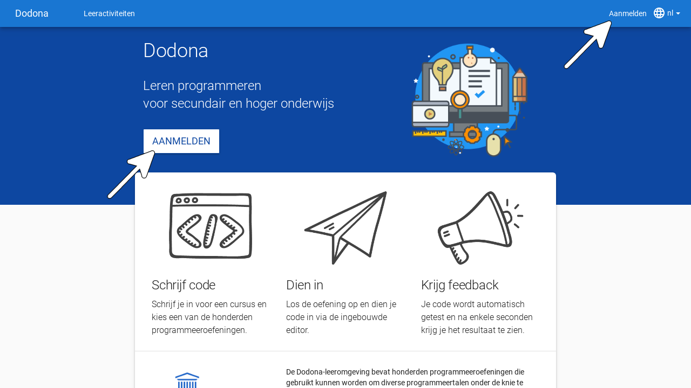
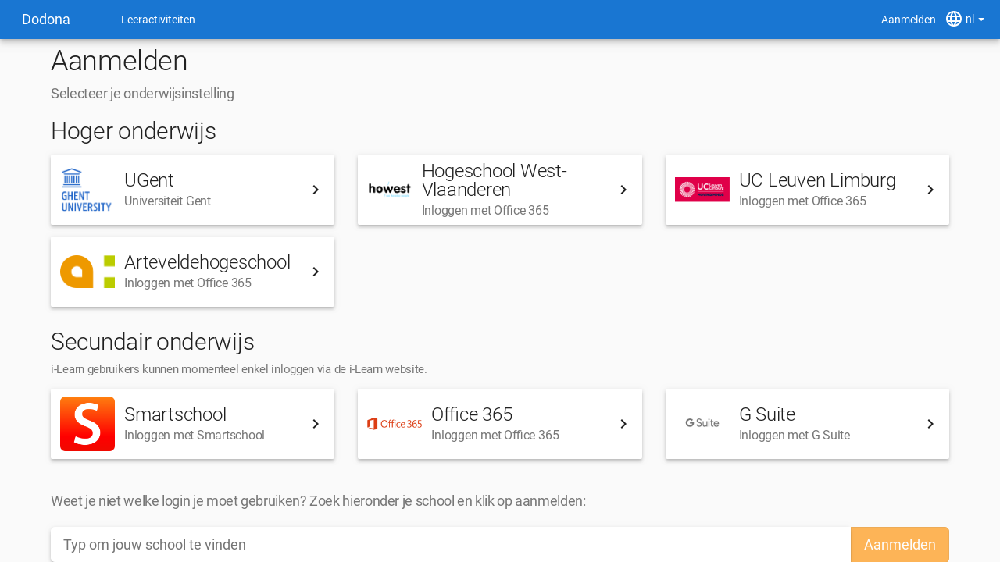
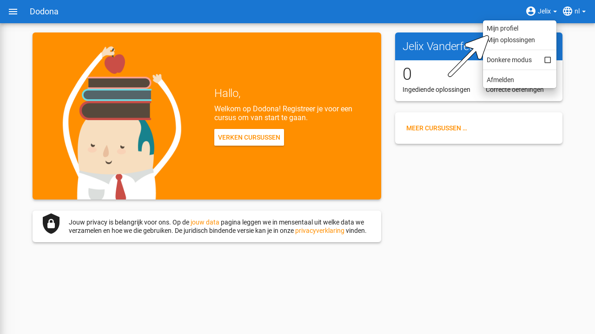
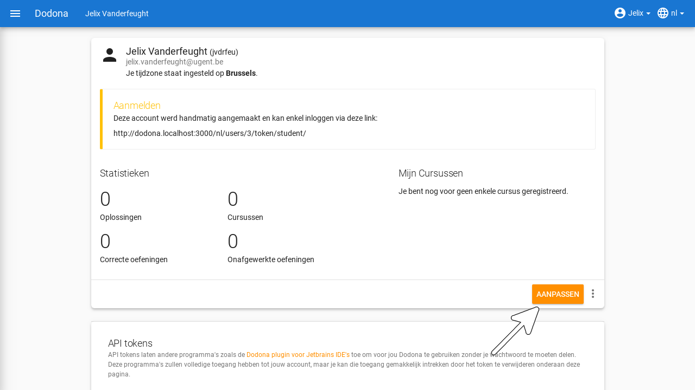
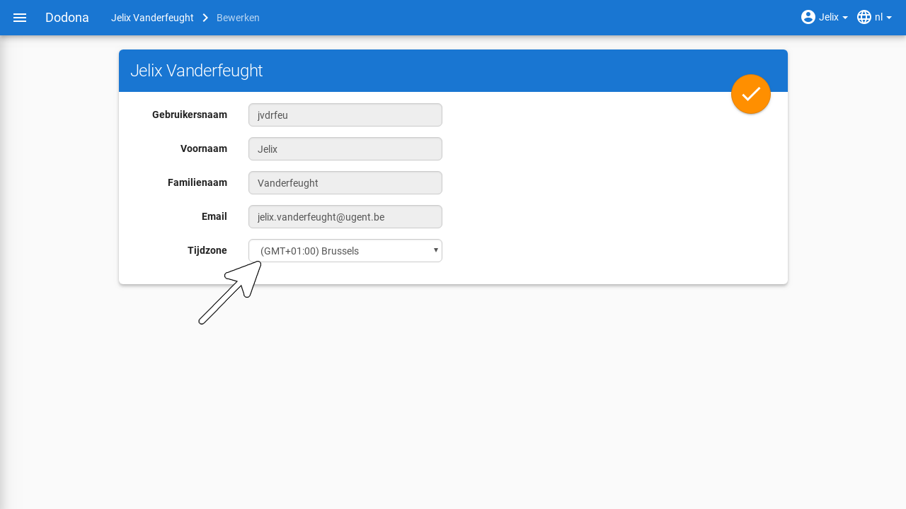
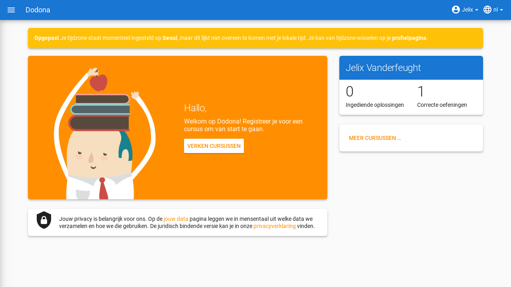

# Aanmelden & gebruikersinstellingen
> Op deze pagina vind je alle informatie zodat je als student een gebruikersaccount op Dodona kan aanmaken en die kan personaliseren.

**Inhoudsopgave**
[[toc]]

## Selecteren van de taal

Je kan Dodona gebruiken in het Nederlands of het Engels. Gebruik hiervoor het taalmenu aan de rechterkant van de navigatiebalk (bovenaan elke pagina).

Als je een taal selecteert terwijl je aangemeld bent dan wordt die ook als voorkeurstaal ingesteld in je [gebruikersprofiel](https://dodona.ugent.be/profile). Op die manier wordt bij aanmelden automatisch je voorkeurstaal geselecteerd.

::: tip Wordt alles vertaald?

De vaste componenten van Dodona (menubalken, cursusstructuur, mededelingen, ...) worden altijd weergegeven in de geselecteerde taal.

De naam en beschrijving van een [cursus](../courses/) worden weergegeven in de taal zoals de lesgever ze heeft ingegeven. Deze worden niet aangepast aan je taalvoorkeuren.

De naam en beschrijving van een [oefening](../exercises/#navigeren-naar-een-oefening) worden steeds in je voorkeurstaal weergegeven indien beschikbaar. Niet alle oefeningen zijn namelijk in beide talen beschikbaar.

:::

## Aanmelden

Om je aan te melden op dodona klik je ofwel op `Aanmelden` aan de rechterkant van de navigatiebalk, ofwel navigeer je naar de landingspagina en klik je op de knop `Aanmelden` centraal op de pagina.

Je kan je aanmelden op Dodona door je onderwijsinstelling te selecteren op de aanmeldpagina. Studenten uit het secundair kunnen inloggen met hun Smartschool, Office365 of G-Suite account. Als dit de eerste keer is dat je aanmeldt op Dodona dan wordt er automatisch een nieuwe gebruikersaccount aangemaakt op basis van de persoonsgegevens die doorgestuurd werden door je externe onderwijs- of onderzoeksinstelling.

::: warning Jouw data op Dodona

Sommige onderwijs- of onderzoeksinstellingen vragen op het einde van de aanmeldingsprocedure expliciet jouw toestemming voor het doorsturen van enkele [persoonsgegevens](https://dodona.ugent.be/nl/data/) naar Dodona. Vaak hoef je deze toestemming slechts één keer te geven op elke computer waarmee je aanmeldt. Dodona gebruikt deze persoonsgegevens enkel voor intern beheer van je gebruikersprofiel en wisselt deze informatie nooit uit met externe partijen.
:::

::: tip Foutmelding?

Als nog niemand van jouw school eerder aanmeldde op Dodona, dan kan het zijn dat niet alles loopt zoals verwacht. Om aan te melden gebruiken we namelijk de bestaande accounts van je onderwijsinstelling en koppelen we die via technieken als [SAML](https://nl.wikipedia.org/wiki/Security_Assertion_Markup_Language) en [OAuth](https://nl.wikipedia.org/wiki/OAuth). Soms loopt het hier mis omdat jouw school geen toestemming geeft voor deze koppeling. Vraag een ICT-beheerder of lesgever van je onderwijs- of onderzoeksinstelling om [contact](../getting-started#contact-opnemen) met ons op te nemen als je graag alle gebruikersaccounts van je instelling toegang wilt geven tot Dodona. Deze dienstverlening is gratis.
:::

::: tip Meerdere accounts?

Als je beschikt over gebruikersaccounts bij verschillende externe onderwijs- of onderzoeksinstellingen, dan corresponderen deze elk met een afzonderlijk gebruikersaccount op Dodona. Gebruik dus steeds dezelfde account om aan te melden.
:::

Eenmaal je bent aangemeld, dan verandert de neutrale landingspagina in een gepersonaliseerde startpagina met een overzicht van alle [cursussen](../courses/) waarvoor je geregistreerd bent, hun oefeningenreeksen met nakende deadlines en je voortgang bij het indienen van oplossingen voor [oefeningen](../exercises/). Je kunt steeds terugkeren naar de landingspagina door op `Dodona` te klikken linksboven elke pagina.

Als dit de eerste keer is dat je aanmeldt op Dodona, dan ben je uiteraard nog voor geen enkele cursus geregistreerd en heb je nog geen enkele oplossing ingediend. Daardoor ziet je startpagina er op dit moment nog vrij kaal uit. Hoe je je kan registreren voor een cursus vind je op [deze pagina](../courses/#registreren-voor-een-cursus).

## Instellen van persoonlijke voorkeuren

Kies voor `Mijn profiel` in het gebruikersmenu aan de rechterkant van de navigatiebalk om naar je profielpagina te navigeren.

Op de profielpagina staan je persoonsgegevens (voornaam, familienaam, gebruikersnaam en e-mailadres) en enkele persoonlijke voorkeuren ([taal](#selecteren-van-de-taal) en tijdzone) die samen je gebruikersprofiel vormen.

Klik op de bewerkknop in de rechterbenedenhoek van je profielpagina om je gebruikersprofiel te bewerken. Je persoonsgegevens zoals naam en e-mailadres kan je zelf niet aanpassen. Deze worden namelijk automatisch aangepast op basis van de gegevens die tijdens het aanmelden door je externe onderwijs- of onderzoeksinstelling naar Dodona worden doorgestuurd.

Wat je wel kan aanpassen is de **tijdzone** die gebruikt wordt voor het weergeven van alle tijdsaanduidingen op het platform (bijvoorbeeld het tijdstip waarop je een oplossing hebt ingediend of de deadline voor een oefeningenreeks).

Als de tijdzone uit je gebruikersprofiel niet overeenkomt met de lokale tijdzone zoals die door je browser gedetecteerd wordt, dan krijg je bovenaan elke pagina een mededeling te zien die erop wijst dat alle tijdsaanduidingen op het platform niet overeenkomen met de lokale tijdzone.

Je kunt deze mededeling enkel weghalen door in je gebruikersprofiel de tijdzone in te stellen op de lokale tijdzone. Merk op dat de mededeling een link bevat waarmee je rechtstreeks naar je profielpagina kunt navigeren.
