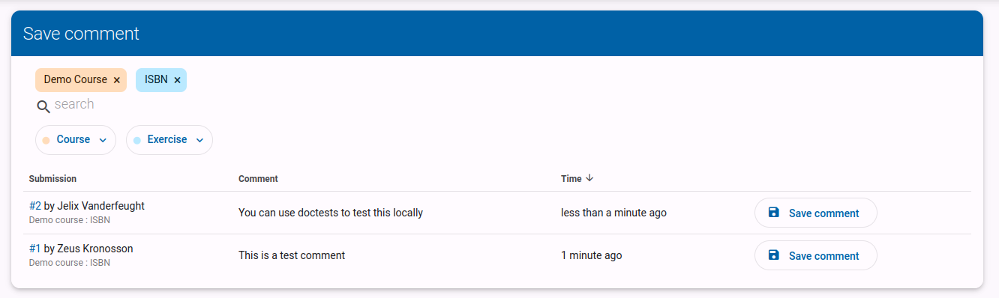
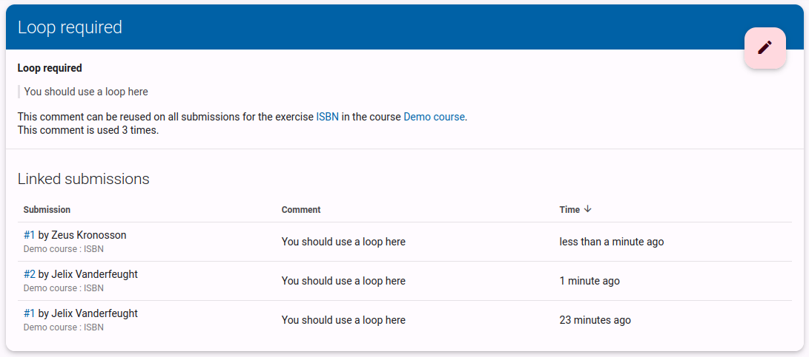

# Vragen beantwoorden
> Deze handleiding is geschreven voor lesgevers. Studenten die hulp willen bij het stellen van vragen kunnen meer info vinden in [deze handleiding](/nl/guides/students/exercises/#vragen-stellen).

Dodona geeft studenten de mogelijkheid om vragen te stellen over oefeningen en oplossingen. Als je deze functie wil uitschakelen, kan je dit doen in de cursusinstellingen.

Wanneer een student een vraag stelt in Dodona, zal je een notificatie icoon zien verschijnen op het tabblad vragen van je cursus.
Als je naar dit tabblad gaat, zal je een lijst zien van alle vragen die gesteld zijn in je cursus.

Je kan de oplossing met de vraag openen door op de vraag te klikken.

Je kan kiezen om een vraag te beantwoorden, wat de vraag markeert als beantwoord en de student een notificatie stuurt.
Je kan ook direct een vraag markeren als beantwoord. Dit is vaak handig als je weet dat de student de vraag al opgelost heeft op een andere manier. Bijvoorbeeld de student heeft een andere oplossing ingediend waar het probleem opgelost is, of je hebt de vraag beantwoord buiten het Dodona platform.

> Ter zijde: opmerkingen ondersteunen markdown, dus je kan gebruik maken van vet, cursief, lijsten, ... Je kan alle markdown features bekijken in [deze referentie](/nl/references/exercise-description/#markdown).

# Opmerkingen geven

Als lesgever kan je ook opmerkingen geven op de code van je studenten. Dit kan handig zijn om feedback te geven op hun oplossing, of om een fout aan te duiden.

> Als je alle oplossingen van je studenten wil overlopen en feedback wil geven, kan het handig zijn om [een evaluatie aan te maken](/nl/guides/teachers/grading).

You can either use the `Add global comment` button to add a general comment about the submission, or you can select a piece of code and click the `Add comment` button to add a comment about that specific piece of code.

Je kan een algemene opmerking toevoegen door op de `Globale opmerking toevoegen` knop te klikken. Je kan ook een stuk code selecteren en op de `Voeg opmerking toe` knop klikken om een opmerking toe te voegen over dat specifieke stuk code.

> Ter zijde: opmerkingen ondersteunen markdown, dus je kan gebruik maken van vet, cursief, lijsten, ... Je kan alle markdown features bekijken in [deze referentie](/nl/references/exercise-description/#markdown).

# Opmerkingen hergebruiken
Studenten maken vaak dezelfde fouten, of hebben gelijkaardige vragen. Om te vermijden dat je dezelfde opmerkingen steeds opnieuw moet schrijven, kan je opmerkingen hergebruiken.

Tijdens het schrijven of bewerken van een opmerking kan je `opmerking opslaan` aanvinken. Dit zal je toelaten om een titel toe te voegen aan de opmerking, wat je zal helpen om de opmerking in de toekomst terug te vinden.

Je kan ook een bestaande opmerking opslaan door op `opmerking opslaan` te klikken in het menu van de opmerking.

Eenmaal je een of meerdere opmerkingen hebt opgeslagen, krijg je een zoekveld te zien wanneer je een nieuwe opmerking schrijft. Selecteer de gewenste opmerking uit de lijst om deze te hergebruiken. Je kan de opmerking nog steeds bewerken voor je deze post.

# Opgeslagen opmerkingen beheren

::: warning Groepering van opmerkingen
Opgeslagen opmerkingen worden gegroepeerd per oefening. Dit betekent dat je een opmerking kan opslaan voor een oefening, en deze opmerking kan hergebruiken in alle oplossingen van die oefening. Als je een opmerking wil hergebruiken in een andere oefening, zal je deze opnieuw moeten opslaan.
:::

Je kan een overzicht van al je opgeslagen opmerkingen voor een bepaalde oefening vinden door op de link onder het zoekveld te klikken.

Wanneer je op de `+` klikt, kom je op een pagina met al je niet-opgeslagen opmerkingen voor die oefening. Je kan een opmerking opslaan door op de `opmerking opslaan` knop te klikken.

Je kan ook de details van een opgeslagen opmerking bekijken door op de titel van de opmerking te klikken in de lijst.

Deze pagina kan je ook bereiken door op het blauwe `opgeslagen opmerking` icoon te klikken op een opmerking die gelinkt is aan deze specifieke opmerking. Dit icoon maakt het ook makkelijk om te zien of een opmerking opgeslagen is of niet.

Op de detailpagina kan je ook de opgeslagen opmerking bewerken of verwijderen door op het potloodje te klikken. Alle veranderingen zullen enkel invloed hebben op toekomstige opmerking. Als je bestaande opmerkingen wil bewerken, zal je deze ook manueel moeten aanpassen.

