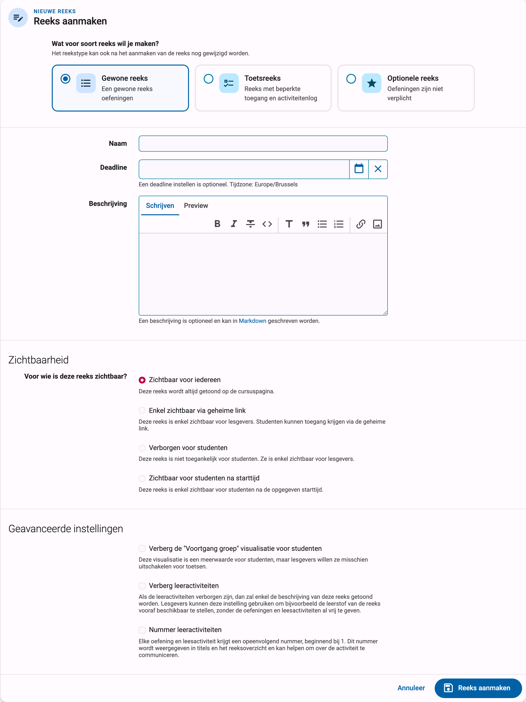
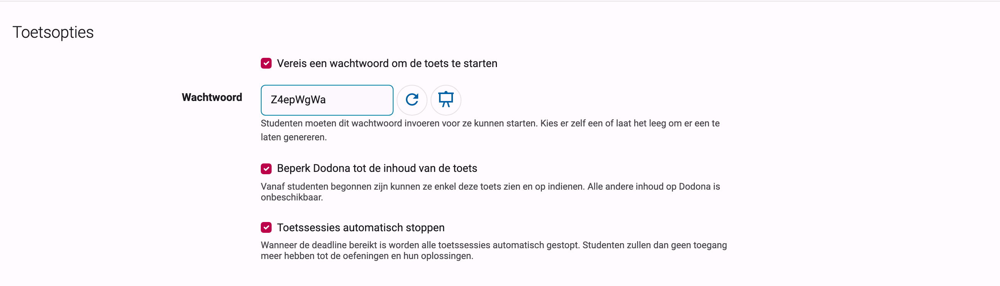
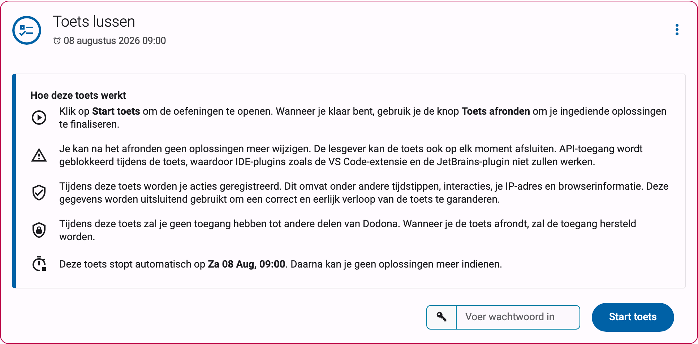
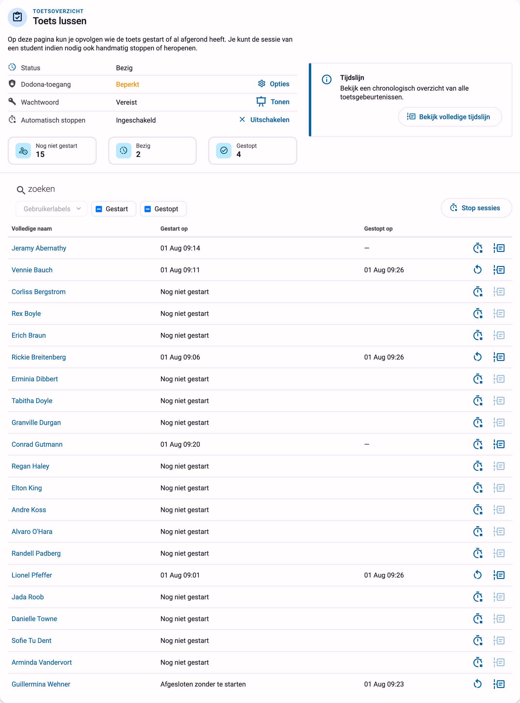
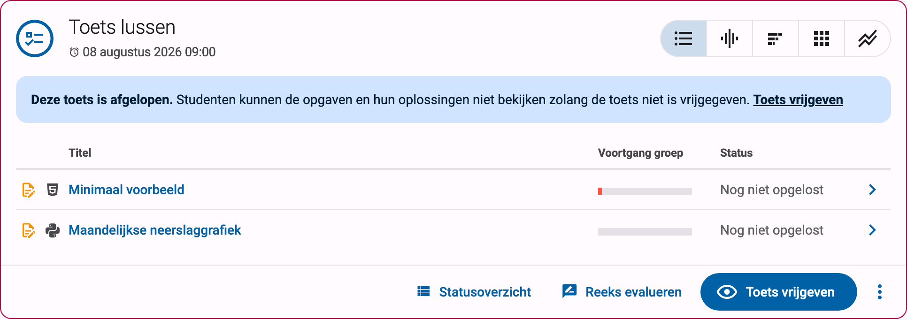
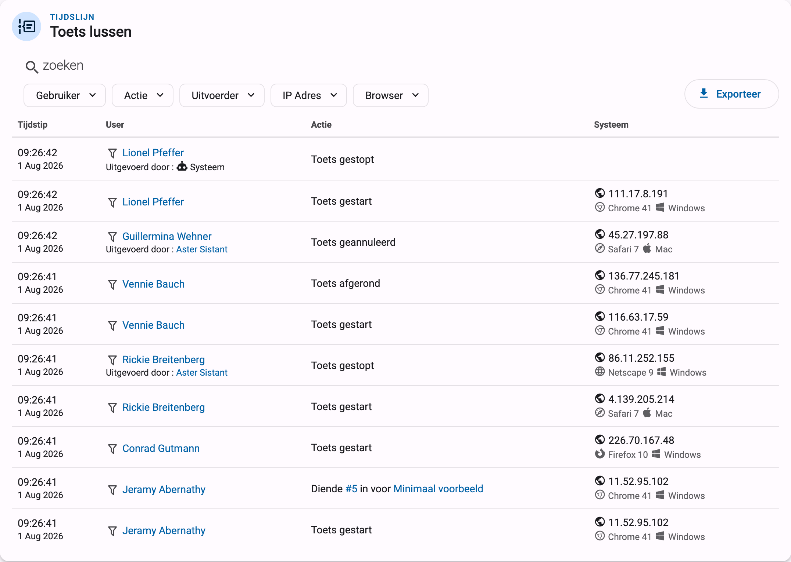

# Toetsen en examens

Wil je Dodona gebruiken voor een toets of examen op punten, dan kan je een reeks omvormen tot een **toetsreeks**. Een toetsreeks gedraagt zich helemaal anders dan een gewone reeks:

* Studenten moeten expliciet op start klikken op de reeks om toegang te krijgen tot de oefeningen.
* De toegang is beperkt tot de browser waarmee ze de toets starten. Aanmelden op een tweede toestel of browser geeft geen toegang tot de toets.
* API-toegang wordt geblokkeerd tijdens de toets, waardoor IDE-plugins zoals de VS Code-extensie en de JetBrains-plugin niet werken.
* Nadat ze de toets afronden, hebben studenten geen toegang meer tot de oefeningen en hun oplossingen, tot jij de toets achteraf vrijgeeft.
* Elke relevante actie van een student wordt bijgehouden in een toetslog die je kan raadplegen en exporteren.

Deze handleiding overloopt het volledige traject: de reeks instellen, wat je studenten zien, sessies opvolgen en stoppen tijdens de toets, de resultaten achteraf vrijgeven, en wat er precies gelogd wordt.

::: tip Belangrijk
Een toetsreeks regelt de toegang *binnen* Dodona: ze vergrendelt de computer van de student niet, neemt het scherm niet op en blokkeert geen andere websites. Beschouw ze als één laag van een examen onder toezicht, naast toezicht in het lokaal of de examenomgeving van je school.
:::

::: info Beschikbaarheid
Toetsreeksen worden geleidelijk uitgerold. Zie je de toetsoptie niet bij het aanmaken van een reeks, [contacteer ons](https://dodona.be/nl/contact/) dan en we schakelen ze voor je in.
:::

## Een toetsreeks aanmaken

Een toetsreeks maak je aan zoals elke andere reeks: navigeer naar je cursus, klik op `Reeksen beheren` en dan op `Reeks aanmaken`, zoals beschreven in [oefeningenreeksenbeheer](../exercise-series-management/#oefeningenreeks-aanmaken). Bovenaan het reeksformulier kies je `Toetsreeks` als type, daar omschreven als "Reeks met beperkte toegang en activiteitenlog".

Je hoeft dit niet op voorhand te beslissen: het reekstype kan ook na het aanmaken van de reeks nog gewijzigd worden. Kies `Reekstype wijzigen…` in het reeks-actiemenu om een bestaande reeks om te zetten. Zolang de reeks nog geen ingediende oplossingen heeft, wordt ze rechtstreeks omgezet; anders maakt Dodona een kopie van de reeks met het nieuwe type, zodat een echte toets altijd met een schone lei begint. Hetzelfde geldt in de andere richting: zodra een toets sessies of gelogde gebeurtenissen heeft, levert een omzetting een niet-toets kopie op en blijft de oorspronkelijke toets onaangeroerd.

Als je het toetstype selecteert, verschijnt er een extra sectie `Toetsopties` op het formulier:

* `Vereis een wachtwoord om de toets te starten`: studenten moeten een wachtwoord invoeren voor ze kunnen starten. Zie [het toetswachtwoord](#het-toetswachtwoord) hieronder.

* `Beperk Dodona tot de inhoud van de toets`: eenmaal gestart kunnen studenten enkel deze toets bekijken en er oplossingen voor indienen. Al de rest van Dodona is onbeschikbaar tot ze hun toets afronden. Zonder deze optie behouden studenten tijdens de toets toegang tot de rest van Dodona (andere cursussen, eerdere oplossingen, …), en dat is zelden wat je wil voor een examen.

* `Toetssessies automatisch stoppen`: wanneer de deadline bereikt is, worden alle toetssessies automatisch gestopt. Studenten hebben dan geen toegang meer tot de oefeningen en hun oplossingen. Deze optie vereist dat de reeks een deadline heeft. Sessies die zo gestopt worden, tonen `Systeem` als uitvoerder in de tijdslijn van de toets.

Alle andere eigenschappen van het formulier (naam, deadline, beschrijving, zichtbaarheid, …) werken zoals bij elke reeks en worden beschreven in de referentie over [reeksinstellingen](../series-settings/). De zichtbaarheidsinstellingen combineren mooi met een toets: met `Zichtbaar voor studenten na starttijd` verschijnt de reeks bijvoorbeeld pas op het moment dat het examen begint. Merk op dat zelfs een zichtbare toetsreeks haar oefeningen nooit toont aan studenten zolang ze hun sessie niet gestart hebben.

## Het toetswachtwoord

Het wachtwoord is een extra beveiliging bovenop de zichtbaarheidsinstellingen: het garandeert dat niemand de toets kan starten voor jij het wachtwoord bekendmaakt in het examenlokaal, en dat studenten die niet fysiek aanwezig zijn de toets helemaal niet kunnen starten.

Je schakelt het in met `Vereis een wachtwoord om de toets te starten` op het reeksformulier. In het veld `Wachtwoord` kies je zelf een wachtwoord of laat je het leeg om er een te laten genereren. Als leerkracht kan je het wachtwoord achteraf bekijken via de knop `Tonen` in het statuspaneel van de toets op de reeks, en het opnieuw instellen via het reeksformulier als het te vroeg zou uitlekken.

Het wachtwoord geldt per reeks en is hetzelfde voor alle studenten. Het wachtwoord op het bord of de projector tonen bij de start van het examen is dus de typische werkwijze.

## Wat je studenten zien

Voor de toets gestart is, zien studenten de reeks in de cursus met een uitleg getiteld `Hoe deze toets werkt` in plaats van de oefeningenlijst. Die legt uit hoe ze starten en afronden, waarschuwt dat ze na het afronden geen oplossingen meer kunnen wijzigen, dat de lesgever de toets op elk moment kan afsluiten, en dat API-toegang geblokkeerd wordt. Er staat ook een privacyvermelding bij: tijdens de toets worden hun acties geregistreerd, waaronder tijdstippen, interacties, hun IP-adres en browserinformatie, en die gegevens worden uitsluitend gebruikt om een correct en eerlijk verloop van de toets te garanderen.

Om te beginnen voert een student het wachtwoord in (indien vereist) en klikt op `Start toets`. Vanaf dat moment:

* De oefeningen worden zichtbaar en de student kan oplossingen indienen, enkel in die browser.
* Met `Beperk Dodona tot de inhoud van de toets` ingeschakeld, blijft de rest van Dodona verborgen tot de student klaar is.
* Een student kan maar aan één toets tegelijk deelnemen.

Wanneer een student klaar is, klikt die op `Toets afronden`. Na bevestiging eindigt de sessie: de ingediende oplossingen zijn opgeslagen en de student kan de oefeningen niet meer bekijken of wijzigen, tenzij jij de sessie heropent of de toets vrijgeeft.

::: warning Browser dichtgeklikt of van toestel gewisseld?
De toets is gekoppeld aan de browser waarmee de student ze startte. Meldt een student zich af, klikt die per ongeluk de browser dicht of wisselt die van toestel, dan komt die op een pagina met de titel `We kunnen je toets niet verderzetten in deze browser`. Er gaat geen voortgang verloren. De student keert best terug naar de oorspronkelijke browser; lukt dat niet, dan herstel jij de toegang via het toetsoverzicht door de sessie te stoppen en daarna te heropenen (zie hieronder). Op dezelfde pagina kan een student die al klaar is de toets ook gewoon afronden vanuit de nieuwe browser.
:::

## De toets opvolgen

Tijdens het examen is het toetsoverzicht je controlekamer. Je bereikt het via de knop `Toetsoverzicht` op de reeks. Op deze pagina kan je opvolgen wie de toets gestart of al afgerond heeft, en kan je de sessie van een student indien nodig handmatig stoppen of heropenen.

Bovenaan vind je het statuspaneel van de toets met de huidige fase (`Nog niet gestart`, `Bezig`, `Gestopt, klaar om vrij te geven` of `Vrijgegeven`) en de actieve instellingen: `Dodona-toegang` (`Beperkt` of `Onbeperkt`), `Wachtwoord` (`Vereist`, met de knop `Tonen`, of `Niet vereist`) en `Automatisch stoppen` (`Ingeschakeld` of `Uitgeschakeld`). Daarnaast tonen drie tellers hoeveel studenten `Nog niet gestart`, `Bezig` en `Gestopt` zijn; klik op een teller om de tabel eronder te filteren.

De tabel toont elke student van de cursus met de tijdstippen `Gestart op` en `Gestopt op`. Je kan zoeken op naam, filteren op `Gebruikerlabels`, `Gestart` en `Gestopt`, en de kolommen sorteren. Per rij kan je:

* `Stop sessie`: beëindig de toets van de student onmiddellijk. Het werk blijft bewaard, maar de student kan de oefeningen niet meer bekijken en niets meer indienen. Voor een student die nog niet gestart is, sluit dezelfde knop de toets af nog voor die kan starten, weergegeven als `Afgesloten zonder te starten`; handig voor studenten die afwezig zijn of niet mogen deelnemen.
* `Heropen sessie`: maak een stop ongedaan. De student kan de toets opnieuw starten in een verse browsersessie en gaat verder met behoud van al het eerdere werk. Zo herstel je ook de toegang van een student van wie de browser crashte: eerst `Stop sessie`, daarna `Heropen sessie`.
* De persoonlijke tijdslijn van toetsgebeurtenissen van die student bekijken.

## De toets stoppen

Een toetssessie kan op verschillende manieren eindigen:

* De student rondt zelf de toets af met `Toets afronden`.
* Jij stopt een individuele sessie met `Stop sessie` op het toetsoverzicht.
* Jij stopt iedereen tegelijk. De knop `Stop sessies` boven de tabel op het toetsoverzicht stopt enkel de sessies die voldoen aan de huidige filters, waardoor je bijvoorbeeld één klasgroep kan stoppen door eerst op hun label te filteren. De knop `Toets stoppen` op de reeks zelf beëindigt alle lopende sessies, en studenten die nog niet gestart zijn, kunnen daarna niet meer starten.
* Dodona stopt alle sessies automatisch op de deadline, als je `Toetssessies automatisch stoppen` hebt ingeschakeld.

Zodra elke sessie gestopt is, verandert de fase van de toets naar `Gestopt, klaar om vrij te geven`. Studenten kunnen de oefeningen en hun oplossingen op dat moment niet bekijken; de reeks toont hun een melding dat hun oplossingen opgeslagen zijn.

## De resultaten vrijgeven

Na de toets beslis jij wanneer studenten de oefeningen en hun oplossingen opnieuw kunnen bekijken. Klik op `Toets vrijgeven` op de reeks en bevestig. De toets wordt dan voor iedereen afgesloten en studenten kunnen de opgaven en hun oplossingen in alleen-lezenmodus bekijken: ze kunnen geen nieuwe oplossingen indienen en geen activiteiten als gelezen markeren. Dit is het natuurlijke moment om studenten hun werk te laten inkijken, bijvoorbeeld terwijl je de oplossingen klassikaal bespreekt.

Te vroeg vrijgegeven? Met `Toets verbergen` in het reeks-actiemenu maak je de toets weer privé.

Vrijgeven staat los van verbeteren. Om de toets te verbeteren maak je een evaluatie aan voor de reeks en geef je optioneel feedback en punten; zie de handleiding over [taken en toetsen verbeteren](../grading/). Een evaluatie werkt op de oplossingen die studenten tijdens de toets indienden, dus je kan verbeteren voor of na het vrijgeven.

## De tijdslijn van de toets

Elke toets houdt een gedetailleerde log van gebeurtenissen bij. Vanuit het toetsoverzicht opent `Bekijk volledige tijdslijn` een chronologisch overzicht van alle toetsgebeurtenissen; de knop per student op elke rij van de tabel toont dezelfde tijdslijn gefilterd op één student.

De volgende gebeurtenissen worden geregistreerd, telkens met een tijdstip, de betrokken student, en waar relevant de uitvoerder van de actie (jij, de student, of `Systeem`):

* `Toets gestart`, `Toets afgerond` (door de student), `Toets gestopt` (door een lesgever of het systeem), `Toets heropend`, `Toets geannuleerd` (afgesloten voor de student startte)
* `Oplossing ingediend`, met een link naar de oplossing en de oefening
* `Leesactiviteit gelezen`
* `Aangemeld tijdens toets` en `Afgemeld tijdens toets`

Je kan de tijdslijn filteren op `Gebruiker`, `Actie`, `Uitvoerder`, `IP adres` en `Browser`. De knop `Exporteer` downloadt de log als CSV-bestand, inclusief het IP-adres en de browserinformatie bij elke gebeurtenis, zodat je ze kan archiveren of onregelmatigheden na het examen kan onderzoeken.

## Privacyoverwegingen

Vragen die je school (of je studenten) kunnen stellen over toetsen:

* **Wat wordt er gelogd?** De gebeurtenissen hierboven, met tijdstippen, het IP-adres van de student en browserinformatie. Het loggen start wanneer de student de toets start en is beperkt tot acties die met de toets te maken hebben.
* **Worden studenten geïnformeerd?** Ja. Het startscherm vertelt studenten expliciet dat hun acties geregistreerd worden, wat daarbij hoort, en dat die gegevens uitsluitend gebruikt worden om een correct en eerlijk verloop van de toets te garanderen. Een student start de toets pas na het zien van deze melding.
* **Wie kan de log inkijken?** Enkel de cursusbeheerders van de cursus (en Dodona-medewerkers). Studenten kunnen de tijdslijn van de toets niet zien.
* **Is dit proctoringsoftware?** Nee. Dodona neemt geen schermen, webcams of toetsaanslagen op, en kan niet verhinderen dat studenten andere programma's of websites openen. Het IP-adres en de browserinformatie in de log kunnen helpen om afwijkingen op te sporen (zoals een sessie die plots verdergaat vanaf een ander netwerk), maar fysiek toezicht blijft jouw verantwoordelijkheid.

Heb je vragen over het afnemen van een examen met Dodona waar deze handleiding geen antwoord op geeft, contacteer ons dan gerust via [support@dodona.be](mailto:support@dodona.be).
