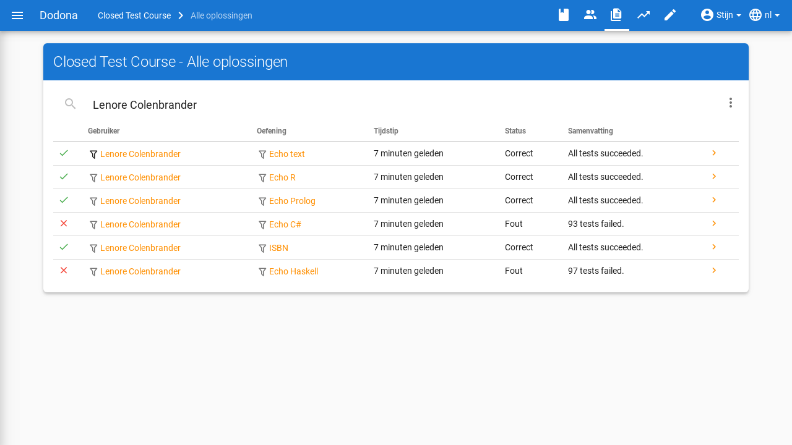

# Cursusbeheer

Op deze pagina vind je alle informatie over cursusbeheer op Dodona.

Een cursus wordt opgebouwd als een leerpad met oefeningen die gebundeld worden in oefeningenreeksen. De opeenvolging van oefeningenreeksen impliceert een mogelijke volgorde waarin de oefeningen kunnen opgelost worden. Gebruikers kunnen zichzelf registreren voor een cursus. Er is altijd minstens één gebruiker die cursusbeheerder is, bijvoorbeeld de gebruiker die de cursus aanmaakte. Voor informatie over hoe je een nieuwe cursus aanmaakt, kan je [hier](../creating-a-course/) terecht.

## Beheersrechten

Cursusbeheerders hebben binnen een cursus speciale rechten. Ze kunnen de cursus aanpassen naar hun wens en de voortgang van de studenten die voor de cursus zijn ingeschreven opvolgen. De gebruiker die de cursus aanmaakt wordt standaard aangesteld tot cursusbeheerder. Hij kan op zijn beurt andere extra cursusbeheerder aanstellen onder de gebruikers die voor de cursus zijn ingeschreven.

## Cursus bewerken

Om de eigenschappen van een bestaande cursus te bewerken, navigeer je naar de cursuspagina en klik je op het bewerken-icoontje bovenaan.

Je komt op een pagina terecht waar je de naam, lesgevers, beschrijving, zichtbaarheid en registratieprocedure kan aanpassen. Voor meer details over de specifieke eigenschappen kan je terecht op [deze pagina](../creating-a-course/#cursuseigenschappen).

Klik na het aanpassen op de afwerkknop in de rechterbovenhoek van het paneel om de nieuwe cursuseigenschappen op te slaan. Alternatief kan je ook op de `Aanpassen` klikken onderaan het paneel. Daarna navigeer je automatisch terug naar de cursuspagina waar de nieuwe cursuseigenschappen onmiddellijk van toepassing zijn.

## Een cursus opbouwen

Als cursusbeheerder kan je voor de cursus een leerpad uitstippelen. Het leerpad wordt op de cursuspagina weergegeven onder de hoofding `Oefeningenreeksen`. Aan het leerpad kan je oefeningenreeksen toevoegen waaraan je oefeningen kunt koppelen. Voor meer uitleg over wat je allemaal kan doen, zie [oefeningenreeksen beheren](../exercise-series-management/).

## Cursusgebruikers beheren

Om een overzicht te krijgen van de gebruikers in een cursus, klik je op het gebruikersicoontje in de navigatiebalk bovenaan de cursuspagina. Voor meer informatie over welke acties je daar kan uitvoeren, kan je de handleiding over [gebruikersbeheer](../user-management/) raadplegen.

## Navigeren naar oplossingen

Als cursusbeheerder kan je alles opvolgen wat binnen je cursus gebeurt. Om een overzicht te krijgen van alle oplossingen die door de studenten werden ingediend klik je op `Ingediende oplossingen` bovenaan de cursuspagina of op het icoontje in de navigatiebalk.

Het overzicht bevat heel wat informatie per inzending, zoals de naam van de gebruiker en de naam van de oefening, inclusief filters voor deze waarden. Ook de status, het tijdstip en een link naar de inzending zijn aanwezig.

Als je klikt op het filter-icoontje voor de naam van een student of oefening, dan zal de lijst inzendingen gefilterd worden en enkel oplossingen tonen voor die specifieke gebruiker of oefening.

Deze oplossingen kan je ook op andere manieren bereiken:

* Een overzicht van de oplossingen voor een **specifieke oefening** vind je door op de cursuspagina op het pijltje rechts van een oefening te klikken.
* Een overzicht van de oplossingen voor **specifieke gebruiker** vind je door op `Oplossingen` te klikken op de [cursuspagina van die gebruiker](../user-management/#studenten-opvolgen).

In het oplossingenoverzicht vind je rechts van de filterbalk een knop met 3 puntjes. In het menu vind je enkele acties en filter:

* `Meest recente correcte oplossing per gebruiker`: Beperkt het overzicht tot de meest recente correcte oplossing per gebruiker.

* `Oplossingen hertesten` (actie): [Hertest](../exercise-series-management/#oplossing-hertesten) alle oplossingen uit het overzicht.
