# Een reeks evalueren

Correcte testresultaten zijn geen garantie voor goede code. Daarom biedt Dodona ook ondersteuning om de oplossingen manueel te evalueren en hen van feedback te voorzien. Om een evaluatie te starten, open je als lesgever het [oefeningenreeks-actiesmenu](../exercise-series-management#het-reeks-menu) door te klikken op de drie bolletjes in de rechterbovenhoek van de reeks.

Vervolgens selecteer je `Reeks evalueren`.
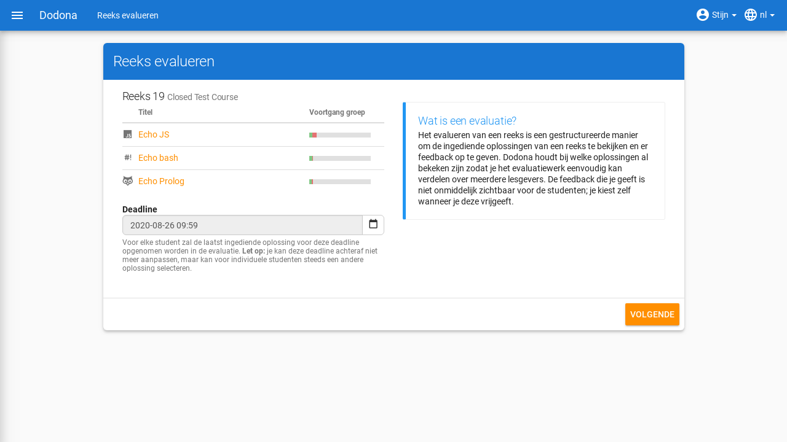

Je wordt naar de volgende pagina gebracht waar je gebruikers kan selecteren om te evalueren.  Er zijn ook handige knoppen om snel een bepaalde categorie gebruikers te selecteren. Uiteraard kan je ook via de zoekbalk filteren op gebruikers via hun naam, labels, ... .
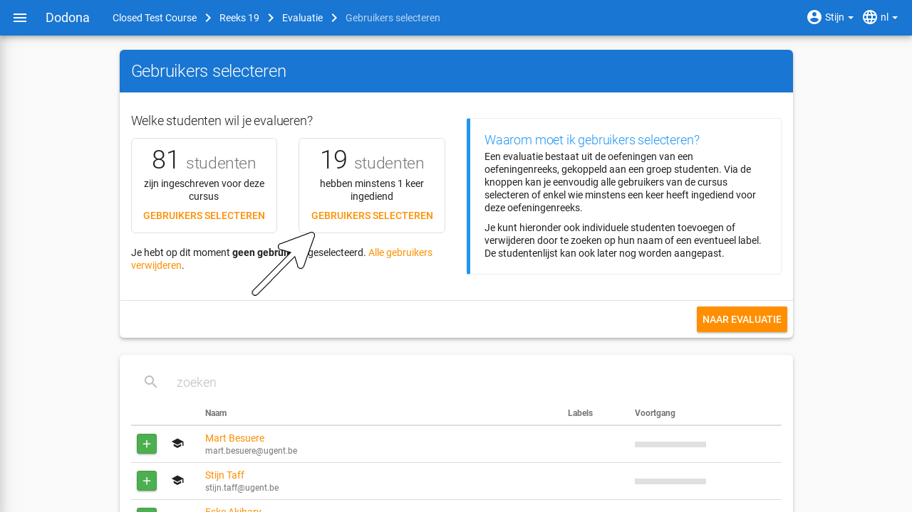

Na de nodige gebruikers gekozen te hebben, kan je de evaluate starten. 
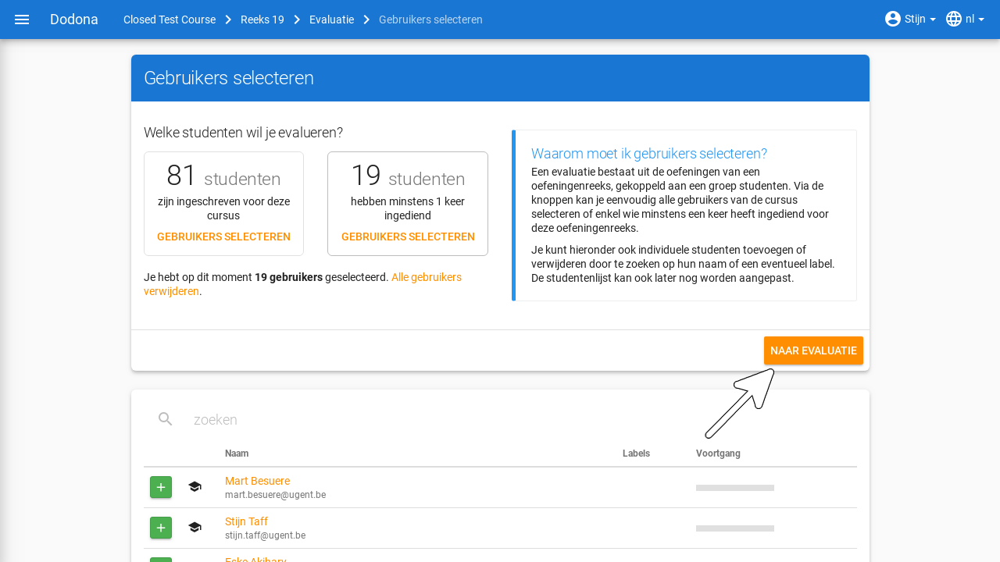

Je wordt nu automatisch door de evaluatie geleid, waarbij Dodona bijhoudt welke gebruikers je reeds geëvalueerd hebt. Je kan de ingediende code van annotaties voorzien: opmerkingen over de code, wat goed is en wat beter kan. Deze feedback wordt niet automatisch vrijgegeven, dit kan je op het einde van de evaluatie voor alle gebruikers tegelijkertijd doen via de knop `Feedback vrijgeven`. De studenten krijgen hier een melding van. Je kan deze feedback ook weer verbergen via dezelfde knop.

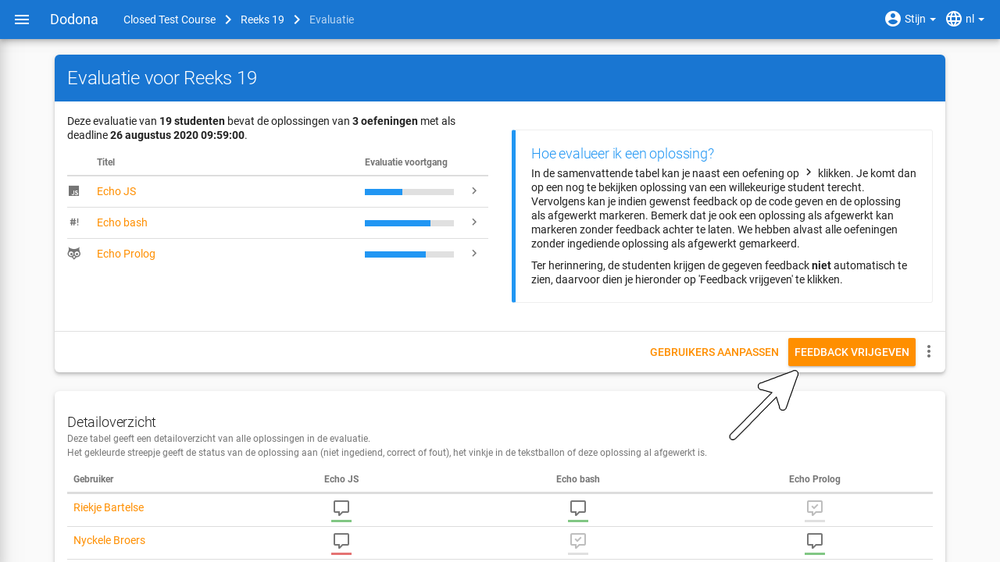

In het detailoverzicht zie je de status van de gekozen gebruikers voor de oefeningen in de reeks. Het icoontje bestaat uit twee delen. De tekstballon geeft aan dat je deze oplossing reeds geëvalueerd hebt als het een vinkje bevat. Het balkje eronder gebruikt een kleurencode voor de status van de oefening: rood voor fout, groen voor correct en grijs voor niet ingediend.
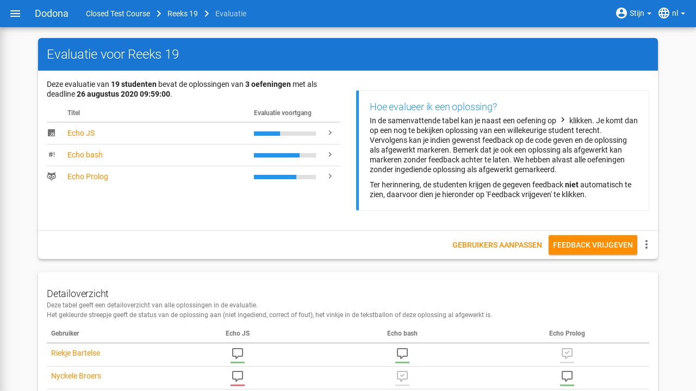

Je kan klikken op deze icoontjes om de bijhorende oplossing te evalueren.
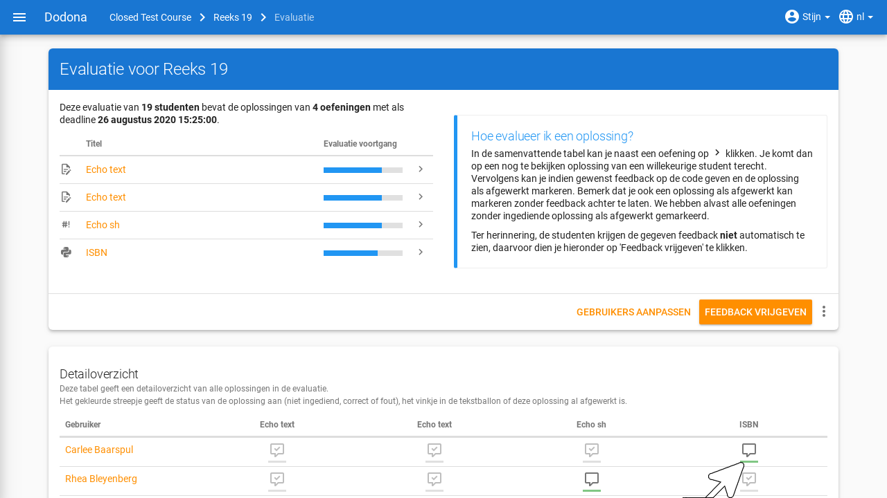

Je komt op een evaluatie-pagina terecht van de gebruiker waar je dus de code zelf van feedback kan voorzien. Dit kan op een lijn-per-lijnbasis. De gebruiker zal na het vrijgeven van de feedback een melding krijgen, waarna hij de feedback kan bekijken.
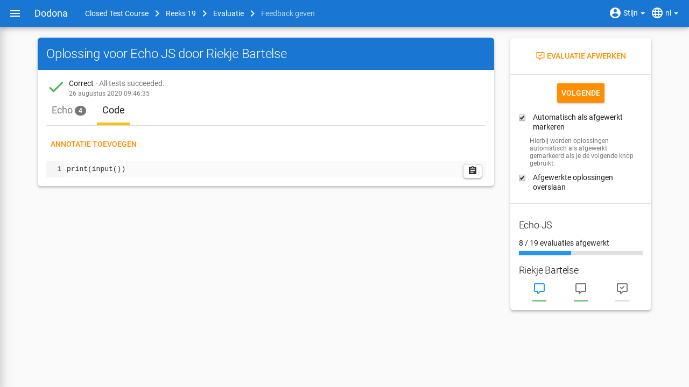

In de rechterbovenhoek vind je navigatie-opties om efficiënt de oplossingen te overlopen. De knop `Volgende` brengt je naar een volgende niet-afgewerkte indiening. Daar staan ook opties om het evalueerproces te versnellen en vereenvoudigen. Zo kan je reeds afgewerkte oplossingen overslaan en de huidige oefening automatisch als afgewerkt markeren als je op `Volgende` klikt. 

Eronder vind je je voortgang voor de huidige oefening en kan je ook navigeren naar de oplossingen van de huidige gebruiker voor andere oefeningen die in de reeks zitten.
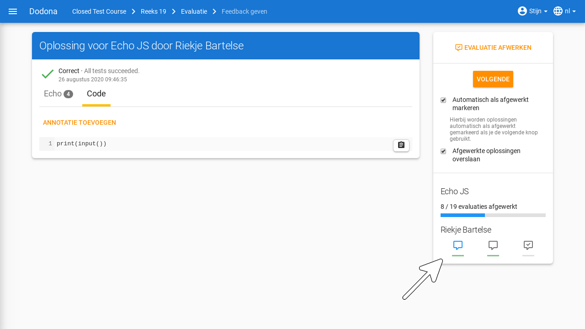

Via de navigatiebalk bovenaan kan je makkelijk terugkeren naar de evaluatiepagina.
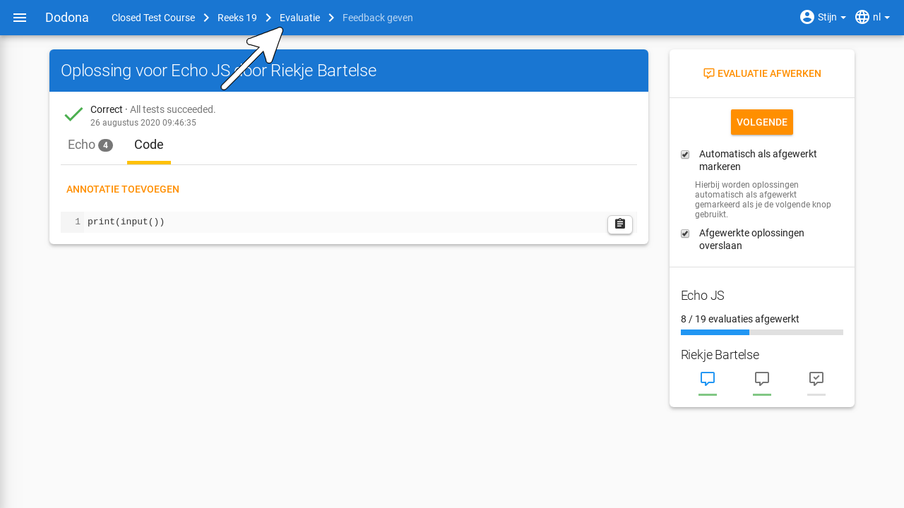

Je kan een reeks slechts één keer evalueren. Dit hoef je echter niet in één stuk te doen, je kan later terugkeren naar de evaluatie via het reeks-actiesmenu, waar nu `Evaluatie bekijken` staat.

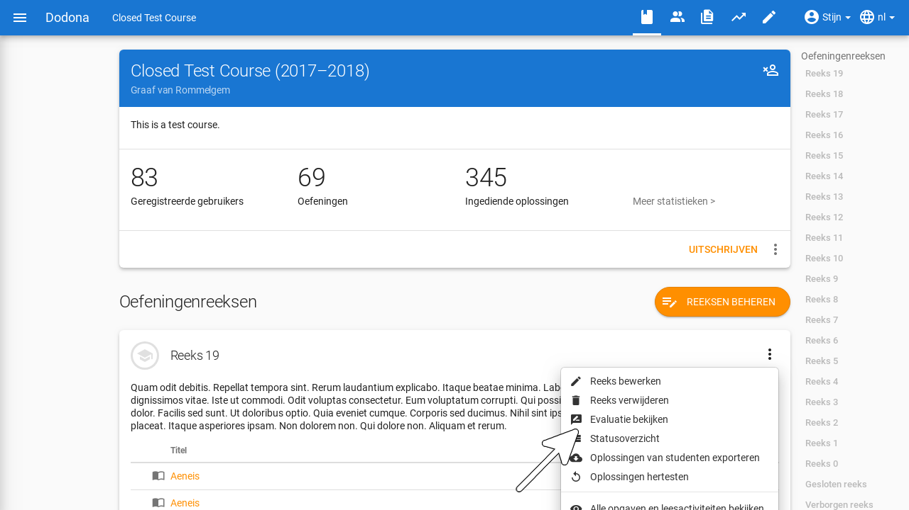

Je kan een bestaande evaluatie ook verwijderen. De gegeven feedback zal ook verdwijnen.
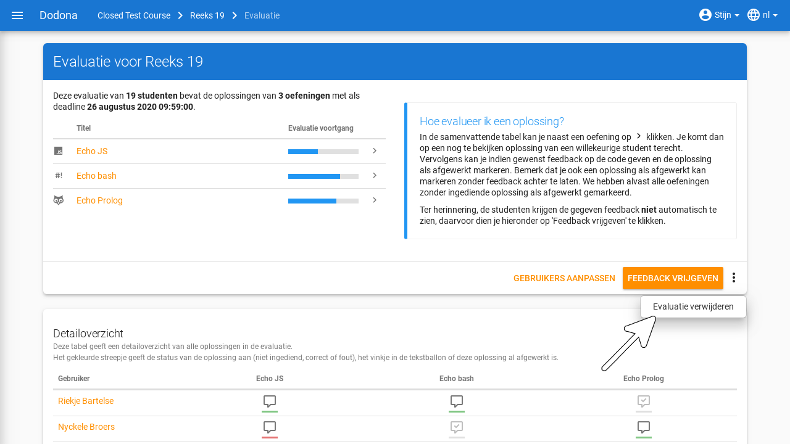
