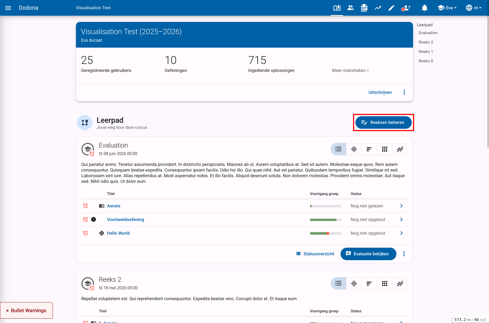
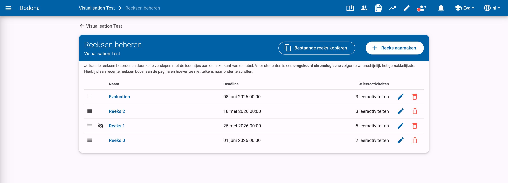
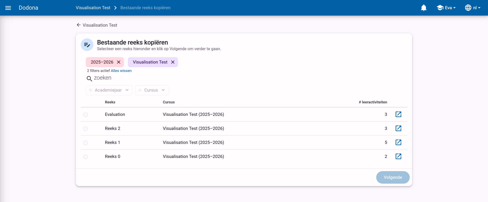
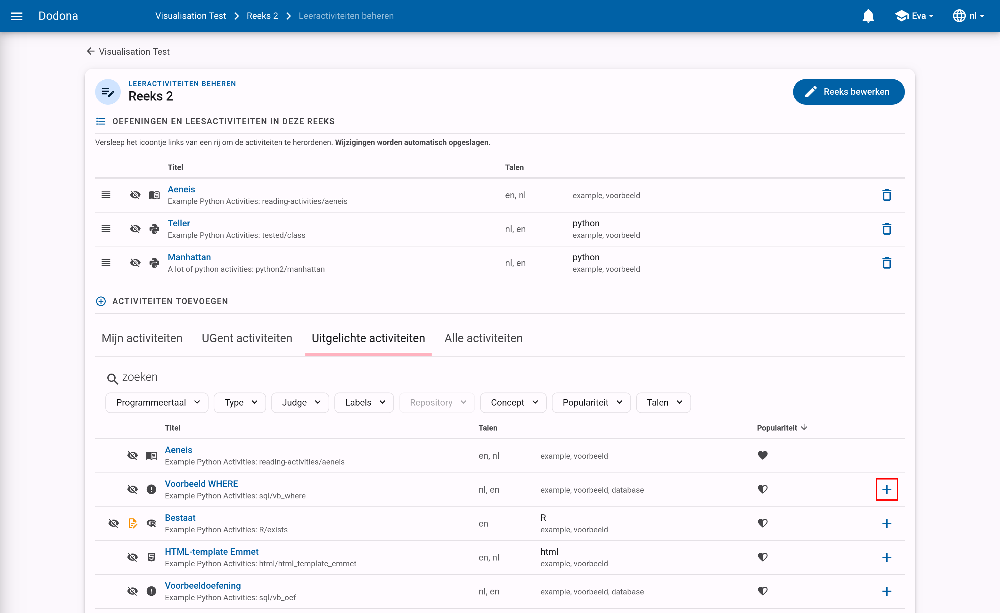
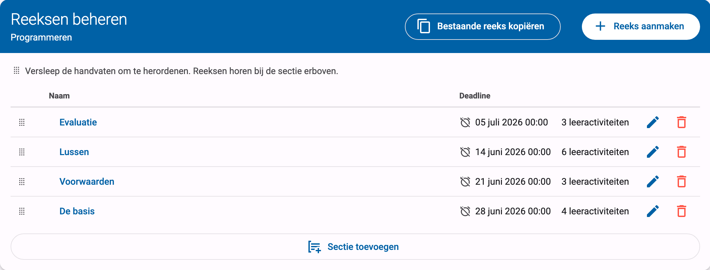
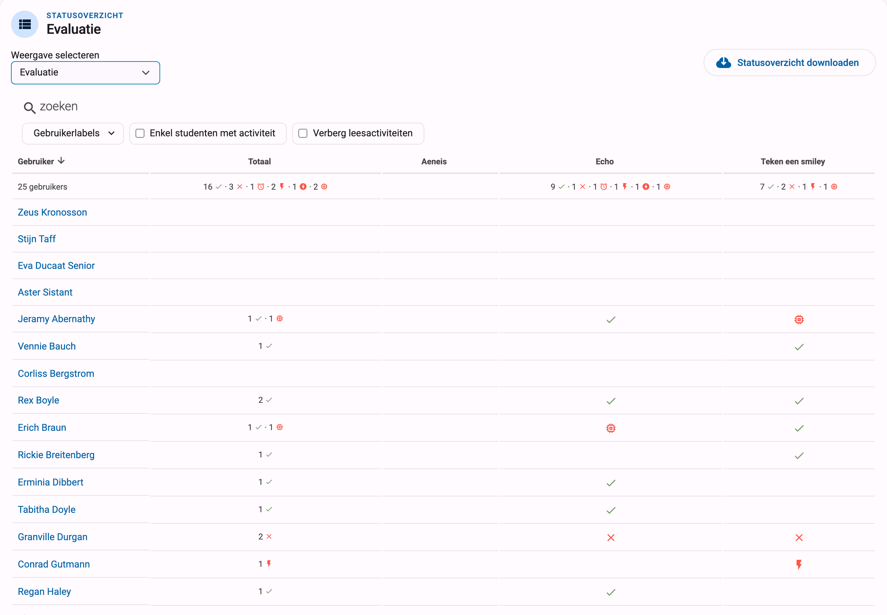

# Oefeningenreeksenbeheer

Het leerpad van een cursus bestaat uit verschillende oefeningenreeksen die elk opnieuw bestaan uit verschillende oefeningen. Cursusbeheerders kunnen deze reeksen aanmaken, bewerken, verwijderen en herordenen.

## Oefeningenreeks aanmaken

Een cursusbeheerder kan onbeperkt oefeningenreeksen binnen je cursus aanmaken. Je doet dit door eerst naar de cursuspagina van de cursus te navigeren en vervolgens `Reeksen beheren` aan te klikken.

Op deze pagina vind je rechtsboven de knoppen `Bestaande reeks kopiëren` en `Reeks aanmaken`.

Bij het kopiëren van een bestaande reeks selecteer je de reeks die je wil kopiëren. Dit wordt standaard gefilterd op de huidige cursus, maar je kan reeksen kiezen uit elke cursus die je beheert.

Je wordt dan doorgestuurd naar een formulier waar je de eigenschappen van de reeks kan instellen. Dit is ook het formulier waar je op terechtkomt als je een nieuwe reeks aanmaakt.

Eerst kies je de soort reeks die je wil aanmaken: een gewone reeks, een toetsreeks, of een optionele reeks. De gewone reeks heeft een duidelijke voortgangsaanduiding. Een optionele reeks wordt standaard ingeklapt voor je studenten, en maakt duidelijk dat de oefeningen in de reeks optioneel zijn. Een toetsreeks beperkt de toegang en houdt een activiteitenlog van studenten bij; deze soort is bedoeld voor toetsen en examens en wordt in detail beschreven in de handleiding over [toetsen en examens](../assessments/).

Nadien geef je de reeks een naam en stel je optioneel een deadline, beschrijving, zichtbaarheid en enkele geavanceerde instellingen in. Alle eigenschappen van dit formulier worden beschreven in de referentie over [reeksinstellingen](../series-settings/).

Om de reeks aan te maken klik je op de knop `Reeks aanmaken` onderaan de pagina. De nieuwe oefeningenreeks wordt zo aan je cursus toegevoegd.

Na het aanmaken van de reeks kom je op de pagina terecht waar je de oefeningen van de reeks beheert.

## Oefeningen toevoegen aan een reeks

Je kan deze pagina op twee manieren bereiken: automatisch na het aanmaken van een nieuwe reeks of door de knop `Leeractiviteiten beheren` in het reeks-actiemenu te gebruiken.

Hier vind je de activiteiten die al deel uitmaken van de reeks en de mogelijke activiteiten om toe te voegen.
Klik op de toevoegknop (`+`) aan de rechterkant van een oefening om de oefening aan de oefeningenreeks toe te voegen.

Via de zoekbalk kan je bestaande oefeningen filteren op naam, beschikbare vertalingen, programmeertaal, labels, repository of type.

Onder de hoofding `Oefeningen en leesactiviteiten in deze reeks` kan je aan de rechterkant van een oefening op de verwijderknop klikken om de oefening uit de oefeningenreeks te verwijderen.

Versleep de verplaatsknop aan de linkerkant van de oefeningen om de volgorde van de oefeningen aan te passen. De volgorde waarin de oefeningen onder de hoofding `Oefeningen en leesactiviteiten in deze reeks` gerangschikt worden, is immers ook de volgorde waarin de oefeningen weergegeven worden in de oefeningenreeks.

::: tip Belangrijk

We veronderstellen hier dat de oefeningen die aan de oefeningenreeks moeten gekoppeld worden reeds beschikbaar zijn in Dodona. Het opstellen, publiceren en delen van oefeningen wordt [hier](/nl/guides/exercises/creating-exercises/introduction/) besproken.

:::

## Oefeningenreeks beheren

Uiteraard is het mogelijk om een reeks te verwijderen uit een cursus. De actie vind je analoog aan het bewerken in het reeksen-beheren menu of in het reeks-actiesmenu.

Het kan handig zijn om reeksen in een cursus een bepaalde volgorde te geven, om ze bijvoorbeeld te sorteren volgens moeilijkheidsgraad. Standaard zullen ze gesorteerd worden in omgekeerd chronologische volgorde op basis van wanneer je ze toevoegt. Zo moeten studenten minder scrollen als ze een reeks willen maken. In het reeksen-beherenpaneel kan je in de tabel van de reeds toegevoegde reeksen ze verslepen via het icoontje aan de linkerkant.

## Het reeks-menu

Onderaan de reeks vind je enkele handige acties die cursusbeheerders kunnen uitvoeren op de reeks. De belangrijkste acties zijn `Reeks evalueren` en `Statusoverzicht`, de andere acties vind je door op de drie bolletjes te klikken.

* `Reeks evalueren`: deze actie stelt je in staat om op een gestructureerde manier door de ingediende oplossingen van deze reeks te bladeren, bijvoorbeeld om ze te [evalueren](/nl/guides/teachers/grading) of verbeteren.

* `Statusoverzicht`: toont een handig overzicht met de indienstatus van alle cursusgebruikers voor alle oefeningen uit de oefeningenreeks. De indienstatus wordt in het overzicht weergegeven met de gebruikelijke icoontjes.

  

  Klik op de naam van een cursusgebruiker om naar de overzichtspagina van de gebruiker te navigeren.

  Klik op het icoontje van een indienstatus om naar de oplossing te navigeren die gebruikt werd om de indienstatus te bepalen (als de cursusgebruiker effectief een oplossing heeft ingediend op basis waarvan de indienstatus kon bepaald worden). Je kan in dit overzicht ook filteren op studenten die aan minstens één activiteit begonnen zijn, leesactiviteiten verbergen, en zoeken op naam of studentlabel.

* `Oplossingen van studenten exporteren`: deze actie stelt je in staat om de ingezonden oplossingen van studenten voor de oefeningen in de reeks te [exporteren](../series-export-and-retest/#oefeningenreeks-oplossingen-exporteren) als zip-bestand.

* `Oplossingen hertesten`: deze actie [hertest](../series-export-and-retest/#oplossing-hertesten) alle oplossingen die cursusgebruikers ingediend hebben voor oefeningen van de oefeningenreeks. Dit kan nuttig zijn als je bijvoorbeeld een aantal testen hebt toegevoegd of aangepast en je de al ingediende oplossingen opnieuw wil testen.

De exporteer- en hertestacties worden in detail besproken in [oplossingen exporteren en hertesten](../series-export-and-retest/).
