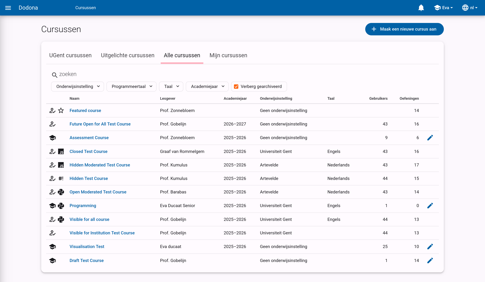
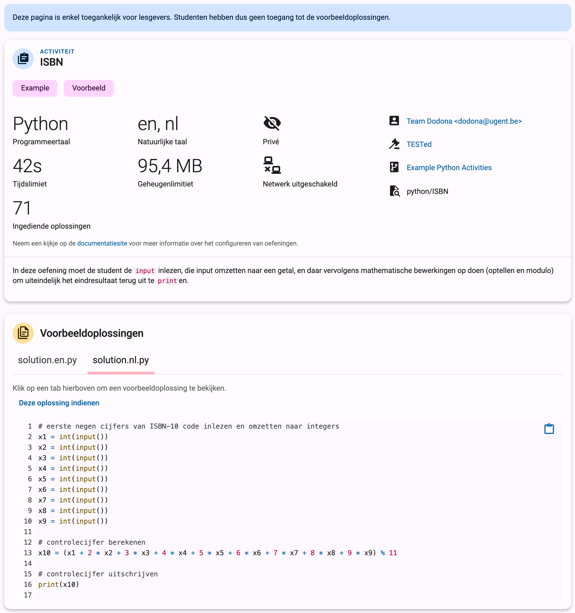
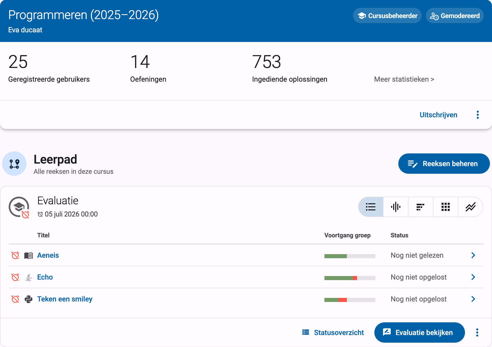

# Van start met Dodona als leerkracht

Alle informatie om vlot van start te gaan met Dodona als leerkracht.

## Wat is Dodona?

<!--@include: ../../_what-is-dodona.md-->

Op Dodona kunnen lesgevers een eigen cursus aanmaken, opgebouwd uit verschillende oefeningenreeksen. Ze kunnen hiervoor beroep doen op bestaande cursussen en oefeningen, maar kunnen er ook voor kiezen om zelf aan de slag te gaan en eigen oefeningen en lesmateriaal op te stellen. Dankzij de ingebouwde *learning analytics* en datavisualisaties is het bovendien eenvoudig om de voortgang van studenten te meten.

## Aanmelden

Aanmelden op Dodona kan via de Smartschool, Microsoft 365 of Google Workspace account van je school. Dodona krijgt vervolgens je naam, e-mailadres, en naam van je school doorgestuurd van het gekozen loginsysteem. Op basis hiervan kunnen we je identificeren en maken we automatisch een Dodona-account aan de eerste keer dat je aanmeldt. Je wachtwoord wordt op geen enkel moment naar ons doorgestuurd.

::: tip Meerdere inlogsystemen?
Sommige scholen bieden zowel inloggen via Smartschool als via Microsoft 365 of Google Workspace aan. Omdat je Dodona-account gekoppeld is aan het gebruikte inlogsysteem, zal je twee verschillende Dodona-accounts hebben als je bijvoorbeeld eerst via Smartschool aanmeldt en vervolgens via Microsoft 365.

Om problemen te voorkomen kunnen we voor jouw school de inlogmogelijkheden beperken. Contacteer ons hiervoor op <a href="mailto:support@dodona.be">support@dodona.be</a>.
:::

Een standaard Dodona-account kan zich vrij inschrijven voor cursussen en onbeperkt oefeningen indienen. Wil je als lesgever zelf een cursus aanmaken of oefeningen opstellen, dan heb je extra rechten nodig. Gebruik het [aanvraagformulier](https://dodona.be/nl/rights_requests/new) op Dodona en we geven je zo snel mogelijk de nodige rechten.
Meer over hoe accounts werken lees je in de [FAQ](/nl/faq/accounts/).

## Een cursus aanmaken

Eenmaal we je lesgeversrechten hebben geactiveerd kan je zelf een cursus aanmaken door op de knop `Maak een nieuwe cursus aan` te klikken in het [cursusoverzicht](https://dodona.be/nl/courses/).

Vervolgens kan je kiezen om te starten vanaf een lege cursus, of om de inhoud van een bestaande cursus over te nemen en aan te passen. Om inspiratie op te doen kan je een kijkje nemen in onze [uitgelichte cursussen](https://dodona.be/nl/courses/?tab=featured).

Meer details over het aanmaken van een cursus vind je in [deze handleiding](/nl/guides/teachers/creating-a-course).

## Een cursus opstellen

Een cursus op Dodona bestaat uit verschillende oefeningenreeksen die je kan gebruiken om oefeningen te groeperen. Om een nieuwe oefeningenreeks aan te maken, klik je op de `Reeksen beheren` knop op je cursuspagina en vervolgens op `Reeks aanmaken`. Je krijgt dan onderstaand formulier te zien.

Elke oefeningenreeks bestaat uit een titel en een beschrijving die je kan gebruiken om bijvoorbeeld te verwijzen naar lesmateriaal. Naast gewone tekst kan je hier ook het [Markdownformaat](/nl/references/exercise-description/#markdown) gebruiken om extra opmaak toe te voegen. Daarnaast kan je ook een eventuele deadline opgeven en de zichtbaarheid van de reeks instellen. Alle mogelijke opties worden beschreven in de referentie over [reeksinstellingen](/nl/guides/teachers/series-settings/).

Nadat je een reeks hebt aangemaakt, kan je oefeningen en leesactiviteiten toevoegen. Je kan hiervoor kiezen uit alle oefeningen en activiteiten die voor jou beschikbaar zijn in Dodona. Via het zoekveld kan je eenvoudig de lijst van oefeningen filteren.

Bij het selecteren van oefeningen kan je meer info over een oefening bekijken door naar de infopagina te gaan. Hier vind je voorbeeldoplossingen, beschikbare talen, instellingen, extra uitleg en contactgegevens van de auteur.

In onze handleiding over [oefeningenreeksenbeheer](/nl/guides/teachers/exercise-series-management) vind je meer informatie over hoe je oefeningenreeksen beheert.

Wil je zelf oefeningen aanmaken, dan hebben we daar ook een handleiding voor. In [deze handleiding](/nl/guides/exercises/creating-exercises/introduction/) vind je alle info over hoe je oefeningen voor Dodona aanmaakt.

## Je cursus gebruiken

Eenmaal je je cursus hebt opgesteld, kan je ze gebruiken in je les. Je leerlingen vinden je cursus eenvoudig terug in de cursuslijst nadat ze aangemeld zijn, of je kan een directe link naar de cursus delen door ze bijvoorbeeld op Smartschool te plaatsen. Via de ingebouwde analytics kan je de voortgang van je leerlingen makkelijk opvolgen.

Dodona laat je ook toe om feedback te geven, oefeningen te quoteren en vragen te beantwoorden. De volgende handleidingen leggen alle mogelijkheden in detail uit:
- [Cursusbeheer](/nl/guides/teachers/course-management)
- [Gebruikersbeheer](/nl/guides/teachers/user-management)
- [Taken en toetsen verbeteren](/nl/guides/teachers/grading)
- [Vragen beantwoorden](/nl/faq/annotations)
