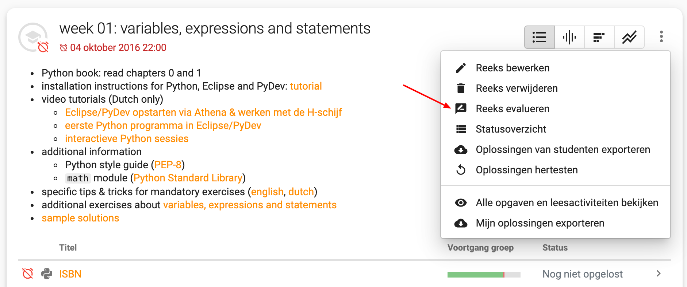
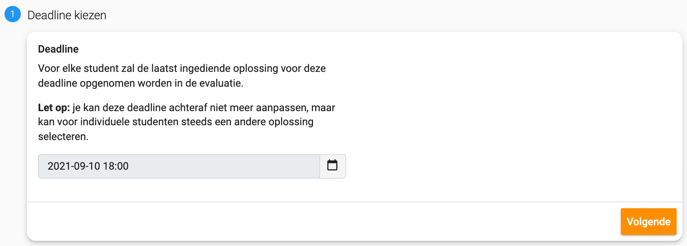
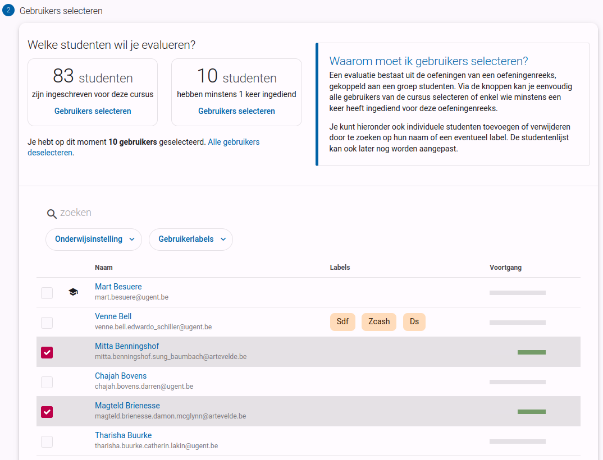
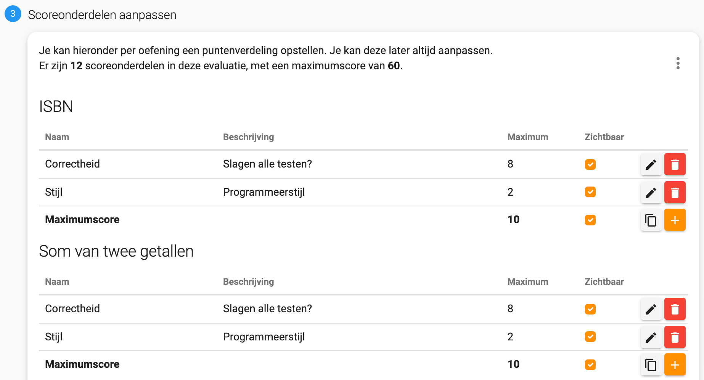
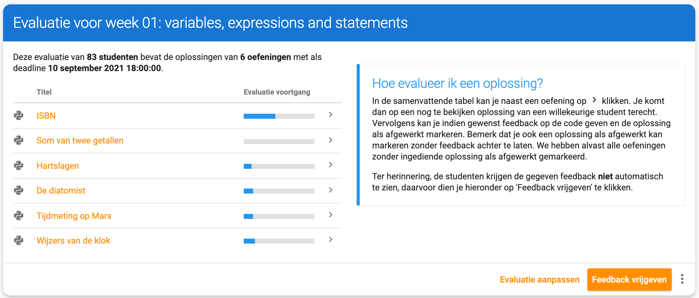
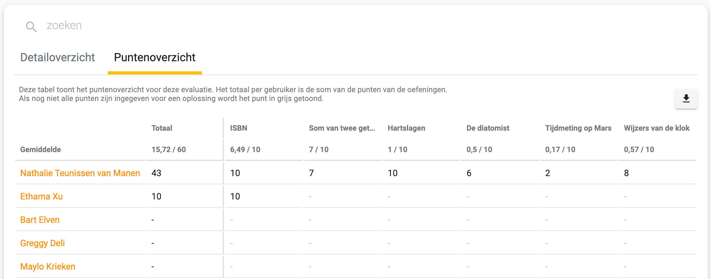
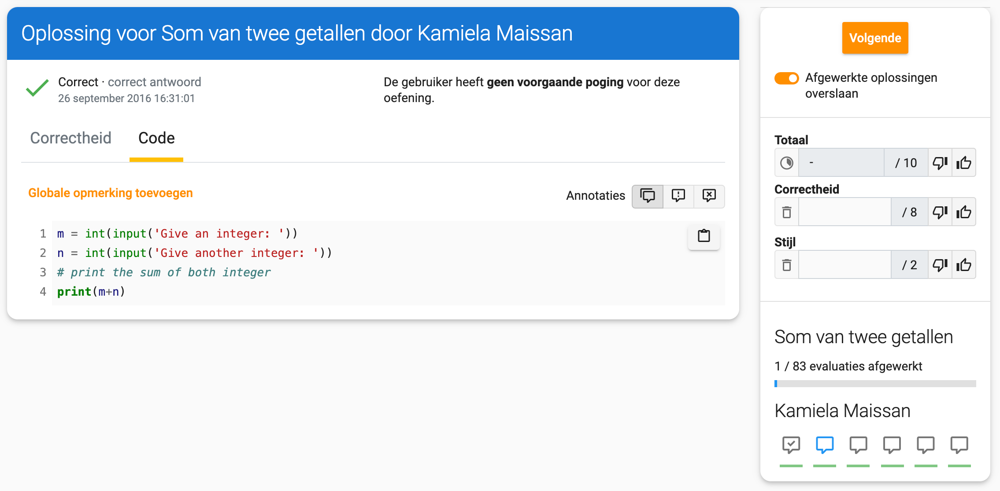

# Taken en toetsen verbeteren met Dodona

> Sinds september 2021 heeft Dodona een verbetermodule. Ideaal om op een gestructureerde manier door de ingediende oplossingen te gaan en feedback en/of punten te geven.

## Een reeks evalueren

Het verbeteren van oefeningen gebeurt steeds per reeks. Als je een taak, toets of examen later wil verbeteren, dan maak je hier dus best een aparte reeks voor aan.

In het reeksmenu vind je een knop om een nieuwe evaluatie voor die reeks aan te maken. Eenmaal aangemaakt kan je via dezelfde weg de evaluatie terugvinden.

## Je evaluatie configureren

Voor je kan beginnen met verbeteren moet je eerst de evaluatie configureren. Je moet bijvoorbeeld selecteren welke studenten je wil opnemen en of je een puntenverdeling per oefening wil instellen. Bij het aanmaken wordt je door de verschillende stappen gegidst.

### Een deadline kiezen

Een eerste keuze die je moet maken is welke deadline je wil gebruiken. Voor elke student zal de laatst ingediende oplossing voor het gekozen tijdstip geselecteerd worden.

Als een reeks een deadline had ingesteld dan wordt deze automatisch overgenomen, maar je kan ze hier eventueel wel aanpassen.

Een deadline kan enkel in het verleden liggen en na het maken van je keuze kan ze niet meer worden aangepast.

### Studenten selecteren

In een tweede stap kies je welke studenten opgenomen moeten worden in de evaluatie. Je kan studenten individueel selecteren, of gebruik maken van de standaardconfiguraties: alle studenten die zich inschreven in de cursus, of alle studenten die minstens voor 1 van de oefeningen iets hebben ingediend.

Als je gebruik maakte van een van de standaardconfiguraties kan je nog steeds de studentenlijst manueel aanpassen.

De studentenlijst is eenvoudig filterbaar via het zoekvak bovenaan de lijst en geeft tevens een beknopt overzicht van wie welke oefeningen correct indiende.

### Punten geven?

In de volgende stap beslis je of je punten wil koppelen aan je evaluatie. Als je er voor kiest om geen punten te geven, dan kan je tijdens het evalueren op een gestructureerde manier door de ingediende oplossingen van de studenten stappen en manueel feedback aan hun oplossingen toevoegen.

### Een puntenverdeling opstellen

Als je er voor gekozen hebt om punten te geven, dan kan je in de laatste stap de puntenverdeling configureren. Je kan per oefening een of meerdere scoreonderdelen toevoegen. Op basis van de verschillende deelpunten wordt automatisch een totaal per oefening en voor de volledige evaluatie berekend.

Via het menu rechtsboven kan scoreonderdelen aan alle oefeningen tegelijk toevoegen.

Als je een scoreonderdeel toevoegt, dan kan je volgende dingen instellen:
* **naam**: de naam van het score onderdeel, typisch 1 woord
* **beschrijving** (optioneel): een korte beschrijving van het scoreonderdeel
* **maxiumscore**: hoeveel punten je aan dit onderdeel wil toekennen, tot op een kwart punt nauwkeurig
* **zichtbaarheid**: nadat je de evaluatie hebt afgerond kan je alle feedback en punten vrijgeven aan de studenten. Je hebt hierbij de keuze om bepaalde deelpunten voor hun te verbergen.

## Het evaluatieoverzicht

Nu je de evaluatie geconfigureerd hebt, kom je op de overzichtspagina van de evaluatie terecht. Deze pagina bestaat uit verschillende onderdelen.

### Evaluatievoortgang

Bovenaan vind je een overzicht van de huidige toestand van de evaluatie. Per oefening geeft een balkje weer welk percentage van de oplossingen al is bekeken. Via het pijltje rechts ervan kan je snel verder gaan met verbeteren en spring je naar een onbekeken oplossing.

Studenten die voor een bepaalde oefening geen enkele oplossing indienden worden automatisch als afgewerkt gemarkeerd. Op die manier kan het dus voorkomen dat de voorgangsbalkjes al deels zijn gekleurd na het aanmaken van de evaluatie.

### Detailoverzicht

Onder de samenvatting vind je het detailoverzicht. Deze tabel bevat een vakje voor elke student voor elke oefening. In elk vakje staat een icoontje met een gekleurd streepje.

Het gekleurd streepje geeft de dodona-status van de corresponderende oplossing weer. Bij een groen streepje slaagde alle testen, bij een rood streepje was er minstens een fout, bij een grijs streepje werd niets ingediend.

Een licht grijs icoontje met een vinkje in wil zeggen dat de corresponderende oplossing al verbeterd werd. Een donkergrijze tekstballon geeft aan dat hier feedback of punten moeten ingevuld worden.

Elk van de icoontjes is aanklikbaar en brengt je naar de corresponderende oplossing van die student voor die oefening.

### Puntenoverzicht

Als je er voor gekozen hebt om punten te geven, dan is het puntenoverzicht ook zichtbaar. Analoog aan het detailoverzicht is in deze tabel ook een vakje per student per oefening voorzien. In elke vakje wordt de score weergegeven die je aan de corresponderende oplossing gaf. Indien nog geen punten voor een oplossing werden ingegeven, dan krijg je een streepje te zien. Indien nog niet voor alle scoreonderdelen een punt werd ingegeven, dan wordt de score in het lichtgrijs afgebeeld. Ook hier is elke score aanklikbaar en kom je zo bij de corresponderende oplossing terecht.

De totaalscore per student en het gemiddelde voor elke oefening worden automatisch berekend.

In de rechterbovenhoek van het puntenoverzicht is een downloadknop zichtbaar. Als je hier op klikt, dan wordt een csv-bestand met de punten gedownload. Dit bestand kan je eenvoudig open in bijvoorbeeld Excel.

## Een oplossing evalueren

Op de evaluatiepagina krijg je steeds de laatst ingediende oplossing voor de deadline van een student voor een bepaalde oefening te zien.

Aan de linkerkant zie je de status van de testen en de ingediende code. Op de code kan feedback worden toegevoegd aan een bepaalde regel door op het regelnummer te klikken. Voor algemene feedback klik je op "Globale opmerking toevoegen".

**Merk op**: de feedback die je hier geeft is niet automatisch zichtbaar voor de studenten. Feedback binnen een evaluatie moet je steeds vrijgeven via de "Feedback vrijgeven" knop op het evaluatieoverzicht.

Aan de rechter kant van de pagina vind je de navigatie en score interface. Van boven naar onder zie je volgende elementen:
* **Volgende**: via deze knop ga je snel naar de volgende student voor dezelfde oefening.
* **Punten geven**: Hier zie je alle score-items voor deze oefening. Je kan een score geven voor elk van de onderdelen. Je punten worden automatische bijgehouden als je ze intikt en ook de totaalscore is zo steeds up to date. Als alle deelscores zijn ingegeven, dan verschijnt een vinkje onder **Totaal**: Via het duimpje omhoog en omlaag kan je snel een 0 of de maximumscore op een onderdeel invullen.
* **Voortgang voor deze oefening**: Dit is dezelfde voorgangsindicator als op de overzichtpagina. Het balkje geeft weer hoe ver je staat in het verbeterproces voor deze oefening.

* **Status van de student**: Hier zie je de status van de ingediende oplossingen voor alle oefeningen binnen deze reeks. Deze icoontjes zijn klikbaar en brengen je snel naar de corresponderende evaluatiepagina.

::: tip Gebruik de demo modus voor anoniem verbeteren

Om zo objectief mogelijk te verbeteren is het soms beter om de naam van de student in kwestie niet te zien. Op dodona kan je hiervoor de demo modus inschakelen door rechtsboven op de pagina op je naam te klikken. Hierdoor worden de namen van de studenten geanonimiseerd.

:::

