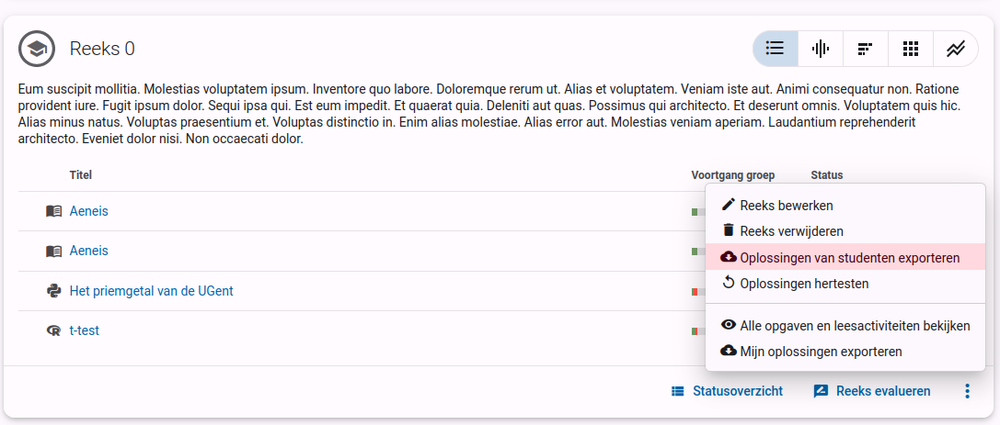
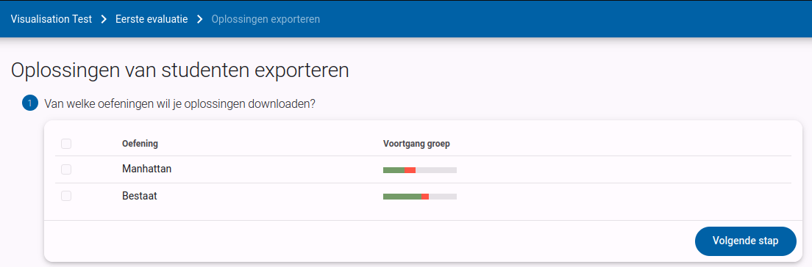
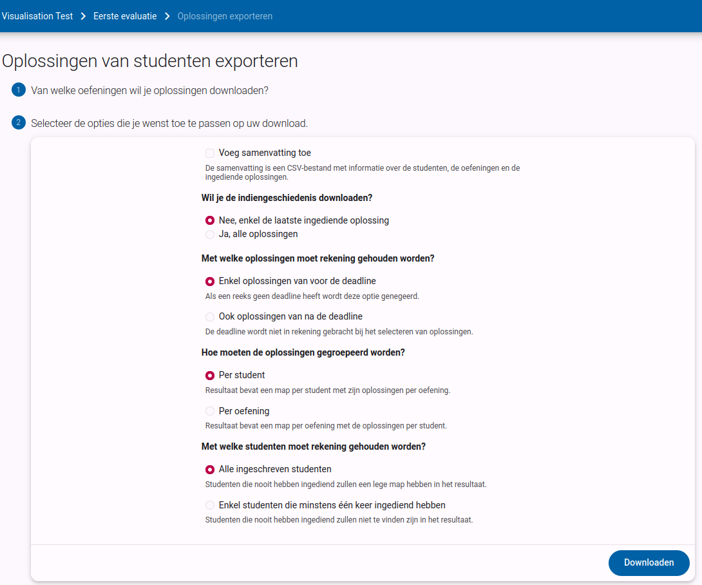
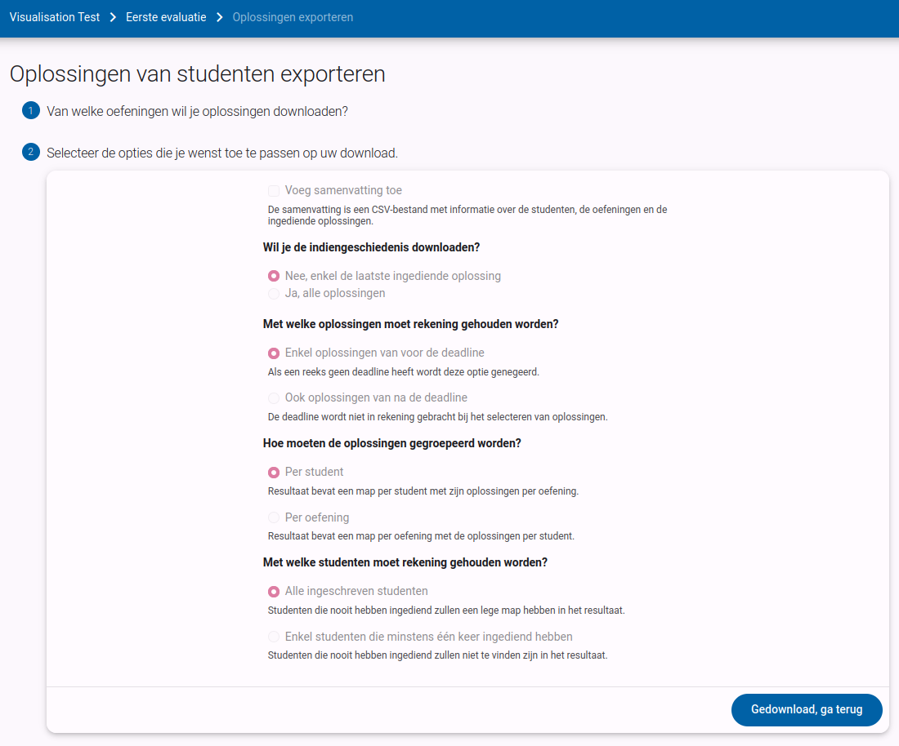
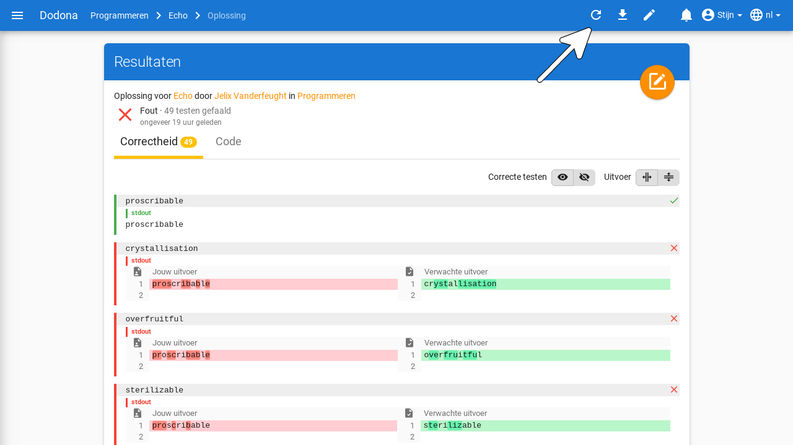

# Oplossingen exporteren en hertesten

Het [reeks-menu](../exercise-series-management/#het-reeks-menu) bevat twee acties die werken op alle oplossingen van een reeks: ze exporteren als zip-bestand en ze hertesten.
Op deze pagina overlopen we ze allebei.

## Oefeningenreeks oplossingen exporteren

In het actiemenu van een reeks kan je als lesgever kiezen om de ingezonden code van je studenten te exporteren als een zip-bestand. Dit is bijvoorbeeld handig als je liever op papier verbetert en de code wil afdrukken.

Dit brengt je naar een exporteerpagina waar je eerst gevraagd wordt om de oefeningen in de reeks te selecteren waarvan je de inzendingen wenst.

Als je ze allemaal wenst te downloaden, dan kies je het selectievakje in de hoofding van de tabel. Daarna klik je op `Volgende stap` om verder te gaan.

Vervolgens kan je verschillende opties aanvinken die de inhoud van de export beïnvloeden. Je kan een samenvattende csv verkrijgen, kiezen of je alle oplossingen of enkel de laatste wil, of er rekening gehouden moet worden met de deadline, of de bestanden per student of per oefening gegroepeerd moeten worden en welke studenten meegerekend moeten worden.

Klik op `Downloaden` om de download te starten. Op dat moment worden alle ingediende oplossingen gezipt, dit kan even duren. Daarna wordt de download automatisch gestart.

## Oplossing hertesten

De actie `Oplossingen hertesten` in het reeks-menu hertest alle oplossingen die cursusgebruikers ingediend hebben voor oefeningen van de oefeningenreeks. Dit kan nuttig zijn als je bijvoorbeeld een aantal testen hebt toegevoegd of aangepast en je de al ingediende oplossingen opnieuw wil testen.

Bij het hertesten van een oplossing worden alle testen opnieuw uitgevoerd zonder dat de oplossing opnieuw moet ingediend worden. Op die manier blijft het originele tijdstip van indienen behouden. Als de configuratie van de oefening aangepast werd sinds de vorige beoordeling van de oplossing, dan kan de status van de oplossing wijzigen door het herevalueren.

Je kan ook een enkele oplossing herevalueren: klik op de herhaalknop in de rechterbovenhoek van de feedbackpagina van een oplossing van een gebruiker.

::: tip Belangrijk

Bij het herevalueren krijgen oplossingen een lagere prioriteit in de wachtrij dan oplossingen die nieuw ingediend worden. Op die manier ondervindt het beoordelen van oplossingen die gebruikers indienen minimale vertraging, maar kan het herevalueren wel langer duren.

Gebruikers krijgen geen melding van het platform als hun oplossingen geherevalueerd worden. Als je beslist om oplossingen te herevalueren, is het belangrijk om gebruikers te informeren dat er zowel wijzigingen kunnen zijn van de status van oplossingen die ze vroeger ingediend hebben als van hun indienstatus voor oefeningen in de oefeningenreeksen van de cursus.
:::

## Statusoverzicht en evalueren

Wil je een overzicht van de indienstatus van je studenten in plaats van hun code, gebruik dan de actie `Statusoverzicht` die beschreven wordt bij [het reeks-menu](../exercise-series-management/#het-reeks-menu).

Correcte testresultaten zijn geen garantie voor goede code. Daarom biedt Dodona ook ondersteuning om de oplossingen manueel te evalueren en hen van feedback en punten te voorzien. Meer informatie hierover kan je vinden in de handleiding over [taken en toetsen verbeteren](/nl/guides/teachers/grading).
