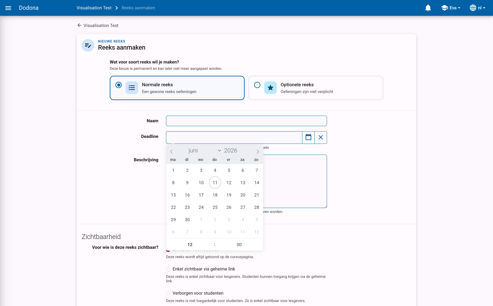
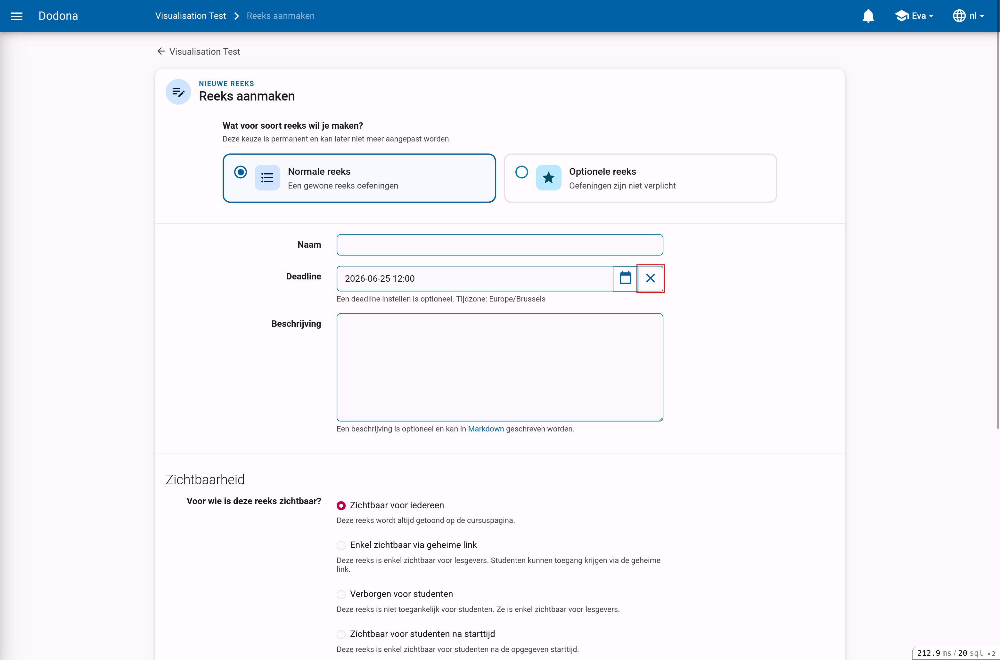
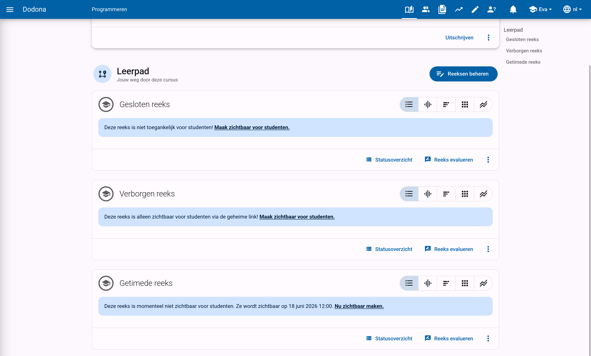
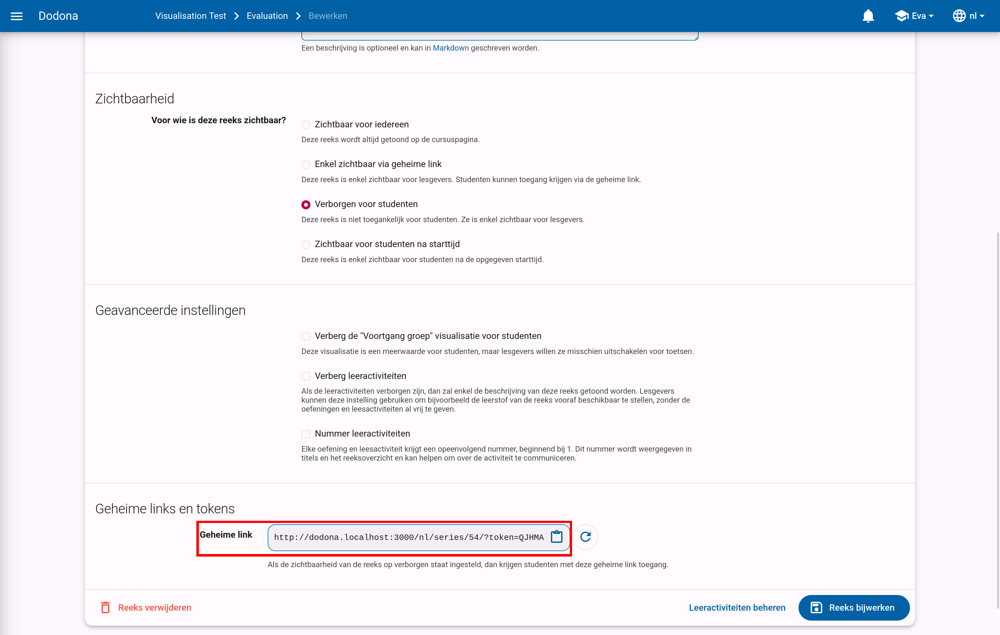
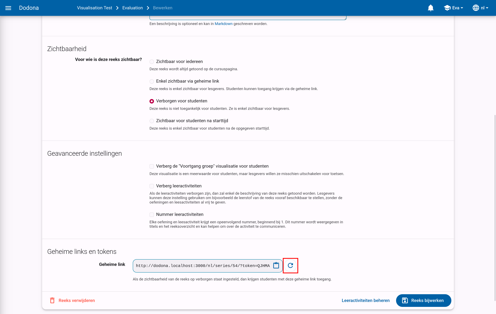

# Reeksinstellingen

Wanneer je een [oefeningenreeks aanmaakt of kopieert](../exercise-series-management/#oefeningenreeks-aanmaken), kom je op het reeksformulier terecht.
Je kan dit formulier later altijd opnieuw openen via `Bewerken` in het reeks-actiemenu of op de pagina `Reeksen beheren`.
Deze pagina beschrijft alle eigenschappen die je op dat formulier kan instellen.

## Naam

De naam van de oefeningenreeks.
Binnen een cursus kunnen verschillende oefeningenreeksen dezelfde naam hebben, maar het is aangeraden om alle oefeningenreeksen een unieke naam te geven.

## Deadline

Een optionele deadline die aangeeft tot wanneer er rekening gehouden wordt met oplossingen die ingediend worden voor oefeningen van deze oefeningenreeks.
Studenten kunnen na de deadline onbeperkt oplossingen blijven indienen voor oefeningen uit de oefeningenreeks, en ontvangen daar ook nog steeds een beoordeling en feedback voor.
Er wordt met deze oplossingen echter geen rekening meer gehouden bij het bepalen van hun indienstatus voor oefeningen uit de oefeningenreeks.
Dit kan niet ingesteld worden voor een optionele reeks.

::: tip Belangrijk

De indienstatus voor studenten wordt steeds dynamisch berekend op basis van de deadline. Als de deadline wordt aangepast, dan kan het dus zijn dat de indienstatus voor een bepaalde oefening wordt aangepast. Hou hier dus rekening mee als je de deadline instelt op een vroeger tijdstip.
:::

Klik op het invulveld of klik op de kalenderknop om de datum en het tijdstip van de deadline in te stellen. Selecteer de deadline in de tijdzone die je hebt ingesteld in je gebruikersprofiel. Andere gebruikers krijgen de deadline te zien in de tijdzone die ze in hun gebruikersprofiel hebben ingesteld.

Klik op de verwijderknop om een ingestelde deadline te wissen.

## Beschrijving

Een optionele beschrijving die gebruikers te zien krijgen bij de weergave van de oefeningenreeks in de cursus. Voor het opmaken van de beschrijving kan je gebruikmaken van [Markdown](/nl/references/exercise-description/#markdown).

## Zichtbaarheid

Dit bepaalt of gebruikers de oefeningenreeks kunnen zien. Voor deze eigenschap kunnen de volgende waarden ingesteld worden:

* `Zichtbaar voor iedereen`: alle gebruikers zien de oefeningenreeks op de cursuspagina.

* `Enkel zichtbaar via de geheime link`: alleen cursusbeheerders zien de oefeningenreeks op de cursuspagina. Er staat een duidelijke mededeling bij om hen er op te wijzen dat andere gebruikers de oefeningenreeks niet kunnen zien. Je kan gebruikers toegang geven tot deze reeks door hun de specifieke [geheime link](#geheime-link) van deze reeks door te sturen.

* `Verborgen voor studenten`: alleen cursusbeheerders zien de oefeningenreeks op de cursuspagina. Er staat een duidelijke mededeling bij om hen er op te wijzen dat andere gebruikers de oefeningenreeks daar niet kunnen zien.

* `Zichtbaar voor studenten na starttijd`: de reeks is niet zichtbaar voor studenten tot na de starttijd die je specifieert.
  Je kan de starttijd instellen op dezelfde manier als de deadline.

## Geheime link

Bij het aanmaken van een oefeningenreeks die enkel zichtbaar is via de geheime link wordt automatisch een geheime link gegenereerd om toegang te geven tot deze reeks. Zonder deze link kunnen gebruikers deze oefeningenreeks niet zien.

De geheime link voor een oefeningenreeks kan je onderaan de bewerk-pagina voor die reeks vinden.

Je kan eenvoudig een nieuwe geheime link genereren door op de vernieuwknop te klikken. Dit kan je bijvoorbeeld doen als je per ongeluk de link kenbaar hebt gemaakt aan iemand die ze niet zou mogen zien. Hou er wel rekening mee dat de oude link niet meer zal werken van zodra je een nieuwe genereert.

## Geavanceerde instellingen

* `Verberg de "Voortgang groep" visualisatie voor studenten`: Bij een oefening wordt de voortgang van alle gebruikers in de cursus getoond. Hierin kan je zien hoeveel studenten een oefening reeds hebben begonnen of afgewerkt. Deze visualisatie is een meerwaarde voor studenten, maar je wil ze misschien uitschakelen voor examens.

* `Verberg leeractiviteiten`: Als de leeractiviteiten verborgen zijn, dan zal enkel de beschrijving van deze reeks getoond worden. Je kan deze instelling gebruiken om bijvoorbeeld de leerstof van de reeks vooraf beschikbaar te stellen, zonder de oefeningen en leesactiviteiten al vrij te geven.

* `Nummer leeractiviteiten`: Als deze instelling actief is, krijgt elke oefening en leesactiviteit een nummer, beginnende bij 1.
  Dit nummer wordt getoond in titels en oplijstingen en kan het eenvoudiger maken om over deze activiteiten te communiceren.

## Toetsopties

Koos je bovenaan het formulier `Toetsreeks` als reekstype, dan verschijnt er een extra sectie `Toetsopties` met het toetswachtwoord en de instellingen `Beperk Dodona tot de inhoud van de toets` en `Toetssessies automatisch stoppen`.
Deze opties, en het afnemen van een toets of examen in het algemeen, worden beschreven in de handleiding over [toetsen en examens](../assessments/).
