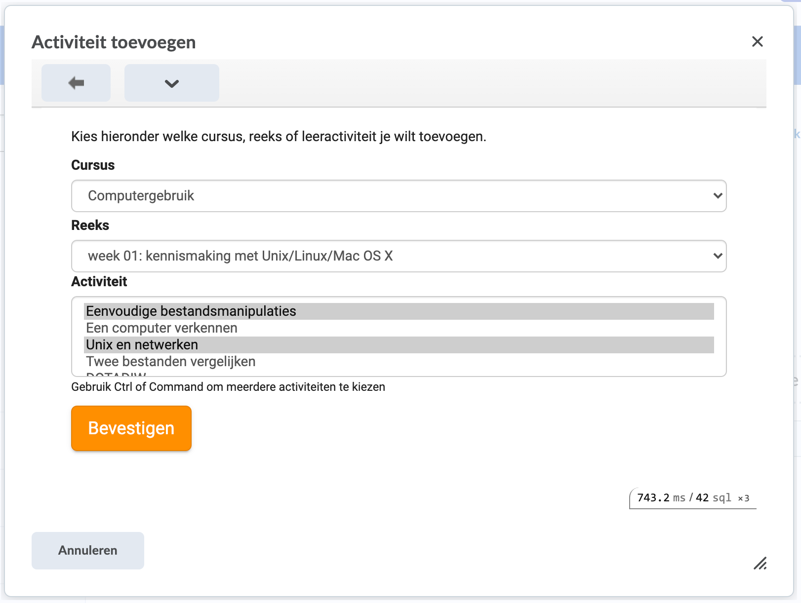
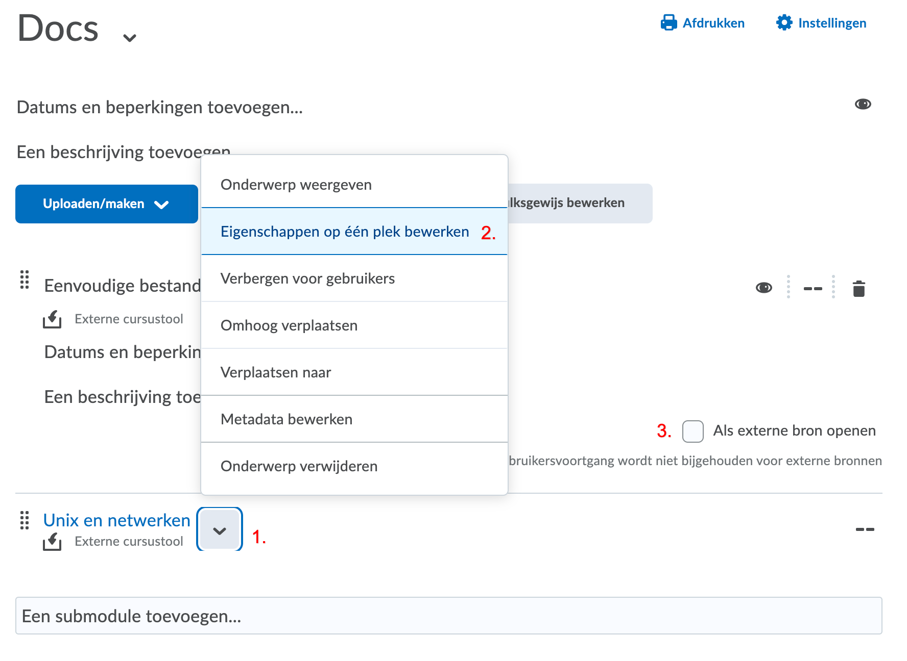

# Dodona en Ufora

::: warning UGent-only
Deze pagina gaat specifiek over het koppelen van Dodona met Ufora, de online leeromgeving van de Universiteit Gent.
:::

Sinds academiejaar 2020-2021 is het mogelijk om Dodona oefeningen en reeksen in te voegen in de inhoudstool van Ufora. Studenten die doorklikken worden automatisch ingelogd met hun UGent-account. In een latere fase voorzien we integratie met de scoremodule van Ufora zodat we het resultaat van de ingediende oplossingen kunnen terugsturen naar Ufora.

## 1. Open je cursus op Ufora

Surf naar [ufora.ugent.be](https://ufora.ugent.be) en navigeer naar je cursus. Open vervolgens de inhoudstool en kies de gewenste module in de navigatiebalk.

## 2. Open de oefeningenkiezer

Klik op het menu `Bestaande activiteiten` en vervolgens op `Dodona`. Er verschijnt nu een dialoogvenster om oefeningen te selecteren.

::: tip Geen Dodona?
De Dodona-module is niet in alle faculteiten standaard ingeschakeld. Zie je geen Dodona-optie in het menu? Contacteer ons dan via dodona@ugent.be met vermelding van je cursuscode.
:::

De eerste keer dat je Dodona gebruikt vanuit Ufora, moeten we je Ufora-profiel koppelen aan je UGent-account. Daarom zullen we eenmalig vragen om met je UGent-account in te loggen. Klik hiervoor op de grote oranje knop om een nieuw venster te openen en doorloop de loginprocedure. Sluit vervolgens het dialoogvenster en start stap 2 opnieuw.

## 3. Selecteer oefeningen

In het dialoogvenster verschijnt een overzicht van alle cursussen waar je toegang tot hebt. Nadat je een cursus kiest, verschijnen alle oefeningenreeksen voor dat vak. Als je vervolgens een reeks kiest, dan verschijnen alle oefeningen binnen die reeks.

Met behulp van de ctrl-knop (of command op een mac) op je toetsenbord kan je een of meer oefeningen selecteren. Klik vervolgens op de knop `Bevestigen` om die oefeningen aan Ufora toe te voegen. Als je geen oefeningen of geen reeks selecteert dan zal je respectievelijk een link naar de reeks of de cursus in Dodona aan Ufora toevoegen.

## 4. Selecteer 'Als externe bron openen' 

Na het klikken op de knop `Bevestigen` zou het dialoogvenster moeten verdwijnen en zou je de gekozen oefeningen moeten zien verschijnen op Ufora. **Pas op!** Je bent nog niet klaar. Standaard zal Ufora de Dodona-oefening openen in een klein venster. Je kan dit echter eenvoudig aanpassen:
 - Klik op het pijltje naast de naam van de oefening
 - Kies 'Eigenschappen op één plek bewerken'
 - Vink 'Als externe bron openen' aan
 - Herhaal dit voor alle toegevoegde oefeningen

 De oefening zal nu in een nieuw venster openen als studenten de link volgen.

::: warning Vergeet deze laatste stap niet!
Als je deze laatste stap vergeet, dan werkt Dodona mogelijk niet naar behoren. De studenten zullen ook op elke pagina een waarschuwing zien.
:::

