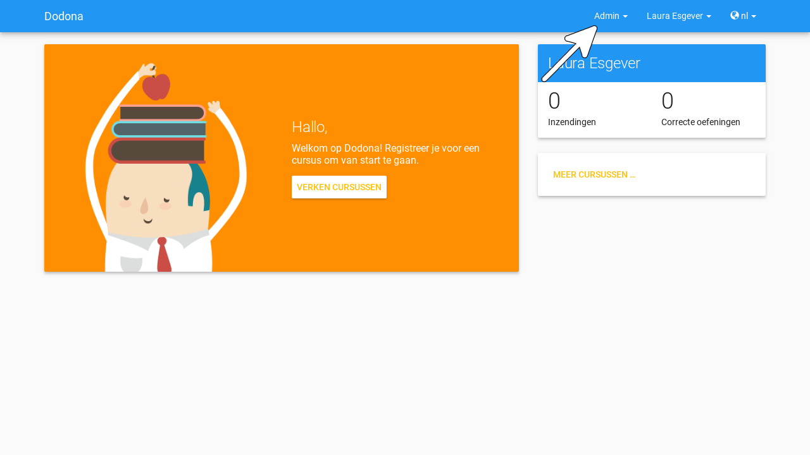
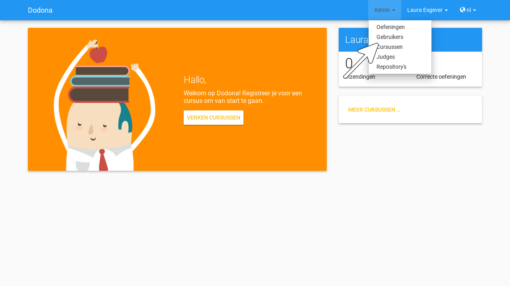
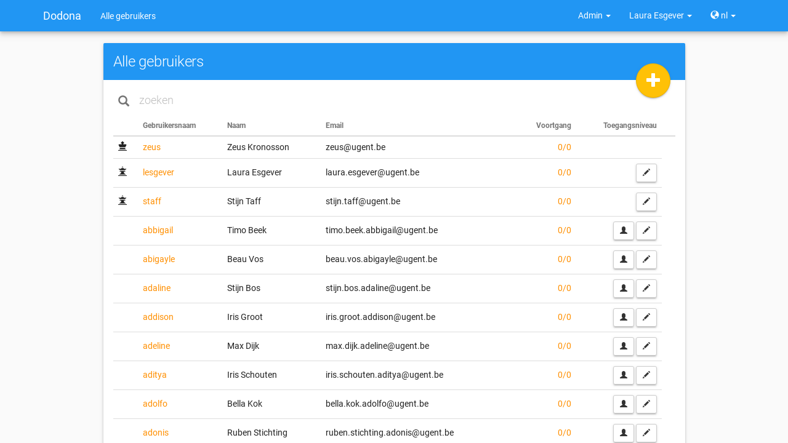
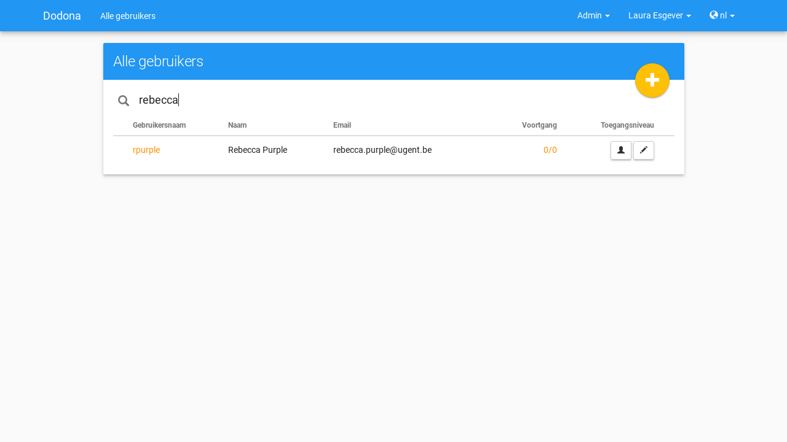
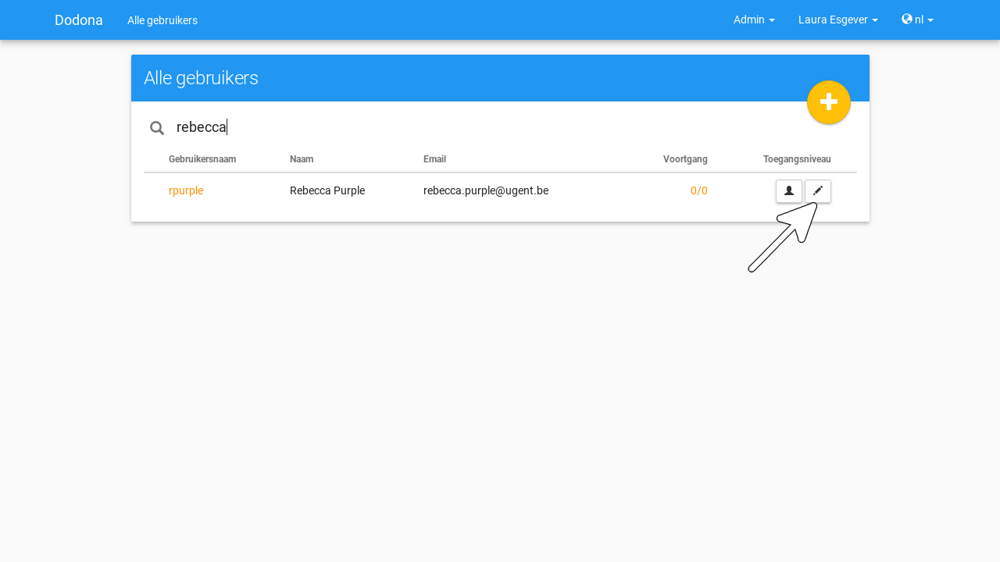
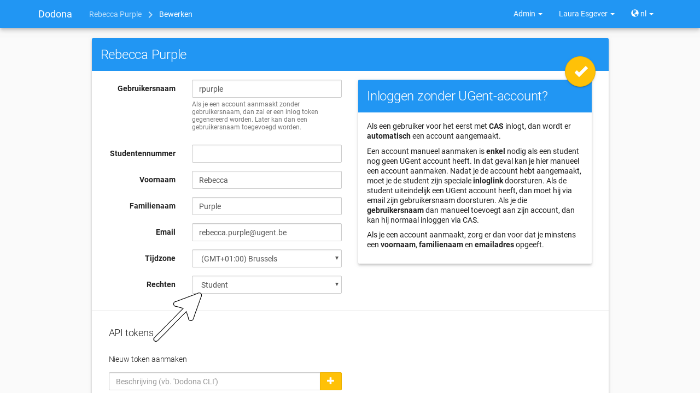
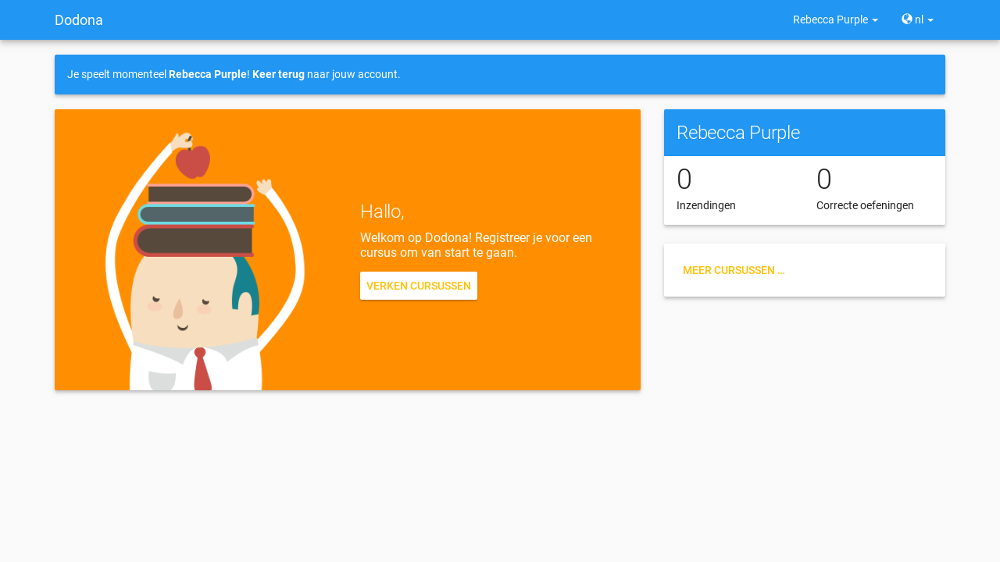
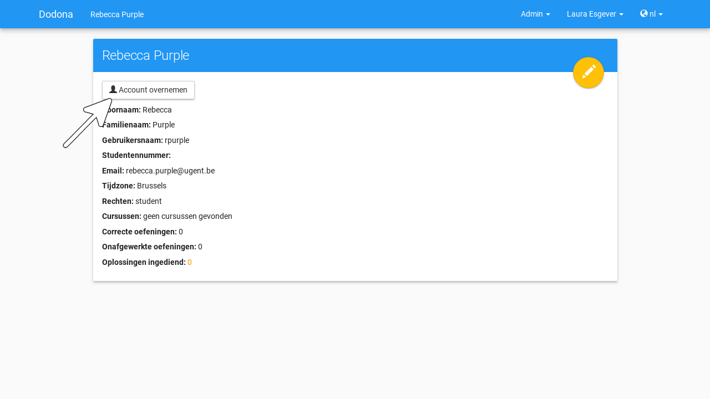
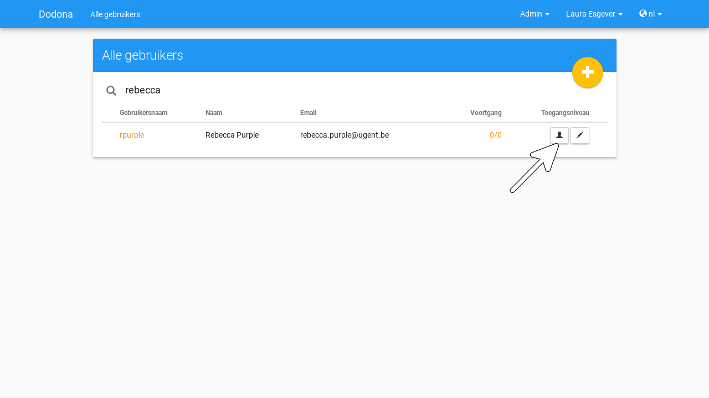
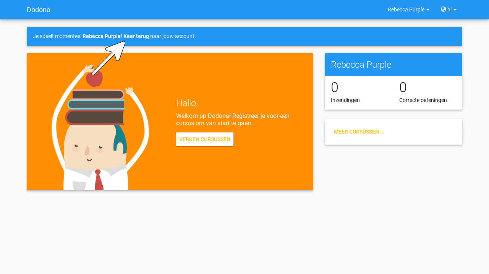

# Gebruikersbeheer

Alle **gebruikers** kunnen zich
[aanmelden](#aanmelden) en hun
[gebruikersprofiel](#profiel) beheren. Voor sommige acties heb je echter bijkomende
[beheersrechten](#beheersrechten) nodig.
Onder gebruikers onderscheiden we daarom
[studenten](#studenten),
[lesgevers](#lesgevers) en
[beheerders](#beheerders) afhankelijk van
de beheersrechten die aan hen
[toegewezen](#beheersrechten-instellen)
werden. Als lesgever kan je zelf ook andere lesgevers aanduiden.

::: tip

Je herkent dat je [lesgever](#lesgevers) bent als je het **beheersmenu** (menu Admin) ziet staan links van het
[gebruikersmenu](/nl/for-students#gebruikersmenu) aan de
rechterkant van de [navigatiebalk](/nl/for-students#navigatiebalk).

:::

::: tip Belangrijk

Onder de [geregistreerde](/nl/for-students#cursus-registreren) gebruikers van een [cursus](/nl/course-management#cursus) onderscheiden we studenten en
[cursusbeheerders](/nl/course-management#cursusbeheerder
afhankelijk van de [beheersrechten](#beheersrechten) die ze gekregen hebben voor de cursus. Enkel
cursusbeheerders kunnen een cursus beheren. Het
[beheren](/nl/course-management#cursusgebruikers-beheren) van
[cursusgebruikers](/nl/course-management/cursusgebruiker) en
het [aanduiden](/nl/course-management/cursusbeheerders-aanduiden) van cursusbeheerders wordt behandeld in
[cursus beheren](/nl/course-management).
:::

## Navigeren naar een gebruiker

Als [lesgever](#lesgevers) navigeer je naar
het [gebruikersoverzicht](#gebruikersoverzicht) door Gebruikerste
selecteren in het [beheersmenu](#beheersmenu) aan de rechterkant van de
[navigatiebalk](/nl/for-students#navigatiabalk).

## Gebruikersoverzicht
In het **gebruikersoverzicht** worden de gebruikersnaam, de naam, het
emailadres en
[voortgangsstatistieken](#voortgangsstatistieken) opgelijst uit het
[gebruikersprofiel](/nl/for-students#gebruikersprofiel)
van alle gebruikers. Voor de naam van elke [lesgever](#lesgevers) en [beheerder](#beheerders)
staat een
[icoontje](#gebruikers-beheersrechten-icoontje) dat correspondeert met de
[beheersrechten](#beheersrechten) die aan
de gebruiker [toegewezen](#beheersrechten-instellen) werden.

## Gebruiker zoeken
Gebruik de zoekbalk bovenaan het
[gebruikersoverzicht](#gebruikersoverzicht) om te zoeken naar specifieke gebruikers op basis van een
gebruikersnaam, een naam of een emailadres.

## Gebruiker selecteren
Druk op een gebruikersnaam om naar de
[profielpagina](/nl/for-students#profielpagina) van de
gebruiker te [navigeren](#gebruiker-navigeren).

## Gebruiker voortgangsstatistieken
De **voortgangsstatistieken** van een gebruiker bestaan uit twee
getallen $c/i$. Daarbij staat $i$ voor het aantal
[oefeningen](/nl/for-students#oefening) waarvoor de
gebruiker minstens één [oplossing](/nl/for-students#oplossing) heeft [ingediend](/nl/for-students#oplossing-indienen) en $c$ voor het aantal oefeningen waarvoor de gebruiker
minstens één *correcte* oplossing heeft ingediend.

## Gebruikersprofiel bewerken

Als [lesgever](#lesgevers) kan je het
[gebruikersprofiel](/nl/for-students#gebruikersprofiel)
van [studenten](#studenten) en andere
lesgevers bewerken. Druk daarvoor op de bewerkknop in de
rechterbovenhoek van de
[profielpagina](/nl/for-students#profielpagina) van de
gebruiker.

Als alternatief kan je in het
[gebruikersoverzicht](#gebruikersoverzicht) ook drukken op de bewerkknop aan de rechterkant van een
gebruiker om onmiddellijk het
[gebruikersprofiel](/nl/for-students#gebruikersprofiel)
van de gebruiker te bewerken.

## Instellen van beheersrechten

Om sommige acties te kunnen uitvoeren op Dodona heb je bijkomende
**beheersrechten** nodig. Als [lesgever](#lesgevers) kan je aan de eigenschap Rechten op de [profielpagina](/nl/for-students#profielpagina) van een gebruiker zien welke beheersrechten de gebruiker
heeft.

## Gebruiker beheersrechten icoontje
Aan gebruikers kunnen de volgende
[beheersrechten](#beheersrechten)
toegekend worden:

 | naam                                          | icoontje                                |permissies|
 | ----------------------------------------------|-----------------------------------------|----------|
 | Student|   *geen*|                                  [studenten](#studenten) kunnen hun [gebruikersprofiel](/nl/for-students#gebruikersprofiel) [bewerken](/nl/for-students#gebruikersprofiel-bewerken), kunnen zich [registreren](/nl/for-students#cursus-registreren) voor [cursussen](/nl/course-management#cursus) en kunnen [oplossingen](/nl/for-students#oplossing) [indienen](/nl/for-students#oplossing-indienen) voor [oefeningen](/nl/for-students#oefening)|
 |Staff|     |   [lesgevers](#lesgevers) krijgen alle permissies van [studenten](#studenten) en kunnen bovendien ook lesgevers aanduiden, het [gebruikersprofiel](/nl/for-students#gebruikersprofiel) van studenten en lesgevers [bewerken](/nl/for-students#gebruikersprofiel-bewerken), [cursussen](/nl/course-management#cursus) [aanmaken](/nl/course-management#cursus-aanmaken), [oefeningen](/nl/for-students#oefening) [toevoegen](/nl/course-management#oefening-toevoegen) en [judges](/nl/for-students#judge) [toevoegen](/nl/creating-a-judge)|
 |Zeus|      |    [beheerders](#beheerders) krijgen alle permissies van [lesgevers](#lesgevers) en cursusbeheerders en kunnen bovendien ook alle [beheersrechten](#beheersrechten) (inclusief cursusbeheerders) toewijzen, het [gebruikersprofiel](/nl/for-students#gebruikersprofiel) van alle gebruikers [bewerken](/nl/for-students#gebruikersprofiel-bewerken), alle [cursussen](/nl/course-management#cursus) [bewerken](/nl/course-management#cursus-bewerken), alle [oefeningen](/nl/for-students#oefening) [bewerken](/nl/course-management#oefening-bewerken) en alle [judges](/nl/for-students#judge) [bewerken](/nl/judges#judge-bewerken)

### Studenten
Een gebruiker waarvoor de
[beheersrechten](#beheersrechten)
ingesteld zijn op Student noemen we
een **student**. 
### Lesgevers
Een gebruiker waarvoor de [beheersrechten](#beheersrechten) ingesteld zijn
op Staff noemen we een
**lesgever**.
### Beheerders
Een gebruiker waarvoor de [beheersrechten](#beheersrechten) ingesteld zijn
op Zeus noemen we een
**beheerder**.

## Beheersrechten instellen
Als je het [gebruikersprofiel](/nl/for-students#gebruikersprofiel) van een gebruiker
[bewerkt](/nl/for-students#gebruikersprofiel-bewerken) dan
kan je daar de [beheersrechten](#beheersrechten) van de gebruiker instellen. Als
[lesgever](#lesgevers) kan je enkel de
beheersrechten Student en
Staff toekennen aan gebruikers
(inclusief jezelf). Op die manier kan je een gebruiker promoveren tot
lesgever of degraderen tot [student](#studenten).
:::

::: tip Belangrijk

Als je jezelf als [lesgever](#lesgevers)
degradeert tot [student](#studenten), dan
kan je jezelf daarna niet terug promoveren tot lesgever.
:::

## Gebruikersaccount overnemen

Als [lesgever](#lesgevers) kan je tijdelijk
de [gebruikersaccount](/nl/for-students#gebruikersaccount)
van een [student](#studenten) overnemen.
Daardoor krijg je de gepersonaliseerde versie van Dodona te zien door de
ogen van de student. Dit kan interessant zijn voor het beantwoorden van
vragen over iets wat een student waarneemt in Dodona of over een actie
die ze in Dodona wil uitvoeren. Bovendien laat het je ook toe om zelf
acties uit te voeren in naam van de student, zoals het
[registreren](/nl/for-students#cursus-registreren) voor
een [cursus](/nl/course-management#cursus) of het
[indienen](/nl/for-students#oplossing-indienen) van een
[oplossing](/nl/for-students#oplossing) voor een
[oefening](/nl/for-students#oefening).

::: tip Belangrijk

Als je [registreert](/nl/for-students#cursus-registreren)
voor een [cursus](/nl/course-management#cursus) of een
[oplossing](/nl/for-students#oplossing)
[indient](/nl/for-students#oplossing-indienen) voor een
[oefening](/nl/for-students#oefening) terwijl je de
[gebruikersaccount](/nl/for-students#gebruikersaccount)
van een [student](#studenten) aan het
[overnemen](#gebruikersaccount-overnemen)
bent, dan hebben deze acties hetzelfde effect alsof ze door de student
zelf zouden uitgevoerd worden. Wees je er dus van bewust of je deze
acties in naam van de student wilt uitvoeren of dat je eerst wilt
[terugkeren](#eigen-gebruikersaccount-herstellen) naar je eigen gebruikersaccount om daarna de acties onder
eigen naam uit te voeren.
:::

Druk op de knop Account overnemen
op de [profielpagina](/nl/for-students#profielpagina) van
een student om zijn/haar
[gebruikersaccount](/nl/for-students#gebruikersaccount)
tijdelijk
[over](#gebruikersaccount-overnemen).

Als alternatief kan je de
[gebruikersaccount](/nl/for-students#gebruikersaccount)
van een student ook tijdelijk overnemen door in het
[gebruikersoverzicht](#gebruikersoverzicht) aan de rechterkant van een student te drukken op de
actieknop voor het
[overnemen](#gebruikersaccount-overnemen)
van gebruikersaccounts.

### Eigen gebruikersaccount herstellen
Terwijl je de [gebruikersaccount](/nl/for-students#gebruikersaccount) van een [student](#studenten)
aan het [overnemen](#gebruikersaccount-overnemen) bent, wordt bovenaan elke pagina een mededeling getoond om
je daaraan te herinneren. De mededeling bevat een link waarmee je kunt
terugkeren naar je eigen gebruikersaccount.
:::

