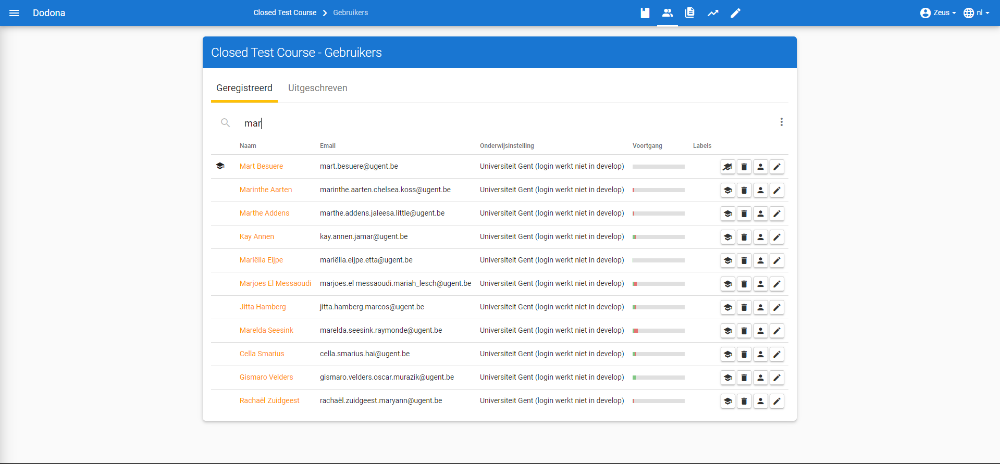
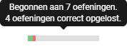

# Gebruikersbeheer
> Op deze pagina vind je alle informatie over gebruikersbeheer op Dodona.

**Inhoudsopgave**
[[toc]]

Als cursusbeheerder krijg je toegang tot de lijst van alle geregistreerde gebruikers in je cursus. Dit overzicht bereik je door te klikken op het gebruikersicoontje in de navigatiebalk bovenaan de cursuspagina. Hierin zie je alle gebruikers die ooit voor de cursus geregistreerd geweest zijn of die ooit een registratieverzoek voor de cursus ingediend hebben. Je kunt hun cursusoverzichtspagina bekijken, hun oplossingen bekijken, hun registratiestatus aanpassen en hun beheersrechten wijzigen. De beheersrechten geven aan wat een gebruiker mag doen binnenin een cursus. Voor meer informatie hierover, zie de handleiding over [cursusbeheer](../course-management).

## Gebruikersoverzicht

Als lesgever navigeer je naar het gebruikersoverzicht van je cursus door naar je cursus te navigeren en vervolgens op `Geregistreerde gebruikers` te klikken in de cursusbeschrijving. Je kan ook op het gebruikersicoontje klikken in de navigatiebalk.

In het gebruikersoverzicht worden de gebruikersnaam, de naam, het emailadres en [voortgangsstatus](#voortgangsstatus) opgelijst uit het gebruikersprofiel van alle gebruikers van jouw cursus. Voor de naam van elke lesgever en beheerder staat een icoontje dat correspondeert met de beheersrechten die aan de gebruiker toegewezen werden.

### Gebruiker zoeken

Gebruik de zoekbalk bovenaan het gebruikersoverzicht om te zoeken naar specifieke gebruikers op basis van een gebruikersnaam, een naam, een emailadres of gebruikerslabel. Verschillende filters kunnen tegelijkertijd actief zijn.

### Voortgangsstatus
De Voortgangsstatus van een gebruiker wordt weergegeven door een vooruitgangsbalkje. Het groen-ingekleurde deel stelt het aandeel oefeningen in de cursus voor waarvoor de gebruiker een **correcte** oplossing voor heeft ingediend. Het rode gedeelte stelt het aandeel oefeningen voor waar de gebruiker reeds oplossingen voor heeft ingediend, maar nog **niet correct** heeft opgelost. Het grijze gedeelte stelt de oefeningen voor waar de gebruiker nog **niet aan begonnen** is.

### Cursusbeheerders aanduiden

Elke cursus heeft minstens 1 cursusbeheerder. Als cursusbeheerder kan je zelf andere ingeschreven gebruikers promoveren tot cursusbeheerder. Dit kan je doen door naast die gebruiker op het icoontje met een baret te klikken:

Je kan de cursusbeheerders herkennen aan het icoontje in de linkermarge.

::: tip Belangrijk

Een cursusbeheerder die zich uitschrijft uit een cursus verliest zijn status van cursusbeheerder. Je kan ook steeds jezelf degraderen tot student.

Om ervoor te zorgen dat een cursus altijd minstens één cursusbeheerder heeft, kan de laatste cursusbeheerder zich niet uitschrijven en kan hij zichzelf ook niet degraderen tot student.

Na het aanmaken van een cursus kan een lesgever zich uitschrijven als hij minstens 1 andere cursusbeheerder heeft aangeduid. Hij kan door andere cursusbeheerders ook gedegradeerd worden tot cursusgebruiker zonder beheersrechten voor de cursus.
:::

### Registratieverzoeken afhandelen

Afhankelijk van de ingestelde [registratieprocedure](../creating-a-course/#cursuseigenschappen) van een cursus zal je bij de gebruikerslijst meerdere tabbladen zien. Elke tab biedt andere acties aan om de registratiestatus van de bijhorende gebruiker aan te passen.

* `Geregistreerd`: alle cursusgebruikers die momenteel geregistreerd zijn.
  Door te klikken op  schrijf je de gebruiker uit de cursus.

* `Op de wachtlijst`: alle cursusgebruikers waarvoor er nog een registratieverzoek openstaat dat wacht op afhandeling door een cursusbeheerder.
  Door te klikken op  keur je het registratieverzoek goed. Afkeuren doe je door te klikken op . Deze tab is enkel zichtbaar als de cursus werkt met gemodereerde inschrijving.

* `Uitgeschreven`: alle cursusgebruikers die ooit geregistreerd waren, maar die ondertussen uitgeschreven zijn.
  Deze gebruiker kan je terug inschrijven voor de cursus door te klikken op 

## Studenten opvolgen
Om de voortgang van een individuele student op te volgen is er een overzichtpagina per student voorzien. Je kan deze pagina raadplegen door in het gebruikersoverzicht van een cursus op de naam van een student te klikken. Op deze pagina krijg je een overzicht van de vooruitgang van een gebruiker binnenin de cursus. Naast enkele statistieken kan je ook de status voor elke oefening en reeks binnen de cursus voor deze student raadplegen.

