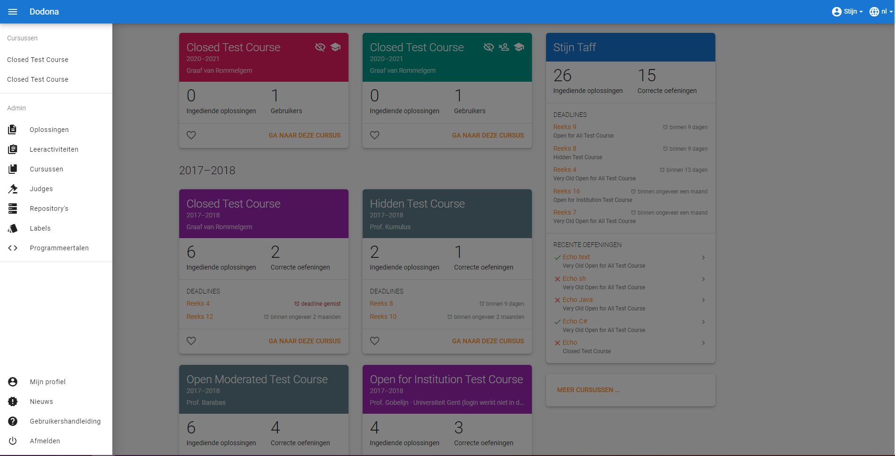
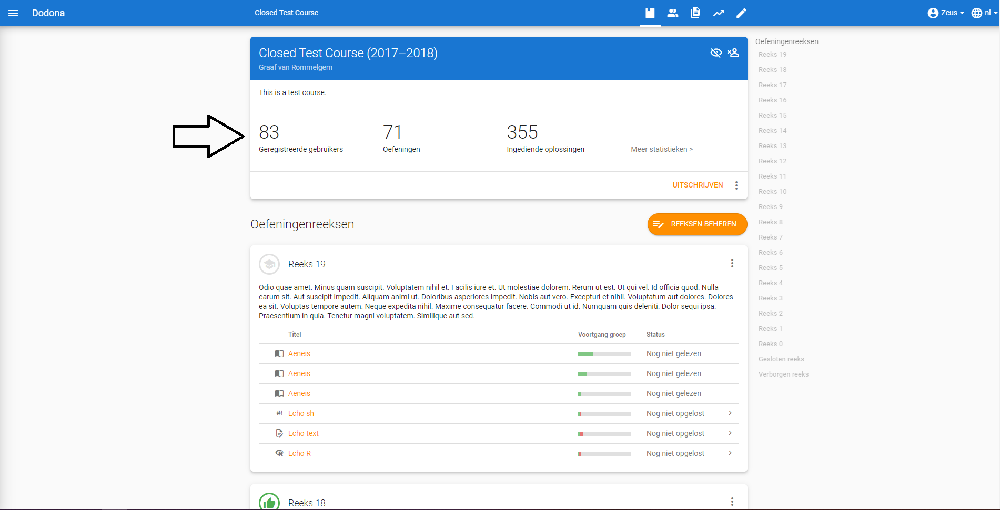
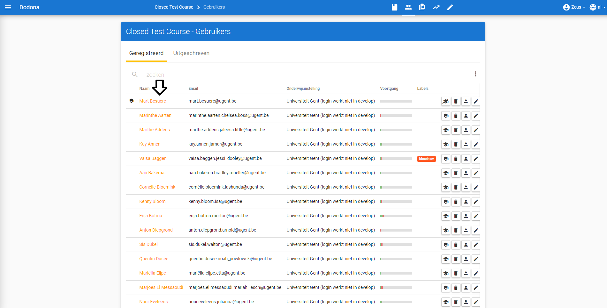
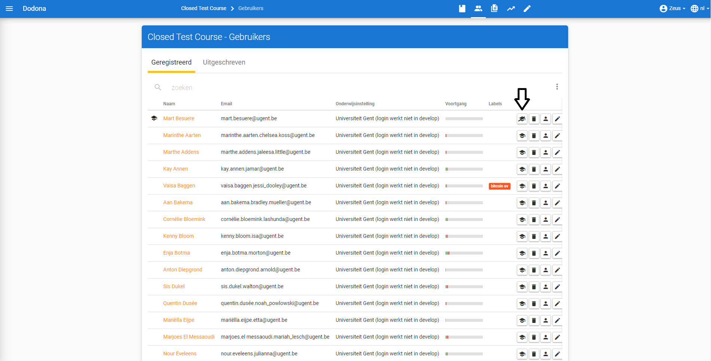

# Gebruikersbeheer

Alle **gebruikers** kunnen zich
[aanmelden](/nl/for-students#aanmelden) en hun
[gebruikersprofiel](/nl/for-students#gebgruikersprofiel) beheren. Voor sommige acties heb je echter bijkomende
[beheersrechten](#beheersrechten) nodig.
Onder gebruikers binnenin een cursus onderscheiden we daarom [studenten](#student),
[lesgevers](#lesgever) afhankelijk van
de beheersrechten die aan hen [toegewezen](#beheersrechten)
werden. Een uitzondering is de cursusbeheerder, deze heeft lesgeverrechten binnen de cursus waarin hij aangewezen is. Lesgevers en reeds benoemde cursusbeheerders kunnen deze rechten toekennen.

::: tip

Je herkent dat je [lesgever](#lesgever) bent als je het **beheersmenu** (menu Admin) ziet wanneer je de aan de
linkerkant van de pagina het hamburgermenu openklikt.

:::

::: tip Belangrijk
 Het [beheren](/nl/course-management#cursusgebruikers-beheren) van
[cursusgebruikers](/nl/course-management#cursusgebruiker) en
het [aanduiden](/nl/course-management#cursusbeheerders-aanduiden) van cursusbeheerders wordt behandeld in
[cursus beheren](/nl/course-management).
:::

## Navigeren naar een gebruiker

Als [lesgever](#lesgever) navigeer je naar
het [gebruikersoverzicht](#gebruikersoverzicht) van je cursus door naar je cursus te navigeren en vervolgens op Geregistreerde gebruikers te klikken in de cursusbeschrijving. Je kan ook op het gebruikersicoontje klikken in de navigatiebalk.

## Gebruikersoverzicht
In het **gebruikersoverzicht** worden de gebruikersnaam, de naam, het
emailadres en [voortgangsstatistieken](#voortgangsstatistieken) opgelijst uit het
[gebruikersprofiel](/nl/for-students#gebruikersprofiel)
van alle gebruikers van jouw cursus. Voor de naam van elke [lesgever](#lesgever) en [beheerder](#beheerder)
staat een
[icoontje](#gebruikers-beheersrechten-icoontje) dat correspondeert met de
[beheersrechten](#beheersrechten) die aan
de gebruiker [toegewezen](#beheersrechten-instellen) werden.

## Gebruiker zoeken
Gebruik de zoekbalk bovenaan het
[gebruikersoverzicht](#gebruikersoverzicht) om te zoeken naar specifieke gebruikers op basis van een
gebruikersnaam, een naam, een emailadres of gebruikerslabel. Verschillende filters kunnen tegelijkertijd actief zijn.

## Gebruiker selecteren
Druk op de naam om naar de
[cursusoverzichtspagina](#cursusoverzichtspagina) van de
gebruiker te [navigeren](#gebruiker-navigeren).

## Gebruiker voortgangsstatistieken
De **voortgangsstatistieken** van een gebruiker worden weergegeven middels een vooruitgangsbalkje. Het groen-ingekleurde deel stelt het aandeel [oefeningen](/nl/for-students#oefening) in de cursus waarvoor de gebruiker een *correcte* [oplossing](/nl/for-students#oplossing) voor heeft [ingediend](/nl/for-students#oplossing-indienen). Het rode gedeelte stelt het aandeel oefeningen voor waar de gebruiker reeds oplossingen voor heeft ingediend, maar nog niet correct heeft opgelost. Het grijze gedeelte stelt de oefeningen voor waar de gebruiker nog niet aan begonnen is.

## Cursusoverzichtspagina

Op deze pagina krijg je een overzicht van de vooruitgang van een gebruiker binnenin de [cursus](/nl/course-management#cursus). Je krijgt de [voortgangsstatistieken](#gebruiker-voortgangsstatistieken) te zien, alsook grafieken over de activiteiten van deze gebruiker en een overzicht per reeks van de status van elke [oefening](/nl/for-students#oefening).

Om sommige acties te kunnen uitvoeren op Dodona heb je bijkomende
**beheersrechten** nodig. Als [lesgever](#lesgever) kan je zien in het [gebruikersoverzicht](#gebruikersoverzicht) door te kijken naar onderstaande [icoontjes](#icoontjes-voor-beheersrechten). Je kan dan ook de acties aan de rechterkant gebruiken om de [beheersrechten](#beheersrechten) van een gebruiker in te stellen.
Als [lesgever](#lesgever) kan je enkel de
beheersrechten Student en
Cursusbeheerder toekennen aan gebruikers
(inclusief jezelf). Op die manier kan je een gebruiker promoveren tot
cursusbegeleider of degraderen tot [student](#student).

::: tip Belangrijk

Als je jezelf als [lesgever](#lesgever)
degradeert tot [student](#student), dan
kan je jezelf daarna niet terug promoveren tot lesgever.
:::

## Icoontjes voor beheersrechten
Aan gebruikers kunnen de volgende
[beheersrechten](#beheersrechten)
toegekend worden:

 | naam                                          | icoontje                                |permissies|
 | ----------------------------------------------|-----------------------------------------|----------|
 | Student|   *geen*|                                  [studenten](#student) kunnen hun [gebruikersprofiel](/nl/for-students#gebruikersprofiel) [bewerken](/nl/for-students#gebruikersprofiel-bewerken), kunnen zich [registreren](/nl/for-students#cursus-registreren) voor [cursussen](/nl/course-management#cursus) en kunnen [oplossingen](/nl/for-students#oplossing) [indienen](/nl/for-students#oplossing-indienen) voor [oefeningen](/nl/for-students#oefening)|
 |Staff|     |   [lesgevers](#lesgever) krijgen alle permissies van [studenten](#student) en kunnen bovendien ook lesgevers aanduiden, [cursussen](/nl/course-management#cursus) [aanmaken](/nl/course-management#cursus-aanmaken), [oefeningen](/nl/for-students#oefening) [toevoegen](/nl/course-management#oefening-toevoegen) en [judges](/nl/for-students#judge) [toevoegen](/nl/creating-a-judge)|
 |Cursusbeheerder| |[cursusbeheerders](#cursusbeheerders) hebben dezelfde rechten als lesgevers, maar enkel binnen de cursus waarin ze beheerder zijn. Ze kunnen dus geen cursus of judges toevoegen, maar wel oefeningen en studenten bewerken binnen een cursus| 

### Student
Een gebruiker waarvoor de
[beheersrechten](#beheersrechten)
ingesteld zijn op Student noemen we
een **student**. 
### Lesgever
Een gebruiker waarvoor de [beheersrechten](#beheersrechten) ingesteld zijn
op Staff noemen we een
**lesgever**.
### Cursusbeheerder
Een gebruiker met de lesgeverrol binnenin een cursus noemen we een cursusbeheerder.
