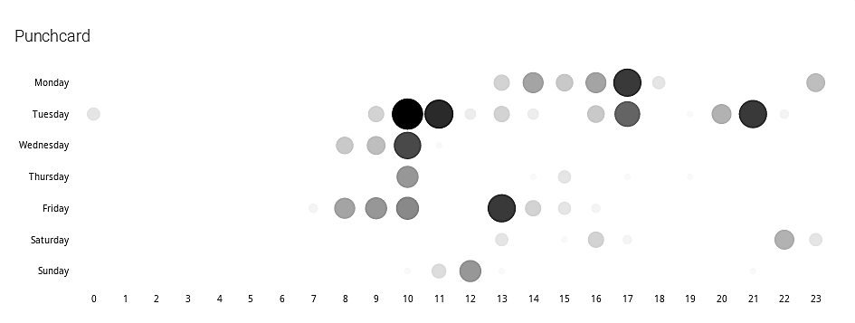

<NewsHeader :title="$frontmatter.title" :date="$frontmatter.date" lang="nl" />

> Release 2.7 bevat een punchcard met een visuele weergave van wanneer gebruikers oplossingen hebben ingediend en biedt functionaliteit om labels toe te kennen aan cursusgebruikers.

## Punchcard

Op de profielpagina van een gebruiker en op de pagina van een gebruiker binnen een cursus staat een punchcard die visualiseert wanneer de gebruiker oefeningen heeft ingediend op Dodona. Op de profielpagina van een gebruiker worden alle oplossingen die de gebruiker heeft ingediend in rekening gebracht. Op de pagina van een gebruiker binnen een cursus worden enkel de oplossingen in rekening gebracht die de gebruiker heeft ingediend binnen de cursus. Gebruikers kunnen hun eigen profielpagina bekijken en cursusbeheerders kunnen de pagina's van alle cursusgebruikers bekijken.

## Labels voor cursusgebruikers

Cursusbeheerders kunnen vanaf nu labels toekennen aan de gebruikers van hun cursussen. Op die manier kunnen ze groepen van studenten aanmaken binnen eenzelfde cursus. Labels die aan cursusgebruikers toegekend worden zijn enkel zichtbaar binnen één enkele cursus. Beheerders van een cursus kunnen nooit de labels zien die binnen een andere cursus aan gebruikers toegekend werden.  

Er zijn twee manieren om labels toe te kennen aan cursusgebruikers. Op de pagina van een cursusgebruiker staat een knop om de labels van de gebruiker te wijzigen. Op de pagina die alle gebruikers van een cursus weergeeft, vind je in het actiemenu de optie "Alle labels bewerken" waarmee de labels voor alle cursusgebruikers in één keer kunnen ingesteld worden.  

Labels die toegekend werden aan cursusgebruikers kunnen gebruikt worden bij het zoeken naar ingediende oplossingen binnen een cursus en bij het zoeken naar gebruikers binnen een cursus.  

## Nieuwe onderwijs- en onderzoeksinstellingen

Bij deze release verwelkomen we twee nieuwe middelbare scholen die Dodona gebruiken: [Sint-Jozefscollege](http://sjcaalst.be/) (Aalst, België) en [Atheneum De Ring](https://deringleuven.be/) (Leuven, België).  

## Volledige lijst van veranderingen

Voor een volledige lijst van veranderingen verwijzen we naar [onze GitHub release](https://github.com/dodona-edu/dodona/releases/tag/2.7), maar hieronder lijsten we ook kort de belangrijkste dingen op.

*   metatags toevoegen om inhoud van Dodona in te sluiten in andere websites
*   aanmeldknop voor Sint-Jozefscollege (Aalst, België) toevoegen aan aanmeldpagina
*   Twitter link toevoegen aan footer
*   labels toevoegen aan cursusgebruikers
*   bug oplossen waardoor ingediende oplossing soms niet bijgewerkt werd na evaluatie
*   aanmeldknop voor Atheneum De Ring (Leuven, België) toevoegen aan aanmeldpagina
*   toegang tot delayed job web beperken tot beheerders
*   gebruik van basic auth stopzetten
*   knoppen toevoegen om correcte testen te verbergen
*   punchcard toevoegen aan de gebruikerspagina en gebruikerspagina binnen cursus
*   altijd minstens één e-mail uitsturen wanneer het verwerken van oefeningen misliep
*   beide contenttypes van GitHub webhooks ondersteunen
*   paginatieparameter opkuisen
*   overzichtspagina met ingediende oplossingen optimaliseren voor smalle schermen
*   compilatie van typescript toevoegen aan webpacker
