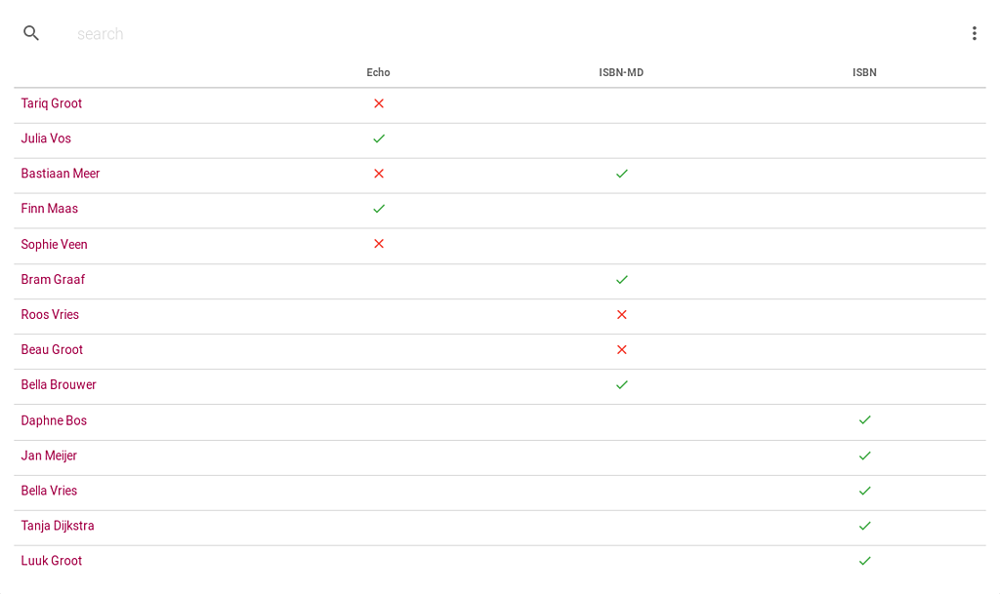
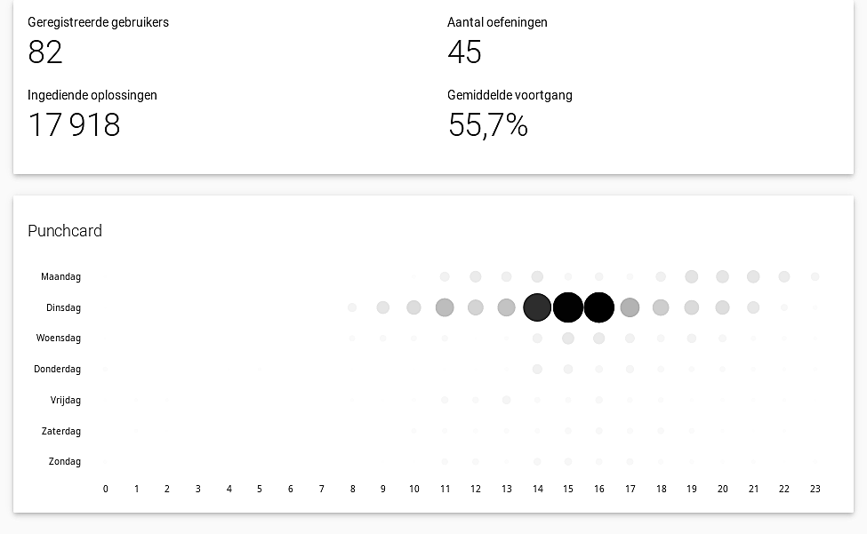

<NewsHeader :title="$frontmatter.title" :date="$frontmatter.date" lang="nl" />

> Release 2.8 gebruikt het bestandssysteem in plaats van de databank voor het opslaan van ingediende oplossingen en gegenereerde feedback, laat toe om gebruikers te filteren in het statusoverzicht van een oefeningenreeks en toont statistieken op het niveau van een cursus.

## Gegevens over oplossingen opslaan op het bestandssysteem

Gegevens over een ingediende oplossing worden nu opgeslaan op het bestandssysteem in plaats van in de databank. Deze technische ingreep heeft geen impact op de manier waarop Dodona moet gebruikt worden, maar biedt wel mogelijkheden om in de toekomst alternatieve scenario's te gaan ondersteunen voor het indienen van oplossingen. We denken er bijvoorbeeld aan om het mogelijk te maken om in de teksteditor met meerdere tabs te werken (bijvoorbeeld voor HTML, CSS en JavaScript voor opgaven rond web design), toe te laten om bestanden op te laden (bijvoorbeeld .jar bestanden voor Java) of specfieke editors in te bouwen (bijvoorbeeld voor Scratch).

## Filteren van gebruikers in statusoverzicht

Het statusoverzicht van een oefeningenreeks bevat standaard alle gebruikers van een cursus. Vanaf nu is het mogelijk om de gebruikerslijst te filteren op naam of op label. Er werd ook een optie toegevoegd aan het menu van de scoresheet om enkel die gebruikers te tonen die minstens één oplossing hebben ingediend voor een oefening uit de reeks.  

## Weergeven van statistieken over een cursus

Cursusbeheerders kunnen statistieken over een cursus bekijken door in de navigatiebalk op de statistiekenknop te klikken. Deze pagina toont enkele basisstatistieken en een nieuwe punchcard die het tijdstip van indienen groepeert per uur van de dag en per weekdag. We plannen om het aantal aangeboden statistieken in de toekomst verder uit te breiden.

## Volledige lijst van veranderingen

Voor een volledige lijst van veranderingen verwijzen we naar [onze GitHub release](https://github.com/dodona-edu/dodona/releases/tag/2.8), maar hieronder lijsten we ook kort de belangrijkste dingen op.

*   maximum geheugenlimiet afdwingen bij evaluatie van ingediende oplossingen
*   gegevens over oplossingen opslaan op het bestandssysteem
*   punchard toevoegen met tijdstip van indienen binnen een cursus
*   alle cursussen die een oefening gebruiken oplijsten op de oefeningpagina
*   cursusbeheerders toelaten om alle oplossing voor een oefeningenreeks te downloaden
*   cachegedrag verbeteren
*   onderwijsinstelling toevoegen aan gebruikersprofiel
*   gebruikers filteren in statusoverzicht
