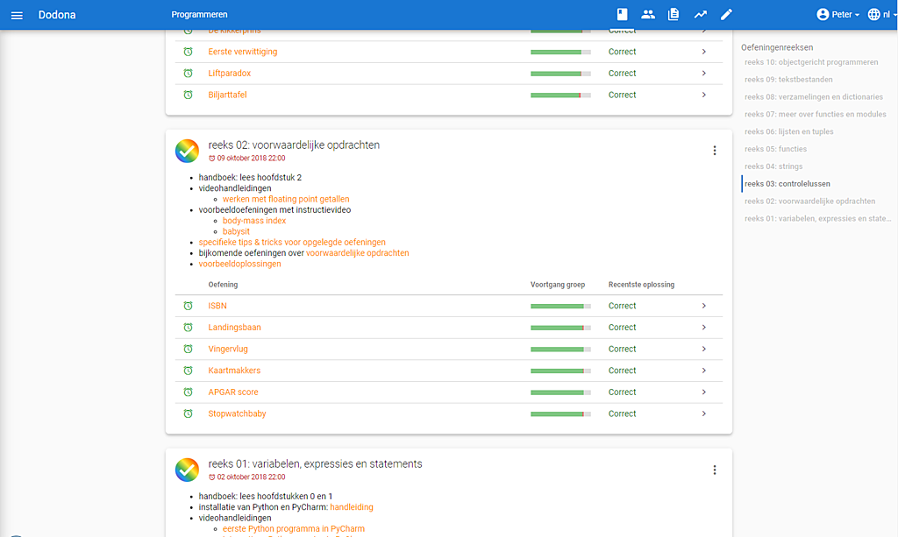

<NewsHeader :title="$frontmatter.title" :date="$frontmatter.date" lang="nl" />

> Release 2.10 wordt geleverd met een eigen privacybeleid, introduceert een reeksoverzicht op cursuspagina's en laat lesgevers toe om bestaande cursussen te kopiëren.

## Privacy en persoonsgegevens

Dodona gaat heel zorgvuldig om met persoonsgegevens en waakt over jouw privacy. In ons [gegevensbeleid](https://dodona.ugent.be/data/) vertellen we op een eenvoudige manier welke gegevens we bijhouden en waarom we dat doen. In onze [privacyverklaring](https://dodona.ugent.be/privacy/) staat dezelfde informatie ook op een juridisch bindende manier beschreven. Je vindt een verwijzing naar beide documenten onderaan elke pagina van Dodona. Op die manier mag je er zeker van zijn: alles gebeurt transparant, vlot en veilig.  

## Reeksnavigatiemenu

Het leerpad van een cursus bestaat uit meerdere oefeningenreeksen. Er werd een menu toegevoegd in de rechtermarge van de cursuspagina om sneller naar een specifieke reeks te kunnen navigeren. Dit navigatiemenu bevat een overzicht van alle reeksen in de cursus.  

## Cursussen kopiëren

Als lesgevers een nieuwe cursus aanmaken, dan hebben ze nu ook de optie om daarin het leerpad van een bestaande broncursus te kopiëren. Ze kunnen elke cursus waarvoor ze toegang hebben als broncursus gebruiken, dus niet enkel hun eigen cursussen. Wie een cursus aanmaakt wordt automatisch cursusbeheerder van de nieuwe cursus, maar bij het kopiëren kunnen bijkomend ook de cursusbeheerders van de broncursus overgenomen worden. Na het kopiëren kunnen het leerpad en de cursusbeheerders van de nieuwe cursus onafhankelijk van de broncursus aangepast worden.  

Het kopiëren kan gestart worden via de knop CURSUS AANMAKEN op het cursusoverzicht of via het hoofdmenu op de pagina van een broncursus. Uiteraard is het ook nog steeds mogelijk om nieuwe cursussen vanaf nul op te bouwen.  

## Volledige lijst van veranderingen

Voor een volledige lijst van veranderingen verwijzen we naar [onze GitHub release](https://github.com/dodona-edu/dodona/releases/tag/2.10), maar hieronder lijsten we ook kort de belangrijkste dingen op.

*   navigatiemenu voor reeksen toevoegen aan cursuspagina
*   beschrijvende tekst toevoegen aan sectie met API tokens op pagina om gebruikersprofiel te bewerken
*   zoekbalk duidelijker weergeven in cursusoverzicht
*   waarschuwing tonen bij oefening als gelinkte reeks een nakende deadline heeft
*   onderwijsinstelling toevoegen aan tabel met cursusgebruikers en toelaten om daarop te zoeken
*   cursusbeheerders toelaten om visualisatie van groepsvoortgang (per reeks) te verbergen voor studenten
*   lesgevers toelaten om cursussen te kopiëren
*   JSON syntaxisfouten duidelijker weergeven in emailboodschappen
*   veel kleine bugfixes en verbeteringen
