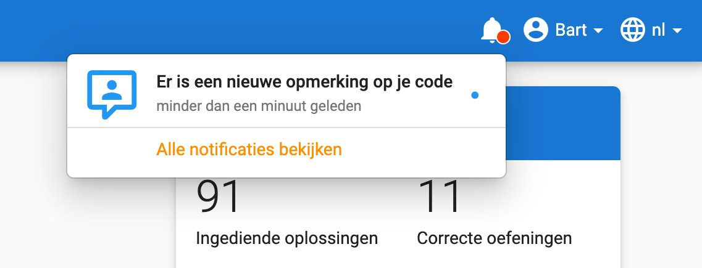

<NewsHeader :title="$frontmatter.title" :date="$frontmatter.date" lang="nl" />

> Dodona 3.4 geeft de mogelijkheid aan leerkrachten om opmerkingen aan de code van studenten toe te voegen. 

## Manuele opmerkingen

Leerkrachten kunnen nu manueel opmerkingen aan de code van studenten toevoegen. Studenten worden hiervan op de hoogte gebracht door middel van een melding in hun navigatiebalk.

## Volledige lijst van veranderingen

Naast deze grotere uitbreidingen zijn er natuurlijk ook een hoop andere kleine dingen verbeterd. Voor een volledige lijst van veranderingen verwijzen we naar [onze GitHub release](https://github.com/dodona-edu/dodona/releases/tag/3.4).
