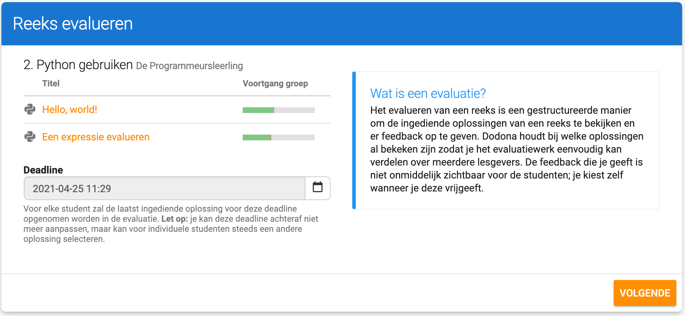
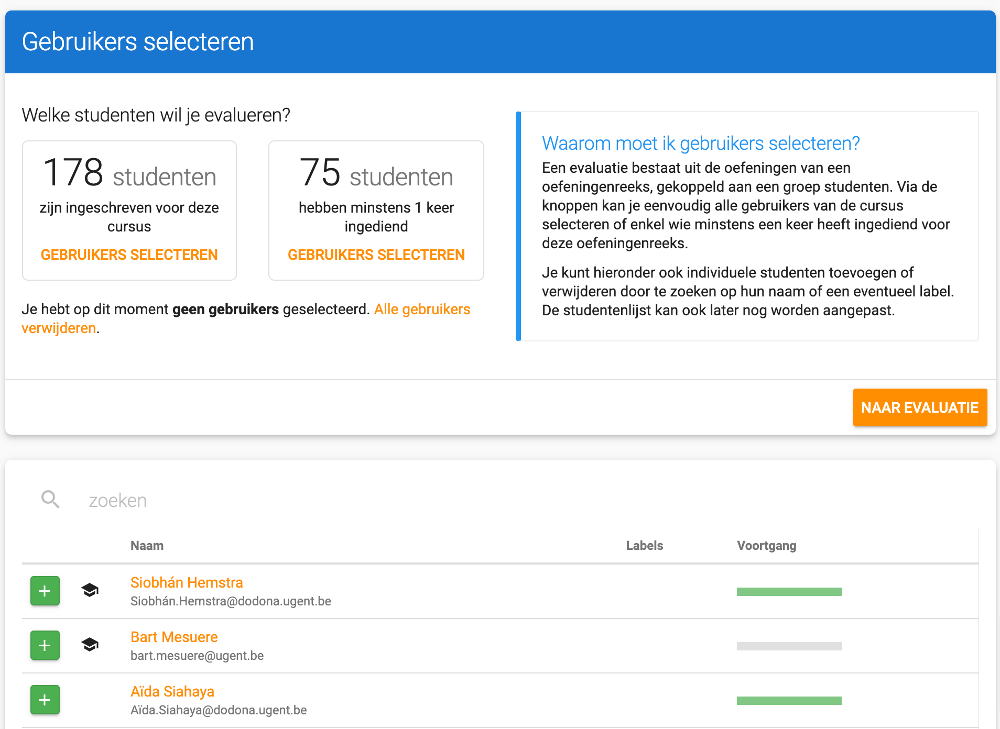
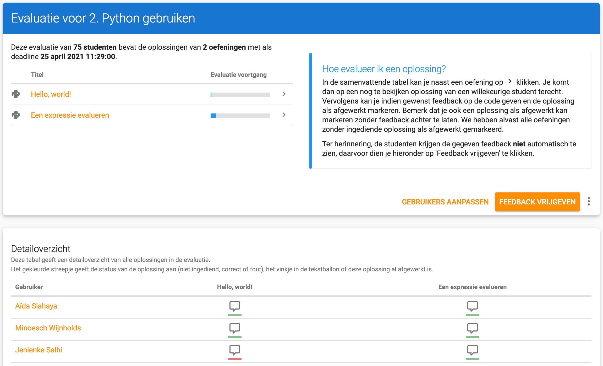
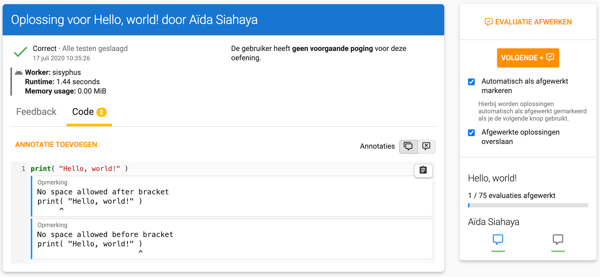

<NewsHeader :title="$frontmatter.title" :date="$frontmatter.date" lang="nl" />

> Dodona 3.7 introduceert de mogelijkheid om op een gestructureerde manier de ingediende oplossingen van studenten te evalueren.

## Een reeks evalueren

Na het geven van een taak of toets wil je vaak de ingediende oplossingen van je leerlingen op een gestructureerde manier overlopen. Vroeger was dit redelijk omslachtig, of moest je de ingediende oplossingen exporteren, maar Dodona 3.7 brengt hier verandering in. Vanaf nu kan je als lesgever in het reeksmenu kiezen voor "Reeks evalueren". De evaluatiewizard wordt dan gestart.

### Een deadline kiezen
In een eerste stap moet je een deadline kiezen. De laatst ingediende oplossing voor deze deadline voor elke student zal in rekening gebracht worden. Als je reeks al een deadline had, dan wordt die deadline automatisch overgenomen, maar je kan ze eventuele nog aanpassen.

### Studenten selecteren
In de volgende stap selecteer je alle gebruikers die je wenst op te nemen in de evaluatie. Je kan met de knoppen bovenaan de pagina snel kiezen voor alle studenten in een cursus of enkel studenten die minstens 1 maal hebben ingediend. Je kan ook individuele studenten toevoegen of verwijderen.

### Overzicht
Na het selecteren van studenten kom je op de overzichtpagina terecht. Hier zie je voor elke oefeningen hoe ver je staat in je evaluatie en welke oplossingen je nog moet bekijken. Het gekleurde streepje onder de tekstballon geeft aan of die oefening fout of correct was. Door er op te klikken kan je de oplossing evalueren door er commentaar op te geven. Studenten krijgen de toegevoegde commentaar pas te zien als je op de overzichtspagina op "feedback vrijgeven" klikt.

### Een oplossing evalueren
Bij het evalueren van een oplossing krijg je de ingediende code te zien, net als de status van de oplossing. Je kan ook de resultaten van de uitgevoerde testen bekijken. Je kan bij elke oplossing opmerkingen toevoegen, zoals als globale annotatie of per regel. De student krijgt deze opmerkingen te zien nadat de gekozen hebt om de feedback vrij te geven.

Via de balk aan de rechter kant van het scherm kan je eenvoudig navigeren naar de volgende student binnen dezelfde oefening. Je kan er voor kiezen om een oefening manueel als gezien/afgewerkt te markeren, of je kan dit automatisch laten doen door op volgende te klikken.

## Volledige lijst van veranderingen

Naast deze grotere uitbreidingen zijn er natuurlijk ook een hoop andere kleine dingen verbeterd. Voor een volledige lijst van veranderingen verwijzen we naar [onze GitHub release](https://github.com/dodona-edu/dodona/releases/tag/3.7).