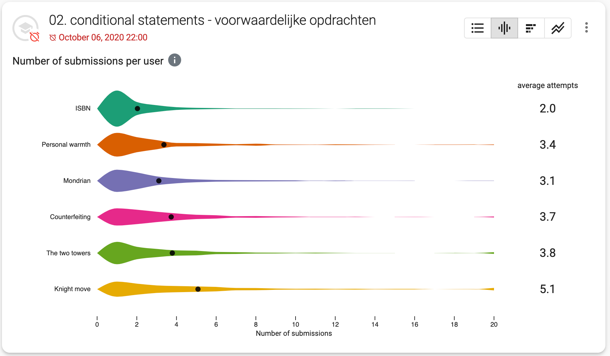
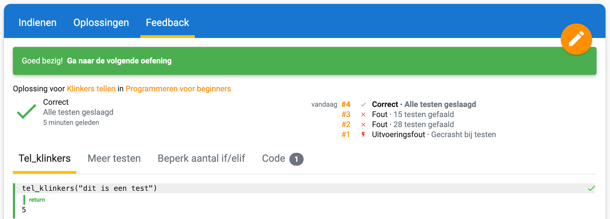
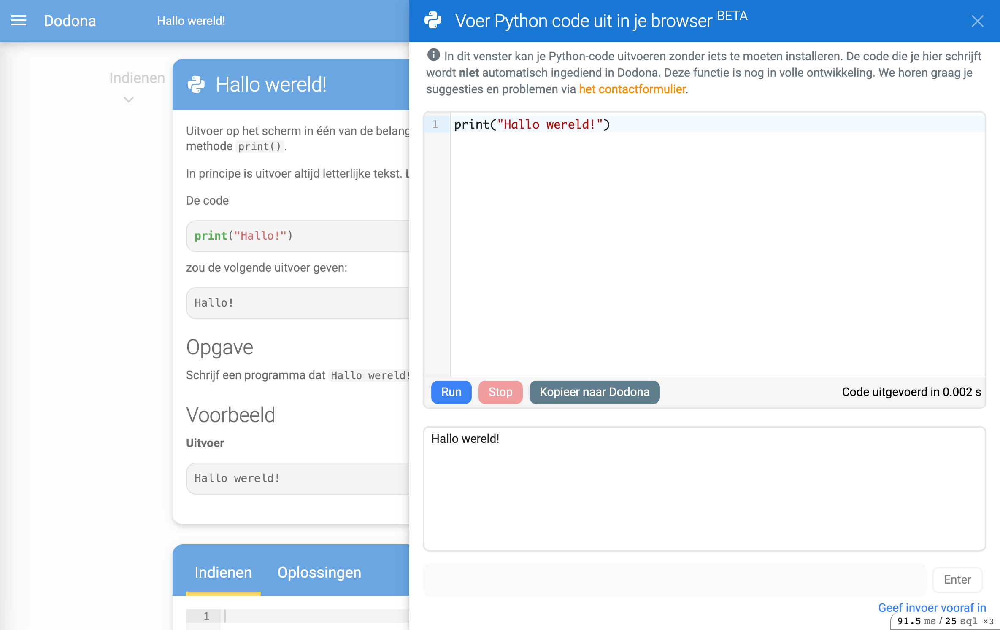

<NewsHeader :title="$frontmatter.title" :date="$frontmatter.date" lang="nl" />

> Dodona werkt doorheen het jaar steeds met kleinere releases. Deze post zal telkens aangevuld worden met nieuwe features voor het jaar 2021-2022.

## Dodona 5.0 - 13/09/2021

Dodona 5.0 is de grootste release van Dodona tot nu toe en bevat de volgende grote features:

### Design refresh

De meest zichtbare verandering is een visuele opfrissing van het design van de home page. Het doel was om een vriendelijker en minder zakelijke pagina te maken. Dit hebben we gedaan door zachtere kleuren te gebruiken in combinatie met meer afgeronde hoeken.

### Punten geven

In een vorige versie van Dodona was het geven van punten al beschikbaar als preview. Deze functionaliteit is nu beschikbaar voor alle gebruikers. We hebben verschillende aanpassingen gedaan om het geven van punten nog gebruiksvriendelijker te maken. Meer informatie kan je vinden in [deze handleiding](/nl/guides/teachers/grading).

### Learning analytics

Lesgevers kunnen nu nog beter hun studenten opvolgen. Aan elke reeks op een cursuspagina hebben we verschillende grafieken toegevoegd die je meer inzicht geven in hoe studenten leren.

### Kalenderintegratie
Studenten kunnen nu eenvoudig de deadlines van een Dodonacursus toevoegen aan hun persoonlijke kalender zoals Google Calendar. Hiervoor klikken ze op de link die beschikbaar is in het menu bovenaan de cursuspagina.

Alle details over deze Dodona versie kan je vinden in onze [GitHub release discussion](https://github.com/dodona-edu/dodona/discussions/3102).

## Dodona 5.1 - 11/10/2021

Dodona 5.1 voegt een nieuwe manier toe om tabulaire uitvoer weer te geven in de feedbacktabel. De diff zal hierbij rekening houden met de rijen en kolommen uit het csv-formaat en het resultaat weergeven als tabel. Deze weergave zal gebruikt worden door de nieuwe SQL-judge.

Studenten stellen soms een vraag als ze vastzitten op een oefening, maar slagen er dan toch in om zelf verder te raken. Om te verhinderen dat lesgevers tijd verspillen aan het beantwoorden van zo'n vragen, geven we nu met een info-icoontje weer als de student nog oplossingen heeft ingediend na het stellen van de vraag.

Dodona 5.1 voegt ook ondersteuning toe voor *identity providers* die aanmelden via OpenID Connect.

Alle details over deze Dodona versie kan je vinden in onze [GitHub release discussion](https://github.com/dodona-edu/dodona/discussions/3155).

## Dodona 5.2 - 25/10/2021

Dodona 5.2 maakt het mogelijk voor ambtenaren van de Vlaamse overheid om aan te melden op Dodona. De loginpagina kreeg een opfrisbeurt om ook niet-onderwijsinstellingen toe te laten.

Op alle oefeningenpagina's wordt nu bovenaan de pagina naast de naam van de oefening met een icoontje aangeduid wat de programmeertaal van de oefening is.

Alle details over deze Dodona versie kan je vinden in onze [GitHub release discussion](https://github.com/dodona-edu/dodona/discussions/3186).

## Dodona 5.3 - 04/03/2022

Het is een eindje geleden sinds onze vorige Dodona release, dus de gedetailleerde lijst met aanpassingen is een stuk langer dan gewoonlijk.
De belangrijkste nieuwe feature in Dodona 5.3 is een nieuw grafiektype in de oefeningenreeksen. Op de heatmap kan je zien op welk tijdstip de meeste oplossingen werden ingediend.

Het start- en eindtijdstip is aanpasbaar en de grafiek past zich automatisch aan om een gepast aantal blokjes te tonen. De selectie van de tijdsperiode werd ook toegevoegd aan de bestaande lijngrafieken.

Alle details over deze Dodona versie kan je vinden in onze [GitHub release discussion](https://github.com/dodona-edu/dodona/discussions/3345).

## Dodona 5.4 - 19/04/2022

Dodona 5.4 voegt ondersteuning toe voor inloggen met SURFconext. Via deze weg kunnen alle scholen in Nederland eenvoudig en veilig aanmelden op Dodona.

Een tweede grote wijziging is een overzicht van alle ingediende oplossingen in de resultaatweergave van een oplossing. Dit maakt het ook eenvoudiger om te linken naar een bepaalde oplossing.

Alle details over deze Dodona versie kan je vinden in onze [GitHub release discussion](https://github.com/dodona-edu/dodona/discussions/3545).

## Dodona 5.5 - 25/04/2022

Dodona 5.5 bevat een experimentele nieuwe feature om Python code uit te voeren in je browser! Elke Python oefening heeft rechtsonder de pagina een "voer code uit"-knop gekregen. Als je hier op klikt dan verschijnt er een Python kladblok waar de code uit de Dodona-editor automatisch in werd ingeladen. Als je vervolgens uit "Run" klikt, dan wordt je code uitgevoerd en verschijnt de eventuele uitvoer onderaan de pagina. We ondersteunen ook meer geavanceerde features zoals het verwerken van invoer en het importeren van packages.

Onder de motorkap werkt deze feature met ons [Papyros](https://github.com/dodona-edu/papyros) project. Het maakt gebruik van de nieuwste browserfeatures, dus het is mogelijk dat er hier en daar iets niet helemaal werkt zoals verwacht. Je feedback is dan ook zeer welkom!

Alle details over deze Dodona versie kan je vinden in onze [GitHub release discussion](https://github.com/dodona-edu/dodona/discussions/3552).

## Dodona 5.6 - 04/06/2022

Dodona 5.6 is iets groter uitgevallen dan normaal omdat we tijdens de examenperiode proberen om geen ingrijpende aanpassingen te doen.

De grootste visuele aanpassing is een vernieuwd ontwerp en kleuren, gebaseerd op Material Design 3. De grootste aanpassingen zitten in de knoppen die nu wat consistenter zijn. We hebben ook afscheid genomen van oranje als kleur voor links en knoppen. Het contrast van oranje tekst op een witte achtergrond was niet hoog genoeg om aan alle toegankelijkheidsstandaarde te voldoen. We gebruiken nu donkerblauwe links en knoppen en gebruiken roze als accentkleur. Ten slotte hebben we onze donkere modus volledig opnieuw opgebouwd volgens een aantal stijlregels. Deze aanpassingen maken de weg vrij voor een speciale kleurenblindenmodus en een pikzwarte donkere modus in de toekomst.

Een tweede grote wijziging is een volledige herwerking van onze filter- en zoekmogelijkheden. Onder de moterkap worden nu *web components* gebruikt om de code te structureren. Verschillende filters worden nu ook meer expliciet weergegeven.

Tenslotte hebben we ook de inloglogica van Dodona herwerkt. Het grote voordeel hier is dat we nu transparanter kunnen zijn wanneer het fout loopt. Bijvoorbeeld wanneer je probeert in te loggen met een emailadres dat binnen Dodona al gekoppeld is met een andere bestaande account. Bovendien zullen Office 365 gebruikers nu telkens expliciet de account moeten selecteren waarmee ze willen inloggen. Dit zal verhinderen dat ze zich per ongeluk met de verkeerde account aanmelden.

Alle details over deze Dodona versie kan je vinden in onze [GitHub release discussion](https://github.com/dodona-edu/dodona/discussions/3763).
