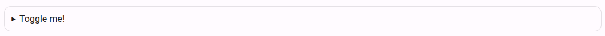

# Oefeningbeschrijvingen

> Dodona ondersteunt oefeningbeschrijvingen en leesactiviteiten in HTML en Markdown met verschillende extra features zoals ondersteuning voor wiskundige formules.

::: tip Kramdown <Badge type="warning" text="geavanceerd" />
Dodona maakt voor de weergave van Markdown gebruik van [kramdown](https://kramdown.gettalong.org) waardoor heel wat uitbreidingen van de standaard Markdown ondersteund worden. Gevorderde gebruikers kunnen in [dit overzicht](https://kramdown.gettalong.org/quickref.html) meer uitleg vinden over hoe deze formattering werkt.
:::

De features die op deze pagina beschreven worden zijn beschikbaar voor zowel oefeningen als leesactiviteiten. Ze worden op exact dezelfde manier weergegeven. Het enige verschil is dat oefeningen onderaan de beschrijving een teksteditor hebben, terwijl leesactiviteiten een knop `Markeer als gelezen` hebben.

## Markdown

Voor oefeningen en leesactiviteiten op Dodona raden we aan om de inhoud te schrijven in Markdown. Ook voor beschrijvingen van cursussen en reeksen kan Markdown gebruikt worden. Markdown is een soort opmaaktaal zoals HTML, maar dan een stuk eenvoudiger. Hieronder kan je de basisopmaak vinden, een lijst van alle syntax kan je vinden in deze [Markdown Cheatsheet pagina](https://github.com/adam-p/markdown-here/wiki/Markdown-Cheatsheet). Verder op deze pagina staan specifieke uitbreidingen die werken binnen Dodona oefeningenbeschrijvingen.

### Titels

In Markdown kan je eenvoudig titels van verschillende niveaus gebruiken. Je plaats hiervoor één of meerdere hekjes (`#`) voor je titel. Afhankelijk van het aantal hekjes zal je een grotere of kleinere titel krijgen.

```markdown
# Niveau 1
## Niveau 2
### Niveau 3
#### Niveau 4
##### Niveau 5
###### Niveau 6
```

### Tekstopmaak

Om tekst op te maken, plaats je tekst tussen sterretjes (`*`). Als één of meerdere woorden tussen enkele sterretjes staan, dan zal de tekst cursief geplaatst worden. Als ze tussen dubbele sterretjes geplaatst worden dan zal de tekst in het vet verschijnen. Plaats je tekst tussen dubbele tildes (`~`), dan zal de tekst doorstreept worden. Om code weer te geven in je beschrijving plaats je tekst tussen *back ticks* (`` ` ``).

```markdown
Dit is een voorbeeldzin met woorden in *cursief*, **vet**, en ~~doorstreept~~ en met variabel `a` in functie `geefOplossing()`.
```

Dit ziet er dan uit als volgt: Dit is een voorbeeldzin met woorden in *cursief*, **vet**, en ~~doorstreept~~ en met variabel `a` in functie `geefOplossing()`.

### Links en afbeeldingen

Links en afbeeldingen zijn iets complexer om toe te voegen. Ze bestaan uit twee delen waarvan het eerste deel tussen vierkantje haakjes (`[]`) staat en het tweede deel tussen ronde haakjes (`()`). Het eerste deel wordt gebruikt voor de te linken tekst of de afbeeldingenomschrijving, het tweede deel voor de link zelf of de link naar de afbeelding. Om aan te geven dat het om een afbeelding gaat, en geen link, plaats je een uitroepingsteken (`!`) voor het eerste vierkantje haakje.

```markdown
Dit is een zin waarbij [deze woorden](https://google.com) linken naar Google.
Hieronder staat het Dodona logo afgebeeld.


```

Dit is een zin waarbij [deze woorden](https://google.com) linken naar Google.
Hieronder staat het Dodona logo afgebeeld.


### Opsommingen

Opsommingen werken heel natuurlijk in Markdown. Afhankelijk of je een genummerde of een gewone opsomming wil, laat je je regel voorafgaan door `1. ` of `* `. Dit ziet er dan als volgt uit:

```markdown
1. item 1
2. item 2
3. item 3

* item 1
* item 2
* item 3
```

1. item 1
2. item 2
3. item 3

* item 1
* item 2
* item 3

## Afbeeldingen

Om afbeeldingen te gebruiken in je opgave, dien je de afbeeldingen in de `description/media/` [map](/nl/references/exercise-directory-structure) te plaatsen.

### Grootte instellen

Het is mogelijk om zowel met HTML als kramdown de grootte van de afbeelding in te stellen.

```html

```

```markdown
{:width="25%"}
```

### Lightboxes

Dodona voegt automatisch een [lightbox](https://en.wikipedia.org/wiki/Lightbox_(JavaScript)) toe aan alle afbeeldingen in een opgave. Dat wil zeggen dat als je op een afbeelding klikt, deze zal openen in een lightbox. Het is ook mogelijk om zo een onderschrift toe te voegen en om een alternatieve (hoge-resolutie) versie van de afbeelding te tonen.

Je kan zo'n lightbox ook manueel oproepen met een link door de `dodona-lightbox` *class* toe te voegen:
```html
<a href="image.jpg" class="dodona-lightbox">Show image</a>
```

```markdown
[Show image](image.jpg){: .dodona-lightbox}
```

#### Onderschriften

Je kan een onderschrift (*caption*) specificeren met behulp van het `data-caption` attribuut. Als je dit niet expliciet opneemt, dan zal dodona de waarde van het `alt` attribuut gebruiken.

##### HTML

Een onderschrift dat ingesteld wordt met het `data-caption` attribuut.

```html

```

Een onderschrift dat ingesteld wordt met het `alt` attribuut.

```html

```

Als je `figure` tags gebruikt voor afbeeldingen, dan zullen onderschriften die met een `figcaption` werden ingesteld automatisch verborgen worden. Als je ze toch wil weergeven, voeg dan de `show-caption` klasse toe aan het bovenliggende `figure` element.

##### Markdown

Een onderschrift dat ingesteld wordt met het `data-caption` attribuut in Markdown.

```markdown
{:data-caption="Dit is een langer onderschrift van een afbeelding dat gebruikt zal worden in de lightbox."}
```

Een onderschrift dat ingesteld wordt met het `alt` attribuut in Markdown.

```markdown

```

#### Alternatieve versie

Je kan een alternatieve versie van je afbeelding gebruiken in de lightbox. Zo kan je bijvoorbeeld een lageresolutieversie gebruiken in de algemene beschrijving en enkel de versie in hoge resolutie inladen in de lightbox. Je kan het `data-large` attribuut gebruiken om het pad naar de alternatieve afbeelding op te geven.

Een alternatieve versie van een afbeelding in hoge resolutie, ingesteld met het `data-large` attribuut in HTML.

```html

```

Een alternatieve versie van een afbeelding in hoge resolutie, ingesteld met het `data-large` attribuut in Markdown.

```markdown
{:data-large="large-image.jpg"}
```

### Gecentreerde groepen

Als je meerdere (kleine) afbeeldingen in een opgave gebruikt, dan kan je ze *inline* naast elkaar plaatsen in een gecentreerde groep. Dit kan door alle afbeeldingen in een `div` element te plaatsen met de `dodona-centered-group` *class*.

```html
<div class="dodona-centered-group">
  
  
  
</div>
```

Naast afbeeldingen kan je ook tabellen en andere elementen in een gecentreerde groep plaatsen.

### Zichtbaarheid in donkere modus

Als je een aparte afbeelding wil gebruiken voor lichte modus en donkere modus (bv. met een andere achtergrondkleur), dan kan je de `light-only` of `dark-only` klassen toevoegen aan een afbeelding. De `light-only` klasse zal de afbeelding enkel tonen in lichte modus terwijl de `dark-only` class de afbeelding enkel zal tonen in donkere modus. Deze klassen werken ook voor andere HTML-elementen.

Je kan een afbeelding ook inverteren in dark mode door de `dark-invert` klasse toe te voegen.

```html


```

```markdown
[Show image](dark-image.jpg){: .dark-only}
[Show image](light-image.jpg){: .light-only}
[Show image](invertable-image.jpg){: .dark-invert}
```

---

## Tabellen

Tabellen worden ondersteund door zowel HTML als Markdown. Je kan de `table` *class* toevoegen voor een mooiere opmaak.

##### HTML

```html
<table class="table">
  <thead>
    <tr>
      <th>...</th>
      <th>...</th>
    </tr>
  </thead>
  <tbody>
    <tr>
      <td>...</td>
      <td>...</td>
    </tr>
    ...
  </tbody>
</table>
```

##### Markdown

```markdown
|-----------------+------------+-----------------+----------------|
| Default aligned |Left aligned| Center aligned  | Right aligned  |
|-----------------|:-----------|:---------------:|---------------:|
| First body part |Second cell | Third cell      | fourth cell    |
| Second line     |foo         | **strong**      | baz            |
| Third line      |quux        | baz             | bar            |
|-----------------+------------+-----------------+----------------|
| Second body     |            |                 |                |
| 2 line          |            |                 |                |
|=================+============+=================+================|
| Footer row      |            |                 |                |
|-----------------+------------+-----------------+----------------|
{: .table}
```

---

## Wiskundige formules

Dodona ondersteunt de LaTeX syntax om wiskundige formules te tonen met behulp van [KaTeX](https://katex.org/).

### Inline formules
Om wiskundige formules en symbolen weer te geven op dezelfde regel als andere tekst (*inline*), volstaat het om voor en na de formule een dubbel dollarteken te plaatsen. Deze syntax is dezelfde voor zowel Markdown als HTML.

```markdown
Wat tekst met symbool $$a$$ en een formule $$x^2$$.
```

### Uitgelichte formules
Om formules op een eigen regel te plaatsen gebruiken Markdown en HTML een andere syntax.

Omring de formule met `\[` en `\]` in HTML.

```html
De oplossing kan gevonden worden met de volgende formule: \[a^2 = b^2 + c^2\]
```

In Markdown kan je de dubbele dollar syntax gebruiken waarbij je alles op een nieuwe regel plaatst en een nieuwe regel voor en na de `$$` laat.

```html
De oplossing kan gevonden worden met de volgende formule:

$$
a^2 = b^2 + c^2
$$

```

---

## Codefragmenten

Je kan op Dodona heel eenvoudig codefragmenten tonen in een *monospaced* lettertype met *syntax highlighting*.

### Inline code

Als je HTML gebruikt, plaats dan `<code>` en `</code>` rond je code.

```html
Gebruik de variabele <code>some_variable</code> in je oplossing.
```

Als je Markdown gebruikt, plaats dan *backticks* (\`) rond je code. Je kan ook de gebruikte programmeertaal toevoegen, bijvoorbeeld met `{:.language-python}`. Dat laatste zorgt dan voor _syntax highlighting_.

```markdown
Gebruik de variabele `some_variable` in je oplossing.
Gebruik de verkorte notatie `result += 1`{:.language-python}.
```

### Blokken code

Als je een codefragment van meerdere regels in je HTML-opgave wil plaatsen, plaats dan `<pre><code>` en `</code></pre>` rond je code.

```html
<pre><code>
let a = 5;
let b = 42;
</code></pre>
```

Als je een codefragment van meerdere regels in je Markdown-opgave wil plaatsen, plaats dan drie *backticks* (```) op de regel voor en na de code.

    ```
    let a = 5;
    let b = 42;
    ```

### Syntax highlighting

#### HTML

Dodona ondersteunt geen automatische *syntax highlighting* als je HTML gebruikt. HTML die werd gegenereerd door [Pygments](http://pygments.org/) wordt wel correct getoond als je de correcte syntax gebruikt:

```html
<div class="highlighter-rouge">
  <pre class="highlight">
    <code>
    <span class="kd">let</span> <span class="nx">a</span> <span class="o">=</span> <span class="mi">2</span><span class="p">;</span>
    <span class="kd">let</span> <span class="nx">b</span> <span class="o">=</span> <span class="mi">42</span><span class="p">;</span>
    </code>
  </pre>
</div>
```

#### Markdown

Als je Markdown gebruikt, dan kan Dodona automatisch de code opmaken als je aangeeft in welke programmeertaal de code geschreven is. Dit kan als volgt:

    ```javascript
    let a = 5;
    let b = 42;
    ```

Python doctests worden standaard niet correct gemarkeerd. Als oplossing kan je de taal instellen met `console?lang=python&prompt=>>>`:

    ```console?lang=python&prompt=>>>
    >>> echo("Hello world!")
    "Hello world!"
    >>> echo(5)
    5
    ```

## Callouts

Om de aandacht te vestigen op een stukje uit je opgave, kan je gebruik maken van *callouts*. Dit zorgt voor een opmaak zoals hier wordt getoond:

::: tip Hallo
Dit is een belangrijk bericht.
:::

Om een *callout* te gebruiken maak je een `div` element aan met de `callout` *class*. Hierin kan je optioneel een `h4` element en paragraaf plaatsen.

```html
<div class="callout callout-success">
  <h4>Hallo</h4>
  <p>Dit is een belangrijk bericht.</p>
</div>
```

In plaats van `callout-success` kan je ook `callout-info`, `callout-warning`, of `callout-danger` gebruiken om een element in het blauw, geel of rood weer te geven.

In Markdown ziet het er als volgt uit:

```markdown
{: .callout.callout-success}
> #### Hallo
> Dit is een belangrijk bericht.
```

## Quotes

Om tekst als een quote weer te geven kan je het *blockquote* element gebruiken.

Als je HTML gebruikt, plaats dan `<blockquote>` en `</blockquote>` rond je quote.

```html
<blockquote>
  Dit is een quote.
</blockquote>
```

Als je Markdown gebruikt, plaats een `>` teken aan het begin van elke regel van je quote.

```markdown
> Dit is een quote
```

## Spoilers

Om een deel van je oefeningbeschrijving te verbergen, kan je een spoiler gebruiken. Dit zal resulteren in een element zoals dit:




Om een spoiler te gebruiken, maak je een `details` element aan met daarin een `summary` element en wat inhoud.

```html
<details>
    <summary>Toggle me!</summary>
    Peek a boo!
</details>
```

Merk op dat je standaard geen Markdown kan gebruiken binnenin html tags. Indien je Markdown wil gebruiken, moet je `markdown="1"` toevoegen aan de tag:

```html
<details markdown="1">
    <summary>Toggle me!</summary>
    Peek a **boo**!
</details>
```
