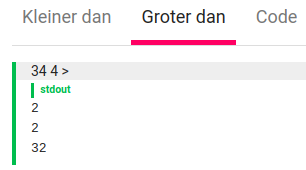
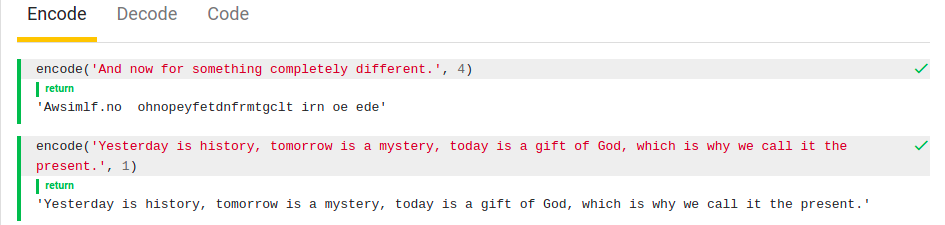
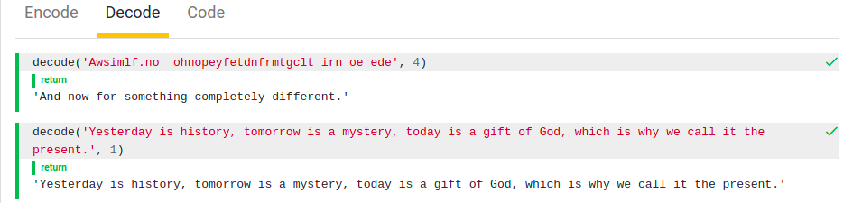
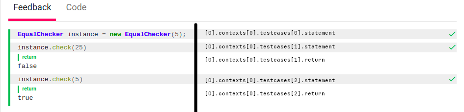

# DSL-testplannen

TESTed ondersteunt een domeinspecifieke taal 
(*[domain-specific language](https://en.wikipedia.org/wiki/Domain-specific_language)*)
om het testplan van een programmeeroefening op een 
programmeertaal-onafhankelijke manier te beschrijven. Daarmee kan dus vastgelegd 
worden welke testen moeten uitgevoerd worden op een ingediende 
oplossing voor de oefening. De belangrijkste doelstelling van de DSL is om de 
beschrijving van testplannen zo eenvoudig mogelijk te houden. Dit gaat soms ten
koste van de flexibiliteit waarmee testplannen kunnen opgesteld worden. Je zou 
kunnen stellen dat ook hier de 80-20-regel geldt: we streven ernaar dat 80% van 
de testplannen kan opgesteld worden op basis van de DSL, met 20% van de 
flexibiliteit die nodig is om testplannen op te stellen. Heb je voor het 
testplan van een programmeeroefening extra functionaliteit of flexibiliteit 
nodig, dan kan je het testplan opstellen in het JSON-formaat van TESTed. 

Een DSL-testplan wordt beschreven in het 
[YAML-formaat](https://en.wikipedia.org/wiki/YAML). De 
structuur van de DSL volgt in grote mate de opbouw waarmee feedback wordt 
weergegeven in Dodona. In onderstaande voorstelling van een DSL-testplan 
gebruiken we vierkante haakjes om lijsten van objecten voor te stellen.

```text
. # testplan met top-level sectie
├ namespace
├ config
│ ├ stdout
│ │ ├ ignoreWhitespace
│ │ ├ caseInsensitive
│ │ ├ tryFloatingPoint
│ │ ├ applyRounding
│ │ └ roundTo
│ └ stderr
│   └ ... # identiek aan stdout
├ disableOptimizations
└ tabs[]
  ├ config
  │ └ ... # identiek aan config hierboven
  ├ tab
  └ contexts[]
    ├ config
    │ └ ... # identiek aan config hierboven
    ├ files[]
    │ ├ name
    │ └ url
    ├ arguments
    ├ stdin
    ├ exception
    ├ exitCode
    ├ stderr
    ├ stdout
    └ testcases[] # optioneel als context maar één testgeval bevat (dus ook geen testgeval op contextniveau)
      ├ files[]
      │ └ ... # identiek aan files hierboven
      ├ statement
      ├ exception
      ├ return     # 'return' en 'return-raw' zijn wederzijds exclusief
      ├ return-raw
      ├ stderr
      └ stdout
      
[] # testplan zonder top-level sectie
└ ... # identiek aan de tabs hierboven
```

We zullen de DSL hoofdzakelijk beschrijven met voorbeelden van testplannen die 
typisch zijn voor bepaalde soorten programmeeroefeningen.

## Lezen uit standaardinvoer en schrijven naar standaarduitvoer

In de klassieke ACM-stijl voor programmeeroefeningen wordt verwacht dat een 
ingediende oplossing invoer leest uit standaardinvoer 
(`stdin`; *standard input*) en een resultaat uitschrijft naar standaarduitvoer 
(`stdout`; *standard output*). Zowel de gegeven invoer als de verwachte uitvoer 
bestaan dus uit tekstfragmenten die in het testplan moeten vastgelegd worden 
voor de kanalen `stdin` en `stdout`.

Bij onderstaand testplan zal een oplossing bijvoorbeeld twee keer uitgevoerd 
worden: één keer voor elke context. Voor elke context leggen we de gegeven 
invoer (`stdin`) en de verwachte uitvoer (`stdout`) vast als een resultaat dat
bestaat uit één regel tekst. De resultaten van beide contexten zullen samen 
weergegeven onder één tab met de naam `Feedback`.

```yaml
- tab: "Feedback"
  contexts:
  - stdin: "invoertekst-0"
    stdout: "invoertekst-0"
  - stdin: "invoertekst-1"
    stdout: "invoertekst-1"
```

Dit is hoe de feedback voor een (correcte) ingediende oplossing voor een 
oefening met dit testplan er zal uitzien in Dodona. Daarbij hebben we extra 
aanduidingen aangebracht die het pad aangeven van het corresponderende object
uit het testplan. Zo verwijst `[0].testcases[0].stdin` bijvoorbeeld naar de 
gegeven tekst op standaardinvoer (`stdin`) voor de eerste context
(`contexts[0]`) van het eerste tabblad (`[0]`).


### Objecten

Het YAML-formaat gebruikt **objecten** om data voor te stellen en gebruikt 
**insprongen** om objecten in elkaar te **nesten**. Objecten bestaan uit 
sleutel/waarde-paren. Een **sleutel** is een naam waarin geen spaties (of andere
witruimtekarakters) mogen voorkomen. Aan een sleutel wordt een waarde gekoppeld
die de vorm kan aannemen van tekst, een getal, een logische waarde, een lijst
of een object. Een sleutel en een waarde worden van elkaar gescheiden door een
dubbelpunt (`:`).

```yaml
object0: 1
```

```yaml
root:
  child0:
    subchild0: "leaf"
    subchild1: "leaf"
  child1:
    subchild0: "leaf"
```

### Lijsten

De elementen van een lijst zijn zelf objecten. Het eerste sleutel/waarde-paar 
van elk element in de lijst moet voorafgegaan worden door een koppelteken (`-`)
en een spatie.

```yaml
- name: "Item 0"
- name: "Item 1"
- name: "Item 2"
- name: "Item 3"
```

```yaml
list:
- name: "Item 0"
  items: 5
- name: "Item 1"
- name: "Item 2"
  items: 3
- name: "Item 3"
```

### Testplan

Een testplan bestaat uit een lijst van tabbladen, eventueel aangevuld met een
aantal globale eigenschappen. Dat laatste is niet het geval voor het testplan
dat we als voorbeeld gebruikt hebben, en dus wordt het testplan louter 
omschreven als een lijst van tabbladen.

### Tabblad

Een tabblad heeft een verplichte sleutel `tab` voor de naam van het tabblad. Dit
is de naam waarmee de tab in Dodona zal weergegeven worden. Daarnaast heeft een
tabblad nog een optionele sleutel `contexts` waaraan een lijst van contexten kan
toegekend worden, waarvan de feedback onder het tabblad moet weergegeven worden.

### Context

Een context is een reeks testen die onafhankelijk uitgevoerd worden van de 
testen in andere contexten. Elke test heeft een aantal invoerkanalen waarlangs
informatie binnenkomt wordt en uitvoerkanalen waarin resultaten gerapporteerd
worden. In het voorbeeld testplan is standaardinvoer (`stdin`) het enige
invoerkanaal en is standaarduitvoer (`stdout`) het enige uitvoerkanaal. 
Bestanden kunnen zowel als invoerkanaal als als uitvoerkanaal gebruikt worden.
Andere uitvoerkanalen zijn bijvoorbeeld een returnwaarde, een *exit status* of
een opgeworpen *exception*.

Merk op dat TESTed altijd alle uitvoerkanalen zal controleren. TESTed verwacht
geen resultaat op uitvoerkanalen die niet expliciet in het testplan beschreven
worden.

#### Standaardinvoer

Het standaardinvoer-kanaal van een test wordt ingesteld via de sleutel `stdin`
waaraan een `string` moet toegekend worden.

#### Standaarduitvoer

Het standaarduitvoer-kanaal van een test wordt ingesteld via de sleutel 
`stdout`. We raden aan om het verwachte resultaat op standaarduitvoer als een
`string` aan deze sleutel toe te kennen. TESTed ondersteunt ook getallen (zowel
natuurlijke getallen, gehele getallen als reële getallen) en Booleaanse waarden 
door ze naar strings te vertalen. Voor de eenvoud zullen we spreken van 
**tekstuele types** op plaatsen waar TESTed strings, getallen of Booleaanse 
waarden interpreteert als `strings`.

## Multitab en multiline

We zullen het vorige testplan nu uitbreiden naar een testplan dat feedback 
rapporteert over meerdere tabbladen (**multitab**), met testen waarvan 
standaardinvoer en standaarduitvoer bestaat uit tekst die over meerdere regels
loopt (**multiline**). Als voorbeeld gebruiken we een testplan voor de oefening
[Boeketje rozen](https://dodona.ugent.be/nl/courses/27/activities/1047652305/).

```yaml
- tab: "Kleiner dan"
  contexts:
    - stdin: "100\n53\n<\n"
      stdout: "2\n51\n49\n"
- tab: "Groter dan"
  contexts:
    - stdin: |
        34
        4
        >
      stdout: |
        2
        2
        32

```

Dodona geeft de feedback voor oplossingen van deze oefening weer over twee tabs.
Zowel de tekst die de oplossing uit standaardinvoer moet lezen als de tekst die
de oplossing naar standaarduitvoer moet schrijven bestaat in dit geval uit 
meerdere regels.

<p float="left">
  
  
</p>

Opmerking: In dit geval gebruikt TESTed de tekst voor het standaardinvoer-kanaal 
als beschrijving voor de test in de feedback. Door een 
[probleem](https://github.com/dodona-edu/dodona/issues/2413)
worden de newlines in deze beschrijving echter vervangen door spaties.

### Multitab

Het voorbeeld maakt duidelijk dat testplannen met meerdere tabs gebruikmaken van
het feit dat de beschrijving van een testplan in de DSL bestaat uit een lijst 
van tabs.

### Multiline

Multiline strings kunnen in YAML op verschillende manieren voorgesteld worden.
In de eerste tab van het voorbeeld testplan wordt de klassieke notatie gebruikt 
van een string met een escape-sequentie `\n` die een newline voorstelt. De 
tweede tab gebruikt de *literal style* waarbij de verticale strepen (`|`)
aangeven dat de string over meerdere regels loopt. Deze laatste notatie zorgt
ervoor dat tekst die over meerdere regels loopt beter leesbaar is, maar de 
klassieke notatie betere controle over het gebruik van witruimtekarakters in de
tekst.

::: tip Tip
Zie [Gekende valkuilen](#gekende-valkuilen) voor meer informatie over het 
gebruik van multiline strings in het YAML-formaat.
:::

## Commandolijn-argumenten, standaardfout en exit status

Naast standaardinvoer en standaarduitvoer ondersteunt TESTed nog andere invoer-
en uitvoerkanalen. Onderstaand testplan gebruikt commandolijn-argumenten 
(`arguments`) als invoerkanaal en gebruikt standaardfout (`stderr`) en de *exit
status* (`exitCode`) als bijkomende uitvoerkanalen voor een fictieve oefening 
die vraagt om een simpele rekenmachine voor gehele getallen te implementeren.

```yaml
- tab: "Som"
  contexts:
  - arguments: [ "-a", "5", "20" ]
    stdout: "25"
  - arguments: [ "-a", "alpha", "beta" ]
    stderr: "'alpha' en 'beta' zijn geen geldige getallen"
    exitCode: 1
- tab: "Verschil"
  contexts:
  - arguments: [ "-s", "5", "20" ]
    stdout: "-15"
  - arguments: [ "-s", "5", "20" ]
    stdin: "Willekeurige invoer"
    stderr: "Er wordt geen invoer verwacht op stdin"
    exitCode: 1
- tab: "Product"
  contexts:
  - arguments: [ "-m", "25", "5" ]
    stdout: "125"
- tab: "Deling"
  contexts:
  - arguments: [ "-d", "25", "5" ]
    stdout: "5"
  - arguments: [ "-d", "25", "0" ]
    stderr: "Gehele deling door nul"
    exitCode: 2
```

Merk dus op dat voor eenzelfde test meerdere invoerkanalen (`stdin`, 
`arguments`, ...) en meerdere uitvoerkanalen (`stdout`, `stderr`, `exitCode`) 
kunnen opgegeven worden.

### Commandolijn-argumenten

De commandolijn-argumenten van een context wordt ingesteld via de sleutel 
`arguments` waaraan een lijst met tekstuele waarden moet toegekend worden. Deze 
argumenten worden doorgegeven bij het uitvoeren van de context.

:::tip Tip
In de DSL kunnen zowel strings, getallen als Booleaanse waarden als argumenten
gebruikt worden, maar we raden aan om enkel strings te gebruiken.
:::

### Standaardfout

Het standaardfout-kanaal van een test wordt ingesteld via de sleutel 
`stderr`. We raden aan om het verwachte resultaat op standaardfout als een
`string` aan deze sleutel toe te kennen. TESTed ondersteunt ook getallen en 
Booleaanse waarden door ze naar strings te vertalen.

### Exit status

De verwachte *exit status* van een context wordt ingesteld via de sleutel 
`exitCode` waaraan een geheel getal moet doorgegeven worden.

## Namespaces en configuratieopties

Het volgende testplan kan gebruikt worden voor de oefening
[Hoe slim ben jij?](https://dodona.ugent.be/nl/courses/392/series/3920/activities/726249058/).
Daarin wordt de *namespace* expliciet ingesteld en wordt gebruikgemaakt van 
configuratieopties die onder andere beïnvloeden hoe TESTed de gegenereerde 
resultaten op standaarduitvoer en standaardfout moet vergelijken met de 
verwachte resultaten op die uitvoerkanalen.

```yaml
namespace: "solution"
disableOptimizations: true
tabs:
- tab: "Hoe slim ben jij?"
  config:
    stdout:
      ignoreWhitespace: true
      tryFloatingPoint: true
  contexts:
  - stdin: "8809"
    stdout: "6"
  - config:
      stdout:
        caseInsensitive: false
    stdin: 7111
    stdout: 0
  - stdin: "2172"
    stdout:
      data: "0"
      config:
        applyRounding: true
        roundTo: 10
```

### Namespaces

Voor sommige programmeertalen gebruikt TESTed standaard de namespace 
`submission` bij het genereren van testcode. Voor Java is dit bijvoorbeeld de 
naam van de klasse waarin (statische) functies moeten geplaatst worden. Als je 
bij het opstellen van een oefening een andere naam voor de klasse wilt 
gebruiken, dan moet je die expliciet instellen via de sleutel `namespace`. Het
benoemen van namespaces gebeurt best in *snake case*. In testcase past TESTed de 
schrijfwijze van de namespace aan op basis van de gebruikelijke stijlconventie
voor de programmeertaal. Zo zal TESTed de namespace `result_calculator` voor 
Java omzetten naar de klasse `ResultCalculator`.

### Optimalisatietechnieken uitschakelen

Standaard gebruikt TESTed aan aantal optimalisatietechnieken voor het genereren 
en uitvoeren van testcode. In uitzonderlijke gevallen kan deze geoptimaliseerde
testcode tot ongewenste resultaten leiden. Daarom kan deze optimalisatie ook
uitgeschakeld worden via de sleutel `disableOptimizations` van het testplan 
waaraan een Booleaanse waarde moet toegekend worden. 

Om het uitvoeren van testcode te versnellen, kan TESTed meerdere contexten in 
één proces uitvoeren. Contexten zijn logisch gezien onafhankelijk van elkaar,
maar het afzonderlijk opstarten van de *runtime*-omgeving voor elke context 
zorgt voor de meeste programmeertalen voor een aanzienlijke *overhead*. Het
bundelen van meerdere contexten in één proces kan bijvoorbeeld door een 
oplossing uitgebuit worden door gebruik te maken van gedeelde caches (niet 
noodzakelijk een ongewenst resultaat), gedeelde globale variabelen of gedeelde 
bestanden op het bestandssysteem. Door de optimalisatietechnieken uit te 
schakelen worden deze achterpoortjes gesloten, met verlies aan snelheid voor het
uitvoeren van de testen. Aan de andere kant laat TESTed ook toe om 
niet-geoptimaliseerde contexten in parallel uit te voeren, wat onder sommige 
omstandigheden dan weer een performantiewinst zal opleveren.

### Globale eigenschappen

De namespace (`namespace`) en het gebruik van optimalisatietechnieken 
(`disableOptimizations`) zijn globale eigenschappen van een testplan. Als deze 
eigenschappen expliciet ingesteld worden in het object voor het testplan, dan 
moet de lijst van tabbladen van het testplan toegekend worden aan de sleutel 
`tabs`. Als er geen globale eigenschappen voor het testplan moeten ingesteld 
worden, dan mag het testplan enkel bestaan uit een lijst van tabbladen op het 
hoogste niveau van YAML. 

### Tekstuele types

Het tweede testgeval in het testplan voor de oefening **Hoe slim ben jij?**
illustreert dat standaardinvoer en standaarduitvoer niet noodzakelijk als 
strings moeten ingesteld worden. In worden ze ingesteld als gehele getallen,
maar ook vlottende kommagetallen (*floating point numbers*) en Booleaanse 
waarden zijn toegelaten. Samen vormen ze de **tekstuele types**.

Het tweede testgeval in het testplan voor __Hoe slim ben jij?__, illustreert dat standaardinvoer en standaarduitvoer niet noodzakelijk strings moeten zijn.
In dit geval zijn het gehele getallen maar ook logische waarden en vlottende kommagetallen zijn mogelijk (de tekstuele types).

::: warning Opmerking

De interpretatie die YAML geeft aan getallen en Booleaanse waarden, levert soms
onverwachte resultaten op na omzetting naar strings. Daarom raden we aan om 
uitsluitend strings te gebruiken voor het instellen van de kanalen voor 
standaardinvoer (`stdin`), standaarduitvoer (`stdout`) en standaardfout 
(`stderr`).

Zie [Gekende valkuilen](#gekende-valkuilen) voor meer informatie over het 
omzetten van tekstuele types naar strings.
:::

### Tekstuele types vergelijken

Voor tekstuele uitvoerkanalen (standaarduitvoer en standaardfout) zal TESTed
standaard het resultaat dat op het kanaal gegenereerd wordt via *exact string 
matching* vergelijken met het resultaat dat op het kanaal verwacht wordt. TESTed
ondersteunt echter enkele configuratieopties om bepaalde vormen van *approximate
string matching* toe te laten:

- `ignoreWhitespace`: Negeer witruimte vooraan en achteraan de strings.
- `caseInsensitive`: Negeer het verschil tussen hoofdletters en kleine letters 
  (*case insensitive*).
- `tryFloatingPoint`: Probeer strings te vergelijken als vlottende kommagetallen.
- `applyRounding`: Pas afronding toe bij het vergelijken van strings als vlottende kommagetallen.
- `roundTo`: Aantal cijfers na de komma dat behouden wordt bij afronding van 
  vlottende kommagetallen. Verplicht op te geven wanneer afronding wordt 
  toegepast.

De configuratieopties kunnen voor het volledige testplan, per tabblad, per 
context en/of per test ingesteld worden. Onderliggende niveaus erven automatisch 
de instelling van hun bovenliggende niveau, maar kunnen die ook overschrijven.
Daardoor hanteert TESTed dus de volgende voorrangsregel: 

> test > context > tabblad > testplan

- **Testplan**:
  Op het niveau van het testplan moeten de configuratieopties per uitvoerkanaal
  ingesteld worden in het object dat toegekend wordt aan de sleutel `config`. 
  Daarin heeft elk uitvoerkanaal zijn eigen sleutel: `stdout` voor 
  standaarduitvoer en `stderr` voor standaardfout. Minstens één van deze 
  sleutels moet ingesteld worden met een object waarin de configuratieopties 
  zelf ingesteld worden. 
- **Tabblad**:
  Identiek als op het niveau van het testplan.
- **Context**:
  Identiek als op het niveau van het testplan.
- **Test**:
  Als je de configuratieopties specifiek voor één test wilt instellen, dan 
  vervang je het verwachte resultaat voor het uitvoerkanaal door een object met 
  twee verplichte sleutels:
  
  - **data**: Het verwachte resultaat voor het uitvoerkanaal.
  - **config**: Het object met de configuratieopties zoals bij de bovenliggende
    niveaus.
    
  Het derde testgeval van het voorbeeld testplan stelt specifieke 
  configuratieopties in voor standaarduitvoer (`stdout`).

## Eenvoudige functieoproepen

Bij het volgende testplan breken we met de klassieke ACM-stijl waarin een 
ingediende oplossing verwacht wordt om informatie te lezen uit standaardinvoer 
en resultaten weg te schrijven naar standaarduitvoer. Deze *black box* manier om
code te testen maakt het makkelijk om de controle op een 
programmeertaal-onafhankelijke manier uit te voeren, maar staat ver van de 
standaard praktijk van 
[unittesten](https://nl.wikipedia.org/wiki/Unittesten). In 
een educatieve context laten unittesten toe om functionele units onafhankelijk 
van elkaar te testen op hun correcte werking, en op een meer modulaire manier
feedback te geven.

De oefening 
[Spoorhekcodering](https://dodona.ugent.be/nl/courses/392/series/3922/activities/444829407/)
vraagt om een probleem op te lossen dat wordt opgesplitst over twee functies. In 
het testplan worden deze functies afzonderlijk getest, elk in een eigen tabblad. 
Merk op dat dit niet hoeft te betekenen dat de functies zelf onafhankelijk zijn
van elkaar. Het testen gebeurt door een functie aan te roepen met specifieke
argumenten en te controleren welke waarde de functie teruggeeft. Verschillende
functieaanroepen van dezelfde functie zijn ook onafhankelijk van elkaar, 
waardoor de testgevallen voor de functieoproepen ook in afzonderlijke contexten 
geplaatst worden. Wat TESTed contexten noemt, correspondeert dus met een *unit*
bij unittesten.

```yaml
- tab: "Encode"
  contexts:
  - expression: 'encode("And now for something completely different.", 4)'
    return: "Awsimlf.no  ohnopeyfetdnfrmtgclt irn oe ede"
  - expression: 'encode("Yesterday is history, tomorrow is a mystery, today is a gift of God, which is why we call it the present.", 1)'
    return-raw: '"Yesterday is history, tomorrow is a mystery, today is a gift of God, which is why we call it the present."'
- tab: "Decode"
  contexts:
  - expression: 'decode("Awsimlf.no  ohnopeyfetdnfrmtgclt irn oe ede", 4)'
    return: "And now for something completely different."
  - expression: 'decode("Yesterday is history, tomorrow is a mystery, today is a gift of God, which is why we call it the present.", 1)'
    return: "Yesterday is history, tomorrow is a mystery, today is a gift of God, which is why we call it the present."
```




### Expressies

Om een functieoproep te testen, plaatsen we in een context een testgeval met als 
invoerkanaal de sleutel `expression` (of `statement`). De waarde is een `string`
die een expressie beschrijft waarin een functie wordt opgeroepen met specifieke
argumenten.

::: tip Tip
Functieoproepen zijn slechts één vorm van expressies die TESTed ondersteunt. In
[Statements, expressies en return-raw](#statements-expressies-en-return-raw) 
gaan we dieper in op de verschillende onderdelen van expressies en statements 
die TESTed ondersteunt, en de manier waarop je die in de DSL kan beschrijven.
Het doel blijft immers dat je de expressies en statements in het testplan op een
programmeertaal-onafhankelijke manier beschrijft, en dat TESTed die in testcode
omzet naar de corresponderende expressies en statements voor een specifieke
programmeertaal.
:::

### Returnwaarden

De functies voor deze oefening zijn 
[**deterministisch**](https://en.wikipedia.org/wiki/Deterministic_algorithm): 
als een functie wordt opgeroepen met specifieke argumenten, dan zal dit altijd 
hetzelfde resultaat teruggeven. In het testplan wordt het resultaat dat we 
verwachten bij het aanroepen van een functie met specifieke argumenten gekoppeld 
aan de sleutel `return` of aan de sleutel `return-raw` van het testgeval voor de
functieoproep.

- **return**: Het verwachte resultaat van de expressie wordt voorgesteld met 
  YAML-objecten. Deze objecten zullen omgezet worden naar basistypes van TESTed.
- **return-raw**: Het verwachte resultaat van de expressie wordt voorgesteld met 
  dezelfde grammatica die ook voor expressies en statements gebruikt wordt (zie 
  [Statements, expressies en return-raw](#statements-expressies-en-return-raw)).

::: warning Opmerking
Als je een functie wil testen die geen waarde teruggeeft (niet de waarde `null`,
bijvoorbeeld `void` in Java), dan het testgeval geen sleutel `return` of 
`return-raw` hebben.
:::

## Variabelen

Een context kan meerdere testgevallen bevatten die na elkaar uitgevoerd worden
en van elkaar afhankelijk zijn. Een dergelijke afhankelijkheid krijg je
bijvoorbeeld door variabelen te introduceren via een toekenningsopdracht.
Dit wordt geïllustreerd in het testplan van de voorbeeldoefening 
[Objects](https://github.com/dodona-edu/universal-judge/tree/master/exercise/objects) 
van TESTed.

```yaml
namespace: "equal_checker"
tabs:
- tab: "Feedback"
  contexts:
  - testcases:
    - statement: 'instance = new EqualChecker(5)'
    - expression: 'instance.check(25)'
      return: false
    - expression: 'instance.check(5)'
      return: true
```



Het testplan bevat één enkele context met drie testgevallen. In het eerste
testgeval wordt er een nieuw object van de klasse `EqualChecker` aangemaakt. Dat
object wordt toegekend aan de variabele `instance`. In de daaropvolgende 
testgevallen worden dan methoden aangeroepen op het object waar de variabele
 `instance` naar verwijst. In TESTed verloopt het testen van methoden op exact 
dezelfde manier als het testen van functies.

Dit illustreert meteen ook waarom TESTed onderscheid maakt tussen contexten en
testgevallen. Testgevallen uit verschillende contexten zijn per definitie 
onafhankelijk van elkaar, terwijl testgevallen uit dezelfde context wel 
afhankelijk kunnen zijn van elkaar.

### Testgevallen

Bij een context waarvoor de ingediende oplossing moet uitgevoerd en getest 
worden, waarna in hetzelfde proces ook nog één of meer expressies of 
statements moeten uitgevoerd en getest worden, moeten de testgevallen voor de
sleutel `testcases` van de expressies en statements als een lijst van 
testgevallen toegekend worden aan de context. In de gegenereerde testcode zal 
dan eerst de ingediende oplossing uitgevoerd en getest worden, waarna in 
hetzelfde proces ook testcode voor de opeenvolgende testgevallen uit de lijst 
wordt uitgevoerd. Afhankelijk van de programmeertaal zal ofwel de ingediende
oplossing integraal uitgevoerd worden, of zal bijvoorbeeld een functie `main` 
uit de code aangeroepen worden.

## Exceptions

Verschillende programmeertalen gebruiken 
[*exception handling*](https://nl.wikipedia.org/wiki/Exception_handling)
als mechanisme om uitzonderlijke gebeurtenissen (*exceptions*) te kunnen 
afhandelen tijdens het uitvoeren van code. Via het uitvoerkanaal `exception`
kan er aangegeven worden dat code verwacht wordt om een *exception* op te 
gooien. Dit wordt geïllustreerd in het testplan voor de functie ‘division’.

```yaml
- tab: "Delen"
  contexts:
  - statement: 'division(9, 0)'
    exception: "Deling door nul"
```

TESTed bekijkt enkel de boodschap van *exceptions*, niet hun type. Types van 
*exceptions* zijn immers sterk afhankelijk van de programmeertaal waarmee 
gewerkt wordt. De waarde die aan de sleutel `exception` moet toegekend worden is
een tekstueel type dat de boodschap van de *exception* beschrijft.

## Bestanden als invoer

Bij sommige oefeningen moet de inhoud van bestanden verwerkt worden en is het 
belangrijk dat deze bestanden ook beschikbaar zijn in de feedback. Zowel bij 
een context als bij een testgeval kan er een lijst van bestanden doorgegeven
worden aan de sleutel `files`.

```yaml
- tab: "Count"
  contexts:
  - statement: 'count_valid_passports("passports01.txt")'
    return: 2
    files:
    - name: "passports01.txt"
      url: "media/workdir/passports01.txt"
```

Voor bestanden die aan een context gekoppeld worden, geeft TESTed in de feedback 
op het niveau van de context een oplijsting met links naar de bestanden. Voor 
bestanden die aan een testgeval gekoppeld worden, probeert TESTed rechtstreeks
het bestand te linken aan de bestandsnaam in de beschrijving van het testgeval.


Bestand die niet rechtstreeks in de beschrijving van een testgeval kunnen 
gelinkt worden, zullen door TESTed afzonderlijk opgelijst worden.

Een item uit de lijst met bestanden voor het invoerkanaal `files` wordt 
beschreven aan de hand van twee verplichte sleutels:

- `name`: Bestandsnaam.
- `url`: Relatief pad van het bestand binnen de map `description` in de map 
  waarin de oefening geconfigureerd wordt.

## Meerdere invoer- en uitvoerkanalen combineren

De oefeningen uit voorgaande voorbeelden gebruikten ofwel *ACM-stijl* waarin 
informatie gelezen worden uit standaardinvoer en resultaten moeten uitgeschreven
worden naar standaarduitvoer, of *unittesten* waarin expressies of statements
uitgevoerd worden waarvan verwacht worden dat ze een waarde opleveren of een 
*exception* opwerpen. TESTed laat echter toe om beide stijlen te combineren door
testgevallen te specificeren met meerdere invoerkanalen en meerdere 
uitvoerkanalen. Dit wordt geïllustreerd in dit testplan voor een rekenmachine.

```yaml
# Testen som van twee getallen
- tab: "Som"
  contexts:
  - arguments: [ "-a", "5", "20" ]
    stdout: "25"
    testcases:
    - statement: 'add(4, 16)'
      return: 20
# Testen verschil van twee getallen
- tab: "Verschil"
  contexts:
  - arguments: [ "-s", "5", "20" ]
    stdout: "-15"
    testcases:
    - statement: 'sub(4, 16)'
      return: -12
# Testen product van twee getallen
- tab: "Product"
  contexts:
  - arguments: [ "-m", "25", "5" ]
    stdout: "125"
    testcases:
    - statement: 'mul(4, 16)'
      return: 64
# Testen deling van twee getallen
- tab: "Deling"
  contexts:
  - arguments: [ "-d", "25", "5" ]
    stdout: "5"
    testcases:
    - statement: 'div(32, 8)'
      return: 4
  - arguments: [ "-d", "25", "0" ]
    stderr: "Gehele deling door nul"
    exitCode: 1
    testcases:
    - statement: 'div(1, 0)'
      exception: "Gehele deling door nul"
```

Bij elke context zal de ingediende oplossing uitgevoerd worden met 
commandolijn-argumenten (invoerkanaal `arguments`). Daarbij wordt telkens getest 
of het uitvoeren van de oplossing het verwachte resultaat uitschrijft naar 
standaarduitvoer (uitvoerkanaal `stdout`) of naar standaardfout (uitvoerkanaal 
`stdout`) en eindigt met de verwachte exit status (uitvoerkanaal `exitCode`).
Daarna zal voor elke context in hetzelfde proces ook nog een functieoproep 
gedaan worden (invoerkanaal `statement`), waarbij getest wordt of die de 
verwachte waarde teruggeeft (uitvoerkanaal `return`) of de verwachte *exception*
opwerpt (uitvoerkanaal `exception`).

### Commentaar

Merk ook op dat het YAML-formaat ook toelaat om commentaar toe te voegen aan een
testplan. Commentaar begint met een hekje (`#`) en loopt tot het einde van de 
regel.

## Statements, expressies en return-raw

De DSL gebruikt een eigen grammatica om op een programmeertaal-onafhankelijke 
manier letterlijke waarden, expressies en statements te beschrijven. In testcode
zullen deze letterlijke waarden, expressies en statements omgezet worden naar de 
programmeertaal van de ingediende oplossing. In een testplan kunnen de 
letterlijke waarden ook gebruikt worden om het verwachte resultaat van een 
expressie aan te geven.

### Regels voor naamgeving

Namen van variabelen, functies, methoden en klassen kunnen bestaan uit kleine
letters, hoofdletters, cijfers en underscores (`_`). Het eerste karakter van een
naam mag geen cijfer zijn. Enkel letters zonder accenten zijn toegelaten.

:::tip Tip
De conventie voor de naamgeving voor de namen van variabelen, functies, methoden
en klassen in de testplannen van TESTed is *snake case*.
Het gebruik van *snake case* in de testplannen zorgt ervoor dat de conventie wat
betreft de naamgeving per programmeertaal gevolgd kan worden.
:::

De volgende **sleutelwoorden** hebben een speciale betekenis in de grammatica en 
kunnen niet als naam gebruikt worden: `false`, `new`, `no`, `null`, `true`, 
`undefined` en `yes`.

### Letterlijke waarden

De grammatica laat toe om letterlijke waarden voor te stellen voor alle 
gegevenstypes van TESTed.

| Gegevenstype | Beschrijving                                        |
| -------------| --------------------------------------------------- |
| nothing      | null-waarden                                         |
| boolean      | Booleaanse waarden                                  |
| text         | basistype voor tekst                                |
| char         | een enkel karakter                                  |
| integer      | basistype voor gehele getallen                      |
| uint8        | 8 bit natuurlijke getallen                          |
| int8         | 8 bit gehele getallen                               |
| uint16       | 16 bit natuurlijke getallen                         |
| int16        | 16 bit gehele getallen                              |
| uint32       | 32 bit natuurlijke getallen                         |
| int32        | 32 bit gehele getallen                              |
| uint64       | 64 bit natuurlijke getallen                         |
| int64        | 64 bit gehele getallen                              |
| bigint       | grote gehele getallen (>64 bit)                     |
| rational     | basistype voor rationale getallen                   |
| single       | 32-bit vlottende kommagetallen                      |
| double       | 64-bit vlottende kommagetallen                      |
| extended     | hoge precisie vlottende kommagetallen               |
| fixed        | rationale getallen met vaste precisie               |
| sequence     | basistype voor sequenties                           |
| list         | lijsten (sequentie, veranderlijk, variabele lengte) |
| array        | arrays (sequentie, veranderlijk, vaste lengte)      |
| tuple        | tuples (sequentie, onveranderlijk)                  |
| set          | verzamelingen                                       |
| map          | dictionaires (afbeeldingen)                         |

#### Expliciete typering

De notatie `<waarde> :: <gegevenstype>` kan gebruikt worden om uitdrukkelijk het
gegevenstype van een letterlijke waarde (niet van een expressie) op te geven.
Dit wordt **expliciete typering** genoemd. Op die manier kan je bijvoorbeeld
onderscheid maken tussen basistypes en geavanceerde types. Als TESTed geen 
onderscheid kan maken op basis van de notatie van een waarde, wordt steeds 
teruggevallen op het basistype. 

Een lege verzameling kan je enkel noteren via expliciete typering. 

```haskell
[] :: set
() :: set
{} :: set
```

### Getallen

TESTed ondersteunt zowel natuurlijke getallen, gehele getallen als reële 
getallen. Natuurlijke getallen en gehele getallen worden voorgesteld in decimale
notatie (`2020`, `+5`, `−2`). Reële getallen kunnen zowel in decimale notatie 
(`3.14159`) als in wetenschappelijke notatie (`27.15e2`, `−2e−2`) voorgesteld
worden.

### Booleaanse waarden

De twee Booleaanse waarden worden voorgesteld als `true` (waarheidswaarde waar) 
en `false` (waarheidswaarde vals).

### Null-waarden

Zowel `null` als `undefined` stellen null-waarden voor.

### Strings

Tekst wordt ingesloten tussen dubbele aanhalingstekens. De volgende speciale
karakters moeten voorafgegaan worden door een backslash (`\`):

| Speciaal karakter             | Notatie      |
| ----------------------------- | ------------ |
| Backslash                     | `\\`         |
| Enkel aanhalingsteken         | `\'`         |
| Dubbel aanhalingsteken        | `\"`         |
| ASCII Bell                    | `\a`         |
| ASCII Backspace               | `\b`         |
| ASCII Formfeed                | `\f`         |
| ASCII Linefeed                | `\n`         |
| ASCII Carriage Return         | `\r`         |
| ASCII Horizontal tab          | `\t`         |
| ASCII Vertical tab            | `\v`         |
| Octaal karakterwaarde         | `\ooo`       |
| Hexadecimale karakterwaarde   | `\xhh`       |
| 16-bit Unicode karakterwaarde | `\uhhhh`     |
| 32-bit Unicode karakterwaarde | `\Uhhhhhhhh` |
| Benoemd Unicode-karakter      | `\N{name}`   |

### Collecties

TESTed ondersteunt verschillende soorten collecties: sequenties, verzamelingen, 
tuples en dictionaires. In een expressie of statement kunnen collecties zowel
letterlijke waarden als expressies bevatten. Als returnwaarde kunnen collecties
enkel letterlijke waarden bevatten, geen expressies. 

**Heterogene collecties** (waarden met verschillende gegevenstypes in dezelfde 
collectie) worden niet door alle programmeertalen ondersteund. Als je in een 
testplan heterogene collecties gebruikt, zal TESTed automatisch controleren of 
ze ondersteund worden door de programmeertaal van de ingediende oplossing.

### Sequenties

Een **sequentie** is een reeks van objecten. De objecten hebben dus een vaste 
volgorde in de reeks. De objecten van een sequentie worden van elkaar gescheiden
door komma's en ingesloten tussen vierkante haakjes. Een lege sequentie wordt 
genoteerd als een paar vierkante haakjes (`[]`).

```javascript
[5, 7, 8]
[5, 7.5, true, "text", null]
[random()]
[]
```

**Lijsten** en **arrays** zijn allebei veranderlijke sequenties. Ze hebben geen 
eigen notatie. Gebruik expliciete typering om een onderscheid te maken tussen 
sequenties, lijsten en arrays.

### Tuples

Een **tuple** is een onveranderlijke sequentie. De objecten van een tuple worden 
van elkaar gescheiden door komma's en ingesloten tussen ronde haakjes. Een 
leeg tuple wordt genoteerd als een paar ronde haakjes (`()`).

```javascript
(5, 7, 8)
(5, 7.5, [true, "text"], null)
(random())
()
```

### Verzamelingen

Een **verzameling** is een veranderlijke collectie van unieke onveranderlijke 
objecten. De objecten hebben dus **geen** vaste volgorde in de verzameling. De 
objecten van een verzameling worden van elkaar gescheiden door komma's en 
ingesloten tussen accolades. Lege verzamelingen kunnen enkel beschreven worden
via expliciete typering, omdat ook de notatie van dictionaries gebruikmaakt van
accolades en `{}` een lege dictionary voorstelt.

```javascript
{5, 7, 8}
{5, 7.5, (true, "text")}
{random()}
{} :: set
```

::: warning Opmerking
TESTed legt geen beperking op aan de objecten in een verzameling, maar in 
sommige programmeertalen is dat wel het geval. TESTed zal automatisch 
controleren of alle objecten in een verzameling ondersteund worden door de 
programmeertaal van de ingediende oplossing.
:::

### Dictionaries

Een **dictionary** is een veranderlijke afbeelding (*map*). De elementen van 
een dictionary zijn sleutel/waarde-paren. De sleutels moeten onveranderlijke 
objecten zijn. De waarden mogen zowel veranderlijke als onveranderlijke objecten
zijn. De sleutel/waarde-paren van een dictionary worden van elkaar gescheiden
door komma's en ingesloten tussen accolades. Een sleutel en een waarde worden
van elkaar gescheiden door een dubbelpunt (`.`). Een lege dictionary wordt 
genoteerd als een paar accolades (`{}`).


```javascript
{}
{"first": 5}
{"size": 5, "precision": 0.75, "rounding active": true}
{0: random(), get_id(): get_username()}
```

::: warning Opmerking
TESTed legt de beperking op dat sleutel van dictionaries veranderlijke objecten 
moeten zijn. Sommige programmeertalen leggen nog bijkomende beperkingen op. 
TESTed zal automatisch controleren of alle sleutels in een dictionary 
ondersteund worden door de programmeertaal van de ingediende oplossing.
:::

### Functieoproepen

Een functieoproep wordt genoteerd als de naam van de functie, gevolgd door een
tuple van argumenten. De argumenten staan dus tussen ronde haakjes en worden van
elkaar gescheiden door komma's.

Een globale functie wordt zonder namespace opgeroepen. Een functie uit een
specifieke namespace (bijvoorbeeld een methode die aan de namespace van een 
object gekoppeld is) wordt opgeroepen via de **dot-notatie** (`.`). Daarbij 
wordt de functieoproep voorafgegaan door de namespace en een punt (`.`).
Een specifieke namespace van een functie is een algemene expressie.
Dus niet enkel variabelen, maar bijvoorbeeld ook andere functies.

```javascript
add(5, 2)
object.get_name()
get_element(4, ["first", 2, 3.4])
get_object().to_string()
```

Bij functieoproepen ondersteunt TESTed voorlopig enkel argumenten die 
positioneel doorgegeven worden. Het doorgeven van benoemde argumenten wordt
voorlopig niet ondersteund.

### Constructors

Een **constructor** is een functieoproep die voorafgegaan wordt door het 
sleutelwoord `new`.

```javascript
new Counter()
new object.Pair("Paar", 8.4e-5)
```

### Globale variabelen

Een **globale variabele** is een eigenschap van de globale namespace.
Een **globale variabele** wordt genoteerd als een naam genoteerd tussen scheve haken.

```
<my_global_variable>
```

### Expressies

Een **expressie** is een letterlijke waarde, een variabele (of eigenschap), een
functieoproep, een constructor of een globale variabele.

### Toekenningen

Om een variabele te kunnen gebruiken, moet er eerst een waarde toegekend worden
aan de variabele. Een **toekenning** is een statement dat bestaat uit de naam 
van een variabele (het linkerlid), een gelijkteken (`=`) en een expressie (het
rechterlid). 

Bij een toekenning kan TESTed automatisch het gegevenstype van de variabele in
het linkerlid afleiden van het gegevenstype van een letterlijke waarden of een 
constructor in het rechterlid. Dit is niet het geval als het rechterlid bestaat
uit een functieoproep. In dat geval moet de toekenning voorafgegaan worden door
het gegevenstype van de variabele.

```javascript
Counter counter = new Counter()
pair = new object.Pair("Paar", 8.4e-5)
text value = get_value(0, pair)
number = 5 :: int8
```

## Gekende valkuilen

Bij het ontwerpen van de DSL hebben we altijd voor ogen gehouden dat het zo 
eenvoudig mogelijk moet zijn om testplannen op te stellen. Toch moet je je
daarbij aan bepaalde regels houden. Sommige van die regels zijn een gevolg van 
het YAML-formaat dat de DSL gebruikt. Andere regels zijn een gevolg van de 
structuur die vastgelegd werd voor de DSL of de grammatica die gebruikt wordt
voor het beschrijven van expressies en statements. In deze sectie beschrijven
we enkele valkuilen die je moet vermijden bij het opstellen van testplannen.

::: tip Tip
Bij het opstellen van een testplan kan het helpen om een editor te gebruiken die
ondersteuning biedt voor YAML.
:::

### Sleutels

Vergeet niet dat er in het YAML-formaat altijd een dubbelpunt (`:`) moet staan 
na de naam van een sleutel.

Fout (dubbelpunt ontbreekt): 

```yaml
- tab "Feedback"
```

Correct:

```yaml
- tab: "Feedback"
```

### Lijsten

Als de elementen van een YAML-lijst complexe objecten zijn, dan is het 
gebruikelijk om elk element op een afzonderlijke regel te zetten, voorafgegaan
door een koppelteken (`-`). Bovendien wordt elk van de sleutel/waarde-paren van
een object ook typisch op een afzonderlijke regel gezet. Daardoor moet je goed
opletten dat je niet te veel of te weinig koppeltekens gebruikt. De gouden regel
is: plaats een koppelteken voor het eerste sleutel/waarde-paar van elk element 
in de lijst.

Fout (koppelteken ontbreekt):

```yaml
- tab: "Feedback"
- contexts:
  - stdin: "input-0"
    stdout: "output-0"
    stdin: "input-1"
    stdout: "output-1"
```

Correct:

```yaml
- tab: "Feedback"
  contexts:
  - stdin: "input-0"
    stdout: "output-0"
  - stdin: "input-1"
    stdout: "output-1"
```

### Tekst

In YAML kan je strings op verschillende manieren noteren. Daarbij moet je goed
opletten hoe elke notatie omgaat met escaping en met witruimte. YAML-strings 
worden door TESTed immers eerst omgezet naar JSON-strings en dan naar 
Python-strings.

::: tip Tip
Bij **tekstuele waarden** is de plaatsing van witruimte vaak extreem belangrijk,
omdat bijvoorbeeld *exact string matching* gebruikt wordt om een verwachte 
waarde te vergelijken met een gegenereerde waarde. Daarom raden we aan om 
tekstuele waarden in te sluiten tussen dubbele aanhalingstekens, die volledige
controle geven over witruimte. Zo worden regeleindes bijvoorbeeld expliciet 
voorgesteld door een escape-sequentie (`\n`).

Bij expressies, statements en `return-raw` raden we aan om enkele 
aanhalingstekens tekens te gebruiken, net omwille van het feit dat daarbij geen
bijkomende escaping toegepast wordt. Op die manier correspondeert de string in
YAML één-op-één met de string die door TESTed zal gebruikt worden.
:::

Als je toch een andere notatie wenst te gebruiken, dan geven we hieronder een
overzicht van de verschillende notaties voor strings in YAML, en de manier 
waarop ze worden omgezet naar JSON-strings.

#### Enkele aanhalingstekens

YAML gebruikt geen escaping als tekst wordt ingesloten tussen enkele 
aanhalingstekens. De enige uitzondering op deze regel is het enkele 
aanhalingsteken zelf, waarvoor de escaping bestaat uit een herhaling van het
enkele aanhalingsteken. Zo wordt dit sleutel/waarde-paar in YAML

```yaml
single: 'data''\ndata'
```

omgezet naar het volgende sleutel/waarde-paar in JSON:

```json
{"single": "data'\\ndata"}
```

#### Dubbele aanhalingstekens

YAML gebruikt escaping als tekst wordt ingesloten tussen dubbele 
aanhalingstekens. Zo wordt dit sleutel/waarde-paar in YAML

```yaml
double: "data\ndata"
```

omgezet naar het volgende sleutel/waarde-paar in JSON:

```json
{"double": "data\ndata"}
```

#### Zonder aanhalingstekens

YAML gebruikt geen escaping als tekst niet wordt ingesloten tussen 
aanhalingstekens. Zo wordt dit sleutel/waarde-paar in YAML

```yaml
unquoted: data \ data
```

omgezet naar het volgende sleutel/waarde-paar in JSON:

```json
{"unquoted": "data \\ data"}
```

#### Multiline zonder aanhalingstekens

Als je in YAML multiline strings gebruikt die niet worden ingesloten tussen
aanhalingstekens (*multiline unquoted strings*), dan wordt elke newline 
vervangen door een spatie en wordt witruimte vooraan en achteraan elke regel
weggelaten. Een volledig lege regel (op witruimte na) wordt vervangen door een
newline. Zo wordt dit sleutel/waarde-paar in YAML

```yaml
multi unquoted:
  line1
    line2
  line3

  line4


  line5
```

omgezet naar het volgende sleutel/waarde-paar in JSON:

```json
{"multi unquoted": "line1 line2 line3\nline4\n\nline5"}
```

#### Multiline met enkele aanhalingstekens

Dit lijkt sterk op multiline zonder aanhalingstekens. Zo wordt dit 
sleutel/waarde-paar in YAML

```yaml
multi single quoted: 'line1''\nline1a
    line2
  line3

  line4


  line5'
```

omgezet naar het volgende sleutel/waarde-paar in JSON:

```json
{"multi single quoted": "line1'\\nline1a line2 line3\nline4\n\nline5"}
```

#### Multiline met dubbele aanhalingstekens

Dit lijkt sterk op multiline zonder aanhalingstekens, maar dan met escaping van
karakters. Zo wordt dit sleutel/waarde-paar in YAML

```yaml
multi double quoted: "line1\nline1a
    line2
  line3

  line4


  line5"
```

omgezet naar het volgende sleutel/waarde-paar in JSON:

```json
{"multi double quoted": "line1\nline1a line2 line3\nline4\n\nline5"}
```

#### Bloknotaties

Voor multiline strings ondersteunt YAML verschillende **bloknotaties**.
Daarbij wordt geen escaping gebruikt, worden newlines bewaard en worden
bijkomende insprongen bovenop de eerste insprong ook bewaard.

Het gebruik van commentaar in de bloknotaties wijkt af van de algemene
regel voor het gebruik van commentaar. Wanneer een regel die met een `#`
start de diepte van de insprong van het blok respecteert of een diepere
insprong gebruikt, dan zal deze regel niet als commentaar gezien worden.

##### Standaard (`|`)

Verwijdert alle lege regels en commentaarregels op het einde van de multiline 
string, maar behoudt wel een newline op het einde van de string. Zo wordt dit 
sleutel/waarde-paar in YAML

```yaml
literal: |
  line1a\nline1b
    line2
  # not a comment
  end

# end of statement
```

omgezet naar het volgende sleutel/waarde-paar in JSON:

```json
{"literal": "line1a\\nline1b\n  line2\n# not a comment\nend\n"}
```

##### Keep (`|+`)

Behoudt alle lege regels en commentaarregels op het einde van de multiline 
string. Zo wordt dit sleutel/waarde-paar in YAML

```yaml
literal: |+
  line1a\nline1b
    line2
  # not a comment
  end

# end of statement
```

omgezet naar het volgende sleutel/waarde-paar in JSON:

```json
{"literal": "line1a\\nline1b\n  line2\n# not a comment\nend\n\n"}
```

##### Trim (`|-`)

Verwijdert alle lege regels en commentaarregels op het einde van de multiline 
string, en heeft ook geen newline op het einde van de string. Zo wordt dit 
sleutel/waarde-paar in YAML

```yaml
literal: |-
  line1a\nline1b
    line2
  # not a comment
  end

# end of statement
```

omgezet naar het volgende sleutel/waarde-paar in JSON:

```json
{"literal": "line1a\\nline1b\n  line2\n# not a comment\nend"}
```

#### Folded block

Voor multiline strings ondersteunt YAML ook zogenaamde *folded blocks*: 
bloknotaties die ook geen escaping gebruiken, bijkomende insprongen bovenop de 
eerste insprong ook bewaren, maar newlines verwijderen als de volgende regel
dezelfde insprong heeft als de huidige regel. Elke volledig lege regel (op 
witruimte na) wordt geïnterpreteerd als een newline.

##### Standaard (`>`)

Verwijdert alle lege regels en commentaarregels op het einde van de multiline 
string, maar behoudt wel een newline op het einde van de string. Zo wordt dit 
sleutel/waarde-paar in YAML

```yaml
literal: >
  line1a
  line1b
    line2

  line3

# end of statement
```

omgezet naar het volgende sleutel/waarde-paar in JSON:

```json
{"literal": "line1a line1b\n  line2\n\nline3\n"}
```

##### Keep (`>+`)

Behoudt alle lege regels en commentaarregels op het einde van de multiline 
string. Zo wordt dit sleutel/waarde-paar in YAML

```yaml
literal: >+
  line1a
  line1b
    line2

  line3

# end of statement
```

omgezet naar het volgende sleutel/waarde-paar in JSON:

```json
{"literal": "line1a line1b\n  line2\n\nline3\n\n"}
```

##### Trim (`>-`)

Verwijdert alle lege regels en commentaarregels op het einde van de multiline 
string, en heeft ook geen newline op het einde van de string. Zo wordt dit 
sleutel/waarde-paar in YAML

```yaml
literal: >-
  line1a
  line1b
    line2

  line3

# end of statement
```

omgezet naar het volgende sleutel/waarde-paar in JSON:

```json
{"literal": "line1a line1b\n  line2\n\nline3"}
```

### 'yes' en 'no'

De YAML-sleutelwoorden `yes` en `no` zijn synoniemen voor de Booleaanse waarden 
`true` en `false`. Let er dus op dat je ze tussen aanhalingstekens plaats als je
ze als tekstuele waarde gebruikt voor de strings `"yes"` en `"no"`.

### Omzetting naar tekstuele types

Als je getallen en Booleaanse waarden gebruikt als tekstuele types, dan kan hun
omzetting naar strings afwijken van wat je voor ogen hield. Zo worden getallen
met voorloopnullen bijvoorbeeld geïnterpreteerd als een octaal getal. Daarom
zijn de volgende twee notaties identiek (`7 ⋅ 8 + 7 = 63`).

```yaml
stdin: 077
```

```yaml
stdin: "63"
```

### Naamgeving

In de DSL wordt *snake case* gebruikt als conventie voor alle namen voor
variabelen, functies, methoden en klassen. TESTed zal deze functienamen
omzetten volgens de gangbare conventie voor de programmeertaal van een
ingediende oplossing. Een correcte omzetting is echter niet gegarandeerd
als je voor deze namen in de DSL afwijkt van de *snake case* conventie.

## DSL-testplan omzetten naar JSON

TESTed kan zowel werken met DSL-testplannen als met JSON-testplannen. Intern 
wordt een DSL-testplan eerst omgezet naar JSON. Op basis daarvan wordt de 
testcode voor een specifieke programmeertaal gegenereerd en uitgevoerd.

De [GitHub repository](https://github.com/dodona-edu/universal-judge) van TESTed
bevat een Python-script waarmee je dezelfde functionaliteit kan gebruiken om een
DSL-testplan om te zetten naar een JSON-testplan. Je kan dit doen zodat de 
oefening onmiddellijk een JSON-testplan gebruik, en de omzetting dus niet moet
uitgevoerd worden voor elke ingediende oplossing. Het JSON-testplan beschrijft 
ook veel explicieter de testen die zullen uitgevoerd worden, waardoor je bij 
problemen ook makkelijker de oorzaak kunt opsporen in een JSON-testplan.

Het Python-script kan op de volgende vier manieren uitgevoerd worden in de root
directory van de GitHub repository:

```bash
# Standaardinvoer - standaarduitvoer
$ python3 -m tested.translate_dsl < testplan.yaml > testplan.json
# Korte namen voor opties
$ python3 -m tested.translate_dsl -i testplan.yaml -o testplan.json
# Lange namen voor opties
$ python3 -m tested.translate_dsl --dsl testplan.yaml --json testplan.json
# Positionele argumenten
$ python3 -m tested.translate_dsl testplan.yaml testplan.json
```
