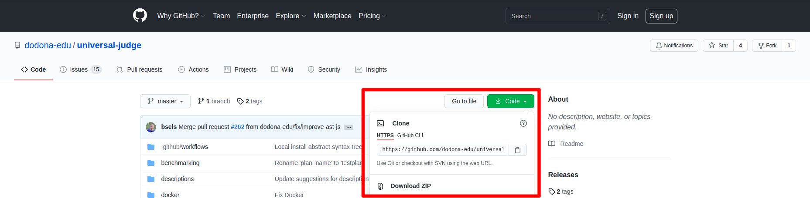

# TESTed zonder Dodona
Hoewel tijdens de ontwikkeling van TESTed er gefocust werd voor het gebruik op het Dodona-platform, kan TESTed ook los
van Dodona gebruikt worden.
In deze handleiding zullen we uitleg hoe je TESTed kan gebruiken los van het Dodona-platform.

## 1. Klonen van de TESTed GitHub repository
De eerst stap om TESTed los van Dodona te gebruiken is het klonen of downloaden van de
[TESTed GitHub repository](https://github.com/dodona-edu/universal-judge).



## 2. Installeren software
De volgende stap is het installeren van de afhankelijkheden van de TESTed judge.

::: tip Windows 10 tip
Windows 10 gebruikers raden we aan om het [Windows Subsystem for Linux](https://ubuntu.com/wsl) te gebruiken.
:::

### 1) Installeren kern software
De kern van de TESTed judge maakt gebruikt van [Python 3.9](https://docs.python.org/3/whatsnew/3.9.html).
Hiervoor moet het `python3.9` commando beschikbaar zijn vanuit het `PATH`.

TESTed heeft een aantal Python dependencies die met behulp van het
[pip](https://en.wikipedia.org/wiki/Pip_(package_manager)) commando vanuit de root-directory van TESTed:
```bash
> pip3 install -r requirement.txt
```

Wanneer je de Python testen wil uitvoeren moet je ook de Python dependencies installeren voor de testen:
```bash
> pip3 install -r requirements-test.txt
```

### 2) Installeren specifieke programmeertaal
:::: tabs
::: tab Bash
De Bash-oefening vereisen dat het [bash](https://nl.wikipedia.org/wiki/Bash) commando geïnstalleerd is en
beschikbaar is vanuit het `PATH`.

Bash is standaard geïnstalleerd op de Debian besturingssystemen en Mac OS.

De Bash-linter [shellcheck](https://www.shellcheck.net/) moet ook beschikbaar zijn in het `PATH`,
wanneer je linting wenst te gebruiken.
:::
::: tab Haskell
De Haskell-oefening vereisen dat de Haskell compiler `ghc` beschikbaar is van uit het `PATH`.
De installatie van de Haskell compiler kan teruggevonden worden op de [Haskell website](https://www.haskell.org/).

Daarnaast heb je ook de `aeson` bibliotheek nodig, die kan geïnstalleerd worden via het commando:
```bash
> cabal v1-install aeson
```

De Haskell-linter [hlint](https://hackage.haskell.org/package/hlint) moet ook beschikbaar zijn in het `PATH`,
wanneer je linting wenst te gebruiken.
:::
::: tab Java
De Java-oefeningen vereisen dat Java 11 geïnstalleerd is.
Zowel de [Oracle versie](https://www.oracle.com/java/technologies/javase-jdk11-downloads.html)
als de [OpenJDK versie](https://openjdk.java.net/projects/jdk/11/) kan gebruikt worden.

De commando's `javac` en `java` moeten beschikbaar zijn in het `PATH`.

Java gebruikt de *Checkstyle-8.41* linter, dit is een JAR-bestand die gedownload kan worden op de
[Checkstyle GitHub pagina](https://github.com/checkstyle/checkstyle/releases/download/checkstyle-8.41/checkstyle-8.41-all.jar).
De locatie naar de *Checkstyle*-jarbestand moet beschikbaar zijn in de omgevingsvariabele `CHECKSTYLE_JAR`.
:::
::: tab JavaScript
De JavaScript-oefeningen vereisen dat [Node.js v14 of hoger](https://nodejs.org/en/download/) geïnstalleerd is en
het commando `node` moet beschikbaar zijn in het `PATH`.

Daarnaast wordt er verwacht dat de `abstract-syntax-tree@2.17.6` globaal geïnstalleerd is,
dit kan met behulp van het commando:
```bash
npm install -g abstract-syntax-tree@2.17.6
```

De JavaScript-linter [eslint](https://eslint.org/) moet ook beschikbaar zijn in het `PATH`,
wanneer je linting wenst te gebruiken.
:::
::: tab Kotlin
De Kotlin-oefeningen vereisen dat de `kotlin` en `kotlinc` commando's beschikbaar zijn in het `PATH`.
De installatiemogelijkheden kunnen teruggevonden worden op de
[Kotlin website](https://kotlinlang.org/docs/command-line.html).

Kotlin gebruikt de *KTLint* linter, dit is een JAR-bestand die gedownload kan worden op de
[KTLint GitHub pagina](https://github.com/pinterest/ktlint/releases/download/0.41.0/ktlint).
De locatie naar de *KTLint*-jarbestand moet beschikbaar zijn in de omgevingsvariabele `KTLINT_JAR`.
:::
::: tab Python
Om Python-oefeningen te evalueren moet de Python dependencies geïnstalleerd worden,
met behulp van het pip commando in de root-directory van TESTed:
```bash
> pip3 install -r tested/languages/python/requirements.txt
```

Python maakt gebruik van [PyLint](https://www.pylint.org/) om de python code te evalueren.
Deze zal mee geïnstalleerd worden met de Python dependencies. 
:::
::::

## 3. Evalueren oefeningen
TESTed kan uitgevoerd met behulp van het volgende commando:
```bash
> python3 -m tested
```

Dit commando vereist een JSON-document als standaardinvoer met de volgende velden:
| Optie | Beschrijving |
| ------| ------------ |
| `time_limit` | De maximale tijdslimiet die gebruikt mag worden tijdens de evaluatie. |
| `memory_limit` | De maximale geheugenlimiet die gebruikt mag worden tijdens de evaluatie. |
| `natural_language` | De natuurlijke taal van de indiening. |
| `programming_language` | De programmeertaal van de indiening. |
| `judge` | De locatie van de judge (meestal de huidige map). |
| `source` | De locatie van de oplossing die geëvalueerd moet worden. |
| `resource` | De locatie van de bestanden die enkel door de judge gebruikt mogen worden. |
| `testplan` | De naam van het testplan-bestand in de `resource` map. |
| `workdir` | De locatie van de `workdir` map die tijdens de evaluatie gebruikt moet worden. |
| `timing_statistics` | Voeg de uitvoer van de tijdsstatistieken toe aan de evaluatie. |
| `options` | Het object met de opties voor de judge (zie [TESTed configureren](../exercise-config)). |

Voorbeeld invoer:
```json
{
  "time_limit": 60,
  "memory_limit": 500000000,
  "natural_language": "nl",
  "programming_language": "javascript",
  "source": "../exercise/solution/solution.js",
  "resources": "../exercise/evaluation/",
  "workdir": "../exercise/workdir/",
  "judge": ".",
  "testplan": "plan.json",
  "options": {
    "parallel": true,
    "allow_fallback": false,
    "mode": "batch",
    "linter": true
  }
}
```

De uitvoer van TESTed volgt het [JSON-formaat](https://dodona.ugent.be/schemas/partial_output.json)
voor de gedeeltelijke uitvoer van Dodona.

Voorbeeld uitvoer:
```json
{"command": "start-judgement"}
{"title": "Feedback", "command": "start-tab"}
{"command": "start-context"}
{"description": {"description": "EqualChecker instance = new EqualChecker(5)", "format": "java"}, "command": "start-testcase"}
{"command": "close-testcase"}
{"description": {"description": "instance.check(25)", "format": "java"}, "command": "start-testcase"}
{"expected": "false", "channel": "return", "command": "start-test"}
{"generated": "false", "status": {"enum": "correct"}, "command": "close-test"}
{"command": "close-testcase"}
{"description": {"description": "instance.check(5)", "format": "java"}, "command": "start-testcase"}
{"expected": "true", "channel": "return", "command": "start-test"}
{"generated": "true", "status": {"enum": "correct"}, "command": "close-test"}
{"command": "close-testcase"}
{"command": "close-context"}
{"command": "close-tab"}
{"command": "close-judgement"}
```