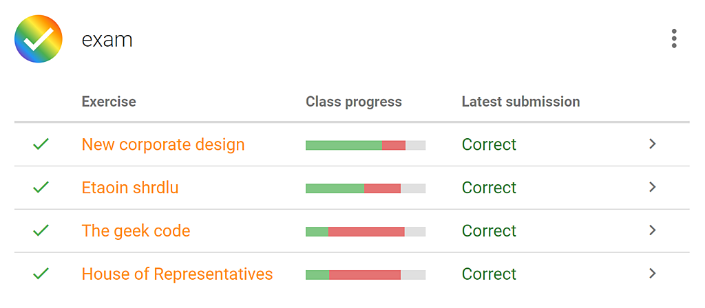

<NewsHeader :title="$frontmatter.title" :date="$frontmatter.date" lang="en" />

Release 2.9 brings many small changes to the Dodona user interface, with a visual representation of the progress of all course members through a series of exercises as an eye-catcher. Because we merit the protection of persona data and confidential information, we provide full transparancy about the data we keep, why we keep it, who can access it and how we use it to further improve the learning environment.  

## Tweaking the user interface  

For this release we paid a lot of attention to embellishing the Dodona web interface. Our goal was to make the user interface even more consistent, informative, responsive, intuitive and attractive, without loosing sight of the essence of Dodona. Many changes to the user interface will not immediately catch the eye, but one of the most visible changes is the visual representation of the progress of all course members through a series of exercises. Hoovering the mouse over the visual representation displays a tooltip containing the absolute values as they were displayed originally.

## Processing of personal data and confidential information in Dodona

Providing a good user experience in Dodona necessitates to keep track of some user data. On [this page](https://dodona.ugent.be/data/) we provide full transparancy on the data we store, why we store the data, who can access the data and how we use the data to further enhance the online learning environment. As an online learning environment developed at Ghent University (Belgium), Dodona also fully complies to the [Ghent University privacy policy](https://www.ugent.be/en/ghentuniv/privacy/privacystatement.htm). In case you have any further questions on the processing of personal data and confidential information in Dodona, please do not hesitate to [contact us](https://dodona.ugent.be/contact/).  

## Full list of changes  

For a full list of changes we refer to [our GitHub release](https://github.com/dodona-edu/dodona/releases/tag/2.9), but we list the most important things below.

*   refine user interface in multiple ways
*   add information to footer on processing of personal data and confidential information
*   convert Python-specific comparison of result to new representation
*   optimize cache invalidation strategy
*   sort priority of search queries on launch time instead of response time
*   add textual annotations to feedback on programming style (_linting_)
*   treat status of submitted solution as a searchable label
*   allow toggling of search options
*   fix a bug preventing the addition of exercises to a series that had been removed from the series just before
*   fix a bug preventing staff users to edit their own profile
