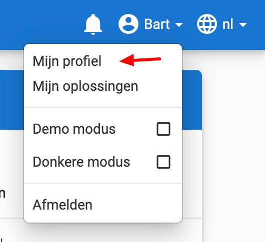

# Een API token aanmaken

Door een API token aan te maken, kan je andere externe applicaties tot jouw Dodona account. Een voorbeeld van zo'n applicatie is de [Dodona plugin voor JetBrains IDEs](https://plugins.jetbrains.com/plugin/11166-dodona). Het voordeel hiervan is dat op geen enkel moment je wachtwoord moet delen met die applicatie en dat je je tokens op elk moment kan verwijderen om de toegang in te trekken. Om een token aan te maken volg je eenvoudig deze vier stappen:

## 1. Ga naar je profielpagina

Ga eerst naar je profielpagina. Dit doe je door op "Mijn profiel" te klikken in het menu onder je naam, rechtsboven op de Dodona website.

## 2. Je profiel aanpassen

Op je profielpagina, klik op de gele `AANPASSEN` knop.

## 3. Een token aanmaken

Scroll naar de onderkant van de pagina en geef een naam in voor de te genereren token (bv. _pycharm_). Klik vervolgens op de gele `+`-knop om het token aan te maken.

## 4. Kopieer de token

Kopieer de nieuw aangemaakte token en plak het in het aanmeldvenster van de plugin. Op Dodona kan je steeds een lijstje zien van al je actieve tokens. Uit veiligheidsoverwegingen kan je de token zelf niet zien. Je kan op elk moment een token verwijderen waardoor die niet meer zal werken.

